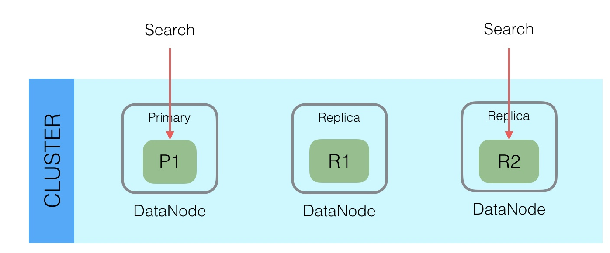
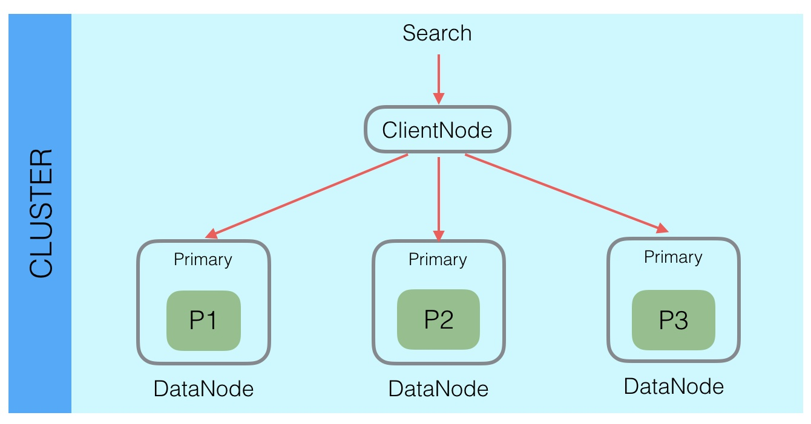
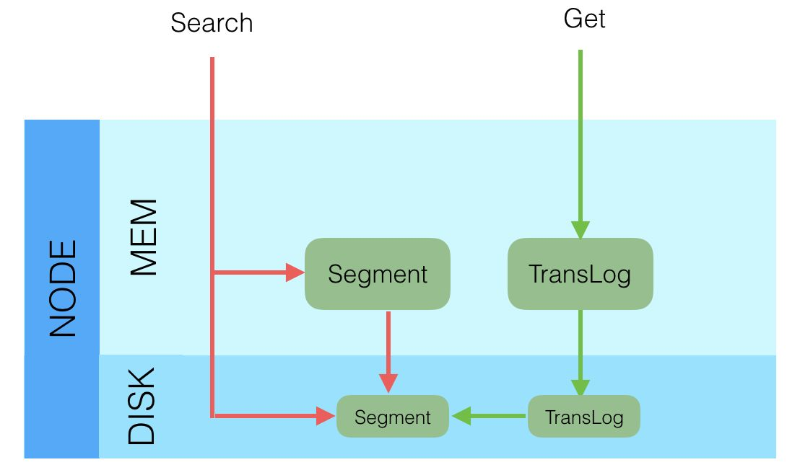
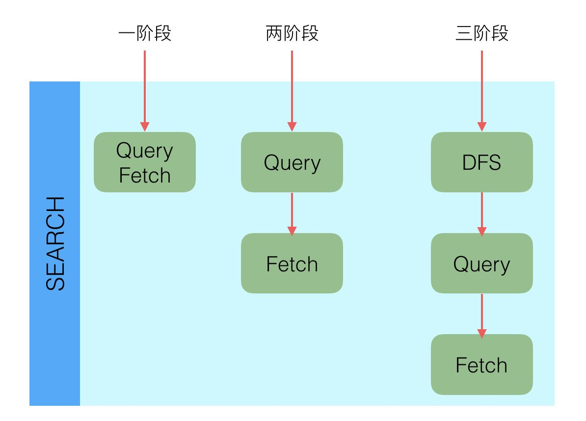
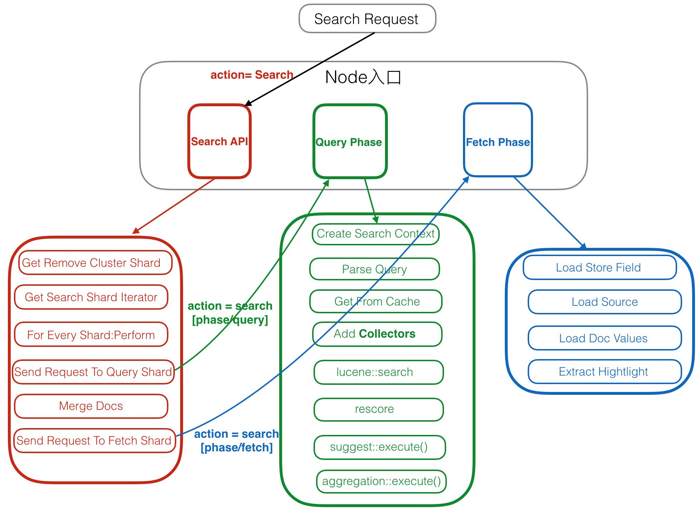

# 16 原理：ES原理之读取文档流程详解

## 文档查询步骤顺序

> 先看下整体的查询流程

### 单个文档

以下是从主分片或者副本分片检索文档的步骤顺序：


1. 客户端向 Node 1 发送获取请求。
1. 节点使用文档的 \_id 来确定文档属于分片 0 。分片 0 的副本分片存在于所有的三个节点上。 在这种情况下，它将请求转发到 Node 2 。
1. Node 2 将文档返回给 Node 1 ，然后将文档返回给客户端。

在处理读取请求时，协调结点在每次请求的时候都会通过轮询所有的副本分片来达到负载均衡。

在文档被检索时，已经被索引的文档可能已经存在于主分片上但是还没有复制到副本分片。 在这种情况下，副本分片可能会报告文档不存在，但是主分片可能成功返回文档。 一旦索引请求成功返回给用户，文档在主分片和副本分片都是可用的。

### 多个文档

使用 mget 取回多个文档的步骤顺序：


以下是使用单个 mget 请求取回多个文档所需的步骤顺序：

1. 客户端向 Node 1 发送 mget 请求。
1. Node 1 为每个分片构建多文档获取请求，然后并行转发这些请求到托管在每个所需的主分片或者副本分片的节点上。一旦收到所有答复， Node 1 构建响应并将其返回给客户端。

## 文档读取过程详解

> 所有的搜索系统一般都是两阶段查询，第一阶段查询到匹配的DocID，第二阶段再查询DocID对应的完整文档，这种在Elasticsearch中称为query_then_fetch。（这里主要介绍最常用的2阶段查询，其它方式可以参考[这里](https://zhuanlan.zhihu.com/p/34674517) ）。


1. 在初始查询阶段时，查询会广播到索引中每一个分片拷贝（主分片或者副本分片）。 每个分片在本地执行搜索并构建一个匹配文档的大小为 from + size 的优先队列。PS：在2. 搜索的时候是会查询Filesystem Cache的，但是有部分数据还在Memory Buffer，所以搜索是近实时的。
1. 每个分片返回各自优先队列中 所有文档的 ID 和排序值 给协调节点，它合并这些值到自己的优先队列中来产生一个全局排序后的结果列表。
1. 接下来就是 取回阶段，协调节点辨别出哪些文档需要被取回并向相关的分片提交多个 GET 请求。每个分片加载并丰富文档，如果有需要的话，接着返回文档给协调节点。一旦所有的文档都被取回了，协调节点返回结果给客户端。

## 深入ElasticSearch读取文档的实现机制

TIP

作为选读内容。

### 读操作

一致性指的是写入成功后，下次读操作一定要能读取到最新的数据。对于搜索，这个要求会低一些，可以有一些延迟。但是对于NoSQL数据库，则一般要求最好是强一致性的。

结果匹配上，NoSQL作为数据库，查询过程中只有符合不符合两种情况，而搜索里面还有是否相关，类似于NoSQL的结果只能是0或1，而搜索里面可能会有0.1，0.5，0.9等部分匹配或者更相关的情况。

结果召回上，搜索一般只需要召回最满足条件的Top N结果即可，而NoSQL一般都需要返回满足条件的所有结果。

搜索系统一般都是两阶段查询，第一个阶段查询到对应的Doc ID，也就是PK；第二阶段再通过Doc ID去查询完整文档，而NoSQL数据库一般是一阶段就返回结果。在Elasticsearch中两种都支持。

目前NoSQL的查询，聚合、分析和统计等功能上都是要比搜索弱的。

### Lucene的读

Elasticsearch使用了Lucene作为搜索引擎库，通过Lucene完成特定字段的搜索等功能，在Lucene中这个功能是通过IndexSearcher的下列接口实现的：

```java
public TopDocs search(Query query, int n);

public Document doc(int docID);

public int count(Query query);

......(其他)

```

第一个search接口实现搜索功能，返回最满足Query的N个结果；第二个doc接口通过doc id查询Doc内容；第三个count接口通过Query获取到命中数。

这三个功能是搜索中的最基本的三个功能点，对于大部分Elasticsearch中的查询都是比较复杂的，直接用这个接口是无法满足需求的，比如分布式问题。这些问题都留给了Elasticsearch解决，我们接下来看Elasticsearch中相关读功能的剖析。

### Elasticsearch的读

Elasticsearch中每个Shard都会有多个Replica，主要是为了保证数据可靠性，除此之外，还可以增加读能力，因为写的时候虽然要写大部分Replica Shard，但是查询的时候只需要查询Primary和Replica中的任何一个就可以了。



在上图中，该Shard有1个Primary和2个Replica Node，当查询的时候，从三个节点中根据Request中的preference参数选择一个节点查询。preference可以设置_local，\_primary，\_replica以及其他选项。如果选择了primary，则每次查询都是直接查询Primary，可以保证每次查询都是最新的。如果设置了其他参数，那么可能会查询到R1或者R2，这时候就有可能查询不到最新的数据。

PS: 上述代码逻辑在OperationRouting.Java的searchShards方法中。

接下来看一下，Elasticsearch中的查询是如何支持分布式的。



Elasticsearch中通过分区实现分布式，数据写入的时候根据_routing规则将数据写入某一个Shard中，这样就能将海量数据分布在多个Shard以及多台机器上，已达到分布式的目标。这样就导致了查询的时候，潜在数据会在当前index的所有的Shard中，所以Elasticsearch查询的时候需要查询所有Shard，同一个Shard的Primary和Replica选择一个即可，查询请求会分发给所有Shard，每个Shard中都是一个独立的查询引擎，比如需要返回Top 10的结果，那么每个Shard都会查询并且返回Top 10的结果，然后在Client Node里面会接收所有Shard的结果，然后通过优先级队列二次排序，选择出Top 10的结果返回给用户。

这里有一个问题就是请求膨胀，用户的一个搜索请求在Elasticsearch内部会变成Shard个请求，这里有个优化点，虽然是Shard个请求，但是这个Shard个数不一定要是当前Index中的Shard个数，只要是当前查询相关的Shard即可，这个需要基于业务和请求内容优化，通过这种方式可以优化请求膨胀数。

Elasticsearch中的查询主要分为两类， **Get请求** ：通过ID查询特定Doc； **Search请求** ：通过Query查询匹配Doc。



PS:上图中内存中的Segment是指刚Refresh Segment，但是还没持久化到磁盘的新Segment，而非从磁盘加载到内存中的Segment。

对于Search类请求，查询的时候是一起查询内存和磁盘上的Segment，最后将结果合并后返回。这种查询是近实时（Near Real Time）的，主要是由于内存中的Index数据需要一段时间后才会刷新为Segment。

对于Get类请求，查询的时候是先查询内存中的TransLog，如果找到就立即返回，如果没找到再查询磁盘上的TransLog，如果还没有则再去查询磁盘上的Segment。这种查询是实时（Real Time）的。这种查询顺序可以保证查询到的Doc是最新版本的Doc，这个功能也是为了保证NoSQL场景下的实时性要求。



所有的搜索系统一般都是两阶段查询，第一阶段查询到匹配的DocID，第二阶段再查询DocID对应的完整文档，这种在Elasticsearch中称为query_then_fetch，还有一种是一阶段查询的时候就返回完整Doc，在Elasticsearch中称作query_and_fetch，一般第二种适用于只需要查询一个Shard的请求。

除了一阶段，两阶段外，还有一种三阶段查询的情况。搜索里面有一种算分逻辑是根据TF（Term Frequency）和DF（Document Frequency）计算基础分，但是Elasticsearch中查询的时候，是在每个Shard中独立查询的，每个Shard中的TF和DF也是独立的，虽然在写入的时候通过_routing保证Doc分布均匀，但是没法保证TF和DF均匀，那么就有会导致局部的TF和DF不准的情况出现，这个时候基于TF、DF的算分就不准。为了解决这个问题，Elasticsearch中引入了DFS查询，比如DFS_query_then_fetch，会先收集所有Shard中的TF和DF值，然后将这些值带入请求中，再次执行query_then_fetch，这样算分的时候TF和DF就是准确的，类似的有DFS_query_and_fetch。这种查询的优势是算分更加精准，但是效率会变差。另一种选择是用BM25代替TF/DF模型。

在新版本Elasticsearch中，用户没法指定DFS_query_and_fetch和query_and_fetch，这两种只能被Elasticsearch系统改写。

### Elasticsearch查询流程

Elasticsearch中的大部分查询，以及核心功能都是Search类型查询，上面我们了解到查询分为一阶段，二阶段和三阶段，这里我们就以最常见的的二阶段查询为例来介绍查询流程。



#### Client Node

> Client Node 也包括了前面说过的Parse Request，这里就不再赘述了，接下来看一下其他的部分。

1. **Get Remove Cluster Shard**判断是否需要跨集群访问，如果需要，则获取到要访问的Shard列表。

1.**Get Search Shard Iterator**获取当前Cluster中要访问的Shard，和上一步中的Remove Cluster Shard合并，构建出最终要访问的完整Shard列表。

这一步中，会根据Request请求中的参数从Primary Node和多个Replica Node中选择出一个要访问的Shard。

1.**For Every Shard:Perform**遍历每个Shard，对每个Shard执行后面逻辑。

1.**Send Request To Query Shard**将查询阶段请求发送给相应的Shard。

1.**Merge Docs**

上一步将请求发送给多个Shard后，这一步就是异步等待返回结果，然后对结果合并。这里的合并策略是维护一个Top N大小的优先级队列，每当收到一个shard的返回，就把结果放入优先级队列做一次排序，直到所有的Shard都返回。

翻页逻辑也是在这里，如果需要取Top 30~ Top 40的结果，这个的意思是所有Shard查询结果中的第30到40的结果，那么在每个Shard中无法确定最终的结果，每个Shard需要返回Top 40的结果给Client Node，然后Client Node中在merge docs的时候，计算出Top 40的结果，最后再去除掉Top 30，剩余的10个结果就是需要的Top 30~ Top 40的结果。

上述翻页逻辑有一个明显的缺点就是每次Shard返回的数据中包括了已经翻过的历史结果，如果翻页很深，则在这里需要排序的Docs会很多，比如Shard有1000，取第9990到10000的结果，那么这次查询，Shard总共需要返回1000 * 10000，也就是一千万Doc，这种情况很容易导致OOM。

另一种翻页方式是使用search_after，这种方式会更轻量级，如果每次只需要返回10条结构，则每个Shard只需要返回search_after之后的10个结果即可，返回的总数据量只是和Shard个数以及本次需要的个数有关，和历史已读取的个数无关。这种方式更安全一些，推荐使用这种。

如果有aggregate，也会在这里做聚合，但是不同的aggregate类型的merge策略不一样，具体的可以在后面的aggregate文章中再介绍。

1. **Send Request To Fetch Shard**选出Top N个Doc ID后发送给这些Doc ID所在的Shard执行Fetch Phase，最后会返回Top N的Doc的内容。

#### Query Phase

> 接下来我们看第一阶段查询的步骤：

1.**Create Search Context**创建Search Context，之后Search过程中的所有中间状态都会存在Context中，这些状态总共有50多个，具体可以查看DefaultSearchContext或者其他SearchContext的子类。

1.**Parse Query**解析Query的Source，将结果存入Search Context。这里会根据请求中Query类型的不同创建不同的Query对象，比如TermQuery、FuzzyQuery等，最终真正执行TermQuery、FuzzyQuery等语义的地方是在Lucene中。

这里包括了dfsPhase、queryPhase和fetchPhase三个阶段的preProcess部分，只有queryPhase的preProcess中有执行逻辑，其他两个都是空逻辑，执行完preProcess后，所有需要的参数都会设置完成。

由于Elasticsearch中有些请求之间是相互关联的，并非独立的，比如scroll请求，所以这里同时会设置Context的生命周期。

同时会设置lowLevelCancellation是否打开，这个参数是集群级别配置，同时也能动态开关，打开后会在后面执行时做更多的检测，检测是否需要停止后续逻辑直接返回。

1.**Get From Cache**判断请求是否允许被Cache，如果允许，则检查Cache中是否已经有结果，如果有则直接读取Cache，如果没有则继续执行后续步骤，执行完后，再将结果加入Cache。

1.**Add Collectors**

Collector主要目标是收集查询结果，实现排序，对自定义结果集过滤和收集等。这一步会增加多个Collectors，多个Collector组成一个List。

- FilteredCollector：先判断请求中是否有Post Filter，Post Filter用于Search，Agg等结束后再次对结果做Filter，希望Filter不影响Agg结果。如果有Post Filter则创建一个FilteredCollector，加入Collector List中。
- PluginInMultiCollector：判断请求中是否制定了自定义的一些Collector，如果有，则创建后加入Collector List。
- MinimumScoreCollector：判断请求中是否制定了最小分数阈值，如果指定了，则创建MinimumScoreCollector加入Collector List中，在后续收集结果时，会过滤掉得分小于最小分数的Doc。
- EarlyTerminatingCollector：判断请求中是否提前结束Doc的Seek，如果是则创建EarlyTerminatingCollector，加入Collector List中。在后续Seek和收集Doc的过程中，当Seek的Doc数达到Early Terminating后会停止Seek后续倒排链。
- CancellableCollector：判断当前操作是否可以被中断结束，比如是否已经超时等，如果是会抛出一个TaskCancelledException异常。该功能一般用来提前结束较长的查询请求，可以用来保护系统。
- EarlyTerminatingSortingCollector：如果Index是排序的，那么可以提前结束对倒排链的Seek，相当于在一个排序递减链表上返回最大的N个值，只需要直接返回前N个值就可以了。这个Collector会加到Collector List的头部。EarlyTerminatingSorting和EarlyTerminating的区别是，EarlyTerminatingSorting是一种对结果无损伤的优化，而EarlyTerminating是有损的，人为掐断执行的优化。
- TopDocsCollector：这个是最核心的Top N结果选择器，会加入到Collector List的头部。TopScoreDocCollector和TopFieldCollector都是TopDocsCollector的子类，TopScoreDocCollector会按照固定的方式算分，排序会按照分数+doc id的方式排列，如果多个doc的分数一样，先选择doc id小的文档。而TopFieldCollector则是根据用户指定的Field的值排序。

1. **lucene::search**这一步会调用Lucene中IndexSearch的search接口，执行真正的搜索逻辑。每个Shard中会有多个Segment，每个Segment对应一个LeafReaderContext，这里会遍历每个Segment，到每个Segment中去Search结果，然后计算分数。

搜索里面一般有两阶段算分，第一阶段是在这里算的，会对每个Seek到的Doc都计算分数，为了减少CPU消耗，一般是算一个基本分数。这一阶段完成后，会有个排序。然后在第二阶段，再对Top 的结果做一次二阶段算分，在二阶段算分的时候会考虑更多的因子。二阶段算分在后续操作中。

具体请求，比如TermQuery、WildcardQuery的查询逻辑都在Lucene中，后面会有专门文章介绍。

1.**rescore**根据Request中是否包含rescore配置决定是否进行二阶段排序，如果有则执行二阶段算分逻辑，会考虑更多的算分因子。二阶段算分也是一种计算机中常见的多层设计，是一种资源消耗和效率的折中。

Elasticsearch中支持配置多个Rescore，这些rescore逻辑会顺序遍历执行。每个rescore内部会先按照请求参数window选择出Top window的doc，然后对这些doc排序，排完后再合并回原有的Top 结果顺序中。

1.\*\*suggest::execute()\*\*如果有推荐请求，则在这里执行推荐请求。如果请求中只包含了推荐的部分，则很多地方可以优化。推荐不是今天的重点，这里就不介绍了，后面有机会再介绍。

1. a**ggregation::execute()**

如果含有聚合统计请求，则在这里执行。Elasticsearch中的aggregate的处理逻辑也类似于Search，通过多个Collector来实现。在Client Node中也需要对aggregation做合并。aggregate逻辑更复杂一些，就不在这里赘述了，后面有需要就再单独开文章介绍。

上述逻辑都执行完成后，如果当前查询请求只需要查询一个Shard，那么会直接在当前Node执行Fetch Phase。

#### Fetch Phase

Elasticsearch作为搜索系统时，或者任何搜索系统中，除了Query阶段外，还会有一个Fetch阶段，这个Fetch阶段在数据库类系统中是没有的，是搜索系统中额外增加的阶段。搜索系统中额外增加Fetch阶段的原因是搜索系统中数据分布导致的，在搜索中，数据通过routing分Shard的时候，只能根据一个主字段值来决定，但是查询的时候可能会根据其他非主字段查询，那么这个时候所有Shard中都可能会存在相同非主字段值的Doc，所以需要查询所有Shard才能不会出现结果遗漏。同时如果查询主字段，那么这个时候就能直接定位到Shard，就只需要查询特定Shard即可，这个时候就类似于数据库系统了。另外，数据库中的二级索引又是另外一种情况，但类似于查主字段的情况，这里就不多说了。

基于上述原因，第一阶段查询的时候并不知道最终结果会在哪个Shard上，所以每个Shard中管都需要查询完整结果，比如需要Top 10，那么每个Shard都需要查询当前Shard的所有数据，找出当前Shard的Top 10，然后返回给Client Node。如果有100个Shard，那么就需要返回100 * 10 = 1000个结果，而Fetch Doc内容的操作比较耗费IO和CPU，如果在第一阶段就Fetch Doc，那么这个资源开销就会非常大。所以，一般是当Client Node选择出最终Top N的结果后，再对最终的Top N读取Doc内容。通过增加一点网络开销而避免大量IO和CPU操作，这个折中是非常划算的。

Fetch阶段的目的是通过DocID获取到用户需要的完整Doc内容。这些内容包括了DocValues，Store，Source，Script和Highlight等，具体的功能点是在SearchModule中注册的，系统默认注册的有：

- ExplainFetchSubPhase
- DocValueFieldsFetchSubPhase
- ScriptFieldsFetchSubPhase
- FetchSourceSubPhase
- VersionFetchSubPhase
- MatchedQueriesFetchSubPhase
- HighlightPhase
- ParentFieldSubFetchPhase

除了系统默认的8种外，还有通过插件的形式注册自定义的功能，这些SubPhase中最重要的是Source和Highlight，Source是加载原文，Highlight是计算高亮显示的内容片断。

上述多个SubPhase会针对每个Doc顺序执行，可能会产生多次的随机IO，这里会有一些优化方案，但是都是针对特定场景的，不具有通用性。

Fetch Phase执行完后，整个查询流程就结束了。

## 参考文档

<https://www.elastic.co/guide/cn/elasticsearch/guide/current/distrib-read.html>

<https://www.elastic.co/guide/cn/elasticsearch/guide/current/distrib-multi-doc.html>

<https://www.elastic.co/guide/cn/elasticsearch/guide/current/inside-a-shard.html>

<https://zhuanlan.zhihu.com/p/34674517>

<https://zhuanlan.zhihu.com/p/34669354>

<https://www.cnblogs.com/yangwenbo214/p/9831479.html>
