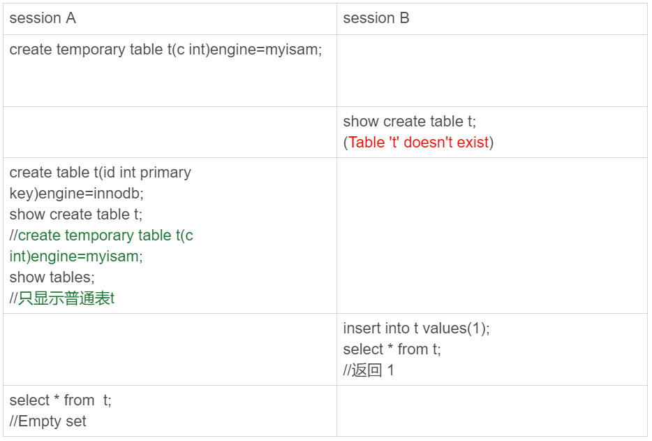
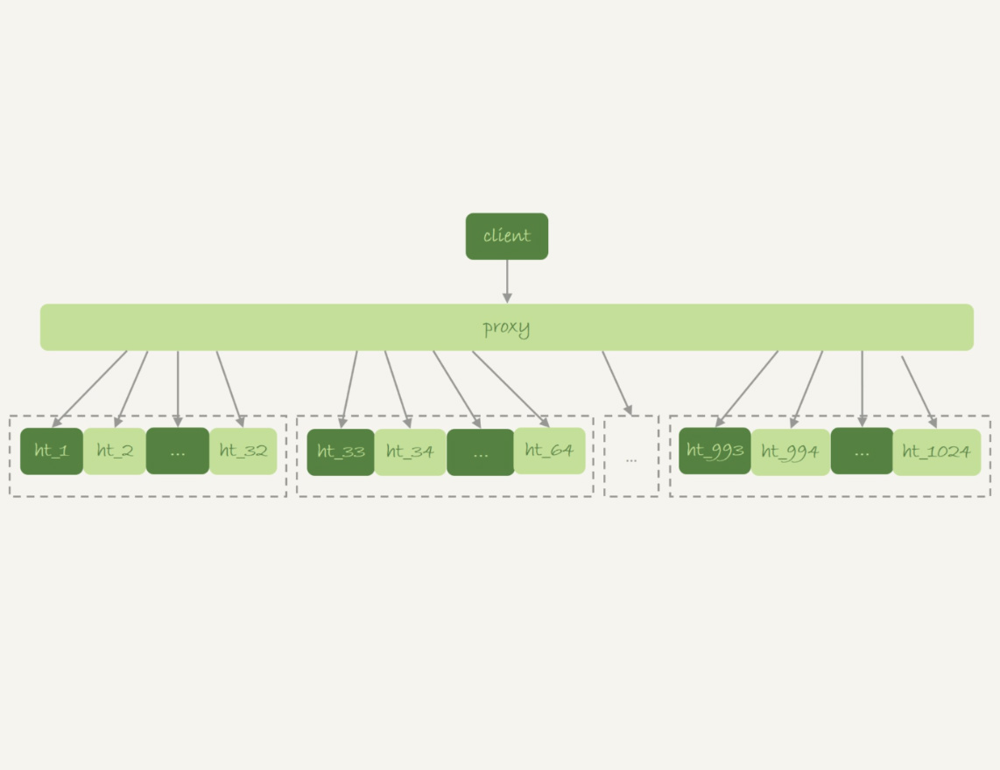

# 36 为什么临时表可以重名？

今天是大年三十，在开始我们今天的学习之前，我要先和你道一声春节快乐！

在上一篇文章中，我们在优化 join 查询的时候使用到了临时表。当时，我们是这么用的：

```sql
create temporary table temp_t like t1;
alter table temp_t add index(b);
insert into temp_t select * from t2 where b>=1 and b<=2000;
select * from t1 join temp_t on (t1.b=temp_t.b);
```

你可能会有疑问，为什么要用临时表呢？直接用普通表是不是也可以呢？

今天我们就从这个问题说起：临时表有哪些特征，为什么它适合这个场景？

这里，我需要先帮你厘清一个容易误解的问题：有的人可能会认为，临时表就是内存表。但是，这两个概念可是完全不同的。

- 内存表，指的是使用 Memory 引擎的表，建表语法是 create table … engine=memory。这种表的数据都保存在内存里，系统重启的时候会被清空，但是表结构还在。除了这两个特性看上去比较“奇怪”外，从其他的特征上看，它就是一个正常的表。
- 而临时表，可以使用各种引擎类型 。如果是使用 InnoDB 引擎或者 MyISAM 引擎的临时表，写数据的时候是写到磁盘上的。当然，临时表也可以使用 Memory 引擎。

弄清楚了内存表和临时表的区别以后，我们再来看看临时表有哪些特征。

## 临时表的特性

为了便于理解，我们来看下下面这个操作序列：

<figure markdown="span">

  <figcaption>图1 临时表特性示例</figcaption>
</figure>

可以看到，临时表在使用上有以下几个特点：

1. 建表语法是 create temporary table …。
2. 一个临时表只能被创建它的 session 访问，对其他线程不可见。所以，图中 session A 创建的临时表 t，对于 session B 就是不可见的。
3. 临时表可以与普通表同名。
4. session A 内有同名的临时表和普通表的时候，show create 语句，以及增删改查语句访问的是临时表。
5. show tables 命令不显示临时表。

由于临时表只能被创建它的 session 访问，所以在这个 session 结束的时候，会自动删除临时表。也正是由于这个特性， **临时表就特别适合我们文章开头的 join 优化这种场景** 。为什么呢？

原因主要包括以下两个方面：

1. 不同 session 的临时表是可以重名的，如果有多个 session 同时执行 join 优化，不需要担心表名重复导致建表失败的问题。
2. 不需要担心数据删除问题。如果使用普通表，在流程执行过程中客户端发生了异常断开，或者数据库发生异常重启，还需要专门来清理中间过程中生成的数据表。而临时表由于会自动回收，所以不需要这个额外的操作。

## 临时表的应用

由于不用担心线程之间的重名冲突，临时表经常会被用在复杂查询的优化过程中。其中，分库分表系统的跨库查询就是一个典型的使用场景。

一般分库分表的场景，就是要把一个逻辑上的大表分散到不同的数据库实例上。比如。将一个大表 ht，按照字段 f，拆分成 1024 个分表，然后分布到 32 个数据库实例上。如下图所示：

<figure markdown="span">

  <figcaption>图2 分库分表简图</figcaption>
</figure>

一般情况下，这种分库分表系统都有一个中间层 proxy。不过，也有一些方案会让客户端直接连接数据库，也就是没有 proxy 这一层。

在这个架构中，分区 key 的选择是以“减少跨库和跨表查询”为依据的。如果大部分的语句都会包含 f 的等值条件，那么就要用 f 做分区键。这样，在 proxy 这一层解析完 SQL 语句以后，就能确定将这条语句路由到哪个分表做查询。

比如下面这条语句：

```sql
select v from ht where f=N;
```

这时，我们就可以通过分表规则（比如，N%1024） 来确认需要的数据被放在了哪个分表上。这种语句只需要访问一个分表，是分库分表方案最欢迎的语句形式了。

但是，如果这个表上还有另外一个索引 k，并且查询语句是这样的：

```sql
select v from ht where k >= M order by t_modified desc limit 100;
```

这时候，由于查询条件里面没有用到分区字段 f，只能到所有的分区中去查找满足条件的所有行，然后统一做 order by 的操作。这种情况下，有两种比较常用的思路。 **第一种思路是，** 在 proxy 层的进程代码中实现排序。

这种方式的优势是处理速度快，拿到分库的数据以后，直接在内存中参与计算。不过，这个方案的缺点也比较明显：

1. 需要的开发工作量比较大。我们举例的这条语句还算是比较简单的，如果涉及到复杂的操作，比如 group by，甚至 join 这样的操作，对中间层的开发能力要求比较高；
2. 对 proxy 端的压力比较大，尤其是很容易出现内存不够用和 CPU 瓶颈的问题。 **另一种思路就是，** 把各个分库拿到的数据，汇总到一个 MySQL 实例的一个表中，然后在这个汇总实例上做逻辑操作。

比如上面这条语句，执行流程可以类似这样：

- 在汇总库上创建一个临时表 temp_ht，表里包含三个字段 v、k、t_modified；
- 在各个分库上执行

```sql
select v,k,t_modified from ht_x where k >= M order by t_modified desc limit 100;
```

- 把分库执行的结果插入到 temp_ht 表中；
- 执行

```sql
select v from temp_ht order by t_modified desc limit 100; 
```

得到结果。

这个过程对应的流程图如下所示：

<figure markdown="span">

  <figcaption>图3 跨库查询流程示意图</figcaption>
</figure>

**在实践中，我们往往会发现每个分库的计算量都不饱和，所以会直接把临时表 temp_ht 放到 32 个分库中的某一个上。** 这时的查询逻辑与图 3 类似，你可以自己再思考一下具体的流程。

## 为什么临时表可以重名？

你可能会问，不同线程可以创建同名的临时表，这是怎么做到的呢？

接下来，我们就看一下这个问题。

我们在执行

```sql
create temporary table temp_t(id int primary key)engine=innodb;
```

这个语句的时候，MySQL 要给这个 InnoDB 表创建一个 frm 文件保存表结构定义，还要有地方保存表数据。 **这个 frm 文件放在临时文件目录下，文件名的后缀是.frm，前缀是“##sql{进程 id}{线程 id} 序列号”** 。你可以使用 select @@tmpdir 命令，来显示实例的临时文件目录。

而关于表中数据的存放方式，在不同的 MySQL 版本中有着不同的处理方式：

- 在 5.6 以及之前的版本里，MySQL 会在临时文件目录下创建一个相同前缀、以.ibd 为后缀的文件，用来存放数据文件；
- 而从 5.7 版本开始，MySQL 引入了一个临时文件表空间，专门用来存放临时文件的数据。因此，我们就不需要再创建 ibd 文件了。

从文件名的前缀规则，我们可以看到，其实创建一个叫作 t1 的 InnoDB 临时表，MySQL 在存储上认为我们创建的表名跟普通表 t1 是不同的，因此同一个库下面已经有普通表 t1 的情况下，还是可以再创建一个临时表 t1 的。

为了便于后面讨论，我先来举一个例子。

<figure markdown="span">

  <figcaption>图4 临时表的表名</figcaption>
</figure>

这个进程的进程号是 1234，session A 的线程 id 是 4，session B 的线程 id 是 5。所以你看到了，session A 和 session B 创建的临时表，在磁盘上的文件不会重名。

MySQL 维护数据表，除了物理上要有文件外，内存里面也有一套机制区别不同的表，每个表都对应一个 table_def_key。

- 一个普通表的 table_def_key 的值是由“库名 + 表名”得到的，所以如果你要在同一个库下创建两个同名的普通表，创建第二个表的过程中就会发现 table_def_key 已经存在了。
- 而对于临时表，table_def_key 在“库名 + 表名”基础上，又加入了“server_id+thread_id”。

也就是说，session A 和 sessionB 创建的两个临时表 t1，它们的 table_def_key 不同，磁盘文件名也不同，因此可以并存。

在实现上，每个线程都维护了自己的临时表链表。这样每次 session 内操作表的时候，先遍历链表，检查是否有这个名字的临时表，如果有就优先操作临时表，如果没有再操作普通表；在 session 结束的时候，对链表里的每个临时表，执行 “DROP TEMPORARY TABLE + 表名”操作。

这时候你会发现，binlog 中也记录了 DROP TEMPORARY TABLE 这条命令。你一定会觉得奇怪，临时表只在线程内自己可以访问，为什么需要写到 binlog 里面？

这，就需要说到主备复制了。

## 临时表和主备复制

既然写 binlog，就意味着备库需要。

你可以设想一下，在主库上执行下面这个语句序列：

```sql
create table t_normal(id int primary key, c int)engine=innodb;/*Q1*/
create temporary table temp_t like t_normal;/*Q2*/
insert into temp_t values(1,1);/*Q3*/
insert into t_normal select * from temp_t;/*Q4*/
```

如果关于临时表的操作都不记录，那么在备库就只有 create table t_normal 表和 insert into t_normal select * from temp_t 这两个语句的 binlog 日志，备库在执行到 insert into t_normal 的时候，就会报错“表 temp_t 不存在”。

你可能会说，如果把 binlog 设置为 row 格式就好了吧？因为 binlog 是 row 格式时，在记录 insert into t_normal 的 binlog 时，记录的是这个操作的数据，即：write_row event 里面记录的逻辑是“插入一行数据（1,1）”。

确实是这样。如果当前的 binlog_format=row，那么跟临时表有关的语句，就不会记录到 binlog 里。也就是说，只在 binlog_format=statment/mixed 的时候，binlog 中才会记录临时表的操作。

这种情况下，创建临时表的语句会传到备库执行，因此备库的同步线程就会创建这个临时表。主库在线程退出的时候，会自动删除临时表，但是备库同步线程是持续在运行的。所以，这时候我们就需要在主库上再写一个 DROP TEMPORARY TABLE 传给备库执行。

**之前有人问过我一个有趣的问题：** MySQL 在记录 binlog 的时候，不论是 create table 还是 alter table 语句，都是原样记录，甚至于连空格都不变。但是如果执行 drop table t_normal，系统记录 binlog 就会写成：

```sql
DROP TABLE `t_normal` /* generated by server */
```

也就是改成了标准的格式。为什么要这么做呢 ？

现在你知道原因了，那就是：drop table 命令是可以一次删除多个表的。比如，在上面的例子中，设置 binlog_format=row，如果主库上执行 "drop table t_normal, temp_t"这个命令，那么 binlog 中就只能记录：

```sql
DROP TABLE `t_normal` /* generated by server */
```

因为备库上并没有表 temp_t，将这个命令重写后再传到备库执行，才不会导致备库同步线程停止。

所以，drop table 命令记录 binlog 的时候，就必须对语句做改写。“/\* generated by server \*/”说明了这是一个被服务端改写过的命令。

说到主备复制， **还有另外一个问题需要解决** ：主库上不同的线程创建同名的临时表是没关系的，但是传到备库执行是怎么处理的呢？

现在，我给你举个例子，下面的序列中实例 S 是 M 的备库。

<figure markdown="span">

  <figcaption>图5 主备关系中的临时表操作</figcaption>
</figure>

主库 M 上的两个 session 创建了同名的临时表 t1，这两个 create temporary table t1 语句都会被传到备库 S 上。

但是，备库的应用日志线程是共用的，也就是说要在应用线程里面先后执行这个 create 语句两次。（即使开了多线程复制，也可能被分配到从库的同一个 worker 中执行）。那么，这会不会导致同步线程报错 ？

显然是不会的，否则临时表就是一个 bug 了。也就是说，备库线程在执行的时候，要把这两个 t1 表当做两个不同的临时表来处理。这，又是怎么实现的呢？

MySQL 在记录 binlog 的时候，会把主库执行这个语句的线程 id 写到 binlog 中。这样，在备库的应用线程就能够知道执行每个语句的主库线程 id，并利用这个线程 id 来构造临时表的 table_def_key：

1. session A 的临时表 t1，在备库的 table_def_key 就是：库名 +t1+“M 的 serverid”+“session A 的 thread_id”;
2. session B 的临时表 t1，在备库的 table_def_key 就是 ：库名 +t1+“M 的 serverid”+“session B 的 thread_id”。

由于 table_def_key 不同，所以这两个表在备库的应用线程里面是不会冲突的。

## 小结

今天这篇文章，我和你介绍了临时表的用法和特性。

在实际应用中，临时表一般用于处理比较复杂的计算逻辑。由于临时表是每个线程自己可见的，所以不需要考虑多个线程执行同一个处理逻辑时，临时表的重名问题。在线程退出的时候，临时表也能自动删除，省去了收尾和异常处理的工作。

在 binlog_format='row’的时候，临时表的操作不记录到 binlog 中，也省去了不少麻烦，这也可以成为你选择 binlog_format 时的一个考虑因素。

需要注意的是，我们上面说到的这种临时表，是用户自己创建的 ，也可以称为用户临时表。与它相对应的，就是内部临时表，在\[第 17 篇文章\]中我已经和你介绍过。

最后，我给你留下一个思考题吧。

下面的语句序列是创建一个临时表，并将其改名：

<figure markdown="span">

  <figcaption>图6 关于临时表改名的思考题</figcaption>
</figure>

可以看到，我们可以使用 alter table 语法修改临时表的表名，而不能使用 rename 语法。你知道这是什么原因吗？

你可以把你的分析写在留言区，我会在下一篇文章的末尾和你讨论这个问题。感谢你的收听，也欢迎你把这篇文章分享给更多的朋友一起阅读。

## 上期问题时间

上期的问题是，对于下面这个三个表的 join 语句，

```sql
select * from t1 join t2 on(t1.a=t2.a) join t3 on (t2.b=t3.b) where t1.c>=X and t2.c>=Y and t3.c>=Z;
```

如果改写成 straight_join，要怎么指定连接顺序，以及怎么给三个表创建索引。

第一原则是要尽量使用 BKA 算法。需要注意的是，使用 BKA 算法的时候，并不是“先计算两个表 join 的结果，再跟第三个表 join”，而是直接嵌套查询的。

具体实现是：在 t1.c>=X、t2.c>=Y、t3.c>=Z 这三个条件里，选择一个经过过滤以后，数据最少的那个表，作为第一个驱动表。此时，可能会出现如下两种情况。

第一种情况，如果选出来是表 t1 或者 t3，那剩下的部分就固定了。

1. 如果驱动表是 t1，则连接顺序是 t1->t2->t3，要在被驱动表字段创建上索引，也就是 t2.a 和 t3.b 上创建索引；
2. 如果驱动表是 t3，则连接顺序是 t3->t2->t1，需要在 t2.b 和 t1.a 上创建索引。

同时，我们还需要在第一个驱动表的字段 c 上创建索引。

第二种情况是，如果选出来的第一个驱动表是表 t2 的话，则需要评估另外两个条件的过滤效果。

总之，整体的思路就是，尽量让每一次参与 join 的驱动表的数据集，越小越好，因为这样我们的驱动表就会越小。

评论区留言点赞板：

> @库淘淘 做了实验验证； @poppy 同学做了很不错的分析； @dzkk 同学在评论中介绍了 MariaDB 支持的 hash join，大家可以了解一下； @老杨同志提了一个好问题，如果语句使用了索引 a，结果还要对 a 排序，就不用 MRR 优化了，否则回表完还要增加额外的排序过程，得不偿失。
