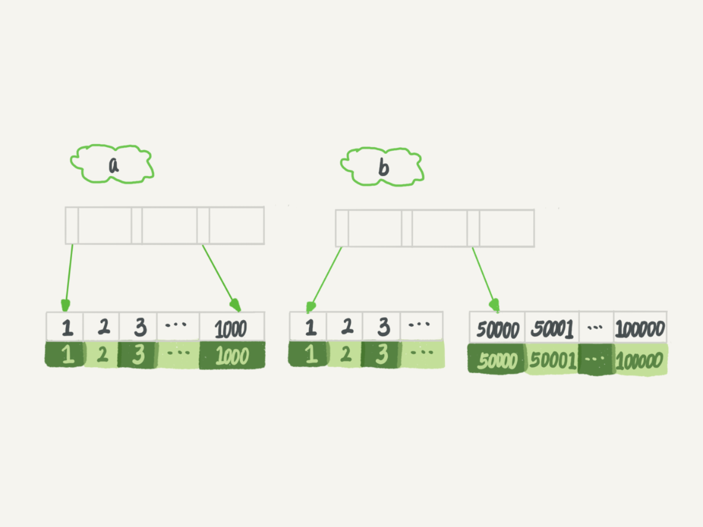

# 10 MySQL为什么有时候会选错索引？

前面我们介绍过索引，你已经知道了在 MySQL 中一张表其实是可以支持多个索引的。但是，你写 SQL 语句的时候，并没有主动指定使用哪个索引。也就是说，使用哪个索引是由 MySQL 来确定的。

不知道你有没有碰到过这种情况，一条本来可以执行得很快的语句，却由于 MySQL 选错了索引，而导致执行速度变得很慢？

我们一起来看一个例子吧。

我们先建一个简单的表，表里有 a、b 两个字段，并分别建上索引：

```SQL
CREATE TABLE `t` (
  `id` int(11) NOT NULL,
  `a` int(11) DEFAULT NULL,
  `b` int(11) DEFAULT NULL,
  PRIMARY KEY (`id`),
  KEY `a` (`a`),
  KEY `b` (`b`)
) ENGINE=InnoDB；
```

然后，我们往表 t 中插入 10 万行记录，取值按整数递增，即：(1,1,1)，(2,2,2)，(3,3,3) 直到 (100000,100000,100000)。

我是用存储过程来插入数据的，这里我贴出来方便你复现：

```SQL
delimiter ;;
create procedure idata()
begin
  declare i int;
  set i=1;
  while(i<=100000)do
    insert into t values(i, i, i);
    set i=i+1;
  end while;
end;;
delimiter ;
call idata();
```

接下来，我们分析一条 SQL 语句：

```SQL
mysql> select * from t where a between 10000 and 20000;
```

你一定会说，这个语句还用分析吗，很简单呀，a 上有索引，肯定是要使用索引 a 的。

你说得没错，图 1 显示的就是使用 explain 命令看到的这条语句的执行情况。


图 1 使用 explain 命令查看语句执行情况

从图 1 看上去，这条查询语句的执行也确实符合预期，key 这个字段值是’a’，表示优化器选择了索引 a。

不过别急，这个案例不会这么简单。在我们已经准备好的包含了 10 万行数据的表上，我们再做如下操作。


图 2 session A 和 session B 的执行流程

这里，session A 的操作你已经很熟悉了，它就是开启了一个事务。随后，session B 把数据都删除后，又调用了 idata 这个存储过程，插入了 10 万行数据。

这时候，session B 的查询语句 select * from t where a between 10000 and 20000 就不会再选择索引 a 了。我们可以通过慢查询日志（slow log）来查看一下具体的执行情况。

为了说明优化器选择的结果是否正确，我增加了一个对照，即：使用 force index(a) 来让优化器强制使用索引 a（这部分内容，我还会在这篇文章的后半部分中提到）。

下面的三条 SQL 语句，就是这个实验过程。

```SQL
set long_query_time=0;
select * from t where a between 10000 and 20000; /*Q1*/
select * from t force index(a) where a between 10000 and 20000;/*Q2*/
```

- 第一句，是将慢查询日志的阈值设置为 0，表示这个线程接下来的语句都会被记录入慢查询日志中；
- 第二句，Q1 是 session B 原来的查询；
- 第三句，Q2 是加了 force index(a) 来和 session B 原来的查询语句执行情况对比。

如图 3 所示是这三条 SQL 语句执行完成后的慢查询日志。


图 3 slow log 结果

可以看到，Q1 扫描了 10 万行，显然是走了全表扫描，执行时间是 40 毫秒。Q2 扫描了 10001 行，执行了 21 毫秒。也就是说，我们在没有使用 force index 的时候，MySQL 用错了索引，导致了更长的执行时间。

这个例子对应的是我们平常不断地删除历史数据和新增数据的场景。这时，MySQL 竟然会选错索引，是不是有点奇怪呢？今天，我们就从这个奇怪的结果说起吧。

## 优化器的逻辑

在第一篇文章中，我们就提到过，选择索引是优化器的工作。

而优化器选择索引的目的，是找到一个最优的执行方案，并用最小的代价去执行语句。在数据库里面，扫描行数是影响执行代价的因素之一。扫描的行数越少，意味着访问磁盘数据的次数越少，消耗的 CPU 资源越少。

当然，扫描行数并不是唯一的判断标准，优化器还会结合是否使用临时表、是否排序等因素进行综合判断。

我们这个简单的查询语句并没有涉及到临时表和排序，所以 MySQL 选错索引肯定是在判断扫描行数的时候出问题了。

那么，问题就是：  \*\*扫描行数是怎么判断的？\*\*MySQL 在真正开始执行语句之前，并不能精确地知道满足这个条件的记录有多少条，而只能根据统计信息来估算记录数。

这个统计信息就是索引的“区分度”。显然，一个索引上不同的值越多，这个索引的区分度就越好。而一个索引上不同的值的个数，我们称之为“基数”（cardinality）。也就是说，这个基数越大，索引的区分度越好。

我们可以使用 show index 方法，看到一个索引的基数。如图 4 所示，就是表 t 的 show index 的结果 。虽然这个表的每一行的三个字段值都是一样的，但是在统计信息中，这三个索引的基数值并不同，而且其实都不准确。


图 4 表 t 的 show index 结果

那么，**MySQL 是怎样得到索引的基数的呢？**     这里，我给你简单介绍一下 MySQL 采样统计的方法。

为什么要采样统计呢？因为把整张表取出来一行行统计，虽然可以得到精确的结果，但是代价太高了，所以只能选择“采样统计”。

采样统计的时候，InnoDB 默认会选择 N 个数据页，统计这些页面上的不同值，得到一个平均值，然后乘以这个索引的页面数，就得到了这个索引的基数。

而数据表是会持续更新的，索引统计信息也不会固定不变。所以，当变更的数据行数超过 1/M 的时候，会自动触发重新做一次索引统计。

在 MySQL 中，有两种存储索引统计的方式，可以通过设置参数 innodb_stats_persistent 的值来选择：

- 设置为 on 的时候，表示统计信息会持久化存储。这时，默认的 N 是 20，M 是 10。
- 设置为 off 的时候，表示统计信息只存储在内存中。这时，默认的 N 是 8，M 是 16。

由于是采样统计，所以不管 N 是 20 还是 8，这个基数都是很容易不准的。

但，这还不是全部。

你可以从图 4 中看到，这次的索引统计值（cardinality 列）虽然不够精确，但大体上还是差不多的，选错索引一定还有别的原因。

其实索引统计只是一个输入，对于一个具体的语句来说，优化器还要判断，执行这个语句本身要扫描多少行。

接下来，我们再一起看看优化器预估的，这两个语句的扫描行数是多少。


图 5 意外的 explain 结果

rows 这个字段表示的是预计扫描行数。

其中，Q1 的结果还是符合预期的，rows 的值是 104620；但是 Q2 的 rows 值是 37116，偏差就大了。而图 1 中我们用 explain 命令看到的 rows 是只有 10001 行，是这个偏差误导了优化器的判断。

到这里，可能你的第一个疑问不是为什么不准，而是优化器为什么放着扫描 37000 行的执行计划不用，却选择了扫描行数是 100000 的执行计划呢？

这是因为，如果使用索引 a，每次从索引 a 上拿到一个值，都要回到主键索引上查出整行数据，这个代价优化器也要算进去的。

而如果选择扫描 10 万行，是直接在主键索引上扫描的，没有额外的代价。

优化器会估算这两个选择的代价，从结果看来，优化器认为直接扫描主键索引更快。当然，从执行时间看来，这个选择并不是最优的。

使用普通索引需要把回表的代价算进去，在图 1 执行 explain 的时候，也考虑了这个策略的代价 ，但图 1 的选择是对的。也就是说，这个策略并没有问题。

所以冤有头债有主，MySQL 选错索引，这件事儿还得归咎到没能准确地判断出扫描行数。至于为什么会得到错误的扫描行数，这个原因就作为课后问题，留给你去分析了。

既然是统计信息不对，那就修正。analyze table t 命令，可以用来重新统计索引信息。我们来看一下执行效果。


图 6 执行 analyze table t 命令恢复的 explain 结果

这回对了。

所以在实践中，如果你发现 explain 的结果预估的 rows 值跟实际情况差距比较大，可以采用这个方法来处理。

其实，如果只是索引统计不准确，通过 analyze 命令可以解决很多问题，但是前面我们说了，优化器可不止是看扫描行数。

依然是基于这个表 t，我们看看另外一个语句：

```SQL
mysql> select * from t where (a between 1 and 1000)  and (b between 50000 and 100000) order by b limit 1;
```

从条件上看，这个查询没有符合条件的记录，因此会返回空集合。

在开始执行这条语句之前，你可以先设想一下，如果你来选择索引，会选择哪一个呢？

为了便于分析，我们先来看一下 a、b 这两个索引的结构图。



图 7 a、b 索引的结构图

如果使用索引 a 进行查询，那么就是扫描索引 a 的前 1000 个值，然后取到对应的 id，再到主键索引上去查出每一行，然后根据字段 b 来过滤。显然这样需要扫描 1000 行。

如果使用索引 b 进行查询，那么就是扫描索引 b 的最后 50001 个值，与上面的执行过程相同，也是需要回到主键索引上取值再判断，所以需要扫描 50001 行。

所以你一定会想，如果使用索引 a 的话，执行速度明显会快很多。那么，下面我们就来看看到底是不是这么一回事儿。

图 8 是执行 explain 的结果。

```SQL
mysql> explain select * from t where (a between 1 and 1000) and (b between 50000 and 100000) order by b limit 1;
```


图 8 使用 explain 方法查看执行计划 2

可以看到，返回结果中 key 字段显示，这次优化器选择了索引 b，而 rows 字段显示需要扫描的行数是 50198。

从这个结果中，你可以得到两个结论：

1. 扫描行数的估计值依然不准确；
1. 这个例子里 MySQL 又选错了索引。

## 索引选择异常和处理

其实大多数时候优化器都能找到正确的索引，但偶尔你还是会碰到我们上面举例的这两种情况：原本可以执行得很快的 SQL 语句，执行速度却比你预期的慢很多，你应该怎么办呢？

\*\*一种方法是，像我们第一个例子一样，采用 force index 强行选择一个索引。\*\*MySQL 会根据词法解析的结果分析出可能可以使用的索引作为候选项，然后在候选列表中依次判断每个索引需要扫描多少行。如果 force index 指定的索引在候选索引列表中，就直接选择这个索引，不再评估其他索引的执行代价。

我们来看看第二个例子。刚开始分析时，我们认为选择索引 a 会更好。现在，我们就来看看执行效果：


图 9 使用不同索引的语句执行耗时

可以看到，原本语句需要执行 2.23 秒，而当你使用 force index(a) 的时候，只用了 0.05 秒，比优化器的选择快了 40 多倍。

也就是说，优化器没有选择正确的索引，force index 起到了“矫正”的作用。

不过很多程序员不喜欢使用 force index，一来这么写不优美，二来如果索引改了名字，这个语句也得改，显得很麻烦。而且如果以后迁移到别的数据库的话，这个语法还可能会不兼容。

但其实使用 force index 最主要的问题还是变更的及时性。因为选错索引的情况还是比较少出现的，所以开发的时候通常不会先写上 force index。而是等到线上出现问题的时候，你才会再去修改 SQL 语句、加上 force index。但是修改之后还要测试和发布，对于生产系统来说，这个过程不够敏捷。

所以，数据库的问题最好还是在数据库内部来解决。那么，在数据库里面该怎样解决呢？

既然优化器放弃了使用索引 a，说明 a 还不够合适，所以**第二种方法就是，我们可以考虑修改语句，引导 MySQL 使用我们期望的索引。**    比如，在这个例子里，显然把“order by b limit 1” 改成 “order by b,a limit 1” ，语义的逻辑是相同的。

我们来看看改之后的效果：


图 10 order by b,a limit 1 执行结果

之前优化器选择使用索引 b，是因为它认为使用索引 b 可以避免排序（b 本身是索引，已经是有序的了，如果选择索引 b 的话，不需要再做排序，只需要遍历），所以即使扫描行数多，也判定为代价更小。

现在 order by b,a 这种写法，要求按照 b,a 排序，就意味着使用这两个索引都需要排序。因此，扫描行数成了影响决策的主要条件，于是此时优化器选了只需要扫描 1000 行的索引 a。

当然，这种修改并不是通用的优化手段，只是刚好在这个语句里面有 limit 1，因此如果有满足条件的记录， order by b limit 1 和 order by b,a limit 1 都会返回 b 是最小的那一行，逻辑上一致，才可以这么做。

如果你觉得修改语义这件事儿不太好，这里还有一种改法，图 11 是执行效果。

```SQL
mysql> select * from  (select * from t where (a between 1 and 1000)  and (b between 50000 and 100000) order by b limit 100)alias limit 1;
```


图 11 改写 SQL 的 explain

在这个例子里，我们用 limit 100 让优化器意识到，使用 b 索引代价是很高的。其实是我们根据数据特征诱导了一下优化器，也不具备通用性。

**第三种方法是，在有些场景下，我们可以新建一个更合适的索引，来提供给优化器做选择，或删掉误用的索引。**

不过，在这个例子中，我没有找到通过新增索引来改变优化器行为的方法。这种情况其实比较少，尤其是经过 DBA 索引优化过的库，再碰到这个 bug，找到一个更合适的索引一般比较难。

如果我说还有一个方法是删掉索引 b，你可能会觉得好笑。但实际上我碰到过两次这样的例子，最终是 DBA 跟业务开发沟通后，发现这个优化器错误选择的索引其实根本没有必要存在，于是就删掉了这个索引，优化器也就重新选择到了正确的索引。

## 小结

今天我们一起聊了聊索引统计的更新机制，并提到了优化器存在选错索引的可能性。

对于由于索引统计信息不准确导致的问题，你可以用 analyze table 来解决。

而对于其他优化器误判的情况，你可以在应用端用 force index 来强行指定索引，也可以通过修改语句来引导优化器，还可以通过增加或者删除索引来绕过这个问题。

你可能会说，今天这篇文章后面的几个例子，怎么都没有展开说明其原理。我要告诉你的是，今天的话题，我们面对的是 MySQL 的 bug，每一个展开都必须深入到一行行代码去量化，实在不是我们在这里应该做的事情。

所以，我把我用过的解决方法跟你分享，希望你在碰到类似情况的时候，能够有一些思路。

你平时在处理 MySQL 优化器 bug 的时候有什么别的方法，也发到评论区分享一下吧。

最后，我给你留下一个思考题。前面我们在构造第一个例子的过程中，通过 session A 的配合，让 session B 删除数据后又重新插入了一遍数据，然后就发现 explain 结果中，rows 字段从 10001 变成 37000 多。

而如果没有 session A 的配合，只是单独执行 delete from t 、call idata()、explain 这三句话，会看到 rows 字段其实还是 10000 左右。你可以自己验证一下这个结果。

这是什么原因呢？也请你分析一下吧。

你可以把你的分析结论写在留言区里，我会在下一篇文章的末尾和你讨论这个问题。感谢你的收听，也欢迎你把这篇文章分享给更多的朋友一起阅读。

## 上期问题时间

我在上一篇文章最后留给你的问题是，如果某次写入使用了 change buffer 机制，之后主机异常重启，是否会丢失 change buffer 和数据。

这个问题的答案是不会丢失，留言区的很多同学都回答对了。虽然是只更新内存，但是在事务提交的时候，我们把 change buffer 的操作也记录到 redo log 里了，所以崩溃恢复的时候，change buffer 也能找回来。

在评论区有同学问到，merge 的过程是否会把数据直接写回磁盘，这是个好问题。这里，我再为你分析一下。

merge 的执行流程是这样的：

1. 从磁盘读入数据页到内存（老版本的数据页）；
1. 从 change buffer 里找出这个数据页的 change buffer 记录（可能有多个），依次应用，得到新版数据页；
1. 写 redo log。这个 redo log 包含了数据的变更和 change buffer 的变更。

到这里 merge 过程就结束了。这时候，数据页和内存中 change buffer 对应的磁盘位置都还没有修改，属于脏页，之后各自刷回自己的物理数据，就是另外一个过程了。

评论区留言点赞板：

> @某、人 把 02 篇的 redo log 更新细节和 change buffer 的更新串了起来； @Ivan 回复了其他同学的问题，并联系到 Checkpoint 机制； @约书亚 问到了 merge 和 redolog 的关系。
