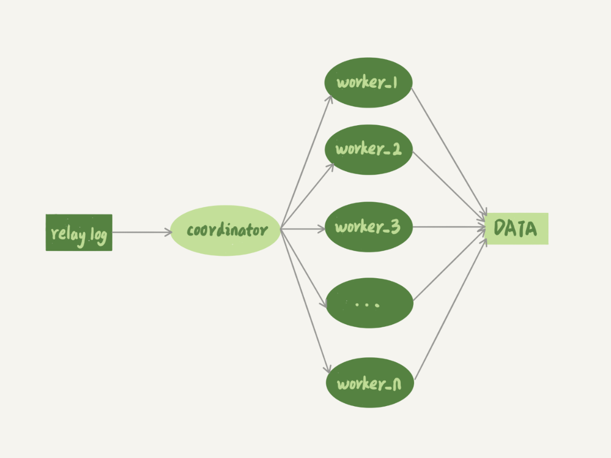

# 26 备库为什么会延迟好几个小时？

在上一篇文章中，我和你介绍了几种可能导致备库延迟的原因。你会发现，这些场景里，不论是偶发性的查询压力，还是备份，对备库延迟的影响一般是分钟级的，而且在备库恢复正常以后都能够追上来。

但是，如果备库执行日志的速度持续低于主库生成日志的速度，那这个延迟就有可能成了小时级别。而且对于一个压力持续比较高的主库来说，备库很可能永远都追不上主库的节奏。

这就涉及到今天我要给你介绍的话题：备库并行复制能力。

为了便于你理解，我们再一起看一下第 24 篇文章\[《MySQL 是怎么保证主备一致的？》\]的主备流程图。


图 1 主备流程图

谈到主备的并行复制能力，我们要关注的是图中黑色的两个箭头。一个箭头代表了客户端写入主库，另一箭头代表的是备库上 sql_thread 执行中转日志（relay log）。如果用箭头的粗细来代表并行度的话，那么真实情况就如图 1 所示，第一个箭头要明显粗于第二个箭头。

在主库上，影响并发度的原因就是各种锁了。由于 InnoDB 引擎支持行锁，除了所有并发事务都在更新同一行（热点行）这种极端场景外，它对业务并发度的支持还是很友好的。所以，你在性能测试的时候会发现，并发压测线程 32 就比单线程时，总体吞吐量高。

而日志在备库上的执行，就是图中备库上 sql_thread 更新数据 (DATA) 的逻辑。如果是用单线程的话，就会导致备库应用日志不够快，造成主备延迟。

在官方的 5.6 版本之前，MySQL 只支持单线程复制，由此在主库并发高、TPS 高时就会出现严重的主备延迟问题。

从单线程复制到最新版本的多线程复制，中间的演化经历了好几个版本。接下来，我就跟你说说 MySQL 多线程复制的演进过程。

其实说到底，所有的多线程复制机制，都是要把图 1 中只有一个线程的 sql_thread，拆成多个线程，也就是都符合下面的这个模型：



图 2 多线程模型

图 2 中，coordinator 就是原来的 sql_thread, 不过现在它不再直接更新数据了，只负责读取中转日志和分发事务。真正更新日志的，变成了 worker 线程。而 work 线程的个数，就是由参数 slave_parallel_workers 决定的。根据我的经验，把这个值设置为 8~16 之间最好（32 核物理机的情况），毕竟备库还有可能要提供读查询，不能把 CPU 都吃光了。

接下来，你需要先思考一个问题：事务能不能按照轮询的方式分发给各个 worker，也就是第一个事务分给 worker_1，第二个事务发给 worker_2 呢？

其实是不行的。因为，事务被分发给 worker 以后，不同的 worker 就独立执行了。但是，由于 CPU 的调度策略，很可能第二个事务最终比第一个事务先执行。而如果这时候刚好这两个事务更新的是同一行，也就意味着，同一行上的两个事务，在主库和备库上的执行顺序相反，会导致主备不一致的问题。

接下来，请你再设想一下另外一个问题：同一个事务的多个更新语句，能不能分给不同的 worker 来执行呢？

答案是，也不行。举个例子，一个事务更新了表 t1 和表 t2 中的各一行，如果这两条更新语句被分到不同 worker 的话，虽然最终的结果是主备一致的，但如果表 t1 执行完成的瞬间，备库上有一个查询，就会看到这个事务“更新了一半的结果”，破坏了事务逻辑的隔离性。

所以，coordinator 在分发的时候，需要满足以下这两个基本要求：

1. 不能造成更新覆盖。这就要求更新同一行的两个事务，必须被分发到同一个 worker 中。
1. 同一个事务不能被拆开，必须放到同一个 worker 中。

各个版本的多线程复制，都遵循了这两条基本原则。接下来，我们就看看各个版本的并行复制策略。

## MySQL 5.5 版本的并行复制策略

官方 MySQL 5.5 版本是不支持并行复制的。但是，在 2012 年的时候，我自己服务的业务出现了严重的主备延迟，原因就是备库只有单线程复制。然后，我就先后写了两个版本的并行策略。

这里，我给你介绍一下这两个版本的并行策略，即按表分发策略和按行分发策略，以帮助你理解 MySQL 官方版本并行复制策略的迭代。

### 按表分发策略

按表分发事务的基本思路是，如果两个事务更新不同的表，它们就可以并行。因为数据是存储在表里的，所以按表分发，可以保证两个 worker 不会更新同一行。

当然，如果有跨表的事务，还是要把两张表放在一起考虑的。如图 3 所示，就是按表分发的规则。


图 3 按表并行复制程模型

可以看到，每个 worker 线程对应一个 hash 表，用于保存当前正在这个 worker 的“执行队列”里的事务所涉及的表。hash 表的 key 是“库名. 表名”，value 是一个数字，表示队列中有多少个事务修改这个表。

在有事务分配给 worker 时，事务里面涉及的表会被加到对应的 hash 表中。worker 执行完成后，这个表会被从 hash 表中去掉。

图 3 中，hash_table_1 表示，现在 worker_1 的“待执行事务队列”里，有 4 个事务涉及到 db1.t1 表，有 1 个事务涉及到 db2.t2 表；hash_table_2 表示，现在 worker_2 中有一个事务会更新到表 t3 的数据。

假设在图中的情况下，coordinator 从中转日志中读入一个新事务 T，这个事务修改的行涉及到表 t1 和 t3。

现在我们用事务 T 的分配流程，来看一下分配规则。

1. 由于事务 T 中涉及修改表 t1，而 worker_1 队列中有事务在修改表 t1，事务 T 和队列中的某个事务要修改同一个表的数据，这种情况我们说事务 T 和 worker_1 是冲突的。
1. 按照这个逻辑，顺序判断事务 T 和每个 worker 队列的冲突关系，会发现事务 T 跟 worker_2 也冲突。
1. 事务 T 跟多于一个 worker 冲突，coordinator 线程就进入等待。
1. 每个 worker 继续执行，同时修改 hash_table。假设 hash_table_2 里面涉及到修改表 t3 的事务先执行完成，就会从 hash_table_2 中把 db1.t3 这一项去掉。
1. 这样 coordinator 会发现跟事务 T 冲突的 worker 只有 worker_1 了，因此就把它分配给 worker_1。
1. coordinator 继续读下一个中转日志，继续分配事务。

也就是说，每个事务在分发的时候，跟所有 worker 的冲突关系包括以下三种情况：

1. 如果跟所有 worker 都不冲突，coordinator 线程就会把这个事务分配给最空闲的 woker;
1. 如果跟多于一个 worker 冲突，coordinator 线程就进入等待状态，直到和这个事务存在冲突关系的 worker 只剩下 1 个；
1. 如果只跟一个 worker 冲突，coordinator 线程就会把这个事务分配给这个存在冲突关系的 worker。

这个按表分发的方案，在多个表负载均匀的场景里应用效果很好。但是，如果碰到热点表，比如所有的更新事务都会涉及到某一个表的时候，所有事务都会被分配到同一个 worker 中，就变成单线程复制了。

### 按行分发策略

要解决热点表的并行复制问题，就需要一个按行并行复制的方案。按行复制的核心思路是：如果两个事务没有更新相同的行，它们在备库上可以并行执行。显然，这个模式要求 binlog 格式必须是 row。

这时候，我们判断一个事务 T 和 worker 是否冲突，用的就规则就不是“修改同一个表”，而是“修改同一行”。

按行复制和按表复制的数据结构差不多，也是为每个 worker，分配一个 hash 表。只是要实现按行分发，这时候的 key，就必须是“库名 + 表名 + 唯一键的值”。

但是，这个“唯一键”只有主键 id 还是不够的，我们还需要考虑下面这种场景，表 t1 中除了主键，还有唯一索引 a：

```sql
CREATE TABLE `t1` (
  `id` int(11) NOT NULL,
  `a` int(11) DEFAULT NULL,
  `b` int(11) DEFAULT NULL,
  PRIMARY KEY (`id`),
  UNIQUE KEY `a` (`a`)
) ENGINE=InnoDB; 
insert into t1 values(1,1,1),(2,2,2),(3,3,3),(4,4,4),(5,5,5);
```

假设，接下来我们要在主库执行这两个事务：


图 4 唯一键冲突示例

可以看到，这两个事务要更新的行的主键值不同，但是如果它们被分到不同的 worker，就有可能 session B 的语句先执行。这时候 id=1 的行的 a 的值还是 1，就会报唯一键冲突。

因此，基于行的策略，事务 hash 表中还需要考虑唯一键，即 key 应该是“库名 + 表名 + 索引 a 的名字 +a 的值”。

比如，在上面这个例子中，我要在表 t1 上执行 update t1 set a=1 where id=2 语句，在 binlog 里面记录了整行的数据修改前各个字段的值，和修改后各个字段的值。

因此，coordinator 在解析这个语句的 binlog 的时候，这个事务的 hash 表就有三个项:

1. key=hash_func(db1+t1+“PRIMARY”+2), value=2; 这里 value=2 是因为修改前后的行 id 值不变，出现了两次。
1. key=hash_func(db1+t1+“a”+2), value=1，表示会影响到这个表 a=2 的行。
1. key=hash_func(db1+t1+“a”+1), value=1，表示会影响到这个表 a=1 的行。

可见， **相比于按表并行分发策略，按行并行策略在决定线程分发的时候，需要消耗更多的计算资源。** 你可能也发现了，这两个方案其实都有一些约束条件：

1. 要能够从 binlog 里面解析出表名、主键值和唯一索引的值。也就是说，主库的 binlog 格式必须是 row；
1. 表必须有主键；
1. 不能有外键。表上如果有外键，级联更新的行不会记录在 binlog 中，这样冲突检测就不准确。

但，好在这三条约束规则，本来就是 DBA 之前要求业务开发人员必须遵守的线上使用规范，所以这两个并行复制策略在应用上也没有碰到什么麻烦。

对比按表分发和按行分发这两个方案的话，按行分发策略的并行度更高。不过，如果是要操作很多行的大事务的话，按行分发的策略有两个问题：

1. 耗费内存。比如一个语句要删除 100 万行数据，这时候 hash 表就要记录 100 万个项。
1. 耗费 CPU。解析 binlog，然后计算 hash 值，对于大事务，这个成本还是很高的。

所以，我在实现这个策略的时候会设置一个阈值，单个事务如果超过设置的行数阈值（比如，如果单个事务更新的行数超过 10 万行），就暂时退化为单线程模式，退化过程的逻辑大概是这样的：

1. coordinator 暂时先 hold 住这个事务；
1. 等待所有 worker 都执行完成，变成空队列；
1. coordinator 直接执行这个事务；
1. 恢复并行模式。

读到这里，你可能会感到奇怪，这两个策略又没有被合到官方，我为什么要介绍这么详细呢？其实，介绍这两个策略的目的是抛砖引玉，方便你理解后面要介绍的社区版本策略。

## MySQL 5.6 版本的并行复制策略

官方 MySQL5.6 版本，支持了并行复制，只是支持的粒度是按库并行。理解了上面介绍的按表分发策略和按行分发策略，你就理解了，用于决定分发策略的 hash 表里，key 就是数据库名。

这个策略的并行效果，取决于压力模型。如果在主库上有多个 DB，并且各个 DB 的压力均衡，使用这个策略的效果会很好。

相比于按表和按行分发，这个策略有两个优势：

1. 构造 hash 值的时候很快，只需要库名；而且一个实例上 DB 数也不会很多，不会出现需要构造 100 万个项这种情况。
1. 不要求 binlog 的格式。因为 statement 格式的 binlog 也可以很容易拿到库名。

但是，如果你的主库上的表都放在同一个 DB 里面，这个策略就没有效果了；或者如果不同 DB 的热点不同，比如一个是业务逻辑库，一个是系统配置库，那也起不到并行的效果。

理论上你可以创建不同的 DB，把相同热度的表均匀分到这些不同的 DB 中，强行使用这个策略。不过据我所知，由于需要特地移动数据，这个策略用得并不多。

## MariaDB 的并行复制策略

在\[第 23 篇文章\]中，我给你介绍了 redo log 组提交 (group commit) 优化， 而 MariaDB 的并行复制策略利用的就是这个特性：

1. 能够在同一组里提交的事务，一定不会修改同一行；
1. 主库上可以并行执行的事务，备库上也一定是可以并行执行的。

在实现上，MariaDB 是这么做的：

1. 在一组里面一起提交的事务，有一个相同的 commit_id，下一组就是 commit_id+1；
1. commit_id 直接写到 binlog 里面；
1. 传到备库应用的时候，相同 commit_id 的事务分发到多个 worker 执行；
1. 这一组全部执行完成后，coordinator 再去取下一批。

当时，这个策略出来的时候是相当惊艳的。因为，之前业界的思路都是在“分析 binlog，并拆分到 worker”上。而 MariaDB 的这个策略，目标是“模拟主库的并行模式”。

但是，这个策略有一个问题，它并没有实现“真正的模拟主库并发度”这个目标。在主库上，一组事务在 commit 的时候，下一组事务是同时处于“执行中”状态的。

如图 5 所示，假设了三组事务在主库的执行情况，你可以看到在 trx1、trx2 和 trx3 提交的时候，trx4、trx5 和 trx6 是在执行的。这样，在第一组事务提交完成的时候，下一组事务很快就会进入 commit 状态。


图 5 主库并行事务

而按照 MariaDB 的并行复制策略，备库上的执行效果如图 6 所示。


图 6 MariaDB 并行复制，备库并行效果

可以看到，在备库上执行的时候，要等第一组事务完全执行完成后，第二组事务才能开始执行，这样系统的吞吐量就不够。

另外，这个方案很容易被大事务拖后腿。假设 trx2 是一个超大事务，那么在备库应用的时候，trx1 和 trx3 执行完成后，就只能等 trx2 完全执行完成，下一组才能开始执行。这段时间，只有一个 worker 线程在工作，是对资源的浪费。

不过即使如此，这个策略仍然是一个很漂亮的创新。因为，它对原系统的改造非常少，实现也很优雅。

## MySQL 5.7 的并行复制策略

在 MariaDB 并行复制实现之后，官方的 MySQL5.7 版本也提供了类似的功能，由参数 slave-parallel-type 来控制并行复制策略：

1. 配置为 DATABASE，表示使用 MySQL 5.6 版本的按库并行策略；
1. 配置为 LOGICAL_CLOCK，表示的就是类似 MariaDB 的策略。不过，MySQL 5.7 这个策略，针对并行度做了优化。这个优化的思路也很有趣儿。

你可以先考虑这样一个问题：同时处于“执行状态”的所有事务，是不是可以并行？

答案是，不能。

因为，这里面可能有由于锁冲突而处于锁等待状态的事务。如果这些事务在备库上被分配到不同的 worker，就会出现备库跟主库不一致的情况。

而上面提到的 MariaDB 这个策略的核心，是“所有处于 commit”状态的事务可以并行。事务处于 commit 状态，表示已经通过了锁冲突的检验了。

这时候，你可以再回顾一下两阶段提交，我把前面\[第 23 篇文章\]中介绍过的两阶段提交过程图贴过来。


图 7 两阶段提交细化过程图

其实，不用等到 commit 阶段，只要能够到达 redo log prepare 阶段，就表示事务已经通过锁冲突的检验了。

因此，MySQL 5.7 并行复制策略的思想是：

1. 同时处于 prepare 状态的事务，在备库执行时是可以并行的；
1. 处于 prepare 状态的事务，与处于 commit 状态的事务之间，在备库执行时也是可以并行的。

我在第 23 篇文章，讲 binlog 的组提交的时候，介绍过两个参数：

1. binlog_group_commit_sync_delay 参数，表示延迟多少微秒后才调用 fsync;
1. binlog_group_commit_sync_no_delay_count 参数，表示累积多少次以后才调用 fsync。

这两个参数是用于故意拉长 binlog 从 write 到 fsync 的时间，以此减少 binlog 的写盘次数。在 MySQL 5.7 的并行复制策略里，它们可以用来制造更多的“同时处于 prepare 阶段的事务”。这样就增加了备库复制的并行度。

也就是说，这两个参数，既可以“故意”让主库提交得慢些，又可以让备库执行得快些。在 MySQL 5.7 处理备库延迟的时候，可以考虑调整这两个参数值，来达到提升备库复制并发度的目的。

## MySQL 5.7.22 的并行复制策略

在 2018 年 4 月份发布的 MySQL 5.7.22 版本里，MySQL 增加了一个新的并行复制策略，基于 WRITESET 的并行复制。

相应地，新增了一个参数 binlog-transaction-dependency-tracking，用来控制是否启用这个新策略。这个参数的可选值有以下三种。

1. COMMIT_ORDER，表示的就是前面介绍的，根据同时进入 prepare 和 commit 来判断是否可以并行的策略。
1. WRITESET，表示的是对于事务涉及更新的每一行，计算出这一行的 hash 值，组成集合 writeset。如果两个事务没有操作相同的行，也就是说它们的 writeset 没有交集，就可以并行。
1. WRITESET_SESSION，是在 WRITESET 的基础上多了一个约束，即在主库上同一个线程先后执行的两个事务，在备库执行的时候，要保证相同的先后顺序。

当然为了唯一标识，这个 hash 值是通过“库名 + 表名 + 索引名 + 值”计算出来的。如果一个表上除了有主键索引外，还有其他唯一索引，那么对于每个唯一索引，insert 语句对应的 writeset 就要多增加一个 hash 值。

你可能看出来了，这跟我们前面介绍的基于 MySQL 5.5 版本的按行分发的策略是差不多的。不过，MySQL 官方的这个实现还是有很大的优势：

1. writeset 是在主库生成后直接写入到 binlog 里面的，这样在备库执行的时候，不需要解析 binlog 内容（event 里的行数据），节省了很多计算量；
1. 不需要把整个事务的 binlog 都扫一遍才能决定分发到哪个 worker，更省内存；
1. 由于备库的分发策略不依赖于 binlog 内容，所以 binlog 是 statement 格式也是可以的。

因此，MySQL 5.7.22 的并行复制策略在通用性上还是有保证的。

当然，对于“表上没主键”和“外键约束”的场景，WRITESET 策略也是没法并行的，也会暂时退化为单线程模型。

## 小结

在今天这篇文章中，我和你介绍了 MySQL 的各种多线程复制策略。

为什么要有多线程复制呢？这是因为单线程复制的能力全面低于多线程复制，对于更新压力较大的主库，备库是可能一直追不上主库的。从现象上看就是，备库上 seconds_behind_master 的值越来越大。

在介绍完每个并行复制策略后，我还和你分享了不同策略的优缺点：

- 如果你是 DBA，就需要根据不同的业务场景，选择不同的策略；
- 如果是你业务开发人员，也希望你能从中获取灵感用到平时的开发工作中。

从这些分析中，你也会发现大事务不仅会影响到主库，也是造成备库复制延迟的主要原因之一。因此，在平时的开发工作中，我建议你尽量减少大事务操作，把大事务拆成小事务。

官方 MySQL5.7 版本新增的备库并行策略，修改了 binlog 的内容，也就是说 binlog 协议并不是向上兼容的，在主备切换、版本升级的时候需要把这个因素也考虑进去。

最后，我给你留下一个思考题吧。

假设一个 MySQL 5.7.22 版本的主库，单线程插入了很多数据，过了 3 个小时后，我们要给这个主库搭建一个相同版本的备库。

这时候，你为了更快地让备库追上主库，要开并行复制。在 binlog-transaction-dependency-tracking 参数的 COMMIT_ORDER、WRITESET 和 WRITE_SESSION 这三个取值中，你会选择哪一个呢？

你选择的原因是什么？如果设置另外两个参数，你认为会出现什么现象呢？

你可以把你的答案和分析写在评论区，我会在下一篇文章跟你讨论这个问题。感谢你的收听，也欢迎你把这篇文章分享给更多的朋友一起阅读。

## 上期问题时间

上期的问题是，什么情况下，备库的主备延迟会表现为一个 45 度的线段？评论区有不少同学的回复都说到了重点：备库的同步在这段时间完全被堵住了。

产生这种现象典型的场景主要包括两种：

- 一种是大事务（包括大表 DDL、一个事务操作很多行）；
- 还有一种情况比较隐蔽，就是备库起了一个长事务，比如

```sql
begin; 
select * from t limit 1;
```

然后就不动了。

这时候主库对表 t 做了一个加字段操作，即使这个表很小，这个 DDL 在备库应用的时候也会被堵住，也不能看到这个现象。

评论区还有同学说是不是主库多线程、从库单线程，备库跟不上主库的更新节奏导致的？今天这篇文章，我们刚好讲的是并行复制。所以，你知道了，这种情况会导致主备延迟，但不会表现为这种标准的呈 45 度的直线。

评论区留言点赞板：

> @易翔 、 @万勇、@老杨同志 等同学的回复都提到了我们上面说的场景；
> @Max 同学提了一个很不错的问题。主备关系里面，备库主动连接，之后的 binlog 发送是主库主动推送的。之所以这么设计也是为了效率和实时性考虑，毕竟靠备库轮询，会有时间差。
