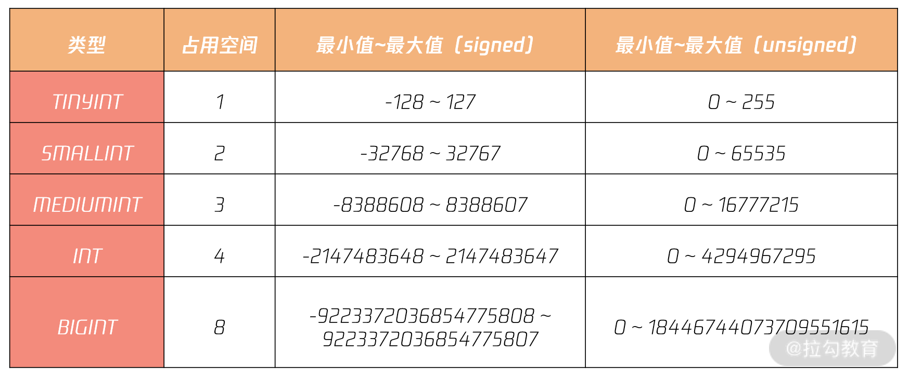
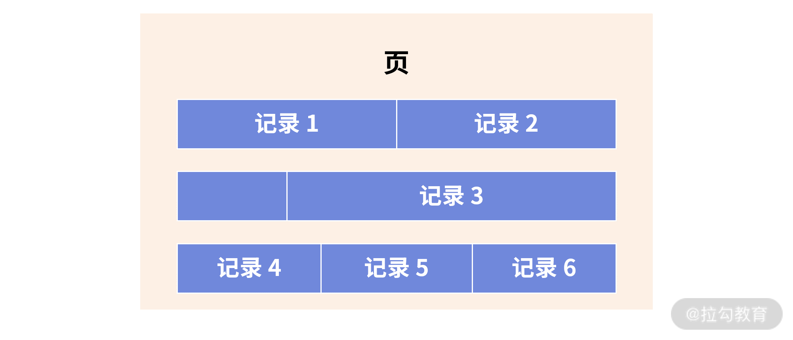
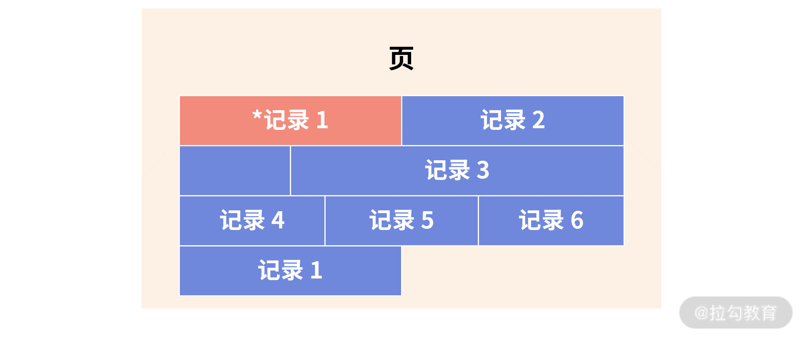

01 数字类型：避免自增踩坑
==============

在进行表结构设计时，数字类型是最为常见的类型之一，但要用好数字类型并不如想象得那么简单，比如：

* 怎么设计一个互联网海量并发业务的自增主键？用 INT 就够了？
* 怎么设计账户的余额？用 DECIMAL 类型就万无一失了吗？

**以上全错！**数字类型看似简单，但在表结构架构设计中很容易出现上述“设计上思考不全面”的问题（特别是在海量并发的互联网场景下）。所以我将从业务架构设计的角度带你深入了解数字类型的使用，期待你学完后，能真正用好 MySQL 的数字类型（整型类型、浮点类型和高精度型）。

### 数字类型

#### 整型类型

MySQL 数据库支持 SQL 标准支持的整型类型：INT、SMALLINT。此外，MySQL 数据库也支持诸如 TINYINT、MEDIUMINT 和 BIGINT 整型类型（表 1 显示了各种整型所占用的存储空间及取值范围）：



各 INT 类型的取值范围

在整型类型中，有 signed 和 unsigned 属性，其表示的是整型的取值范围，默认为 signed。在设计时，我不建议你刻意去用 unsigned 属性，因为在做一些数据分析时，SQL 可能返回的结果并不是想要得到的结果。

来看一个“销售表 sale”的例子，其表结构和数据如下。这里要特别注意，列 sale\_count 用到的是 unsigned 属性（即设计时希望列存储的数值大于等于 0）：

```
mysql> SHOW CREATE TABLE sale\G***************************1. row***************************


       Table: sale


Create Table: CREATE TABLE `sale` (


  `sale_date` date NOT NULL,


  `sale_count` int unsigned DEFAULT NULL,


  PRIMARY KEY (`sale_date`)


) ENGINE=InnoDB DEFAULT CHARSET=utf8mb4 COLLATE=utf8mb4_general_ci


1 row in set (0.00 sec)


mysql> SELECT * FROM sale;


+------------+------------+


| sale_date  | sale_count |


+------------+------------+


| 2020-01-01 |      10000 |


| 2020-02-01 |       8000 |


| 2020-03-01 |      12000 |


| 2020-04-01 |       9000 |


| 2020-05-01 |      10000 |


| 2020-06-01 |      18000 |


+------------+------------+


6 rows in set (0.00 sec)

```

其中，sale\_date 表示销售的日期，sale\_count 表示每月的销售数量。现在有一个需求，老板想要统计每个月销售数量的变化，以此做商业决策。这条 SQL 语句需要应用到非等值连接，但也并不是太难写：

```
SELECT


    s1.sale_date, s2.sale_count - s1.sale_count AS diff


FROM


    sale s1


        LEFT JOIN


    sale s2 ON DATE_ADD(s2.sale_date, INTERVAL 1 MONTH) = s1.sale_date


ORDER BY sale_date;

```

然而，在执行的过程中，由于列 sale\_count 用到了 unsigned 属性，会抛出这样的结果：

```
ERROR 1690 (22003): BIGINT UNSIGNED value is out of range in '(`test`.`s2`.`sale_count` - `test`.`s1`.`sale_count`)'

```

可以看到，MySQL 提示用户计算的结果超出了范围。其实，这里 MySQL 要求 unsigned 数值相减之后依然为 unsigned，否则就会报错。

为了避免这个错误，需要对数据库参数 sql\_mode 设置为 NO\_UNSIGNED\_SUBTRACTION，允许相减的结果为 signed，这样才能得到最终想要的结果：

```
mysql> SET sql_mode='NO_UNSIGNED_SUBTRACTION';


Query OK, 0 rows affected (0.00 sec)


SELECT


    s1.sale_date,


    IFNULL(s2.sale_count - s1.sale_count,'') AS diff


FROM


    sale s1


    LEFT JOIN sale s2 


    ON DATE_ADD(s2.sale_date, INTERVAL 1 MONTH) = s1.sale_date


ORDER BY sale_date;


+------------+-------+


| sale_date  | diff  |


+------------+-------+


| 2020-01-01 |       |


| 2020-02-01 | 2000  |


| 2020-03-01 | -4000 |


| 2020-04-01 | 3000  |


| 2020-05-01 | -1000 |


| 2020-06-01 | -8000 |


+------------+-------+


6 rows in set (0.00 sec)

```

#### 浮点类型和高精度型

除了整型类型，数字类型常用的还有浮点和高精度类型。

MySQL 之前的版本中存在浮点类型 Float 和 Double，但这些类型因为不是高精度，也不是 SQL 标准的类型， **所以在真实的生产环境中不推荐使用** ，否则在计算时，由于精度类型问题，会导致最终的计算结果出错。

更重要的是，从 MySQL 8.0.17 版本开始，当创建表用到类型 Float 或 Double 时，会抛出下面的警告：MySQL 提醒用户不该用上述浮点类型，甚至提醒将在之后版本中废弃浮点类型。

```
Specifying number of digits for floating point data types is deprecated and will be removed in a future release

```

而数字类型中的高精度 DECIMAL 类型可以使用，当声明该类型列时，可以（并且通常必须要）指定精度和标度，例如：

```
salary DECIMAL(8,2)

```

其中，8 是精度（精度表示保存值的主要位数），2 是标度（标度表示小数点后面保存的位数）。通常在表结构设计中，类型 DECIMAL 可以用来表示用户的工资、账户的余额等精确到小数点后 2 位的业务。

然而，在海量并发的互联网业务中使用，金额字段的设计并不推荐使用 DECIMAL 类型，而更推荐使用 INT 整型类型（下文就会分析原因）。

### 业务表结构设计实战

#### 整型类型与自增设计

在真实业务场景中，整型类型最常见的就是在业务中用来表示某件物品的数量。例如上述表的销售数量，或电商中的库存数量、购买次数等。在业务中，整型类型的另一个常见且重要的使用用法是作为表的主键，即用来唯一标识一行数据。

整型结合属性 auto\_increment，可以实现 **自增功能** ，但在表结构设计时用自增做主键，希望你特别要注意以下两点，若不注意，可能会对业务造成灾难性的打击：

* 用 BIGINT 做主键，而不是 INT；
* 自增值并不持久化，可能会有回溯现象（MySQL 8.0 版本前）。

从表 1 可以发现，INT 的范围最大在 42 亿的级别，在真实的互联网业务场景的应用中，很容易达到最大值。例如一些流水表、日志表，每天 1000W 数据量，420 天后，INT 类型的上限即可达到。

因此，（敲黑板 1） **用自增整型做主键，一律使用 BIGINT，而不是 INT** 。不要为了节省 4 个字节使用 INT，当达到上限时，再进行表结构的变更，将是巨大的负担与痛苦。

那这里又引申出一个有意思的问题：如果达到了 INT 类型的上限，数据库的表现又将如何呢？是会重新变为 1？我们可以通过下面的 SQL 语句验证一下：

```
mysql> CREATE TABLE t (


    ->     a INT AUTO_INCREMENT PRIMARY KEY


    -> );


mysql> INSERT INTO t VALUES (2147483647);


Query OK, 1 row affected (0.01 sec)


mysql> INSERT INTO t VALUES (NULL);


ERROR 1062 (23000): Duplicate entry '2147483647' for key 't.PRIMARY'

```

可以看到，当达到 INT 上限后，再次进行自增插入时，会报重复错误，MySQL 数据库并不会自动将其重置为 1。

第二个特别要注意的问题是，（敲黑板 2） **MySQL 8.0 版本前，自增不持久化，自增值可能会存在回溯问题** ！

```
mysql> SELECT * FROM t;


+---+


| a |


+---+


| 1 |


| 2 |


| 3 |


+---+


3 rows in set (0.01 sec)


mysql> DELETE FROM t WHERE a = 3;


Query OK, 1 row affected (0.02 sec)


mysql> SHOW CREATE TABLE t\G


***************************1. row***************************Table: t


Create Table: CREATE TABLE `t` (


  `a` int NOT NULL AUTO_INCREMENT,


  PRIMARY KEY (`a`)


) ENGINE=InnoDB AUTO_INCREMENT=4 DEFAULT CHARSET=utf8mb4 COLLATE=utf8mb4_general_ci


1 row in set (0.00 sec

```

可以看到，在删除自增为 3 的这条记录后，下一个自增值依然为 4（AUTO\_INCREMENT=4），这里并没有错误，自增并不会进行回溯。但若这时数据库发生重启，那数据库启动后，表 t 的自增起始值将再次变为 3，即自增值发生回溯。具体如下所示：

```
mysql> SHOW CREATE TABLE t\G***************************1. row***************************


       Table: t


Create Table: CREATE TABLE `t` (


  `a` int NOT NULL AUTO_INCREMENT,


  PRIMARY KEY (`a`)


) ENGINE=InnoDB AUTO_INCREMENT=3 DEFAULT CHARSET=utf8mb4 COLLATE=utf8mb4_general_ci


1 row in set (0.00 s

```

若要彻底解决这个问题，有以下 2 种方法：

* 升级 MySQL 版本到 8.0 版本，每张表的自增值会持久化；
* 若无法升级数据库版本，则强烈不推荐在核心业务表中使用自增数据类型做主键。

其实，在海量互联网架构设计过程中，为了之后更好的分布式架构扩展性，不建议使用整型类型做主键，更为推荐的是 **字符串类型** （这部分内容将在 05 节中详细介绍）。

#### 资金字段设计

在用户余额、基金账户余额、数字钱包、零钱等的业务设计中，由于字段都是资金字段，通常程序员习惯使用 DECIMAL 类型作为字段的选型，因为这样可以精确到分，如：DECIMAL(8,2)。

```
CREATE TABLE User (


  userId BIGINT AUTO_INCREMENT,


  money DECIMAL(8,2) NOT NULL,


  ......


)

```

（敲黑板3） **在海量互联网业务的设计标准中，并不推荐用 DECIMAL 类型，而是更推荐将 DECIMAL 转化为 整型类型** 。也就是说，资金类型更推荐使用用分单位存储，而不是用元单位存储。如1元在数据库中用整型类型 100 存储。

金额字段的取值范围如果用 DECIMAL 表示的，如何定义长度呢？因为类型 DECIMAL 是个变长字段，若要定义金额字段，则定义为 DECIMAL(8,2) 是远远不够的。这样只能表示存储最大值为 999999.99，百万级的资金存储。

用户的金额至少要存储百亿的字段，而统计局的 GDP 金额字段则可能达到数十万亿级别。用类型 DECIMAL 定义，不好统一。

另外重要的是，类型 DECIMAL 是通过二进制实现的一种编码方式，计算效率远不如整型来的高效。因此，推荐使用 BIG INT 来存储金额相关的字段。

字段存储时采用分存储，即便这样 BIG INT 也能存储千兆级别的金额。这里，1兆 = 1万亿。

这样的好处是，所有金额相关字段都是定长字段，占用 8 个字节，存储高效。另一点，直接通过整型计算，效率更高。

注意，在数据库设计中，我们非常强调定长存储，因为定长存储的性能更好。

我们来看在数据库中记录的存储方式，大致如下：



若发生更新，记录 1 原先的空间无法容纳更新后记录 1 的存储空间，因此，这时数据库会将记录 1 标记为删除，寻找新的空间给记录1使用，如：



上图中\*记录 1 表示的就是原先记录 1 占用的空间，而这个空间后续将变成碎片空间，无法继续使用，除非人为地进行表空间的碎片整理。

那么，当使用 BIG INT 存储金额字段的时候，如何表示小数点中的数据呢？其实，这部分完全可以交由前端进行处理并展示。作为数据库本身，只要按分进行存储即可。

### 总结

今天，我带你深入了解了 MySQL 数字类型在表结构设计中的实战。我总结一下今天的重点：

* 不推荐使用整型类型的属性 Unsigned，若非要使用，参数 sql\_mode 务必额外添加上选项 NO\_UNSIGNED\_SUBTRACTION；
* 自增整型类型做主键，务必使用类型 BIGINT，而非 INT，后期表结构调整代价巨大；
* MySQL 8.0 版本前，自增整型会有回溯问题，**做业务开发的你一定要了解这个问题；**
* 当达到自增整型类型的上限值时，再次自增插入，MySQL 数据库会报重复错误；
* 不要再使用浮点类型 Float、Double，MySQL 后续版本将不再支持上述两种类型；
* 账户余额字段，设计是用整型类型，而不是 DECIMAL 类型，这样性能更好，存储更紧凑。
