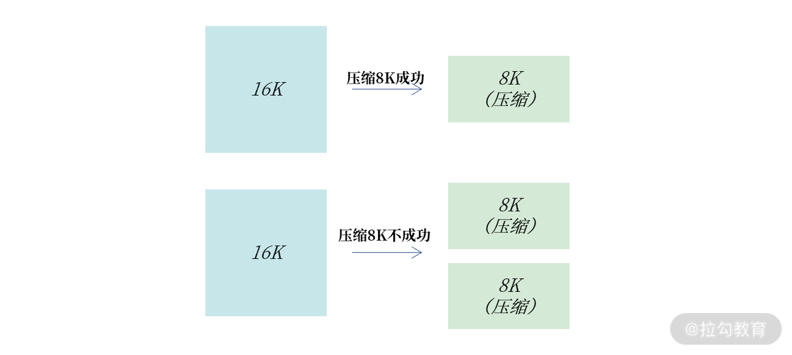
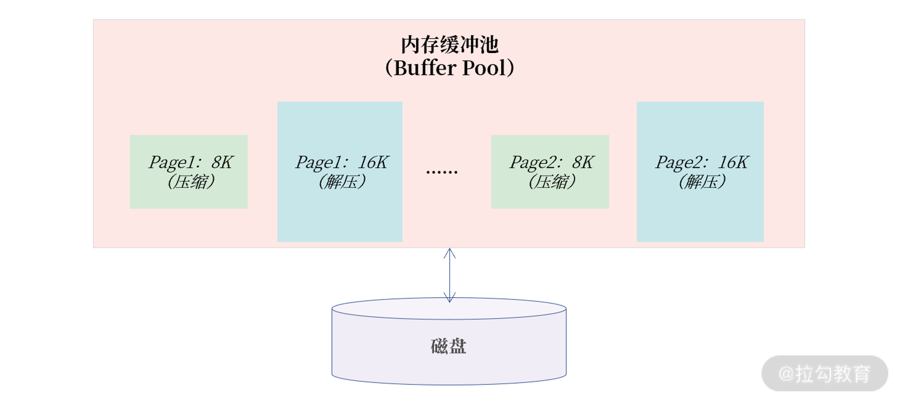
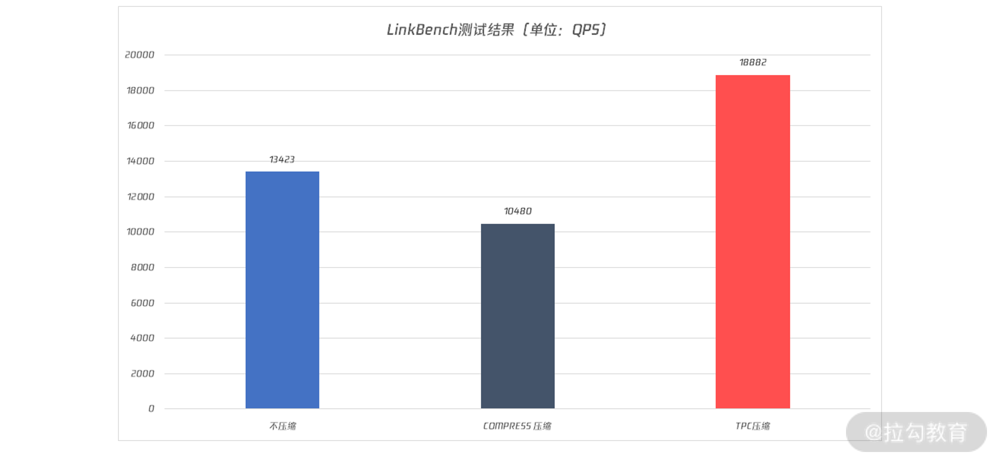

# 06 表压缩：不仅仅是空间压缩

前面几讲，我们从最早的各种列类型的选择，过渡到表结构的设计，相信学完前面几讲，你已经能够较好地设计出各种业务表，比如用户表、订单表。既然我们已经掌握了表的逻辑设计，那这一讲就继续学习不同业务表的物理存储设计。

据我观察，很多同学不会在表结构设计之初就考虑存储的设计，只有当业务发展到一定规模才会意识到问题的严重性。而物理存储主要是考虑是否要启用表的压缩功能，默认情况下，所有表都是非压缩的。

但一些同学一听到压缩，总会下意识地认为压缩会导致 MySQL 数据库的性能下降。**这个观点说对也不对，需要根据不同场景进行区分。**这一讲，我们就来看一看表的物理存储设计：不同场景下，表压缩功能的使用。

### 表压缩

数据库中的表是由一行行记录（rows）所组成，每行记录被存储在一个页中，在 MySQL 中，一个页的大小默认为 16K，一个个页又组成了每张表的表空间。

通常我们认为，**如果一个页中存放的记录数越多，数据库的性能越高**。这是因为数据库表空间中的页是存放在磁盘上，MySQL 数据库先要将磁盘中的页读取到内存缓冲池，然后以页为单位来读取和管理记录。

一个页中存放的记录越多，内存中能存放的记录数也就越多，那么存取效率也就越高。若想将一个页中存放的记录数变多，可以启用压缩功能。此外，启用压缩后，存储空间占用也变小了，同样单位的存储能存放的数据也变多了。

若要启用压缩技术，数据库可以根据记录、页、表空间进行压缩，不过在实际工程中，我们普遍使用页压缩技术，**这是为什么呢？**

- **压缩每条记录：** 因为每次读写都要压缩和解压，过于依赖 CPU 的计算能力，性能会明显下降；另外，因为单条记录大小不会特别大，一般小于 1K，压缩效率也并不会特别好。
- **压缩表空间：**压缩效率非常不错，但要求表空间文件静态不增长，这对基于磁盘的关系型数据库来说，很难实现。

而基于页的压缩，既能提升压缩效率，又能在性能之间取得一种平衡。

可能很多同学认为，启用表的页压缩功能后，性能有明显损失，因为压缩需要有额外的开销。的确，压缩需要消耗额外的 CPU 指令，但是压缩并不意味着性能下降，或许能额外提升性能，因为大部分的数据库业务系统，CPU 的处理能力是剩余的，而 I/O 负载才是数据库主要瓶颈。

借助页压缩技术，MySQL 可以把一个 16K 的页压缩为 8K，甚至 4K，这样在从磁盘写入或读取时，就能将 I/O 请求大小减半，甚至更小，从而提升数据库的整体性能。

当然，压缩是一种平衡，并非一定能提升数据库的性能。这种性能“平衡”取决于解压缩开销带来的收益和解压缩带来的开销之间的一种权衡。但无论如何，压缩都可以有效整理数据原本的容量，对存储空间来说，压缩的收益是巨大的。

### MySQL 压缩表设计

#### COMPRESS 页压缩

COMPRESS 页压缩是 MySQL 5.7 版本之前提供的页压缩功能。只要在创建表时指定ROW_FORMAT=COMPRESS，并设置通过选项 KEY_BLOCK_SIZE 设置压缩的比例。**需要牢记的是，**虽然是通过选项 ROW_FORMAT 启用压缩功能，但这并不是记录级压缩，依然是根据页的维度进行压缩。

下面这是一张日志表，ROW_FROMAT 设置为 COMPRESS，表示启用 COMPRESS 页压缩功能，KEY_BLOCK_SIZE 设置为 8，表示将一个 16K 的页压缩为 8K。

```
CREATE TABLE Log (
  logId BINARY(16) PRIMARY KEY,
  ......
)
ROW_FORMAT=COMPRESSED
KEY_BLOCK_SIZE=8
```

COMPRESS 页压缩就是将一个页压缩到指定大小。如 16K 的页压缩到 8K，若一个 16K 的页无法压缩到 8K，则会产生 2 个压缩后的 8K 页，具体如下图所示：



COMPRESS 页压缩

总的来说，COMPRESS 页压缩，适合用于一些对性能不敏感的业务表，例如日志表、监控表、告警表等，压缩比例通常能达到 50% 左右。

虽然 COMPRESS 压缩可以有效减小存储空间，但 COMPRESS 页压缩的实现对性能的开销是巨大的，性能会有明显退化。主要原因是一个压缩页在内存缓冲池中，存在压缩和解压两个页。



1 个 COMPRESS 压缩页在内存中存在 2 个页版本

如图所示，Page1 和 Page2 都是压缩页 8K，但是在内存中还有其解压后的 16K 页。这样设计的原因是 8K 的页用于后续页的更新，16K 的页用于读取，这样读取就不用每次做解压操作了。

很明显，这样的实现会增加对内存的开销，会导致缓存池能存放的有效数据变少，MySQL 数据库的性能自然出现明显退化。

为了 解决压缩性能下降的问题，从MySQL 5.7 版本开始推出了 TPC 压缩功能。

#### TPC 压缩

TPC（Transparent Page Compression）是 5.7 版本推出的一种新的页压缩功能，其利用文件系统的空洞（Punch Hole）特性进行压缩。可以使用下面的命令创建 TPC 压缩表：

```
CREATE TABLE Transaction （
  transactionId BINARY(16) PRIMARY KEY,
  .....
)
COMPRESSION=ZLIB | LZ4 | NONE;
```

要使用 TPC 压缩，首先要确认当前的操作系统是否支持空洞特性。通常来说，当前常见的 Linux 操作系统都已支持空洞特性。

由于空洞是文件系统的一个特性，利用空洞压缩只能压缩到文件系统的最小单位 4K，且其页压缩是 4K 对齐的。比如一个 16K 的页，压缩后为 7K，则实际占用空间 8K；压缩后为 3K，则实际占用空间是 4K；若压缩后是 13K，则占用空间依然为 16K。

TPC 压缩的具体实现如下所示：


TPC 页压缩

上图可以看到，一个 16K 的页压缩后是 8K，接着数据库会对这 16K 的页剩余的 8K 填充0x00，这样当这个 16K 的页写入到磁盘时，利用文件系统空洞特性，则实际将仅占用 8K 的物理存储空间。

空洞压缩的另一个好处是，它对数据库性能的侵入几乎是无影响的（小于 20%），甚至可能还能有性能的提升。

这是因为不同于 COMPRESS 页压缩，TPC 压缩在内存中只有一个 16K 的解压缩后的页，对于缓冲池没有额外的存储开销。

另一方面，所有页的读写操作都和非压缩页一样，没有开销，只有当这个页需要刷新到磁盘时，才会触发页压缩功能一次。但由于一个 16K 的页被压缩为了 8K 或 4K，其实写入性能会得到一定的提升。



官方 TPC 测试对比

上图是 MySQL 官方的 LinkBench 测试结果，可以看到，无压缩的测试结果为 13,432 QPS，传统的 COMPRESS 页压缩性能下降为 10,480 QPS，差不多30%的性能下降。基于TPC压缩的测试结果为 18,882，在未压缩的基础上还能有额外 40% 的性能提升。

### 表压缩在业务上的使用

总的来说，对一些对性能不敏感的业务表，例如日志表、监控表、告警表等，它们只对存储空间有要求，因此可以使用 COMPRESS 页压缩功能。

在一些较为核心的流水业务表上，我更推荐使用 TPC压缩。因为流水信息是一种非常核心的数据存储业务，通常伴随核心业务。如一笔电商交易，用户扣钱、下单、记流水，这就是一个核心业务的微模型。

所以，用户对流水表有性能需求。此外，流水又非常大，启用压缩功能可更为有效地存储数据。

若对压缩产生的性能抖动有所担心，**我的建议**：由于流水表通常是按月或天进行存储，对当前正在使用的流水表不要启用 TPC 功能，对已经成为历史的流水表启用 TPC 压缩功能，如下所示：


流水表的设计**需要特别注意的是：** 通过命令 ALTER TABLE xxx COMPRESSION = ZLIB 可以启用 TPC 页压缩功能，但是这只对后续新增的数据会进行压缩，对于原有的数据则不进行压缩。所以上述ALTER TABLE 操作只是修改元数据，瞬间就能完成。

若想要对整个表进行压缩，需要执行 OPTIMIZE TABLE 命令：

```
ALTER TABLE Transaction202102 COMPRESSION=ZLIB；
OPTIMIZE TABLE Transaction202102;
```

### 总结

在进行表结构设计时，除了进行列的选择外，还需要考虑存储的设计，特别是对于表的压缩功能的设计，总结来说：

- MySQL 中的压缩都是基于页的压缩；
- COMPRESS 页压缩适合用于性能要求不高的业务表，如日志、监控、告警表等；
- COMPRESS 页压缩内存缓冲池存在压缩和解压的两个页，会严重影响性能；
- 对存储有压缩需求，又希望性能不要有明显退化，推荐使用 TPC 压缩；
- 通过 ALTER TABLE 启用 TPC 压缩后，还需要执行命令 OPTIMIZE TABLE 才能立即完成空间的压缩。
