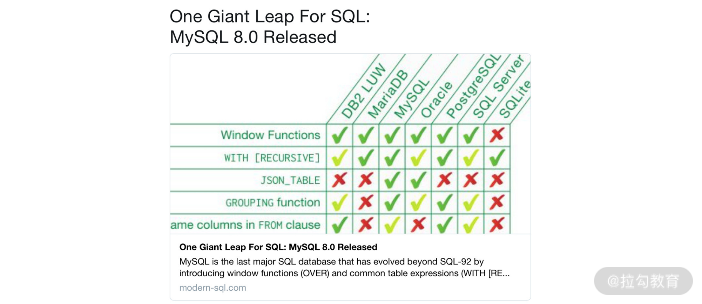
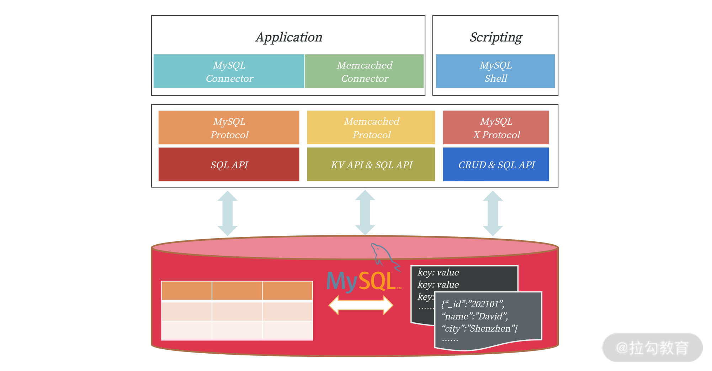
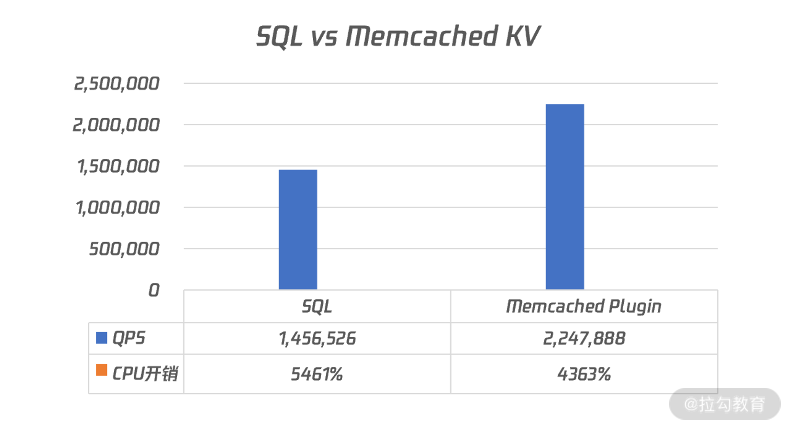

# 07 表的访问设计：你该选择 SQL 还是 NoSQL？

到目前为止，我已经带你学习了表结构的字段类型选择和表的物理存储设计，这一讲我们将继续学习表的访问选型。这样一来，字段类型选择 + 物理存储设计 + 表的访问设计，就完成了表结构设计的所有内容。

前面 6 讲，我演示的都是通过 SQL 的方式对表进行访问，但从 MySQL 5.6 版本开始，就支持除 SQL 外的其他访问方式，比如 NoSQL，甚至可以把 MySQL 打造成一个百万级并发访问的 KV 数据库或文档数据库。

今天这一讲，我就带你从全局角度看 MySQL 数据库中表的访问方式，以及它们各自的使用场景，希望你能有所收获。

### MySQL 中表的访问方式

SQL 是访问数据库的一个通用接口，虽然数据库有很多种，但数据库中的 SQL 却是类似的，因为 SQL 有标准存在，如 SQL92、SQL2003 等。

虽然有些数据库会扩展支持 SQL 标准外的语法，但 90% 的语法是兼容的，所以，不同数据库在 SQL 层面的学习成本是比较低的。也因为上述原因，从一种关系型数据库迁移到另一种关系型数据库，开发的迁移成本并不高。比如去 IOE，将 Oracle 数据库迁移到 MySQL 数据库，通常 SQL 语法并不是难题。

MySQL 8.0 版本前，有不少同学会吐槽 MySQL 对于 SQL 标准的支持的程度。但是在当前 8.0 版本下，MySQL 对于 SQL 语法的支持度已经越来越好，甚至在某些方面超过了商业数据库 Oracle。



上图是专家评估的不同数据库对 SQL 的支持程度，可以看到，MySQL 8.0 在这一块非常完善，特别是对 JSON_TABLE 的支持功能。

通常来说，MySQL 数据库用于 OLTP 的在线系统中，不用特别复杂的 SQL 语法支持。但 MySQL 8.0 完备的 SQL 支持意味着 MySQL 未来将逐渐补齐在 OLAP 业务方面的短板，让我们一起拭目以待。

当然，通过 SQL 访问表，你肯定并不陌生，这也不是本讲的重点。 **接下来我重点带你了解 MySQL 怎么通过 NoSQL 的方式访问表中的数据。**

我们先来看看当前 MySQL 版本中支持的不同表的访问方式：



MySQL 三种表的访问方式

可以看到，除了标准的 SQL 访问，MySQL 5.6 版本开始还支持通过 Memcached 通信协议访问表中的数据，这时 MySQL 可以作为一个 KV 数据库使用。此外，MySQL 5.7 版本开始还支持通过新的 MySQL X 通信协议访问表中的数据，这时 MySQL 可以作为一个文档数据库使用。

但无论哪种 NoSQL 的访问方式，其访问的数据都是以表的方式进行存储。SQL 和 NoSQL 之间通过某种映射关系进行绑定。

对比传统的 NoSQL 数据库（比如 Memcached、MongoDB），MySQL 这样的访问更具有灵活性，在通过简单的 NoSQL 接口保障性能的前提下，又可以通过 SQL 的方式丰富对于数据的查询。另外，MySQL 提供的成熟事务特性、高可用解决方案，又能弥补 NoSQL 数据库在这方面的不足。

那接下来，我们先来看一看基于 Memcache 协议的 NoSQL 访问方式。

### 通过 Memcached 协议访问表

MySQL 5.6 版本开始支持通过插件 Memcached Plugin，以 KV 方式访问表，这时可以将 MySQL视作一个 Memcached KV 数据库。

对于数据的访问不再是通过 SQL 接口，而是通过 KV 数据库中常见的 get、set、incr 等请求。

但为什么要通过 KV 的方式访问数据呢？因为有些业务对于数据库的访问本质上都是一个 KV 操作。比如用户登录系统，大多是用于信息确认，这时其 SQL 大多都是通过主键或唯一索引进行数据的查询，如：

```
SELECT * FROM User WHERE PK = ?
```

若在海量并发访问的系统中，通过 SQL 访问这些表，由于通过主键索引进行访问，速度很快。但 SQL 解析（哪怕是软解析）却要耗费不少时间，这时单数据库实例性能会受到一定的限制。

基于 Memcached 的 KV 访问，可以绕过 SQL 解析，通过映射关系，直接访问存储在 InnoDB 引擎中的数据，这样数据库的整体性能会在不花费额外成本的前提下得到极大的提升。

那么要启用 Memcached 协议访问 MySQL 需要做两件事情：

- 开启 Memcached 插件；
- 配置表与 KV 的映射关系。

具体操作如下所示：

```
-- 安装映射表
mysql> source MYSQL_HOME/share/innodb_memcached_config.sql
-- 安装插件，默认会启动11211端口
mysql> INSTALL PLUGIN daemon_memcached soname "libmemcached.so";
```

执行完上述操作后，会新增一个库 innodb_memcache，里面的表 containers 就是需要配置的KV映射表。如果业务常见的主键查询 SQL 如下，其中列 user_id 是主键：

```
SELECT user_id,cellphone,last_login 
FROM test.User 
WHERE user_id = ？
```

那么我们可以在表 Containers 中插入一条记录：

```
INSERT INTO containers
VALUES ('User','test','user_id','user_id|cellphone|last_login','0','0','0','PRIAMRY')
```

上面的映射关系表示通过 Memcached 的 KV 方式访问，其本质是通过 PRIAMRY 索引访问 key 值，key 就是 user_id，value 值返回的是由列 user_id、cellphone、last_login 组合而成，分隔符为"|"的字符串。

最后，通过 SQL 和 KV 的对比性能测试，可以发现通过 KV 的方式访问，性能要好非常多，在我的测试服务器上结果如下所示：



从测试结果可以看到， **基于 Memcached 的 KV 访问方式比传统的 SQL 方式要快54.33%** ，而且CPU 的开销反而还要低20%。

当然了，上述操作只是将表 User 作为 KV 访问，如果想将其他表通过 KV 的方式访问，可以继续在表 Containers 中进行配置。但是在使用时，务必先通过 GET 命令指定要访问的表：

```
# Python伪代码
mc = Client('127.0.0.1:11211')
mc.get('@@User') # 读取映射表User
mc.get('key1')
mc.get('@@sbtest1') # 读取映射表sbtest1
mc.set('sb1_key1','aa|bbb|ccc')
......
```

另一种使用 Memcached Plugin 的场景是原先使用原生 Memcached KV 数据库的用户。这些用户可以考虑将 Memcached 数据库迁移到 MySQL 。这样的好处是：

- 通过 MySQL 进行访问的性能比原生 Memcached 好，数据库并发优化做得更好；
- 存储可以持久化，支持事务，数据一致性和安全性更好；
- 利用 MySQL 复制技术，可以弥补原生 Memcached 不支持数据复制的短板；

### 通过 X Protocol 访问表

MySQL 5.7 版本开始原生支持 JSON 二进制数据类型，同时也提供将表格映射为一个 JSON 文档。同时，MySQL 也提供了 X Protocol 这样的 NoSQL 访问方式，所以，现在我们 MySQL 打造成一个 **SQL & NoSQL** 的文档数据库。

对比 MongoDB 文档数据库，将 MySQL 打造为文档数据库与 MongoDB 的对比在于：


可以看到，除了 MySQL 目前还无法支持数据分片功能外，其他方面 MySQL 的优势会更大一些，特别是 MySQL 是通过二维表格存储 JSON 数据，从而实现文档数据库功能。这样可以通过 SQL 进行很多复杂维度的查询，特别是结合 MySQL 8.0 的 CTE（Common Table Expression）、窗口函数（Window Function）等功能，而这在 MongoDB 中是无法原生实现的。

另外，和 Memcached Plugin 不同的是，MySQL 默认会自动启用 X Plugin 插件，接着就可以通过新的 X Protocol 协议访问 MySQL 中的数据，默认端口 33060，你可以通过下面命令查看有关 X Plugin 的配置：

```
mysql> SHOW VARIABLES LIEK '%mysqlx%';
+-----------------------------------+--------------------+
| Variable_name                     | Value              |
+-----------------------------------+--------------------+
| mysqlx_bind_address               | *                  |
| mysqlx_compression_algorithms     | 
DEFLATE_STREAM,LZ4_MESSAGE,ZSTD_STREAM                   |
| mysqlx_connect_timeout            | 30                 |
| mysqlx_document_id_unique_prefix  | 0                  |
| mysqlx_enable_hello_notice        | ON                 |
| mysqlx_idle_worker_thread_timeout | 60                 |
| mysqlx_interactive_timeout        | 28800              |
| mysqlx_max_allowed_packet         | 67108864           |
| mysqlx_max_connections            | 100                |
| mysqlx_min_worker_threads         | 2                  |
| mysqlx_port                       | 33060              |
| mysqlx_port_open_timeout          | 0                  |
| mysqlx_read_timeout               | 30                 |
| mysqlx_socket                     | /tmp/mysqlx.sock   |
......
```

要通过 X Protocol 管理 MySQL 需要通过新的 MySQL Shell 命令，默认并不安装，需要单独安装。下载地址：[https://dev.mysql.com/downloads/shell/](https://dev.mysql.com/downloads/shell/?fileGuid=xxQTRXtVcqtHK6j8)。安装后就可以通过命令 mysqlsh 通过新的 X Protocol 访问 MySQL 数据库：

```
[email protected]:# mysqlsh [email protected]/test
```

X Protocol 协议支持通过 JS、Python、SQL 的方式管理和访问 MySQL，具体操作你可以参见官方文档。


开发同学若要通过 X Protocol 协议管理文档数据，也需要下载新的 MySQL Connector，并引入新的 X 驱动库，如 Python 驱动：

```
import mysqlx
# Connect to server on localhost
session = mysqlx.get_session({
    'host': 'localhost',
    'port': 33060
})
schema = session.get_schema('test')
# Use the collection 'my_collection'
collection = schema.get_collection('my_collection')
# Specify which document to find with Collection.find()
result = collection.find('name like :param').bind('param', 'S%').limit(1).execute()
# Print document
docs = result.fetch_all()
print('Name: {0}'.format(docs[0]['name']))
session.close()
```

### 总结

这一讲我带你了解了通过 SQL、Memcache 协议、X Protocol 访问 MySQL 中的表，即我们可以将 MySQL 打造成一个关系型数据库、KV 数据库、文档数据库，但底层都是通过表格的方式进行数据的存储，并且数据都存储在 InnoDB 引擎中。

还在使用 Memcached、MongoDB 数据库的同学可以考虑将数据迁移到 MySQL，这样能在兼容原有业务的前提下，使用到 InnoDB 存储引擎的高并发、事务安全、数据复制等高级功能。

或许有同学会问为什么 KV 数据库、文档数据库不单独使用额外的数据库呢？这是因为在企业的数据中心部门，会要求尽可能的收敛技术栈。这样对后续技术架构的稳定性，人员培养，长远来看，会有更大的收益。
