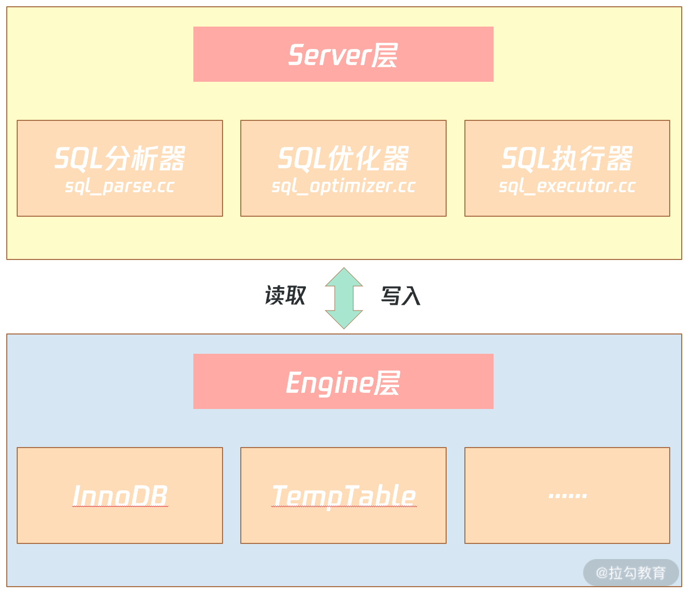
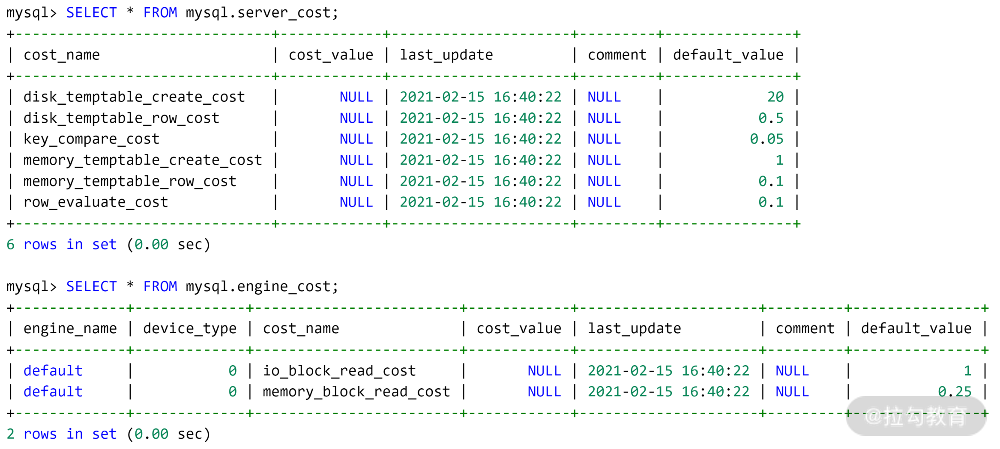

# 11 索引出错：请理解 CBO 的工作原理

在前三讲中，我们学习了 B+ 树索引的原理、索引组织表的实现，组合索引的使用方法，相信你对 B+ 树索引的使用已经有了一定的了解。

而在实际工作中，我也经常会遇到一些同学提出这样的问题：MySQL 并没有按照自己的预想来选择索引，比如创建了索引但是选择了全表扫描，这肯定是 MySQL 数据库的 Bug，或者是索引出错了。

\*\*当然不是！\*\*这主要因为索引中的数据犯了错。

为什么这么说呢？要理解该问题，要理解 MySQL 数据库中的优化器是怎么执行的，然后才能明白为什么最终优化器没有选择你预想的索引。

接下来，我们就来理解 MySQL 数据库是怎么选择索引的。

### MySQL是如何选择索引的？

在前面的表 orders 中，对于字段 o_custkey 已经创建了相关的 3 个索引，所以现在表 orders 的情况如下所示：

```
 CREATE TABLE `orders` (
  `O_ORDERKEY` int NOT NULL,
  `O_CUSTKEY` int NOT NULL,
  `O_ORDERSTATUS` char(1) NOT NULL,
  `O_TOTALPRICE` decimal(15,2) NOT NULL,
  `O_ORDERDATE` date NOT NULL,
  `O_ORDERPRIORITY` char(15) NOT NULL,
  `O_CLERK` char(15) NOT NULL,
  `O_SHIPPRIORITY` int NOT NULL,
  `O_COMMENT` varchar(79) NOT NULL,
  PRIMARY KEY (`O_ORDERKEY`),
  KEY `idx_custkey_orderdate` (`O_CUSTKEY`,`O_ORDERDATE`),
  KEY `ORDERS_FK1` (`O_CUSTKEY`),
  KEY `idx_custkey_orderdate_totalprice` (`O_CUSTKEY`,`O_ORDERDATE`,`O_TOTALPRICE`),
  CONSTRAINT `orders_ibfk_1` FOREIGN KEY (`O_CUSTKEY`) REFERENCES `customer` (`C_CUSTKEY`)
) ENGINE=InnoDB
```

在查询字段 o_custkey 时，理论上可以使用三个相关的索引：ORDERS_FK1、idx_custkey_orderdate、idx_custkey_orderdate_totalprice。**那 MySQL 优化器是怎么从这三个索引中进行选择的呢？ **在关系型数据库中，B+ 树索引只是存储的一种数据结构，具体怎么使用，还要依赖数据库的优化器，优化器决定了具体某一索引的选择，也就是常说的执行计划。** 而优化器的选择是基于成本（cost），哪个索引的成本越低，优先使用哪个索引。**



MySQL 执行过程

如上图所示，MySQL 数据库由 Server 层和 Engine 层组成：

- Server 层有 SQL 分析器、SQL优化器、SQL 执行器，用于负责 SQL 语句的具体执行过程；
- Engine 层负责存储具体的数据，如最常使用的 InnoDB 存储引擎，还有用于在内存中存储临时结果集的 TempTable 引擎。

SQL 优化器会分析所有可能的执行计划，选择成本最低的执行，这种优化器称之为：CBO（Cost-based Optimizer，基于成本的优化器）。

而在 MySQL中，**一条 SQL 的计算成本计算如下所示：**

```
Cost  = Server Cost + Engine Cost
      = CPU Cost + IO Cost
```

其中，CPU Cost 表示计算的开销，比如索引键值的比较、记录值的比较、结果集的排序……这些操作都在 Server 层完成；

IO Cost 表示引擎层 IO 的开销，MySQL 8.0 可以通过区分一张表的数据是否在内存中，分别计算读取内存 IO 开销以及读取磁盘 IO 的开销。

数据库 mysql 下的表 server_cost、engine_cost 则记录了对于各种成本的计算，如：



表 server_cost 记录了 Server 层优化器各种操作的成本，这里面包括了所有 CPU Cost，其具体含义如下。

- disk_temptable_create_cost：创建磁盘临时表的成本，默认为20。
- disk_temptable_row_cost：磁盘临时表中每条记录的成本，默认为0.5。
- key_compare_cost：索引键值比较的成本，默认为0.05，成本最小。
- memory_temptable_create_cost：创建内存临时表的成本：默认为1。
- memory_temptable_row_cost：内存临时表中每条记录的成本，默认为0.1。
- row_evaluate_cost：记录间的比较成本，默认为0.1。

**可以看到，** MySQL 优化器认为如果一条 SQL 需要创建基于磁盘的临时表，则这时的成本是最大的，其成本是基于内存临时表的 20 倍。而索引键值的比较、记录之间的比较，其实开销是非常低的，但如果要比较的记录数非常多，则成本会变得非常大。

而表 engine_cost 记录了存储引擎层各种操作的成本，这里包含了所有的 IO Cost，具体含义如下。

- io_block_read_cost：从磁盘读取一个页的成本，默认值为1。
- memory_block_read_cost：从内存读取一个页的成本，默认值为0.25。

\*\*也就是说，\*\*MySQL 优化器认为从磁盘读取的开销是内存开销的 4 倍。

不过，上述所有的成本都是可以修改的，比如如果数据库使用是传统的 HDD 盘，性能较差，其随机读取性能要比内存读取慢 50 倍，那你可以通过下面的 SQL 修改成本：

```
INSERT INTO 
engine_cost(engine_name,device_type,cost_name,cost_value,last_update,comment) 
VALUES ('InnoDB',0,'io_block_read_cost',12.5,CURRENT_TIMESTAMP,'Using HDD for InnoDB');
FLUSH OPTIMIZER_COSTS;
```

我们再来看一下 10 讲的 GROUP BY SQL 语句，这时我们通过命令 EXPLAIN的FORMAT=json 来查看各成本的值，为的是让你进一步了解优化的工作原理。

```
EXPLAIN FORMAT=json 
SELECT o_custkey,SUM(o_totalprice) 
FROM orders GROUP BY o_custkey***************************1. row***************************
 EXPLAIN: {
   "query_block": {
     "select_id": 1,
     "cost_info": {
       "query_cost": "626899.50" # 总成本
     },
     "grouping_operation": {
       "using_filesort": false,
       "table": {
         "table_name": "orders",
         "access_type": "index",
         "possible_keys": [
           "idx_custkey_orderdate",
           "ORDERS_FK1",
           "idx_custkey_orderdate_totalprice"
         ],
         "key": "idx_custkey_orderdate_totalprice",
         "used_key_parts": [
           "O_CUSTKEY",
           "O_ORDERDATE",
           "O_TOTALPRICE"
         ],
         "key_length": "14",
         "rows_examined_per_scan": 5778755,
         "rows_produced_per_join": 5778755,
         "filtered": "100.00",
         "using_index": true,
         "cost_info": {
           "read_cost": "49024.00", # IO Cost(Engine Cost)
           "eval_cost": "577875.50", # CPU Cost(Server Cost)
           "prefix_cost": "626899.50", # 总成本
           "data_read_per_join": "2G" # 总的读取记录字节数
         },
         "used_columns": [
           "O_ORDERKEY",
           "O_CUSTKEY",
           "O_TOTALPRICE"
         ]
       }
     }
    }
```

从第 33 行开始，其中：

- read_cost 表示就是从 InnoDB 存储引擎读取的开销；
- eval_cost 表示 Server 层的 CPU 成本；
- prefix_cost 表示这条 SQL 的总成本；
- data_read_per_join 表示总的读取记录的字节数。

在知道 MySQL 索引选择是基于 SQL 执行成本之后，接下来，我们就能分析一些索引出错问题到底是怎么回事了。

### MySQL索引出错案例分析

#### 案例1：未能使用创建的索引

经常听到有同学反馈 MySQL 优化器不准，不稳定，一直在变。

但是，我想告诉你的是，MySQL 优化器永远是根据成本，选择出最优的执行计划。哪怕是同一条 SQL 语句，只要范围不同，优化器的选择也可能不同。

如下面这两条 SQL：

```
SELECT * FROM orders
WHERE o_orderdate > '1994-01-01' and o_orderdate < '1994-12-31';
SELECT * FROM orders 
WHERE o_orderdate > '1994-02-01' and o_orderdate < '1994-12-31';
```

上面这两条 SQL 都是通过索引字段 o_orderdate 进行查询，然而第一条 SQL 语句的执行计划并未使用索引 idx_orderdate，而是使用了如下的执行计划：

```
EXPLAIN SELECT * FROM orders 
WHERE o_orderdate > '1994-01-01' 
AND o_orderdate < '1994-12-31'\G
***************************1. row***************************id: 1
  select_type: SIMPLE
        table: orders
   partitions: NULL
         type: ALL
possible_keys: idx_orderdate
          key: NULL
      key_len: NULL
          ref: NULL
         rows: 5799601
     filtered: 32.35
        Extra: Using where
```

从上述执行计划中可以发现，优化器已经通过 possible_keys 识别出可以使用索引 idx_orderdate，**但最终却使用全表扫描的方式取出结果。** 最为根本的原因在于：优化器认为使用通过主键进行全表扫描的成本比通过二级索引 idx_orderdate 的成本要低，可以通过 FORMAT=tree 观察得到：

```
EXPLAIN FORMAT=tree 
SELECT * FROM orders 
WHERE o_orderdate > '1994-01-01' 
AND o_orderdate < '1994-12-31'\G
***************************1. row***************************
EXPLAIN: -> Filter: ((orders.O_ORDERDATE > DATE'1994-01-01') and (orders.O_ORDERDATE < DATE'1994-12-31'))  (cost=592267.11 rows=1876082)
    -> Table scan on orders  (cost=592267.11 rows=5799601)
EXPLAIN FORMAT=tree 
SELECT * FROM orders FORCE INDEX(idx_orderdate)
WHERE o_orderdate > '1994-01-01' 
AND o_orderdate < '1994-12-31'\G
***************************1. row***************************EXPLAIN: -> Index range scan on orders using idx_orderdate, with index condition: ((orders.O_ORDERDATE > DATE'1994-01-01') and (orders.O_ORDERDATE < DATE'1994-12-31'))  (cost=844351.87 rows=1876082)
```

可以看到，MySQL 认为全表扫描，然后再通过 WHERE 条件过滤的成本为 592267.11，对比强制使用二级索引 idx_orderdate 的成本为 844351.87。

成本上看，全表扫描低于使用二级索引。故，MySQL 优化器没有使用二级索引 idx_orderdate。**为什么全表扫描比二级索引查询快呢？** 因为二级索引需要回表，当回表的记录数非常大时，成本就会比直接扫描要慢，因此这取决于回表的记录数。

所以，第二条 SQL 语句，只是时间范围发生了变化，但是 MySQL 优化器就会自动使用二级索引 idx_orderdate了，这时我们再观察执行计划：

```
EXPLAIN SELECT * FROM orders 
WHERE o_orderdate > '1994-02-01' 
AND o_orderdate < '1994-12-31'\G
***************************1. row***************************id: 1
  select_type: SIMPLE
        table: orders
   partitions: NULL
         type: range
possible_keys: idx_orderdate
          key: idx_orderdate
      key_len: 3
          ref: NULL
         rows: 1633884
     filtered: 100.00
        Extra: Using index condition
```

再次强调，并不是 MySQL 选择索引出错，\*\*而是 MySQL 会根据成本计算得到最优的执行计划，\*\*根据不同条件选择最优执行计划，而不是同一类型一成不变的执行过程，这才是优秀的优化器该有的样子。

#### 案例2：索引创建在有限状态上

B+ 树索引通常要建立在高选择性的字段或字段组合上，如性别、订单 ID、日期等，因为这样每个字段值大多并不相同。

但是对于性别这样的字段，其值只有男和女两种，哪怕记录数再多，也只有两种值，这是低选择性的字段，因此无须在性别字段上创建索引。

但在有些低选择性的列上，是有必要创建索引的。比如电商的核心业务表 orders，其有字段 o_orderstatus，表示当前的状态。

在电商业务中会有一个这样的逻辑：即会定期扫描字段 o_orderstatus 为支付中的订单，然后强制让其关闭，从而释放库存，给其他有需求的买家进行购买。

但字段 o_orderstatus 的状态是有限的，一般仅为已完成、支付中、超时已关闭这几种。

通常订单状态绝大部分都是已完成，只有绝少部分因为系统故障原因，会在 15 分钟后还没有完成订单，**因此订单状态是存在数据倾斜的。**

这时，虽然订单状态是低选择性的，但是由于其有数据倾斜，且我们只是从索引查询少量数据，因此可以对订单状态创建索引：

```
ALTER TABLE orders 
ADD INDEX idx_orderstatus(o_orderstatus)
```

但这时根据下面的这条 SQL，优化器的选择可能如下：

```
EXPLAIN SELECT * FROM orders 
WHERE o_orderstatus = 'P'\G
***************************1. row***************************
           id: 1
  select_type: SIMPLE
        table: orders
   partitions: NULL
         type: ALL
possible_keys: NULL
          key: NULL
      key_len: NULL
          ref: NULL
         rows: 5799601
     filtered: 50.00
        Extra: Using where
```

由于字段 o_orderstatus 仅有三个值，分别为 'O'、'P'、'F'。但 MySQL 并不知道这三个列的分布情况，认为这三个值是平均分布的，但其实是这三个值存在严重倾斜：

```
SELECT o_orderstatus,count(1) 
FROM orders GROUP BY o_orderstatus;
+---------------+----------+
| o_orderstatus | count(1) |
+---------------+----------+
| F             |  2923619 |
| O             |  2923597 |
| P             |   152784 |
+---------------+----------+
```

因此，优化器会认为订单状态为 P 的订单占用 1/3 的数据，使用全表扫描，避免二级索引回表的效率会更高。

然而，由于数据倾斜，订单状态为 P 的数据非常少，根据索引 idx_orderstatus 查询的效率会更高。这种情况下，我们可以利用 MySQL 8.0 的直方图功能，创建一个直方图，让优化器知道数据的分布，从而更好地选择执行计划。直方图的创建命令如下所示：

```
ANALYZE TABLE orders 
UPDATE HISTOGRAM ON o_orderstatus;
```

在创建完直方图后，MySQL会收集到字段 o_orderstatus 的数值分布，可以通过下面的命令查询得到：

```
SELECT 
v value, 
CONCAT(round((c - LAG(c, 1, 0) over()) * 100,1), '%') ratio
FROM information_schema.column_statistics, 
JSON_TABLE(histogram->'$.buckets','$[*]' COLUMNS(v VARCHAR(60) PATH '$[0]', c double PATH '$[1]')) hist
WHERE column_name = 'o_orderstatus';
+-------+-------+
| value | ratio |
+-------+-------+
| F     | 49%   |
| O     | 48.5% |
| P     | 2.5%  |
+-------+-------+
```

可以看到，现在 MySQL 知道状态为 P 的订单只占 2.5%，因此再去查询状态为 P 的订单时，就会使用到索引 idx_orderstatus了，如：

```
EXPLAIN SELECT * FROM orders 
WHERE o_orderstatus = 'P'\G
***************************1. row***************************
           id: 1
  select_type: SIMPLE
        table: orders
   partitions: NULL
         type: ref
possible_keys: idx_orderstatus
          key: idx_orderstatus
      key_len: 4
          ref: const
         rows: 306212
     filtered: 100.00
        Extra: Using index condition
```

### 总结

这一讲，我们知道了 MySQL 优化器是 CBO，即一种基于成本的优化器。其会判单每个索引的执行成本，从中选择出最优的执行计划。总结来说：

- MySQL 优化器是 CBO 的；
- MySQL 会选择成本最低的执行计划，你可以通过 EXPLAIN 命令查看每个 SQL 的成本；
- 一般只对高选择度的字段和字段组合创建索引，低选择度的字段如性别，不创建索引；
- 低选择性，但是数据存在倾斜，通过索引找出少部分数据，可以考虑创建索引；
- 若数据存在倾斜，可以创建直方图，让优化器知道索引中数据的分布，进一步校准执行计划。
