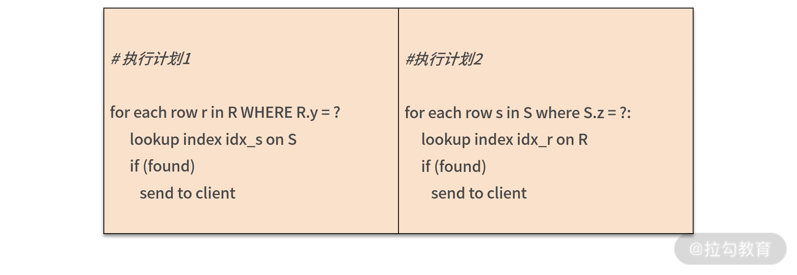
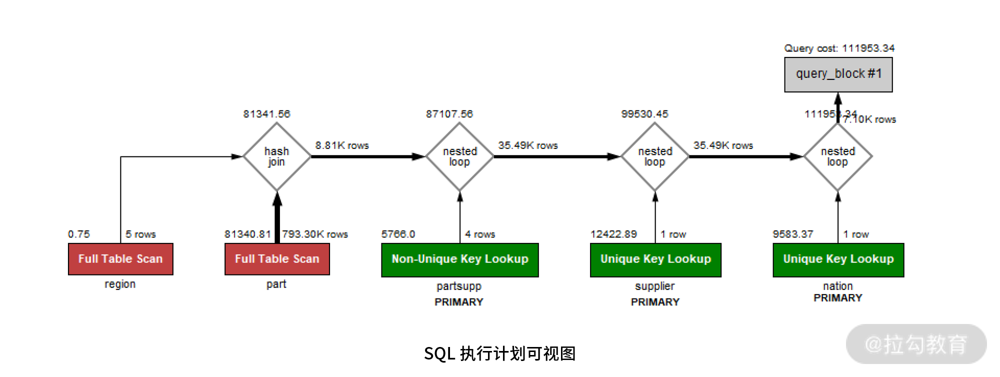

12 JOIN 连接：到底能不能写 JOIN？
=======================

前面几讲，我带你学习了索引和优化器的工作原理，相信你已经可以对单表的 SQL 语句进行索引的设计和调优工作。但除了单表的 SQL 语句，还有两大类相对复杂的 SQL，多表 JOIN 和子查询语句，这就要在多张表上创建索引，难度相对提升不少。

而很多开发人员下意识地认为 JOIN 会降低 SQL 的性能效率，所以就将一条多表 SQL 拆成单表的一条条查询，但这样反而会影响 SQL 执行的效率。**究其原因，在于开发人员不了解 JOIN 的实现过程。**

那接下来，我们就来关注 JOIN 的工作原理，再在此基础上了解 JOIN 实现的算法和应用场景，从而让你放心大胆地使用 JOIN。

### JOIN连接算法

MySQL 8.0 版本支持两种 JOIN 算法用于表之间的关联：

* Nested Loop Join；
* Hash Join。

通常认为，在 OLTP 业务中，因为查询数据量较小、语句相对简单，大多使用索引连接表之间的数据。这种情况下，优化器大多会用 Nested Loop Join 算法；而 OLAP 业务中的查询数据量较大，关联表的数量非常多，所以用 Hash Join 算法，直接扫描全表效率会更高。

注意，这里仅讨论最新的 MySQL 8.0 版本中 JOIN 连接的算法，同时也推荐你在生产环境时优先用 MySQL 8.0。

接下来，我们来分析一下这两个算法 Nested Loop Join 和 Hash Join。

#### Nested Loop Join

Nested Loop Join 之间的表关联是使用索引进行匹配的，假设表 R 和 S 进行连接，其算法伪代码大致如下：

```
for each row r in R with matching condition:


    lookup index idx_s on S where index_key = r


    if (found)


      send to client

```

在上述算法中，表 R 被称为驱动表，表 R 中通过 WHERE 条件过滤出的数据会在表 S 对应的索引上进行一一查询。如果驱动表 R 的数据量不大，上述算法非常高效。

接着，我们看一下，以下三种 JOIN 类型，驱动表各是哪张表：

```
SELECT ... FROM R LEFT JOIN S ON R.x = S.x WEHRE ...


SELECT ... FROM R RIGHT JOIN S ON R.x = S.x WEHRE ...


SELECT ... FROM R INNER JOIN S ON R.x = S.x WEHRE ...

```

对于上述 Left Join 来说，驱动表就是左表 R；Right Join中，驱动表就是右表 S。这是 JOIN 类型决定左表或右表的数据一定要进行查询。但对于 INNER JOIN，驱动表可能是表 R，也可能是表 S。

在这种场景下，**谁需要查询的数据量越少，谁就是驱动表。**我们来看下面的例子：

```
SELECT ... FROM R INNER JOIN S 


ON R.x = S.x 


WHERE R.y = ? AND S.z = ?

```

上面这条 SQL 语句是对表 R 和表 S 进行 INNER JOIN，其中关联的列是 x，WHERE 过滤条件分别过滤表 R 中的列 y 和表 S 中的列 z。那么这种情况下可以有以下两种选择：



优化器一般认为，通过索引进行查询的效率都一样，所以 Nested Loop Join 算法主要要求驱动表的数量要尽可能少。

所以，如果 WHERE R.y = ?过滤出的数据少，那么这条 SQL 语句会先使用表 R 上列 y 上的索引，筛选出数据，然后再使用表 S 上列 x 的索引进行关联，最后再通过 WHERE S.z = ?过滤出最后数据。**为了深入理解优化器驱动表的选择**，咱们先来看下面这条 SQL：

```
SELECT COUNT(1) 


FROM orders


INNER JOIN lineitem


  ON orders.o_orderkey = lineitem.l_orderkey 


    WHERE orders.o_orderdate >= '1994-02-01' 


      AND  orders.o_orderdate < '1994-03-01'

```

上面的表 orders 你比较熟悉，类似于电商中的订单表，在我们的示例数据库中记录总量有 600万条记录。

表 lineitem 是订单明细表，比如一个订单可以包含三件商品，这三件商品的具体价格、数量、商品供应商等详细信息，记录数约 2400 万。

上述 SQL 语句表示查询日期为 1994 年 2 月购买的商品数量总和，你通过命令 EXPLAIN 查看得到执行计划如下所示：

```
EXPLAIN: -> Aggregate: count(1)


 -> Nested loop inner join  (cost=115366.81 rows=549152)


     -> Filter: ((orders.O_ORDERDATE >= DATE'1994-02-01') and (orders.O_ORDERDATE < DATE'1994-03-01'))  (cost=26837.49 rows=133612)


         -> Index range scan on orders using idx_orderdate  (cost=26837.49 rows=133612)


     -> Index lookup on lineitem using PRIMARY (l_orderkey=orders.o_orderkey)  (cost=0.25 rows=4)

```

上面的执行计划步骤如下，表 orders 是驱动表，它的选择过程如下所示：

1. Index range scan on orders using idx\_orderdate：使用索引 idx\_orderdata 过滤出1994 年 2 月的订单数据，预估记录数超过 13 万。
2. Index lookup on lineitem using PRIMARY：将第一步扫描的结果作为驱动表，然后将驱动表中的每行数据的 o\_orderkey 值，在 lineitem 的主键索引中进行查找。
3. Nested loop inner join：进行 JOIN 连接，匹配得到的输出结果。
4. Aggregate: count(1)：统计得到最终的商品数量。

但若执行的是下面这条 SQL，则执行计划就有了改变：

```
EXPLAIN FORMAT=tree


SELECT COUNT(1) 


FROM orders


INNER JOIN lineitem


  ON orders.o_orderkey = lineitem.l_orderkey 


    WHERE orders.o_orderdate >= '1994-02-01' 


      AND  orders.o_orderdate < '1994-03-01'


      AND lineitem.l_partkey = 620758


EXPLAIN: -> Aggregate: count(1)


-> Nested loop inner join  (cost=17.37 rows=2)


    -> Index lookup on lineitem using lineitem_fk2 (L_PARTKEY=620758)  (cost=4.07 rows=38)


    -> Filter: ((orders.O_ORDERDATE >= DATE'1994-02-01') and (orders.O_ORDERDATE < DATE'1994-03-01'))  (cost=0.25 rows=0)


        -> Single-row index lookup on orders using PRIMARY (o_orderkey=lineitem.l_orderkey)  (cost=0.25 rows=1)

```

上述 SQL 只是新增了一个条件 lineitem.l\_partkey =620758，即查询 1994 年 2 月，商品编号为 620758 的商品购买量。

这时若仔细查看执行计划，会发现通过过滤条件 l\_partkey = 620758 找到的记录大约只有 38 条，因此这时优化器选择表 lineitem 为驱动表。

#### Hash Join

MySQL 中的第二种 JOIN 算法是 Hash Join，用于两张表之间连接条件没有索引的情况。

有同学会提问，没有连接，那创建索引不就可以了吗？或许可以，但：

1. 如果有些列是低选择度的索引，那么创建索引在导入数据时要对数据排序，影响导入性能；
2. 二级索引会有回表问题，若筛选的数据量比较大，则直接全表扫描会更快。

对于 OLAP 业务查询来说，Hash Join 是必不可少的功能，MySQL 8.0 版本开始支持 Hash Join 算法，加强了对于 OLAP 业务的支持。

所以，如果你的查询数据量不是特别大，对于查询的响应时间要求为分钟级别，完全可以使用单个实例 MySQL 8.0 来完成大数据的查询工作。

Hash Join算法的伪代码如下：

```
foreach row r in R with matching condition:


    create hash table ht on r


foreach row s in S with matching condition:


    search s in hash table ht:


    if (found)


        send to client

```

Hash Join会扫描关联的两张表：

* 首先会在扫描驱动表的过程中创建一张哈希表；
* 接着扫描第二张表时，会在哈希表中搜索每条关联的记录，如果找到就返回记录。

Hash Join 选择驱动表和 Nested Loop Join 算法大致一样，都是较小的表作为驱动表。如果驱动表比较大，创建的哈希表超过了内存的大小，MySQL 会自动把结果转储到磁盘。

为了演示 Hash Join，接下来，我们再来看一个 SQL：

```
SELECT 


    s_acctbal,


    s_name,


    n_name,


    p_partkey,


    p_mfgr,


    s_address,


    s_phone,


    s_comment


FROM


    part,


    supplier,


    partsupp,


    nation,


    region


WHERE


    p_partkey = ps_partkey


        AND s_suppkey = ps_suppkey


        AND p_size = 15


        AND p_type LIKE '%BRASS'


        AND s_nationkey = n_nationkey


        AND n_regionkey = r_regionkey


        AND r_name = 'EUROPE';

```

上面这条 SQL 语句是要找出商品类型为 %BRASS，尺寸为 15 的欧洲供应商信息。

因为商品表part 不包含地区信息，所以要从关联表 partsupp 中得到商品供应商信息，然后再从供应商元数据表中得到供应商所在地区信息，最后在外表 region 连接，才能得到最终的结果。

最后的执行计划如下图所示：



从上图可以发现，其实最早进行连接的是表 supplier 和 nation，接着再和表 partsupp 连接，然后和 part 表连接，再和表 part 连接。上述左右连接算法都是 Nested Loop Join。这时的结果集记录大概有 79,330 条记录

最后和表 region 进行关联，表 region 过滤得到结果5条，这时可以有 2 种选择：

1. 在 73390 条记录上创建基于 region 的索引，然后在内表中通过索引进行查询；
2. 对表 region 创建哈希表，73390 条记录在哈希表中进行探测；

选择 1 就是 MySQL 8.0 不支持 Hash Join 时优化器的处理方式，缺点是：如关联的数据量非常大，创建索引需要时间；其次可能需要回表，优化器大概率会选择直接扫描内表。

选择 2 只对大约 5 条记录的表 region 创建哈希索引，时间几乎可以忽略不计，其次直接选择对内表扫描，没有回表的问题。**很明显，MySQL 8.0 会选择Hash Join。**

了解完优化器的选择后，最后看一下命令 EXPLAIN FORMAT=tree 执行计划的最终结果：

```
-> Nested loop inner join  (cost=101423.45 rows=79)


    -> Nested loop inner join  (cost=92510.52 rows=394)


        -> Nested loop inner join  (cost=83597.60 rows=394)


            -> Inner hash join (no condition)  (cost=81341.56 rows=98)


                -> Filter: ((part.P_SIZE = 15) and (part.P_TYPE like '%BRASS'))  (cost=81340.81 rows=8814)


                    -> Table scan on part  (cost=81340.81 rows=793305)


                -> Hash


                    -> Filter: (region.R_NAME = 'EUROPE')  (cost=0.75 rows=1)


                        -> Table scan on region  (cost=0.75 rows=5)


            -> Index lookup on partsupp using PRIMARY (ps_partkey=part.p_partkey)  (cost=0.25 rows=4)


        -> Single-row index lookup on supplier using PRIMARY (s_suppkey=partsupp.PS_SUPPKEY)  (cost=0.25 rows=1)


    -> Filter: (nation.N_REGIONKEY = region.r_regionkey)  (cost=0.25 rows=0)


        -> Single-row index lookup on nation using PRIMARY (n_nationkey=supplier.S_NATIONKEY)  (cost=0.25 rows=1)

```

以上就是 MySQL 数据库中 JOIN 的实现原理和应用了。

因为很多开发同学在编写 JOIN 时存在困惑，所以接下来我就带你深入 OLTP 业务中的JOIN问题。

### OLTP 业务能不能写 JOIN？

OLTP 业务是海量并发，要求响应非常及时，在毫秒级别返回结果，如淘宝的电商业务、支付宝的支付业务、美团的外卖业务等。

如果 OLTP 业务的 JOIN 带有 WHERE 过滤条件，并且是根据主键、索引进行过滤，那么驱动表只有一条或少量记录，这时进行 JOIN 的开销是非常小的。

比如在淘宝的电商业务中，用户要查看自己的订单情况，其本质是在数据库中执行类似如下的 SQL 语句：

```
SELECT o_custkey, o_orderdate, o_totalprice, p_name FROM orders,lineitem, part


WHERE o_orderkey = l_orderkey


  AND l_partkey = p_partkey


  AND o_custkey = ?


ORDER BY o_orderdate DESC


LIMIT 30;

```

我发现很多开发同学会以为上述 SQL 语句的 JOIN 开销非常大，因此认为拆成 3 条简单 SQL 会好一些，比如：

```
SELECT * FROM orders 


WHERE o_custkey = ? 


ORDER BY o_orderdate DESC;


SELECT * FROM lineitem


WHERE l_orderkey = ?;


SELECT * FROM part


WHERE p_part = ?

```

其实你完全不用人工拆分语句，因为你拆分的过程就是优化器的执行结果，而且优化器更可靠，速度更快，而拆成三条 SQL 的方式，本身网络交互的时间开销就大了 3 倍。

所以，放心写 JOIN，你要相信数据库的优化器比你要聪明，它更为专业。上述 SQL 的执行计划如下：

```
EXPLAIN: -> Limit: 30 row(s)  (cost=27.76 rows=30)


    -> Nested loop inner join  (cost=27.76 rows=44)


        -> Nested loop inner join  (cost=12.45 rows=44)


            -> Index lookup on orders using idx_custkey_orderdate (O_CUSTKEY=1; iterate backwards)  (cost=3.85 rows=11)


            -> Index lookup on lineitem using PRIMARY (l_orderkey=orders.o_orderkey)  (cost=0.42 rows=4)


        -> Single-row index lookup on part using PRIMARY (p_partkey=lineitem.L_PARTKEY)  (cost=0.25 rows=1)

```

由于驱动表的数据是固定 30 条，因此不论表 orders、lineitem、part 的数据量有多大，哪怕是百亿条记录，由于都是通过主键进行关联，上述 SQL 的执行速度几乎不变。

**所以，OLTP 业务完全可以大胆放心地写 JOIN，但是要确保 JOIN 的索引都已添加**， DBA 们在业务上线之前一定要做 SQL Review，确保预期内的索引都已创建。

### 总结

MySQL 数据库中支持 JOIN 连接的算法有 Nested Loop Join 和 Hash Join 两种，前者通常用于 OLTP 业务，后者用于 OLAP 业务。在 OLTP 可以写 JOIN，优化器会自动选择最优的执行计划。但若使用 JOIN，要确保 SQL 的执行计划使用了正确的索引以及索引覆盖，**因此索引设计显得尤为重要，这也是DBA在架构设计方面的重要工作之一。**
