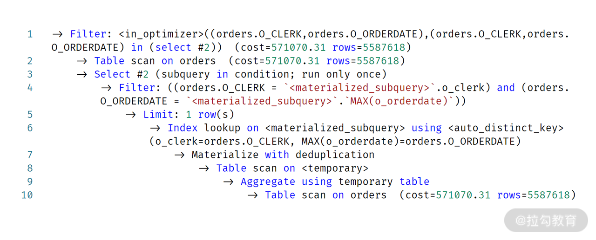

13 子查询：放心地使用子查询功能吧
===================

今天我想和你聊一聊“子查询”。

上一讲，我提到了一种复杂的 SQL 情况，多表间的连接，以及怎么设计索引来提升 JOIN 的性能。

除了多表连接之外，开发同学还会大量用子查询语句（subquery）。但是因为之前版本的MySQL 数据库对子查询优化有限，所以很多 OLTP 业务场合下，我们都要求在线业务尽可能不用子查询。

然而，MySQL 8.0 版本中，子查询的优化得到大幅提升。所以从现在开始，**放心大胆地在MySQL 中使用子查询吧！**### 为什么开发同学这么喜欢写子查询？

我工作这么多年，发现相当多的开发同学喜欢写子查询，而不是传统的 JOIN 语句。举一个简单的例子，如果让开发同学“找出1993年，没有下过订单的客户数量”，大部分同学会用子查询来写这个需求，比如：

```
SELECT


    COUNT(c_custkey) cnt


FROM


    customer


WHERE


    c_custkey NOT IN (


        SELECT


            o_custkey


        FROM


            orders


        WHERE


            o_orderdate >=  '1993-01-01'


            AND o_orderdate <  '1994-01-01'


 );

```

从中可以看到，子查询的逻辑非常清晰：通过 NOT IN 查询不在订单表的用户有哪些。

不过上述查询是一个典型的 LEFT JOIN 问题（即在表 customer 存在，在表 orders 不存在的问题）。所以，这个问题如果用 LEFT JOIN 写，那么 SQL 如下所示：

```
SELECT


    COUNT(c_custkey) cnt


FROM


    customer


        LEFT JOIN


    orders ON


            customer.c_custkey = orders.o_custkey


            AND o_orderdate >= '1993-01-01'


            AND o_orderdate < '1994-01-01'


WHERE


    o_custkey IS NULL;

```

可以发现，虽然 LEFT JOIN 也能完成上述需求，但不容易理解，**因为 LEFT JOIN 是一个代数关系，而子查询更偏向于人类的思维角度进行理解。**所以，大部分人都更倾向写子查询，即便是天天与数据库打交道的 DBA 。

不过从优化器的角度看，LEFT JOIN 更易于理解，能进行传统 JOIN 的两表连接，而子查询则要求优化器聪明地将其转换为最优的 JOIN 连接。

我们来看一下，在 MySQL 8.0 版本中，对于上述两条 SQL，最终的执行计划都是：


可以看到，不论是子查询还是 LEFT JOIN，最终都被转换成了 Nested Loop Join，所以上述两条 SQL 的执行时间是一样的。

即，在 MySQL 8.0 中，优化器会自动地将 IN 子查询优化，优化为最佳的 JOIN 执行计划，这样一来，会显著的提升性能。

### 子查询 IN 和 EXISTS，哪个性能更好？

除了“为什么开发同学都喜欢写子查询”，关于子查询，另一个经常被问到的问题是：“ IN 和EXISTS 哪个性能更好？”要回答这个问题，我们看一个例子。

针对开篇的 NOT IN 子查询，你可以改写为 NOT EXISTS 子查询，重写后的 SQL 如下所示：

```
SELECT


    COUNT(c_custkey) cnt


FROM


    customer


WHERE


    NOT EXISTS (


        SELECT


            1


        FROM


            orders


        WHERE


            o_orderdate >=  '1993-01-01'


            AND o_orderdate <  '1994-01-01'


            AND c_custkey = o_custkey


    );

```

你要注意，千万不要盲目地相信网上的一些文章，有的说 IN 的性能更好，有的说 EXISTS 的子查询性能更好。你只关注 SQL 执行计划就可以，如果两者的执行计划一样，性能没有任何差别。

接着说回来，对于上述 NOT EXISTS，它的执行计划如下图所示：


你可以看到，它和 NOT IN 的子查询执行计划一模一样，所以二者的性能也是一样的。讲完子查询的执行计划之后，接下来我们来看一下一种需要对子查询进行优化的 SQL：依赖子查询。

### 依赖子查询的优化

在 MySQL 8.0 版本之前，MySQL 对于子查询的优化并不充分。所以在子查询的执行计划中会看到 DEPENDENT SUBQUERY 的提示，这表示是一个依赖子查询，子查询需要依赖外部表的关联。**如果你看到这样的提示，就要警惕，** 因为 DEPENDENT SUBQUERY 执行速度可能非常慢，大部分时候需要你手动把它转化成两张表之间的连接。

我们以下面这条 SQL 为例：

```
SELECT


    *


FROM


    orders


WHERE


    (o_clerk , o_orderdate) IN (


        SELECT


            o_clerk, MAX(o_orderdate)


        FROM


            orders


        GROUP BY o_clerk);

```

上述 SQL 语句的子查询部分表示“计算出每个员工最后成交的订单时间”，然后最外层的 SQL表示返回订单的相关信息。

这条 SQL 在最新的 MySQL 8.0 中，其执行计划如下所示：



通过命令 EXPLAIN FORMAT=tree 输出执行计划，你可以看到，第 3 行有这样的提示：_**Select #2 (subquery in condition; run only once)**_。这表示子查询只执行了一次，然后把最终的结果保存起来了。

执行计划的第 6 行 **Index lookup on <materialized\_subquery>** ，表示对表 orders 和子查询结果所得到的表进行 JOIN 连接，最后返回结果。

所以，当前这个执行计划是对表 orders 做2次扫描，每次扫描约 5587618 条记录：

* 第 1 次扫描，用于内部的子查询操作，计算出每个员工最后一次成交的时间；
* 第 2 次表 oders 扫描，查询并返回每个员工的订单信息，即返回每个员工最后一笔成交的订单信息。

最后，直接用命令 EXPLAIN 查看执行计划，如下图所示：


MySQL 8.0 版本执行过程

如果是老版本的 MySQL 数据库，它的执行计划将会是依赖子查询，执行计划如下所示：


老版本 MySQL 执行过程

对比 MySQL 8.0，只是在第二行的 select\_type 这里有所不同，一个是 SUBQUERY，一个是DEPENDENT SUBQUERY。

接着通过命令 EXPLAIN FORMAT=tree 查看更详细的执行计划过程：


可以发现，第 3 行的执行技术输出是：Select #2 (subquery in condition; dependent)，并不像先前的执行计划，提示只执行一次。另外，通过第 1 行也可以发现，这条 SQL 变成了 exists 子查询，每次和子查询进行关联。

所以，上述执行计划其实表示：先查询每个员工的订单信息，接着对每条记录进行内部的子查询进行依赖判断。也就是说，先进行外表扫描，接着做依赖子查询的判断。**所以，子查询执行了5587618，而不是1次！！！**所以，两者的执行计划，扫描次数的对比如下所示：


对于依赖子查询的优化，就是要避免子查询由于需要对外部的依赖，而需要对子查询扫描多次的情况。所以可以通过**派生表**的方式，将外表和子查询的派生表进行连接，从而降低对于子查询表的扫描，从而提升 SQL 查询的性能。

那么对于上面的这条 SQL ，可将其重写为：

```
SELECT * FROM orders o1,


(


    SELECT


        o_clerk, MAX(o_orderdate)


    FROM


        orders


    GROUP BY o_clerk


) o2


WHERE


    o1.o_clerk = o2.o_clerk


    AND o1.o_orderdate = o2.orderdate;

```

可以看到，我们将子查询改写为了派生表 o2，然后将表 o2 与外部表 orders 进行关联。关联的条件是：_**o1.o\_clerk = o2.o\_clerk AND o1.o\_orderdate = o2.orderdate**_。 通过上面的重写后，派生表 o2 对表 orders 进行了1次扫描，返回约 5587618 条记录。派生表o1 对表 orders 扫描 1 次，返回约 1792612 条记录。这与 8.0 的执行计划就非常相似了，其执行计划如下所示：


最后，来看下上述 SQL 的执行时间：


可以看到，经过 SQL 重写后，派生表的执行速度几乎与独立子查询一样。所以，**若看到依赖子查询的执行计划，记得先进行 SQL 重写优化哦。**### 总结

这一讲，我们学习了 MySQL 子查询的优势、新版本 MySQL 8.0 对子查询的优化，以及老版本MySQL 下如何对子查询进行优化。希望你在学完今天的内容之后，可以不再受子查询编写的困惑，而是在各种场景下用好子查询。

总结来看：

1. 子查询相比 JOIN 更易于人类理解，所以受众更广，使用更多；
2. 当前 MySQL 8.0 版本可以“毫无顾忌”地写子查询，对于子查询的优化已经相当完备；
3. 对于老版本的 MySQL，**请 Review 所有子查询的SQL执行计划，** 对于出现 DEPENDENT SUBQUERY 的提示，请务必即使进行优化，否则对业务将造成重大的性能影响；
4. DEPENDENT SUBQUERY 的优化，一般是重写为派生表进行表连接。表连接的优化就是我们12讲所讲述的内容。
