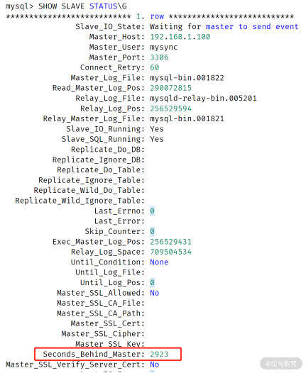
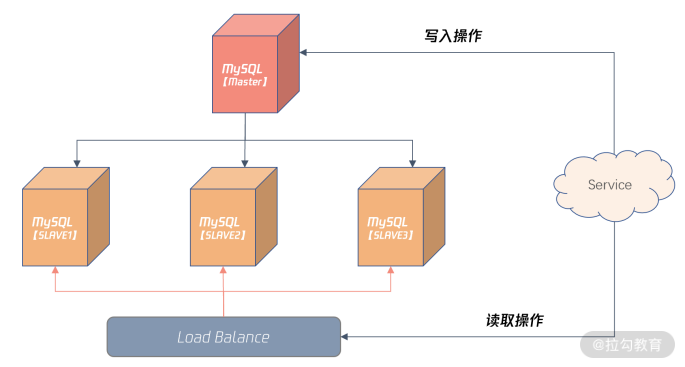

# 16 读写分离设计：复制延迟？其实是你用错了

上一讲我们学习了主从复制的原理，以及 4 种不同复制类型在不同业务中的选型，今天我们来看一下主从复制延迟的问题。

很多同学会发现，自己的主从复制会存在主从数据延迟的问题，甚至会导致读写分离，架构设计在业务层出现较为严重的问题，比如迟迟无法读取到主库已经插入的数据。

但这可能并不是 MySQL 复制的问题，而是你的业务没有根据 MySQL 复制的特点进行设计。

所以这一讲，我们就来学习主从复制延迟的原因，以及如何避免这个令人头疼的问题。

### 逻辑日志的优缺点

学完 15 讲之后，你应该注意到 MySQL 复制基于的二进制日志是一种逻辑日志，其写入的是每个事务中已变更的每条记录的前项、后项。

有了每条记录的变化内容，用户可以方便地通过分析 MySQL 的二进制日志内容，准时地将 MySQL 中的数据同步到异构的数据平台，如 HBase、ES、Hive 等大数据平台。

我们可以发现，逻辑日志简单易懂，方便数据之间的同步，但它的缺点是：事务不能太大，否则会导致二进制日志非常大，一个大事务的提交会非常慢。

假设有个 DELETE 删除操作，删除当月数据，由于数据量可能有 1 亿条记录，可能会产生 100G 的二进制日志，则这条 SQL 在提交时需要等待 100G 的二进制日志写入磁盘，如果二进制日志磁盘每秒写入速度为 100M/秒，至少要等待 1000 秒才能完成这个事务的提交。

**所以在 MySQL 中，你一定要对大事务特别对待，** 总结起来就是：

1. 设计时，把 DELETE 删除操作转化为 DROP TABLE/PARTITION 操作；
1. 业务设计时，把大事务拆成小事务。

对于第一点（把 DELETE 删除操作转化为 DROP TABLE/PARTITION 操作），主要是在设计时把流水或日志类的表按时间分表或者分区，这样在删除时，二进制日志内容就是一条 DROP TABLE/PARITION 的 SQL，写入速度就非常快了。

而第二点（把大事务拆分成小事务）也能控制二进制日志的大小。比如对于前面的 DELETE 操作，如果设计时没有分表或分区，那么你可以进行如下面的小事务拆分：

```
DELETE FROM ...
WHEREE time between ... and ...
LIMIT 1000;
```

上面的 SQL 就是把一个大的 DELETE 操作拆分成了每次删除 1000 条记录的小操作。而小事务的另一个优势是：可以进行多线程的并发操作，进一步提升删除效率。 **MySQL 数据库中，大事务除了会导致提交速度变慢，还会导致主从复制延迟** 。

试想一下，一个大事务在主服务器上运行了 30 分钟，那么在从服务器上也需要运行 30 分钟。在从机回放这个大事务的过程中，主从服务器之间的数据就产生了延迟；产生大事务的另一种可能性是主服务上没有创建索引，导致一个简单的操作时间变得非常长。这样在从机回放时，也会需要很长的时间从而导致主从的复制延迟。

除了把大事务拆分成小事务，可以避免主从复制延迟，你还可以设置复制回放相关的配置参数，接下来我们就来分析一下主从复制延迟的优化。

### 主从复制延迟优化

你要牢记：要彻底避免 MySQL 主从复制延迟，数据库版本至少要升级到 5.7，因为之前的MySQL 版本从机回放二进制都是单线程的（5.6 是基于库级别的单线程）。

从 MySQL 5.7 版本开始，MySQL 支持了从机多线程回放二进制日志的方式，通常把它叫作“并行复制”，官方文档中称为“Multi-Threaded Slave（MTS）”。

MySQL 的从机并行复制有两种模式。

1. **COMMIT ORDER：** 主机怎么并行，从机就怎么并行。
2. **WRITESET：** 基于每个事务，只要事务更新的记录不冲突，就可以并行。

COMMIT ORDER 模式的从机并行复制，从机完全根据主服务的并行度进行回放。理论上来说，主从延迟极小。但如果主服务器上并行度非常小，事务并不小，比如单线程每次插入 1000 条记录，则从机单线程回放，也会存在一些复制延迟的情况。

而 WRITESET 模式是基于每个事务并行，如果事务间更新的记录不冲突，就可以并行。还是以“单线程每次插入 1000 条记录”为例，如果插入的记录没有冲突，比如唯一索引冲突， **那么虽然主机是单线程，但从机可以是多线程并行回放！！！** 所以在 WRITESET 模式下，主从复制几乎没有延迟。那么要启用 WRITESET 复制模式，你需要做这样的配置：

```
binlog_transaction_dependency_tracking = WRITESET
transaction_write_set_extraction = XXHASH64
slave-parallel-type = LOGICAL_CLOCK
slave-parallel-workers = 16
```

因为主从复制延迟会影响到后续高可用的切换，以及读写分离的架构设计，所以在真实的业务中，你要对主从复制延迟进行监控。

### 主从复制延迟监控

#### Seconds_Behind_Master

很多同学或许知道通过命令 SHOW SLAVE STATUS，其中的 Seconds_Behind_Master 可以查看复制延迟，如：



但是， **Seconds_Behind_Master 不准确！用于严格判断主从延迟的问题并不合适，** 有这样三个原因。

1. 它计算规则是（当前回放二进制时间 - 二进制日志中的时间），如果 I/O 线程有延迟，那么 Second_Behind_Master 为 0，这时可能已经落后非常多了，例如存在有大事务的情况下；
1. 对于级联复制，最下游的从服务器延迟是不准确的，因为它只表示和上一级主服务器之间的延迟；
1. 若主从时区不一样，那么 second_behind_master 也不准确；

总的来说，线上业务通过 Seconds_Begind_Master 值观察主从复制延迟并不准确，需要额外引入一张表，才能真正监控主从的复制延迟情况。

#### 心跳表

想要实时准确地监控主从复制延迟，可以在主服务器上引入一张心跳表 heartbeat，用于定期更新时间（比如每 3 秒一次）。于主从复制机制，主机上写入的时间会被复制到从机，这时对于主从复制延迟的判断可以根据如下规则：

主从延迟 = 从机当前时间 - 表 heartbeat 中的时间

这可以很好解决上述 Seconds_Behind_Master 值存在的问题。表 heartbeat 和定期更新时间可以根据类似的设计：

```
USE DBA;
CREATE TABLE heartbeat (
  server-uuid VARCHAR(36) PRIMARY KEY,
  ts TIMESTAMP(6) NOT NULL
);
REPLACE INTO heartbeat(@@server_uuid, NOW())
```

上面的设计中，我们创建了DBA库，以及库下的一张表 heartbeat，用于记录当前时间。

REPLACE 语句用于定期更新当前时间，并存入到表 heartbeat，表 heartbeat 在正常运行情况下只有一条记录。定期执行 REPLACE 语句可以使用定期的脚本调度程序，也可以使用 MySQL自带的事件调度器（event scheduler），如：

```
CREATE EVENT e_heartbeat
ON SCHEDULE
    EVERY 3 SECOND
DO
BEGIN
    REPLACE INTO DBA.heartbeat VALUES (@@server_uuid,NOW())
END
```

根据上述 2 个小节所讲述的内容，你已经能正确配置并行复制，并对复制延迟进行监控，这时就可以设计一种称为读写分离的业务架构了。

### 读写分离设计

读写分离设计是指：把对数据库的读写请求分布到不同的数据库服务器上。对于写入操作只能请求主服务器，而对读取操作则可以将读取请求分布到不同的从服务器上。

这样能有效降低主服务器的负载，提升从服务器资源利用率，从而进一步提升整体业务的性能。下面这张图显示了一种常见的业务读写分离的架构设计：



上图引入了 Load Balance 负载均衡的组件，这样 Server 对于数据库的请求不用关心后面有多少个从机，对于业务来说也就是透明的，只需访问 Load Balance 服务器的 IP 或域名就可以。

通过配置 Load Balance 服务，还能将读取请求平均或按照权重平均分布到不同的从服务器。这可以根据架构的需要做灵活的设计。 **请记住：读写分离设计的前提是从机不能落后主机很多，最好是能准实时数据同步，务必一定要开始并行复制，并确保线上已经将大事务拆成小事务** 。

当然，若是一些报表类的查询，只要不影响最终结果，业务是能够容忍一些延迟的。但无论如何，请一定要在线上数据库环境中做好主从复制延迟的监控。

如果真的由于一些不可预知的情况发生，比如一个初级 DBA 在主机上做了一个大事务操作，导致主从延迟发生，那么怎么做好读写分离设计的兜底呢？


在 Load Balance 服务器，可以配置较小比例的读取请求访问主机，如上图所示的 1%，其余三台从服务器各自承担 33% 的读取请求。

如果发生严重的主从复制情况，可以设置下面从机权重为 0，将主机权重设置为 100%，这样就不会因为数据延迟，导致对于业务的影响了。

### 总结

本讲还是基于上一讲复制内容的延伸，学习怎么解决主从服务可能发生的数据延迟问题，以及基于主从复制机制搭建一个读写分离架构，总的来说：

1. MySQL 二进制日志是一种逻辑日志，便于将数据同步到异构的数据平台；
1. 逻辑日志在事务提交时才写入，若存在大事务，则提交速度很慢，也会影响主从数据之间的同步；
1. 在 MySQL 中务必将大事务拆分成小事务处理，这样才能避免主从数据延迟的问题；
1. 通过配置 MTS 并行复制机制，可以进一步缩短主从数据延迟的问题，推荐使用 MySQL 5.7版本，并配置成基于 WRITESET 的复制；
1. 主从复制延迟监控不能依赖 Seconds_Behind_Master 的值，最好的方法是额外配置一张心跳表；
1. 读写分离是一种架构上非常常见的方法，你一定要掌握，并做好读写分离架构失效情况下的兜底设计。

这一讲内容非常硬核，希望你能回去多阅读几次，对你进行架构设计会有很大的帮助。
