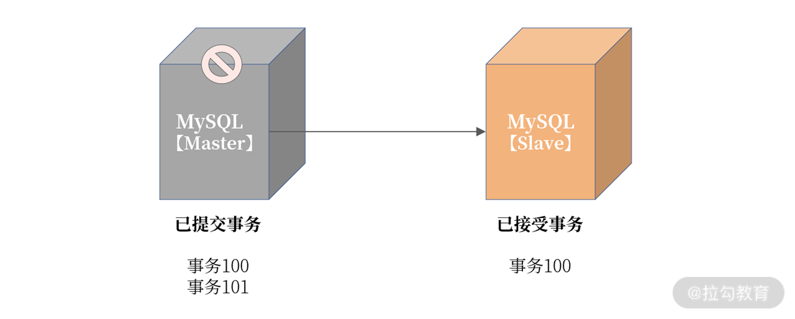
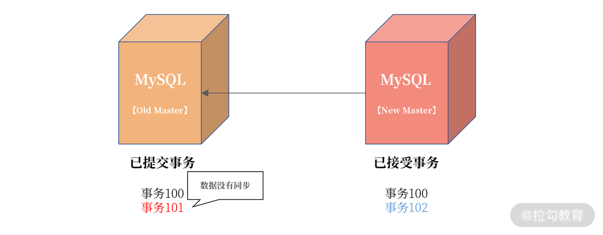
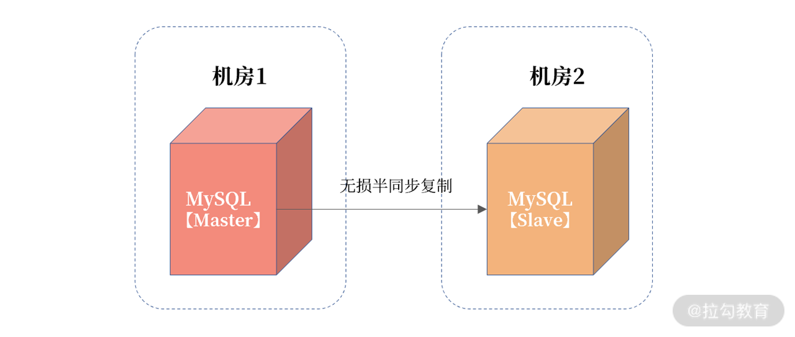
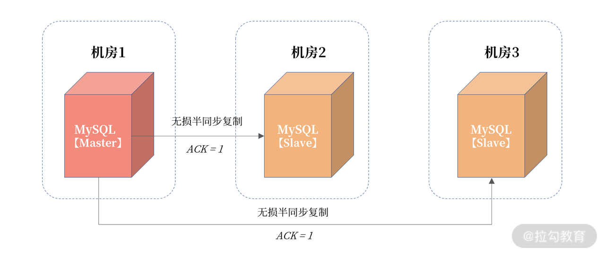
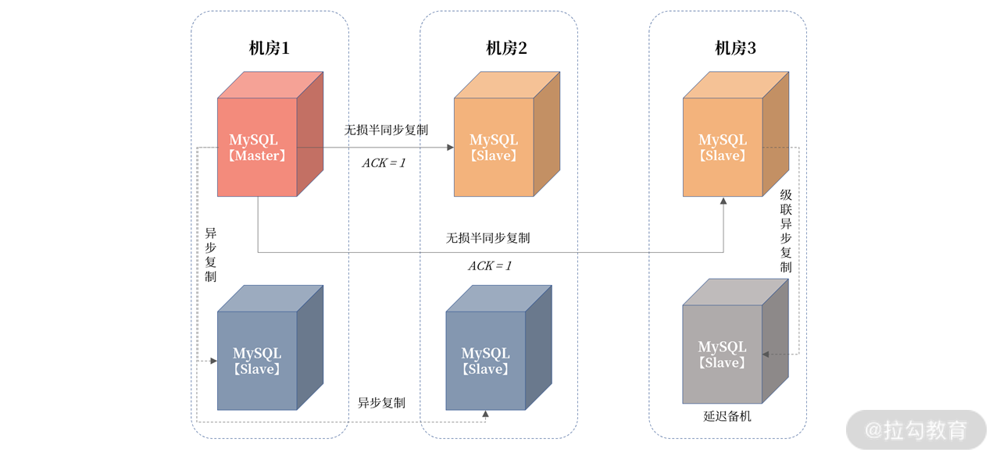
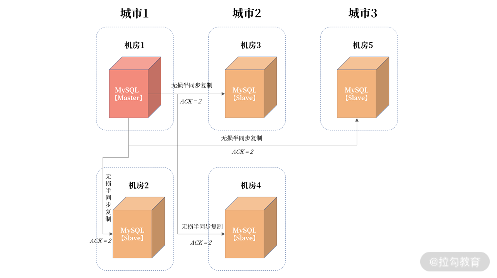
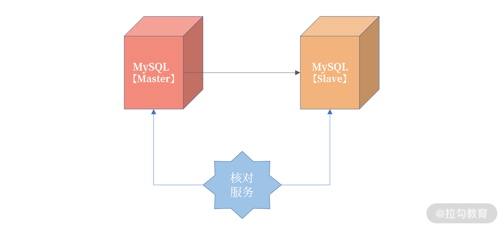

# 18 金融级高可用架构：必不可少的数据核对

在 17 讲中，我们学习了高可用的三大架构设计，基于数据层的高可用、基于业务层的高可用，以及融合的高可用架构设计。

在这些架构中，仅仅解决了业务连续性的问题：也就是当服务器因为各种原因，发生宕机，导致MySQL 数据库不可用之后，快速恢复业务。但对有状态的数据库服务来说，在一些核心业务系统中，比如电商、金融等，还要保证数据一致性。

这里的“数据一致性”是指在任何灾难场景下， **一条数据都不允许丢失** （一般也把这种数据复制方式叫作“强同步”）。

今天我们就来看一看，怎么在这种最高要求（数据一致性）的业务场景中，设计 MySQL 的高可用架构。

### 复制类型的选择

在 15 讲中，我们已经谈到银行、保险、证券等核心业务，需要严格保障数据一致性。那么要想实现数据的强同步，在进行复制的配置时，就要使用无损半同步复制模式。

在 MySQL 内部就是要把参数 rpl_semi_sync_master_wait_point 设置成 AFTER_SYNC 。

但是在高可用设计时，当数据库 FAILOVER 完后，有时还要对原来的主机做额外的操作，这样才能保证主从数据的完全一致性。

我们来看这样一张图：

从图中可以看到，即使启用无损半同步复制，依然存在当发生主机宕机时，最后一组事务没有上传到从机的可能。图中宕机的主机已经提交事务到 101，但是从机只接收到事务 100。如果这个时候 Failover，从机提升为主机，那么这时：

可以看到当主从切换完成后，新的 MySQL 开始写入新的事务102，如果这时老的主服务器从宕机中恢复，则这时事务 101 不会同步到新主服务器，导致主从数据不一致。

**但设置 AFTER_SYNC 无损半同步的好处是，虽然事务 101 在原主机已经提交，但是在从机没有收到并返回 ACK 前，这个事务对用户是不可见的，所以，用户感受不到事务已经提交了**。

所以，在做高可用设计时，当老主机恢复时，需要做一次额外的处理，把事务101给“回滚”（具体怎么实现我们将在 20 讲，高可用套件中具体分析）。

这里我们只要记住，设计数据强一致的高可用方案时，要选择无损半同步复制，另外在发生宕机FAILOVER 后，若老主机恢复，还需要额外处理老主机上已提交但还未发送到从机的数据。

### 容灾级别

高可用用于处理各种宕机问题，而宕机可以分成服务器宕机、机房级宕机，甚至是一个城市发生宕机。

- **机房级宕机：** 机房光纤不通/被挖断，机房整体掉电（双路备用电源也不可用）；
- **城市级宕机：** 一般指整个城市的进出口网络，骨干交换机发生的故障（这种情况发生的概率很小）。

如果综合考虑的话，高可用就成了一种容灾处理机制，对应的高可用架构的评判标准就上升了。

- **机房内容灾：** 机房内某台数据库服务器不可用，切换到同机房的数据库实例，保障业务连续性；
- **同城容灾：** 机房不可用，切换到同城机房的数据库实例，保障业务连续性；
- **跨城容灾：**单个城市机房都不可用，切换到跨城机房的数据库实例，保障业务连续性。

前面我们谈到的高可用设计，都只是机房内的容灾。也就是说，我们的主服务器和从服务器都在一个机房内，现在我们来看一下同城和跨城的容灾设计（我提醒一下，不论是机房内容灾、同城容灾，还是跨城容灾，都是基于 MySQL 的无损半同步复制，只是物理部署方式不同，解决不同的问题）。

对于同城容灾，我看到很多这样的设计：

这种设计没有考虑到机房网络的抖动。如果机房 1 和机房 2 之间的网络发生抖动，那么因为事务提交需要机房 2 中的从服务器接收日志，所以会出现事务提交被 hang 住的问题。

而机房网络抖动非常常见，所以核心业务同城容灾务要采用三园区的架构，如下图所示：

该架构称为“三园区的架构”，如果三个机房都在一个城市，则称为“ 一地三中心”，如果在相邻两个城市，那么就叫“两地三中心”。但这种同城/近城容灾，要求机房网络之间的延迟不超过 5ms。

在三园区架构中，一份数据被存放在了 3 个机房，机房之间根据半同步复制。这里将 MySQL 的半同步复制参数 rpl_semi_sync_master_wait_for_slave_count 设置为 1，表示只要有 1 个半同步备机接收到日志，主服务器上的事务就可以提交。

这样的设计，保证除主机房外，数据在其他机房至少一份完整的数据。

另外，即便机房 1 与机房 2 发生网络抖动，因为机房 1 与机房 3 之间的网络很好，不会影响事务在主服务器上的提交。如果机房 1 的出口交换机或光纤发生故障，那么这时高可用套件会 FAILOVER 到机房 2 或机房 3，因为至少有一份数据是完整的。

机房 2、机房 3 的数据用于保障数据一致性，但是如果要实现读写分离，或备份，还需要引入异步复制的备机节点。所以整体架构调整为：

从图中可以看到，我们加入两个异步复制的节点，用于业务实现读写分离，另外再从机房 3 的备机中，引入一个异步复制的延迟备机，用于做数据误删除操作的恢复。**当设计成类似上述的架构时，你才能认为自己的同城容灾架构是合格的！ **另一个重要的点：因为机房 1 中的主服务器要向四个从服务器发送日志，这时网卡有成为瓶颈的可能，所以请务必配置万兆网卡。** 在明白三园区架构后，要实现跨城容灾也就非常简单了，** 只要把三个机房放在不同城市就行。但这样的设计，当主服务器发生宕机时，数据库就会切到跨城，而跨城之间的网络延迟超过了25 ms。所以，跨城容灾一般设计成“三地五中心”的架构，如下图所示：

在上图中：机房 1、机房 2 在城市 1 中；机房 3、机房 4 在城市 2 中；机房 5 在城市 3 中，三个城市之间的距离超过 200 公里，延迟超过 25ms。

由于有五个机房，所以 ACK 设置为 2，保证至少一份数据在两个机房有数据。这样当发生城市级故障，则城市 2 或城市 3 中，至少有一份完整的数据。

在真实的互联网业务场景中，“三地五中心”应用并不像“三园区”那样普遍。这是因为 25ms的延迟对业务的影响非常大，一般这种架构应用于读多写少的场景，比如用户中心。

另外，真实的互联网业务场景中，实现跨城容灾，一般基于同城容灾架构，然后再由业务层来保障跨城的数据一致性。

### 兜底策略：数据核对

到目前为止，我们的高可用是基于 MySQL 的复制技术。但你有没有想过这样几个问题：

- 万一数据库的复制有 Bug 呢？导致最终的数据在逻辑上不一致呢？
- 主从的数据一定一致吗？你如何判断一定一致呢？

所以，除了高可用的容灾架构设计，我们还要做一层兜底服务，用于判断数据的一致性。这里要引入数据核对，用来解决以下两方面的问题。

- **数据在业务逻辑上一致：** 这个保障业务是对的；
- **主从服务器之间的数据一致： **这个保障从服务器的数据是安全的、可切的。** 业务逻辑核对由业务的同学负责编写， **从整个业务逻辑调度看账平不平。例如“今天库存的消耗”是否等于“订单明细表中的总和”，“在途快递” + “已收快递”是否等于“已下快递总和”。总之，这是个业务逻辑，用于对账。** 主从服务器之间的核对，是由数据库团队负责的。** 需要额外写一个主从核对服务，用于保障主从数据的一致性。这个核对不依赖复制本身，也是一种逻辑核对。思路是：将最近一段时间内主服务器上变更过的记录与从服务器核对，从逻辑上验证是否一致。其实现如图所示：

那么现在的难题是：如何判断最近一段时间内主服务器上变更过的记录？这里有两种思路：

- 表结构设计规范中，有讲过每张表有一个 last_modify_date，用于记录每条记录的最后修改时间，按照这个条件过滤就能查出最近更新的记录，然后每条记录比较即可。
- 核对服务扫描最近的二进制日志，筛选出最近更新过记录的表和主键，然后核对数据。这种的实现难度会更大一些，但是不要求在数据库上进行查询。

如果在核对过程中，记录又在主上发生了变化，但是还没有同步到从机，我们可以加入复核逻辑，按理来说多复核几次，主从数据应该就一致了。如果复核多次不一致，那么大概率，主从数据就已经是不一致的了。

核对服务的逻辑比较简单，但是要实现线上业务的数据核对，开发上还是有一些挑战，但这不就是我们 DBA 的价值所在吗？

### 总结

今天我们学习了金融级高可用的架构设计，内容非常干货，建议你反复阅读。其中涉及的内容在原理上并不复杂，但在实现细节上需要不断打磨，欢迎你在后续的架构设计过程中与我交流。总结来说：

1. 核心业务复制务必设置为无损半同步复制；
1. 同城容灾使用三园区架构，一地三中心，或者两地三中心，机房见网络延迟不超过 5ms；
1. 跨城容灾使用“三地五中心”，跨城机房距离超过 200KM，延迟超过 25ms；
1. 跨城容灾架构由于网络耗时高，因此一般仅用于读多写少的业务，例如用户中心；
1. 除了复制进行数据同步外，还需要额外的核对程序进行逻辑核对；
1. 数据库层的逻辑核对，可以使用 last_modify_date 字段，取出最近修改的记录。
