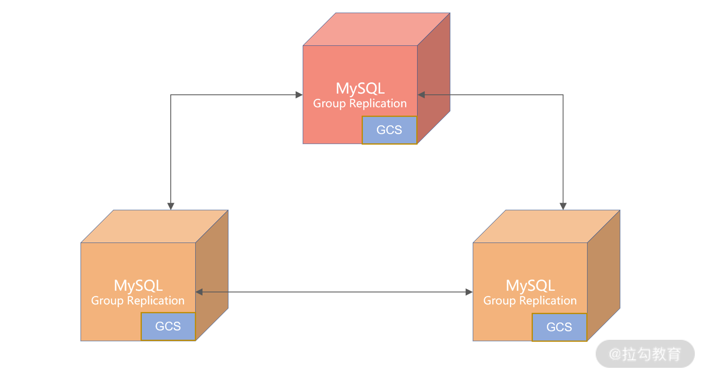

# 20 InnoDB Cluster：改变历史的新产品

前面几讲，我们围绕 MySQL 复制技术构建了读写分离方案、数据库高可用解决方案，以及数据库的管理平台。可以看到，我们所有的讨论都是基于 MySQL 的复制技术。

不过，MySQL 复制只是一种数据同步技术，如果要完成数据库的高可用解决方案，还要额外依赖外部的组件，比如 MHA、Orchestrator、数据库管理平台等。

另一方面，之前介绍的所有切换判断都是通过一组外部的心跳检查机制完成，这依赖于高可用套件自身的能力，如果高可用套件本身不可靠，就意味着高可用的不可靠性。比如，当数据库真的发生宕机时，数据库是否一定能切换成功呢？

最后，数据库复制技术的瓶颈在于：只能在一个节点完成写入，然后再将日志同步各个节点，这样单点写入会导致数据库性能无法进行扩展。那么能不能有一种技术，能实现 MySQL 多个节点写入，并且保证数据同步的能力呢？

有的，这就是我们今天将要学习的 InnoDB Cluster，它的底层是由 MySQL Group Replication（下面简称MGR）实现。为了让你用好 InnoDB Cluster，今天这一讲我会侧重讲解 MGR 技术、多节点写入、InnoDB Cluster 解决方案、希望你在学完之后能掌握这种新的MySQL 高可用解决方案。

### MGR技术

MGR 是官方在 MySQL 5.7 版本推出的一种基于状态机的数据同步机制。与半同步插件类似，MGR 是通过插件的方式启用或禁用此功能。



MGR 复制结构图

注意，我们谈及 MGR，不要简单认为它是一种新的数据同步技术，而是应该把它理解为高可用解决方案，而且特别适合应用于对于数据一致性要求极高的金融级业务场景。

首先，MGR 之间的数据同步并没有采用复制技术，而是采用 GCS（Group Communication System）协议的日志同步技术。

GSC 本身是一种类似 Paxos 算法的协议，要求组中的大部分节点都接收到日志，事务才能提交。所以，MRG 是严格要求数据一致的，特别适合用于金融级的环境。由于是类 Paxos 算法，集群的节点要求数量是奇数个，这样才能满足大多数的要求。

有的同学可能会问了：之前介绍的无损半同步也能保证数据强一致的要求吗？

是的，虽然通过无损半同步复制也能保证主从数据的一致性，但通过 GCS 进行数据同步有着更好的性能：当启用 MGR 插件时，MySQL 会新开启一个端口用于数据的同步，而不是如复制一样使用MySQL 服务端口，这样会大大提升复制的效率。

其次，MGR 有两种模式：

- 单主（Single Primary）模式；
- 多主（Multi Primary）模式。

单主模式只有 1 个节点可以写入，多主模式能让每个节点都可以写入。而多个节点之间写入，如果存在变更同一行的冲突，MySQL 会自动回滚其中一个事务，自动保证数据在多个节点之间的完整性和一致性。

最后，在单主模式下，MGR 可以自动进行 Failover 切换，不用依赖外部的各种高可用套件，所有的事情都由数据库自己完成，比如最复杂的选主（Primary Election）逻辑，都是由 MGR 自己完成，用户不用部署额外的 Agent 等组件。

\*\*说了这么多 MGR 的优势，那么它有没有缺点或限制呢？\*\*当然有，主要是这样几点：

1. 仅支持 InnoDB 表，并且每张表一定要有一个主键；
1. 目前一个 MGR 集群，最多只支持 9 个节点；
1. 有一个节点网络出现抖动或不稳定，会影响集群的性能。

第 1、2 点问题不大，因为目前用 MySQL 主流的就是使用 InnoDB 存储引擎，9 个节点也足够用了。

而第 3 点我想提醒你注意，和复制不一样的是，由于 MGR 使用的是 Paxos 协议，对于网络极其敏感，如果其中一个节点网络变慢，则会影响整个集群性能。而半同步复制，比如 ACK 为1，则 1 个节点网络出现问题，不影响整个集群的性能。所以，在决定使用 MGR 后，切记一定要严格保障网络的质量。

而多主模式是一种全新的数据同步模式，接下来我们看一看在使用多主模式时，该做哪些架构上的调整，从而充分发挥 MGR 多主的优势。

### 多主模式的注意事项

#### 冲突检测

MGR 多主模式是近几年数据库领域最大的一种创新，而且目前来看，仅 MySQL 支持这种多写的 Share Nothing 架构。

多主模式要求每个事务在本节点提交时，还要去验证其他节点是否有同样的记录也正在被修改。如果有的话，其中一个事务要被回滚。

比如两个节点同时执行下面的 SQL 语句：

```
-- 节点1


UPDATE User set money = money - 100 WHERE id = 1;


-- 节点2


UPDATE User set money = money + 300 WHERE id = 1;

```

如果一开始用户的余额为 200，当节点 1 执行 SQL 后，用户余额变为 100，当节点 2 执行SQL，用户余额变味了 500，这样就导致了节点数据的不同。所以 MGR 多主模式会在事务提交时，进行行记录冲突检测，发现冲突，就会对事务进行回滚。

在上面的例子中，若节点 2 上的事务先提交，则节点 1 提交时会失败，事务会进行回滚。

所以，如果要发挥多主模式的优势，就要避免写入时有冲突。\*\*最好的做法是：每个节点写各自的数据库，比如节点 1 写 DB1，节点 2 写 DB2，节点 3 写 DB3，这样集群的写入性能就能线性提升了。\*\*不过这要求我们在架构设计时，就做好这样的考虑，否则多主不一定能带来预期中的性能提升。

#### 自增处理

在多主模式下，自增的逻辑发生了很大的变化。简单来说，自增不再连续自增。

因为，如果连续自增，这要求每次写入时要等待自增值在多个节点中的分配，这样性能会大幅下降，所以 MGR 多主模式下，我们可以通过设置自增起始值和步长来解决自增的性能问题。看下面的参数：

```
group_replication_auto_increment_increment = 7

```

参数 group_replication_auto_increment_increment 默认为 7，自增起始值就是 server-id。

假设 MGR 有 3 个节点 Node1、Node2、Node3，对应的 server-id 分别是 1、2、3, 如果这时多主插入自增的顺序为 Node1、Node1、Node2、Node3、Node1，则自增值产生的结果为：


可以看到，由于是多主模式，允许多个节点并发的产生自增值。所以自增的产生结果为1、8、16、17、22，自增值不一定是严格连续的，而仅仅是单调递增的，这与单实例 MySQL 有着很大的不同。

在 05 讲表结构设计中，我也强调过：尽量不要使用自增值做主键，在 MGR 存在问题，在后续分布式架构中也一样存在类似的自增问题。**所以，对于核心业务表，还是使用有序 UUID 的方式更为可靠，性能也会更好。 **总之，使用 MGR 技术后，所有高可用事情都由数据库自动完成。那么，业务该如何利用 MGR的能力，是否还需要 VIP、DNS 等机制保证业务的透明性呢？接下来，我们就来看一下，** 业务如何利用 MGR 的特性构建高可用解决方案。**

### InnoDB Cluster

MGR 是基于 Paxos 算法的数据同步机制，将数据库状态和日志通过 Paxos 算法同步到各个节点，但如果要实现一个完整的数据库高可用解决方案，就需要更高一层级的 InnoDB Cluster 完成。

一个 InnoDB Cluster 由三个组件组成：MGR 集群、MySQL Shell、MySQL Router。具体如下图所示：


其中，MySQL Shell 用来管理 MGR 集群的创建、变更等操作。以后我们最好不要手动去管理 MGR 集群，而是通过 MySQL Shell 封装的各种接口完成 MGR 的各种操作。如：

```
mysql-js> cluster.status()


{


    "clusterName": "myCluster", 


    "defaultReplicaSet": {


        "name": "default", 


        "primary": "ic-2:3306", 


        "ssl": "REQUIRED", 


        "status": "OK", 


        "statusText": "Cluster is ONLINE and can tolerate up to ONE failure.", 


        "topology": {


            "ic-1:3306": {


                "address": "ic-1:3306", 


                "mode": "R/O", 


                "readReplicas": {}, 


                "role": "HA", 


                "status": "ONLINE"


            }, 


            "ic-2:3306": {


                "address": "ic-2:3306", 


                "mode": "R/W", 


                "readReplicas": {}, 


                "role": "HA", 


                "status": "ONLINE"


            }, 


            "ic-3:3306": {


                "address": "ic-3:3306", 


                "mode": "R/O", 


                "readReplicas": {}, 


                "role": "HA", 


                "status": "ONLINE"


            }


        }


    }, 


    "groupInformationSourceMember": "mysql://[email protected]:6446"


}

```

MySQL Router 是一个轻量级的代理，用于业务访问 MGR 集群中的数据，当 MGR 发生切换时（这里指 Single Primary 模式），自动路由到新的 MGR 主节点，这样业务就不用感知下层MGR 数据的切换。

为了减少引入 MySQL Router 带来的性能影响，官方建议 MySQL Router 与客户端程序部署在一起，以一种类似 sidecar 的方式进行物理部署。这样能减少额外一次额外的网络开销，基本消除引入 MySQL Router 带来的影响。

所以，这里 MySQL Router 的定位是一种轻量级的路由转发，而不是一个数据库中间件，主要解决数据库切换后，做到对业务无感知。

### 总结

本讲我们了解了一种全新的 MySQL 高可用解决方案：InnoDB Cluster。这种高可用解决方案大概率会成为下一代金融场景的标准数据库高可用解决方案，InnoDB Cluster 底层是 MGR，通过类 Paoxs 算法进行数据同步，性能更好，且能保证数据的完整性。

结合管理工具 MySQL Shell，路由工具 MySQL Router 能构建一个完整的 MySQL 高可用解决方案。

对于金融用户来说，我非常推荐这种高可用解决方案。当然，我建议在最新的 MySQL 8.0 版本中使用 InnoDB Cluster。
