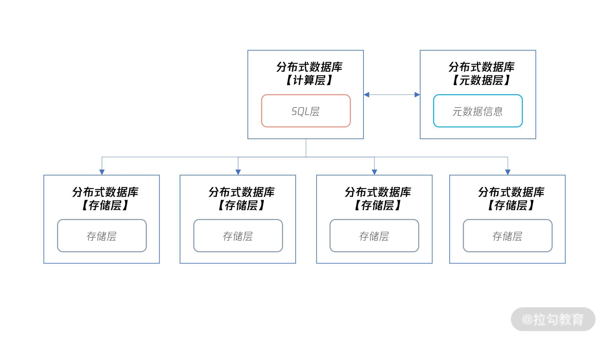
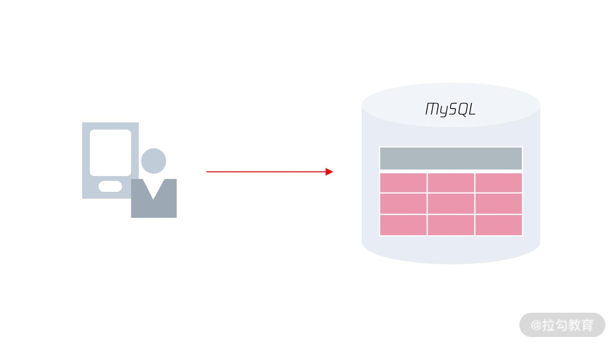
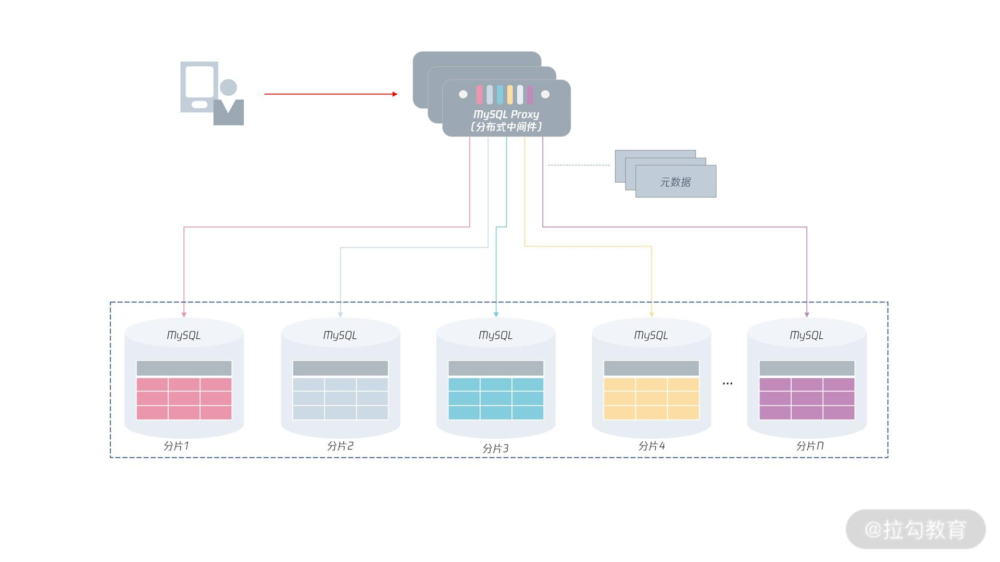

22 分布式数据库架构：彻底理解什么叫分布式数据库
=========================

前面的三个模块里，我们学习了 MySQL 架构设计中最核心的内容，表结构设计、索引设计、高可用设计。相信通过前面的内容，你已经能很好地完成 MySQL 数据库的架构设计工作。

从这个模块开始，我们将进入架构设计的深水区，学习分布式数据库架构的设计。

我们都知道，现在互联网应用已经普及，数据量不断增大。对淘宝、美团、百度等互联网业务来说，传统单实例数据库很难支撑其性能和存储的要求，所以分布式架构得到了很大发展。

而开发同学、DBA 同学，一定要认识到数据库技术正在经历一场较大的变革，及早掌握好分布式架构设计，帮助公司从古老的单实例架构迁移到分布式架构，对自己在职场的竞争力来说，大有益处。

话不多说，我们直接进入分布式架构设计环节。这一讲先来看一看“什么是分布式数据库？”

### 分布式数据库概念

Wiki 官方对分布式数据库的定义为：

> A distributed database is a database in which data is stored across different physical locations. It may be stored in multiple computers located in the same physical location (e.g. a data centre); or maybe dispersed over a network of interconnected computers.

从定义来看，分布式数据库是一种把数据分散存储在不同物理位置的数据库。

对比我们之前学习的数据库，数据都是存放在一个实例对应的物理存储上，而在分布式数据库中，数据将存放在不同的数据库实例上。

分布式数据库的架构

从图中我们可以看到，在分布式数据库下，分布式数据库本身分为计算层、元数据层和存储层：

* 计算层就是之前单机数据库中的 SQL 层，用来对数据访问进行权限检查、路由访问，以及对计算结果等操作。
* 元数据层记录了分布式数据库集群下有多少个存储节点，对应 IP、端口等元数据信息是多少。当分布式数据库的计算层启动时，会先访问元数据层，获取所有集群信息，才能正确进行 SQL 的解析和路由等工作。另外，因为元数据信息存放在元数据层，那么分布式数据库的计算层可以有多个，用于实现性能的扩展。
* 存储层用来存放数据，但存储层要和计算层在同一台服务器上，甚至不求在同一个进程中。

我们可以看到，分布式数据库的优势是把数据打散到不同的服务器上，这种横向扩展的 Scale Out 能力，能解决单机数据库的性能与存储瓶颈。

从理论上来看，分布式数据库的性能可以随着计算层和存储层的扩展，做到性能的线性提升。

从可用性的角度看，如果存储层发生宕机，那么只会影响 1/N 的数据，N 取决于数据被打散到多少台服务器上。所以，分布式数据库的可用性对比单机会有很大提升，单机数据库要实现99.999% 的可用性或许很难，但是分布式数据库就容易多了。

当然，分布式数据库也存在缺点：正因为数据被打散了，分布式数据库会引入很多新问题，比如自增实现、索引设计、分布式事务等（这些将在后面的内容中具体介绍）。

接下来，我们看一看分布式 MySQL 数据库的整体架构。

### 分布式MySQL架构

在学习分布式 MySQL 架构前，我们先看一下原先单机 MySQL 架构是怎样的。

 可以看到，原先客户端是通过 MySQL 通信协议访问 MySQL 数据库，MySQL 数据库会通过高可用技术做多副本，当发生宕机进行切换。

那么对于分布式 MySQL 数据库架构，其整体架构如下图所示：

从上图可以看到，这时数据将打散存储在下方各个 MySQL 实例中，每份数据叫“分片（Shard）”。

在分布式 MySQL 架构下，客户端不再是访问 MySQL 数据库本身，而是访问一个分布式中间件。

这个分布式中间件的通信协议依然采用 MySQL 通信协议（因为原先客户端是如何访问的MySQL 的，现在就如何访问分布式中间件）。分布式中间件会根据元数据信息，自动将用户请求路由到下面的 MySQL 分片中，从而将存储存取到指定的节点。

另外，分布式 MySQL 数据库架构的每一层都要由高可用，保证分布式数据库架构的高可用性。

对于上层的分布式中间件，是可以平行扩展的：即用户可以访问多个分布式中间件，如果其中一个中间件发生宕机，那么直接剔除即可。

因为分布式中间件是无状态的，数据保存在元数据服务中，它的高可用设计比较容易。

对于元数据来说，虽然它的数据量不大，但数据非常关键，一旦宕机则可能导致中间件无法工作，所以，元数据要通过副本技术保障高可用。

最后，每个分片存储本身都有副本，通过我们之前学习的高可用技术，保证分片的可用性。也就是说，如果分片 1 的 MySQL 发生宕机，分片 1 的从服务器会接替原先的 MySQL 主服务器，继续提供服务。

但由于使用了分布式架构，那么即使分片 1 发生宕机，需要 60 秒的时间恢复，这段时间对于业务的访问来说，只影响了 1/N 的数据请求。

可以看到，分布式 MySQL 数据库架构实现了计算层与存储层的分离，每一层都可以进行 Scale Out 平行扩展，每一层又通过高可用技术，保证了计算层与存储层的连续性，大大提升了MySQL 数据库的性能和可靠性，为海量互联网业务服务打下了坚实的基础。

### 总结

今天这一讲，我们主要学习了分布式数据库的概念，了解了分布式数据库是将数据打散到不同节点上存储，从而提升性能与可靠性。另外，要实现分布式数据库，就要做到数据库层的计算层与存储层分离。

接着，我们又学习了分布式 MySQL 数据库的架构：分布式 MySQL 架构通过一个中间件路由层屏蔽了下层 MySQL 分片的信息。

由于分布式中间件通信采用 MySQL 通信协议，用户原先怎么使用 MySQL 数据库，那就怎么使用分布式中间件。对于开发来说，这些都是透明的，他们不用关心下层有多少个分片，所有的路由和计算工作，交友中间件层完成。

这一讲相对比较简单，是下面几讲的基础，我建议你反复阅读，好好理解分布式 MySQL 数据库架构。
