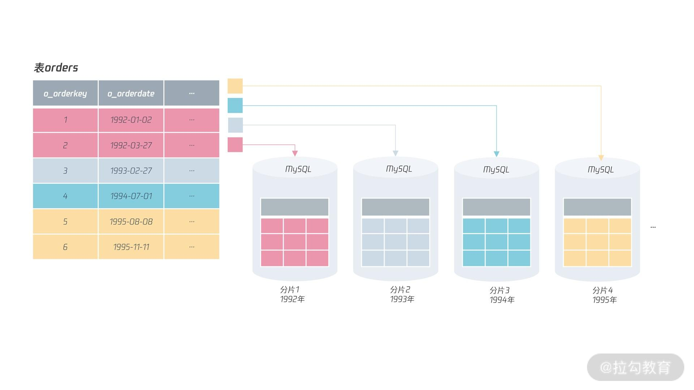
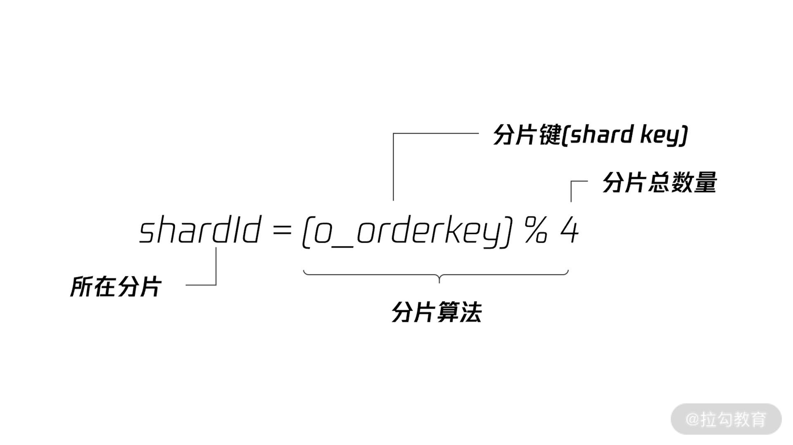
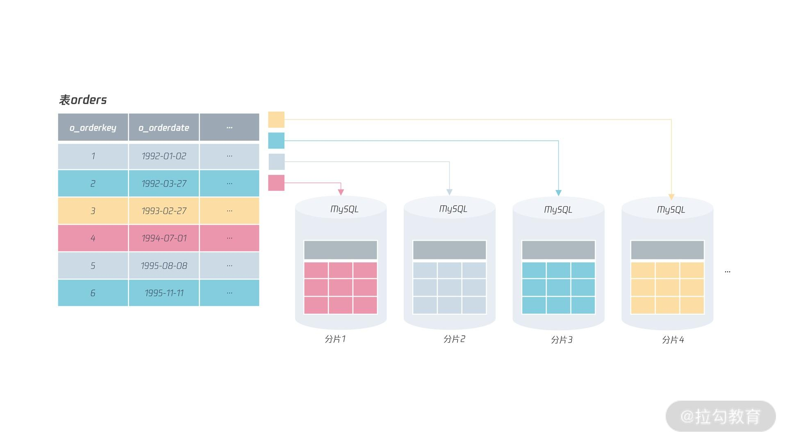
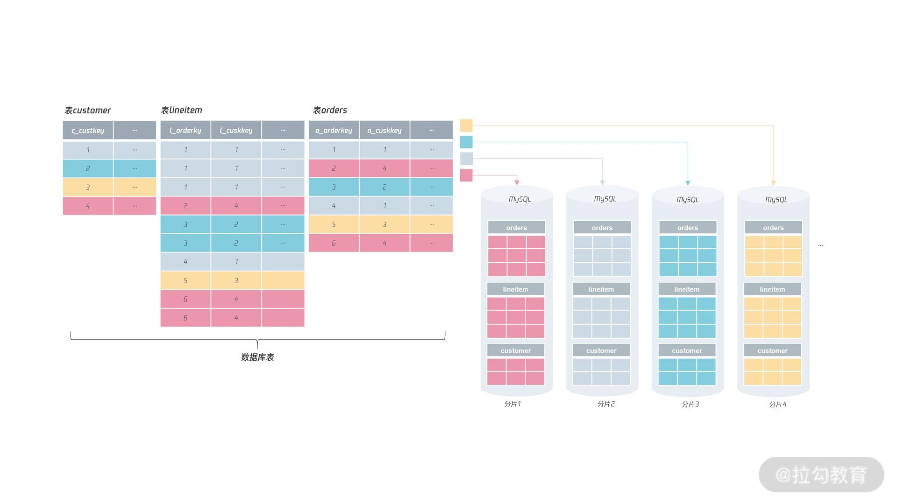
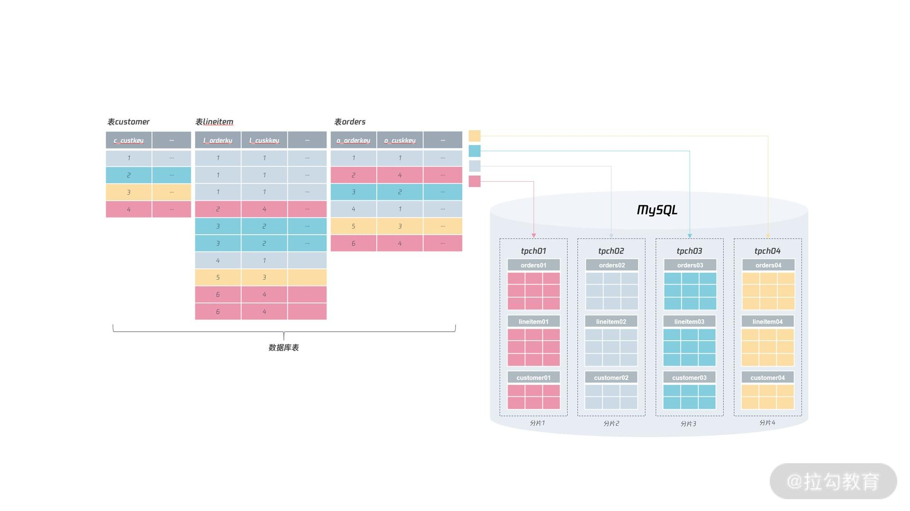
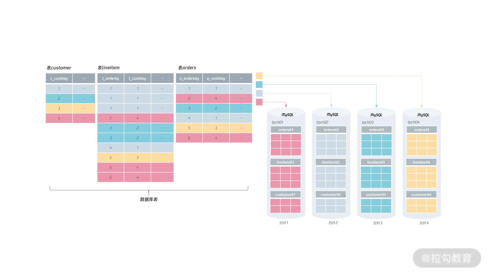
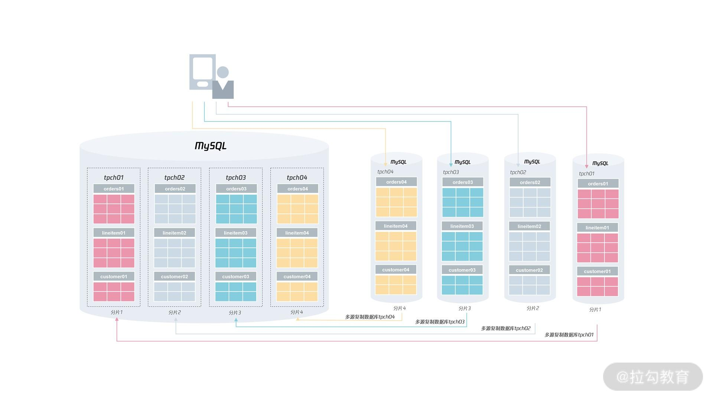

# 23 分布式数据库表结构设计：如何正确地将数据分片？

前面 22 讲中，我们简单学习了分布式数据库的架构，知道各类分布式数据库都离不开计算层、存储层、元数据层这三层关系。

另外，很重要的一点是，知道分布式数据库是把数据打散存储在一个个分片中。在基于MySQL 的分布式数据库架构中，分片就存在于 MySQL 实例中。

今天这一讲，我们来学习分布式数据库中，一个非常重要的设计：正确地把数据分片，充分发挥分布式数据库架构的优势。

### 选出分片键

在对表中的数据进行分片时，首先要选出一个分片键（Shard Key），即用户可以通过这个字段进行数据的水平拆分。

对于我们之前使用的电商业务的订单表orders，其表结构如下所示：

```
CREATE TABLE `orders` (
  `O_ORDERKEY` int NOT NULL,
  `O_CUSTKEY` int NOT NULL,
  `O_ORDERSTATUS` char(1) NOT NULL,
  `O_TOTALPRICE` decimal(15,2) NOT NULL,
  `O_ORDERDATE` date NOT NULL,
  `O_ORDERPRIORITY` char(15) NOT NULL,
  `O_CLERK` char(15) NOT NULL,
  `O_SHIPPRIORITY` int NOT NULL,
  `O_COMMENT` varchar(79) NOT NULL,
  PRIMARY KEY (`O_ORDERKEY`),
  KEY `idx_custkey_orderdate` (`O_CUSTKEY`,`O_ORDERDATE`),
  KEY `ORDERS_FK1` (`O_CUSTKEY`),
  KEY `idx_custkey_orderdate_totalprice` (`O_CUSTKEY`,`O_ORDERDATE`,`O_TOTALPRICE`),
  KEY `idx_orderdate` (`O_ORDERDATE`),
  KEY `idx_orderstatus` (`O_ORDERSTATUS`),
  CONSTRAINT `orders_ibfk_1` FOREIGN KEY (`O_CUSTKEY`) REFERENCES `customer` (`C_CUSTKEY`)
) ENGINE=InnoDB
```

对于类似淘宝、京东、拼多多这样业务体量的应用来说，单实例 MySQL 数据库在性能和存储容量上肯定无法满足“双 11、618 ”大促的要求，所以要改造成分布式数据库架构。

而第一步就是要对表选出一个分片键，然后进行分布式架构的设计。

对于上面的表orders，可以选择的分片键有：o_orderkey、o_orderdate、也可以是o_custkey。在选出分片键后，就要选择分片的算法，比较常见的有 RANGE 和 HASH 算法。

比如，表 orders，选择分片键 o_orderdate，根据函数 YEAR 求出订单年份，然后根据RANGE 算法进行分片，这样就能设计出基于 RANGE 分片算法的分布式数据库架构：



从图中我们可以看到，采用 RANGE 算法进行分片后，表 orders 中，1992 年的订单数据存放在分片 1 中、1993 年的订单数据存放在分片 2 中、1994 年的订单数据存放在分片 3中，依次类推，如果要存放新年份的订单数据，追加新的分片即可。

**不过，RANGE 分片算法在分布式数据库架构中，是一种非常糟糕的算法**，因为对于分布式架构，通常希望能解决传统单实例数据库两个痛点：

- 性能可扩展，通过增加分片节点，性能可以线性提升；
- 存储容量可扩展，通过增加分片节点，解决单点存储容量的数据瓶颈。

那么对于订单表 orders 的 RANGE 分片算法来说，你会发现以上两点都无法实现，因为当年的数据依然存储在一个分片上（即热点还是存在于一个数据节点上）。

如果继续拆细呢？比如根据每天进行 RANGE 分片？这样的确会好一些，但是对“双 11、618”这样的大促来说，依然是单分片在工作，热点依然异常集中。

所以在分布式架构中，RANGE 分区算法是一种比较糟糕的算法。但它也有好处：可以方便数据在不同机器间进行迁移（migrate），比如要把分片 2 中 1992 年的数据迁移到分片 1，直接将表进行迁移就行。

**而对海量并发的 OLTP 业务来说，一般推荐用 HASH 的分区算法**。这样分片的每个节点都可以有实时的访问，每个节点负载都能相对平衡，从而实现性能和存储层的线性可扩展。

我们来看表 orders 根据 o_orderkey 进行 HASH 分片，分片算法如下：



在上述分片算法中，分片键是 o_orderkey，总的分片数量是 4（即把原来 1 份数据打散到 4 张表中），具体来讲，分片算法是将 o_orderkey 除以 4 进行取模操作。

最终，将表orders 根据 HASH 算法进行分布式设计后的结果如下图所示：



可以看到，对于订单号除以 4，余数为 0 的数据存放在分片 1 中，余数为 1 的数据存放在分片 2 中，余数为 2 的数据存放在分片 3 中，以此类推。

这种基于 HASH 算法的分片设计才能较好地应用于大型互联网业务，真正做到分布式数据库架构弹性可扩展的设计要求。

但是，表 orders 分区键选择 o_orderkey 是最好地选择吗？并不是。

我们看一下库中的其他表，如表 customer、lineitem，这三张表应该是经常一起使用的，比如查询用户最近的订单明细。

如果用 o_orderkey 作分区键，那么 lineitem 可以用 l_orderkey 作为分区键，但这时会发现表customer 并没有订单的相关信息，即无法使用订单作为分片键。

如果表 customer 选择另一个字段作为分片键，那么业务数据无法做到单元化，也就是对于表customer、orders、lineitem，分片数据在同一数据库实例上。

所以，如果要实现分片数据的单元化，最好的选择是把用户字段作为分区键，在表 customer 中就是将 c_custkey 作为分片键，表orders 中将 o_custkey 作为分片键，表 lineitem 中将 l_custkey 作为分片键：



这样做的好处是：根据用户维度进行查询时，可以在单个分片上完成所有的操作，不用涉及跨分片的访问，如下面的 SQL：

```
SELECT * FROM orders
INNER JOIN lineitem ON o_orderkey = l_orderkey
INNER JOIN customer ON o_custkey = c_custkey
WHERE o_custkey = 1
ORDER BY o_orderdate DESC LIMIT 10
```

所以，分布式数据库架构设计的原则是： **选择一个适合的分片键和分片算法，把数据打散，并且业务的绝大部分查询都是根据分片键进行访问** 。

那为什么互联网业务这么适合进行分布式架构的设计呢？因为互联网业务大部分是 To C 业务，分片键就是用户的 ID，业务的大部分访问都是根据用户 ID 进行查询，比如：

- 查看某个用户下的微博/短视频；
- 查看某个用户的商品信息/购买记录；
- 查看某个用户自己的余额信息。

学完分片键的选择后，接着就是规划分片，也就我们经常提到的分库分表。

### 分库分表

说了这么久分片，分片到底是什么呢？其实，前面说的分片本质是一张张表，而不是数据库实例，只是每个分片是在 MySQL 数据库实例中，严格来说：

```
分片 = 实例 + 库 + 表 = [email protected]:db_name:table_name
```

对于前面的表orders，假设根据 HASH 算法进行分片，那么可以进行如下的分库分表设计：

1. 每个分片的表名库名都一样，如库 tpch，表名 orders；
1. 每个分片的库名不一样，表名一样，如库名 tpch01、tpch02、tpch03、tpch04，表名orders；
1. 每个分片的表名不一样，库名一样，如库名 tpch，表名分别为 orders01、orders02、orders03、orders04；
1. 每个分片的库名不一样，表名也不一样，如分片 1 的表在库名 tpch01下，表名为oders01；分片 2 的表名在库名 tpch02，表名为 orders02；分片 3 的表名在库名tpch03，表名为 orders03；分片 3 的表名在库名 tpch04，表名为 orders04。

在这 4 种分库分表规则中，最推荐的是第 4 种，也是我们通常意义说的分库分表，这样做的好处有以下几点：

- 不同分片的数据可以在同一 MySQL 数据库实例上，便于做容量的规划和后期的扩展；
- 同一分片键的表都在同一库下，方便做整体数据的迁移和扩容。

如果根据第 4 种标准的分库分表规范，那么分布式 MySQL 数据库的架构可以是这样： 

**有没有发现，按上面这样的分布式设计，数据分片完成后，所有的库表依然是在同一个 MySQL实例上！！！ **牢记，分布式数据库并不一定要求有很多个实例，最基本的要求是将数据进行打散分片。接着，用户可以根据自己的需要，进行扩缩容，以此实现数据库性能和容量的伸缩性。** 这才是分布式数据库真正的魅力所在**。

对于上述的分布式数据库架构，一开始我们将 4 个分片数据存储在一个 MySQL 实例上，但是如果遇到一些大促活动，可以对其进行扩容，比如把 4 个分片扩容到 4 个MySQL实例上： 

如果完成了大促活动，又可以对资源进行回收，将分片又都放到一台 MySQL 实例上，这就是对资源进行缩容。

总的来说，对分布式数据库进行扩缩容在互联网公司是一件常见的操作，比如对阿里来说，每年下半年 7 月开始，他们就要进行双 11 活动的容量评估，然后根据评估结果规划数据库的扩容。

一般来说，电商的双 11 活动后，还有双 12、新年、春节，所以一般会持续到过完年再对数据库进行缩容。接下来，我们来看看如何进行扩缩容。

扩缩容

在 HASH 分片的例子中，我们把数据分片到了 4 个节点，然而在生产环境中，为了方便之后的扩缩容操作，推荐一开始就把分片的数量设置为不少于 1000 个。

不用担心分片数量太多，因为分片 1 个还是 1000 个，管理方式都是一样的，但是 1000 个，意味着可以扩容到 1000 个实例上，对于一般业务来说，1000 个实例足够满足业务的需求了（BTW，网传阿里某核心业务的分布式数据库分片数量为 10000个）。

如果到了 1000 个分片依然无法满足业务的需求，这时能不能拆成 2000 个分片呢？从理论上来说是可以的，但是这意味着需要对一张表中的数据进行逻辑拆分，这个工作非常复杂，通常不推荐。

所以，**一开始一定要设计足够多的分片**。在实际工作中，我遇到很多次业务将分片数量从 32、64 拆成 256、512。每次这样的工作，都是扒一层皮，太不值得。所以，做好分布式数据库设计的工作有多重要！

那么扩容在 MySQL 数据库中如何操作呢？其实，本质是搭建一个复制架构，然后通过设置过滤复制，仅回放分片所在的数据库就行，这个数据库配置在从服务器上大致进行如下配置：

```
# 分片1从服务器配置
replicate_do_db ="tpch01"
```

所以在进行扩容时，首先根据下图的方式对扩容的分片进行过滤复制的配置：


然后再找一个业务低峰期，将业务的请求转向新的分片，完成最终的扩容操作：



至于缩容操作，本质就是扩容操作的逆操作，这里就不再多说了。

### 总结

今天这一讲，我们学习了分布式数据库架构设计中的分片设计，也就是我们经常听说的分库分表设计。希望通过本讲，你能牢牢掌握以下内容：

- 分布式数据库数据分片要先选择一个或多个字段作为分片键；
- 分片键的要求是业务经常访问的字段，且业务之间的表大多能根据这个分片键进行单元化；
- 如果选不出分片键，业务就无法进行分布式数据库的改造；
- 选择完分片键后，就要选择分片算法，通常是 RANGE 或 HASH 算法；
- 海量 OLTP 业务推荐使用 HASH 算法，强烈不推荐使用 RANGE 算法；
- 分片键和分片算法选择完后，就要进行分库分表设计，推荐不同库名表名的设计，这样能方便后续对分片数据进行扩缩容；
- 实际进行扩容时，可以使用过滤复制，仅复制需要的分片数据。

今天的内容非常非常干货，希望你能反复阅读，掌握分布式数据库架构设计中最为基础和重要的知识点，我们下一讲见。
