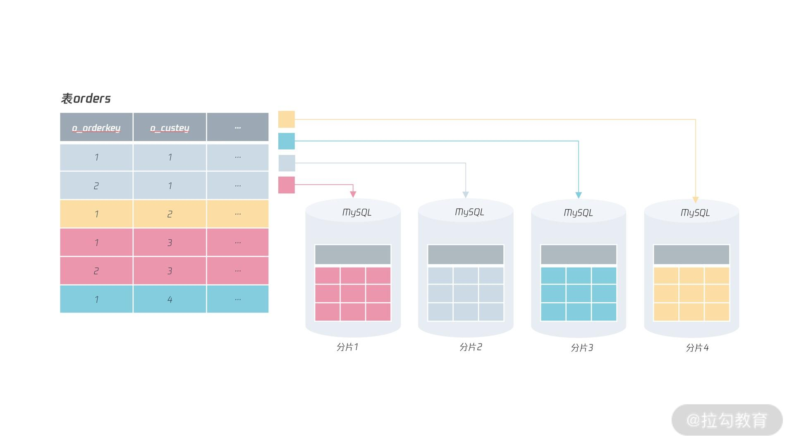
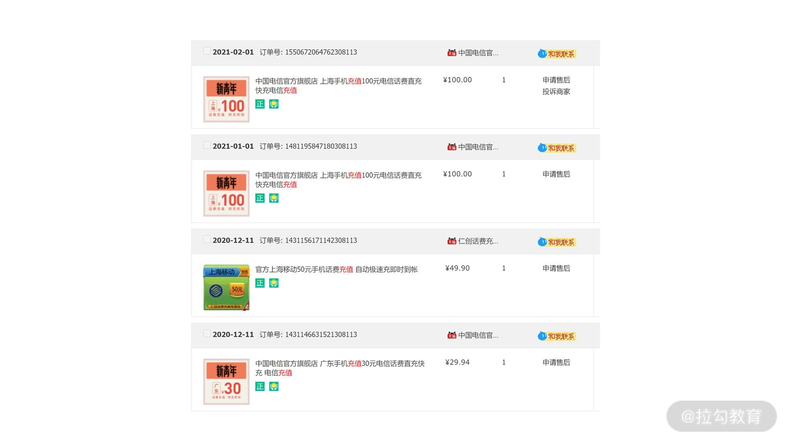
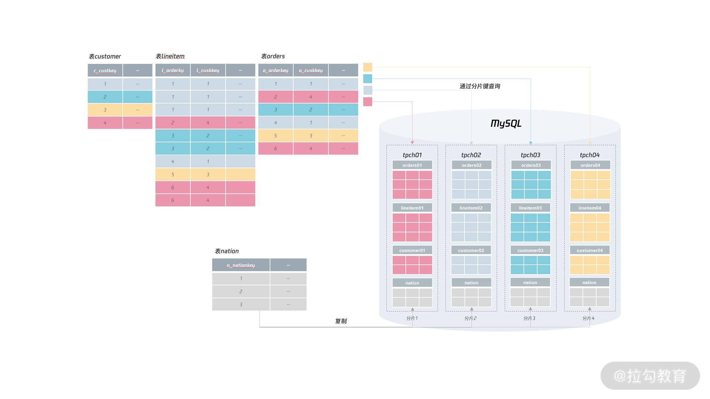

24 分布式数据库索引设计：二级索引、全局索引的最佳设计实践
==============================

前面两讲，我们学习了 MySQL 分布式数据库架构的内容，相信现在你清楚地知道了分布式数据库的整体架构，以及数据如何进行分片。

结合第一模块的“表结构设计”，基本上你已经能完成分布式数据库架构下，表结构的设计工作。

而在分布式数据库架构下，索引的设计也需要做调整，否则无法充分发挥分布式架构线性可扩展的优势。所以这一讲，我们就来学习“在分布式数据库架构下，如何正确的设计索引？”。

### 主键选择

对主键来说，要保证在所有分片中都唯一，它本质上就是一个全局唯一的索引。如果用大部分同学喜欢的自增作为主键，就会发现存在很大的问题。

因为自增并不能在插入前就获得值，而是要通过填 NULL 值，然后再通过函数 last\_insert\_id()获得自增的值。所以，如果在每个分片上通过自增去实现主键，可能会出现同样的自增值存在于不同的分片上。

比如，对于电商的订单表 orders，其表结构如下（分片键是o\_custkey，表的主键是o\_orderkey）：

```
CREATE TABLE `orders` (


  `O_ORDERKEY` int NOT NULL auto_increment,


  `O_CUSTKEY` int NOT NULL,


  `O_ORDERSTATUS` char(1) NOT NULL,


  `O_TOTALPRICE` decimal(15,2) NOT NULL,


  `O_ORDERDATE` date NOT NULL,


  `O_ORDERPRIORITY` char(15) NOT NULL,


  `O_CLERK` char(15) NOT NULL,


  `O_SHIPPRIORITY` int NOT NULL,


  `O_COMMENT` varchar(79) NOT NULL,


  PRIMARY KEY (`O_ORDERKEY`),


  KEY (`O_CUSTKEY`)


  ......


) ENGINE=InnoDB

```

如果把 o\_orderkey 设计成上图所示的自增，那么很可能 o\_orderkey 同为 1 的记录在不同的分片出现，如下图所示：



**所以，在分布式数据库架构下，尽量不要用自增作为表的主键**，这也是我们在第一模块“表结构设计”中强调过的：自增性能很差、安全性不高、不适用于分布式架构。

讲到这儿，我们已经说明白了“自增主键”的所有问题，那么该如何设计主键呢？依然还是用全局唯一的键作为主键，比如 MySQL 自动生成的有序 UUID；业务生成的全局唯一键（比如发号器）；或者是开源的 UUID 生成算法，比如雪花算法（但是存在时间回溯的问题）。

总之，**用有序的全局唯一替代自增，是这个时代数据库主键的主流设计标准**，如果你还停留在用自增做主键，或许代表你已经落后于时代发展了。

### 索引设计

通过分片键可以把 SQL 查询路由到指定的分片，但是在现实的生产环境中，业务还要通过其他的索引访问表。

还是以前面的表 orders 为例，如果业务还要根据 o\_orderkey 字段进行查询，比如查询订单 ID 为 1 的订单详情：

```
SELECT * FROM orders WHERE o_orderkey = 1

```

我们可以看到，由于分片规则不是分片键，所以需要查询 4 个分片才能得到最终的结果，如果下面有 1000 个分片，那么就需要执行 1000 次这样的 SQL，这时性能就比较差了。

但是，我们知道 o\_orderkey 是主键，应该只有一条返回记录，也就是说，o\_orderkey 只存在于一个分片中。这时，可以有以下两种设计：

* 同一份数据，表 orders 根据 o\_orderkey 为分片键，再做一个分库分表的实现；
* 在索引中额外添加分片键的信息。

这两种设计的本质都是通过冗余实现空间换时间的效果，否则就需要扫描所有的分片，当分片数据非常多，效率就会变得极差。

而第一种做法通过对表进行冗余，对于 o\_orderkey 的查询，只需要在 o\_orderkey = 1 的分片中直接查询就行，效率最高，但是设计的缺点又在于冗余数据量太大。

所以，改进的做法之一是实现一个索引表，表中只包含 o\_orderkey 和分片键 o\_custkey，如：

```
CREATE TABLE idx_orderkey_custkey （


  o_orderkey INT


  o_custkey INT,


  PRIMARY KEY (o_orderkey)


)

```

如果这张索引表很大，也可以将其分库分表，但是它的分片键是 o\_orderkey，如果这时再根据字段 o\_orderkey 进行查询，可以进行类似二级索引的回表实现：先通过查询索引表得到记录 o\_orderkey = 1 对应的分片键 o\_custkey 的值，接着再根据 o\_custkey 进行查询，最终定位到想要的数据，如：

```
SELECT * FROM orders WHERE o_orderkey = 1


=>


# step 1


SELECT o_custkey FROM idx_orderkey_custkey 


WHERE o_orderkey = 1


# step 2


SELECT * FROM orders 


WHERE o_custkey = ? AND o_orderkey = 1

```

这个例子是将一条 SQL 语句拆分成 2 条 SQL 语句，但是拆分后的 2 条 SQL 都可以通过分片键进行查询，这样能保证只需要在单个分片中完成查询操作。不论有多少个分片，也只需要查询 2个分片的信息，这样 SQL 的查询性能可以得到极大的提升。

通过索引表的方式，虽然存储上较冗余全表容量小了很多，但是要根据另一个分片键进行数据的存储，依然显得不够优雅。

因此，最优的设计，不是创建一个索引表，而是将分片键的信息保存在想要查询的列中，这样通过查询的列就能直接知道所在的分片信息。

如果我们将订单表 orders 的主键设计为一个字符串，这个字符串中最后一部分包含分片键的信息，如：

```
o_orderkey = string（o_orderkey + o_custkey）

```

那么这时如果根据 o\_orderkey 进行查询：

```
SELECT * FROM Orders


WHERE o_orderkey = '1000-1';

```

由于字段 o\_orderkey 的设计中直接包含了分片键信息，所以我们可以直接知道这个订单在分片1 中，直接查询分片 1 就行。

同样地，在插入时，由于可以知道插入时 o\_custkey 对应的值，所以只要在业务层做一次字符的拼接，然后再插入数据库就行了。

这样的实现方式较冗余表和索引表的设计来说，效率更高，查询可以提前知道数据对应的分片信息，只需 1 次查询就能获取想要的结果。

这样实现的缺点是，主键值会变大一些，存储也会相应变大。但正如我们 05 讲说的，只要主键值是有序的，插入的性能就不会变差。而通过在主键值中保存分片信息，却可以大大提升后续的查询效率，这样空间换时间的设计，总体上看是非常值得的。

当然，这里我们谈的设计都是针对于唯一索引的设计，如果是非唯一的二级索引查询，那么非常可惜，依然需要扫描所有的分片才能得到最终的结果，如：

```
SELECT * FROM Orders


WHERE o_orderate >= ? o_orderdate < ?

```

因此，再次提醒你，分布式数据库架构设计的要求是 **业务的绝大部分请求能够根据分片键定位到 1 个分片上** 。

如果业务大部分请求都需要扫描所有分片信息才能获得最终结果，那么就不适合进行分布式架构的改造或设计。

最后，我们再来回顾下淘宝用户订单表的设计： 

上图是我的淘宝订单信息，可以看到，订单号的最后 6 位都是 308113，所以可以大概率推测出：

* 淘宝订单表的分片键是用户 ID；
* 淘宝订单表，订单表的主键包含用户 ID，也就是分片信息。这样通过订单号进行查询，可以获得分片信息，从而查询 1 个分片就能得到最终的结果。

### 全局表

在分布式数据库中，有时会有一些无法提供分片键的表，但这些表又非常小，一般用于保存一些全局信息，平时更新也较少，绝大多数场景仅用于查询操作。

例如 tpch 库中的表 nation，用于存储国家信息，但是在我们前面的 SQL 关联查询中，又经常会使用到这张表，对于这种全局表，可以在每个分片中存储，这样就不用跨分片地进行查询了。如下面的设计：



### 唯一索引

最后我们来谈谈唯一索引的设计，与主键一样，如果只是通过数据库表本身唯一约束创建的索引，则无法保证在所有分片中都是唯一的。

所以，在分布式数据库中，唯一索引一样要通过类似主键的 UUID 的机制实现，用全局唯一去替代局部唯一，但实际上，即便是单机的 MySQL 数据库架构，我们也推荐使用全局唯一的设计。因为你不知道，什么时候，你的业务就会升级到全局唯一的要求了。

### 总结

今天我们介绍了非常重要的分布式数据库索引设计，内容非常干货，是分布式架构设计的重中之重，期望各位同学反复阅读，抓住本讲的重点，总结来说：

* 分布式数据库主键设计使用有序 UUID，全局唯一；
* 分布式数据库唯一索引设计使用 UUID 的全局唯一设计，避免局部索引导致的唯一问题；
* 分布式数据库唯一索引若不是分片键，则可以在设计时保存分片信息，这样查询直接路由到一个分片即可；
* 对于分布式数据库中的全局表，可以采用冗余机制，在每个分片上进行保存。这样能避免查询时跨分片的查询。
