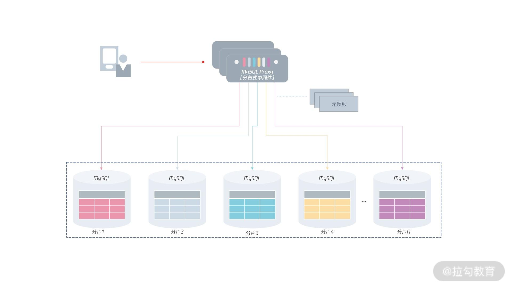

25 分布式数据库架构选型：分库分表 or 中间件 ？
===========================

前面几讲我们学习了分布式数据库的分片设计、表结构设计、索引设计等，相信你已经有能力构建一个分布式数据库系统了。

但现在数据分好了，索引也设计好了，但是如果访问这些数据和索引呢？这就是我们这一讲要讨论的话题。

访问分布式数据库有两种模式：

* 业务直接根据分库分表访问 MySQL 数据库节点；
* 根据中间件访问。

我们先来看一看业务直接访问分布式数据库的场景。

### 分库分表直接访问

在设计分片时，我们已经明确了每张表的分片键信息，所以业务或服务可以直接根据分片键对应的数据库信息，直接访问底层的 MySQL 数据节点，比如在代码里可以做类似的处理：

```
void InsertOrders(String orderKey, int userKey...) {


  


  int shard_id = userKey % 4;


  if (shard_id == 0) {


    conn = MySQLConncetion('shard1',...);


    conn.query(...);


  } else if (shard_id == 1) {


    conn = MySQLConncetion('shard2',...);


    conn.query(...);   


  } else if (shard_id == 2) {


    conn = MySQLConncetion('shard3',...);


    conn.query(...);   


  } else if (shard_id == 3) {


    conn = MySQLConncetion('shard4',...);


    conn.query(...);   


  }


}

```

从这段代码中我们可以看到，在业务代码中会嵌入分库分表的路由逻辑，在业务层计算出对应分片的信息，然后访问数据库：

* 这种处理方式的好处是与单实例数据库没有太大的不同，只是多了一次计算分片的操作，没有额外的开销，性能非常好（我听说支付宝的分布式数据库为了最求极致的性能，用的就是直接访问分片的方式）。
* 这种处理逻辑的缺点是业务需要知道分片信息，感知分片的变化。对于上面的例子，如果分片 shard1 发生变化，又或者进行了扩容，业务就需要跟着修改。

为了解决这个缺点，比较好的处理方式是使用名字服务，而不要直接通过 IP 访问分片。这样当分片发生切换，又或者扩容缩容时，业务也不需要进行很大的改动。

又因为业务比较多，需要访问分布式数据库分片逻辑的地方也比较多。所以，可以把分片信息存储在缓存中，当业务启动时，自动加载分片信息。比如，在 Memcached 或 Redis 中保存如下的分片信息，key 可以是分库分表的表名，value通过 JSON 或字典的方式存放分片信息：

```
{


  'key': 'orders',


  'shard_info' : {


    'shard_key' : 'o_custkey',


    'shard_count' : 4，


    'shard_host' : ['shard1.xxx.com','shard2.xxx.com','...']，


    ‘shard_table' : ['tpch00/orders01','tpch01/orders02','...'],


  }


}

```

如果要进行跨分片的访问，则需要业务自己处理相关逻辑。不过我们前面已经说过，分布式数据库设计要求单元化，绝大部分操作需要在一个分片中完成。如果不能，那么可能都不推荐分布数据库的改造。

总之，分库分表的直接访问方式，要求业务控制一切有关分布式数据库的操作，需要明确每个分片的具体信息，做好全流程的把控。

### 使用中间件技术

另一种比较流行的分布式数据库访问方式是通过分布式数据库中间件。数据库中间件本身模拟成一个 MySQL 数据库，通信协议也都遵循 MySQL 协议：业务之前怎么访问MySQL数据库的，就如何访问MySQL分布式数据库中间件。

这样做的优点是：业务不用关注分布式数据库中的分片信息，把它默认为一个单机数据库使用就好了。这种模式也是大部分同学认为分布式数据库该有的样子，如下面的图：



可以看到，通过分布式 MySQL 中间件，用户只需要访问中间件就行，下面的数据路由、分布式事务的实现等操作全部交由中间件完成。所以，分布式数据库中间件变成一个非常关键的核心组件。

业界比较知名的 MySQL 分布式数据库中间件产品有：ShardingShpere、DBLE、TDSQL 等。

ShardingSphere于 2020 年 4 月 16 日成为 Apache 软件基金会的顶级项目、社区熟度、功能支持较多，特别是对于分布式事务的支持，有多种选择（[ShardingSphere 官网地址](https://shardingsphere.apache.org/)）。

[DBLE](https://opensource.actionsky.com/dble/) 是由知名 MySQL 服务商爱可生公司开源的 MySQL 中间件产品，已用于四大行核心业务，完美支撑传统银行去 IOE，转型分布式架构的探索。除了中间件技术外，爱可生公司还有很多关于 MySQL 数据库、分布式数据库设计等方面的综合经验。

TDSQL MySQL 版（[TDSQL for MySQL](https://cloud.tencent.com/product/dcdb)）是腾讯打造的一款分布式数据库产品，具备强一致高可用、全球部署架构、分布式水平扩展、高性能、企业级安全等特性，同时提供智能 DBA、自动化运营、监控告警等配套设施，为客户提供完整的分布式数据库解决方案。

目前 TDSQL 已经为超过500+的政企和金融机构提供数据库的公有云及私有云服务，客户覆盖银行、保险、证券、互联网金融、计费、第三方支付、物联网、互联网+、政务等领域。TDSQL MySQL 版亦凭借其高质量的产品及服务，获得了多项国际和国家认证，得到了客户及行业的一致认可。

你要注意，使用数据库中间件虽好，但其存在一个明显的缺点，即多了一层中间层的访问，单个事务的访问耗时会有上升，对于性能敏感的业务来说，需要有这方面的意识和考虑。

重要的一点是，虽然使用分布式数据库中间件后，单个事务的耗时会有所上升，但整体的吞吐率是不变的，通过增大并发数，可以有效提升分布式数据库的整体性能。

### 如何选型

那么，选择业务直连分布式数据库？还是通过数据库中间件访问？这是一个架构选型要考虑的问题。

根据我的经验来说，对于较小业务（高峰期每秒事务不超过 1000 的业务），选择通过数据库中间件访问分布式数据库是比较优的方式。

因为这样的业务通常处于爬升期，满足业务的各项功能或许是业务的主要目标。通过分布式中间件屏蔽下面的分片信息，可以让开发同学专注于业务的开发。

另一方面，通过使用中间件提供的分布式事务就能满足简单的跨分片交易，解决分布式数据库中最难的问题。

但如果你的业务是一个海量互联网业务，中间件的瓶颈就会显现，单个事务的耗时会上升，低并发下，性能会有一定下降。而且中间件提供的 2PC 分布式事务性能就更不能满足业务的需求了。所以类似支付宝、阿里这样的业务，并没有使用分布式数据库中间件的架构，而是采用了业务直连的模式。

很多同学或许会问，如果不用数据库中间件，怎么解决 JOIN 这些问题呢？业务层去实现还是很麻烦的。的确，中间件可以完成这部分的功能。但如果真是数据量比较大，跨分片的场景，相信我，中间件也不能满足你的要求。

所以，使用分布式数据库架构是一种折中，你要学会放弃很多，从而才能得到更多。
