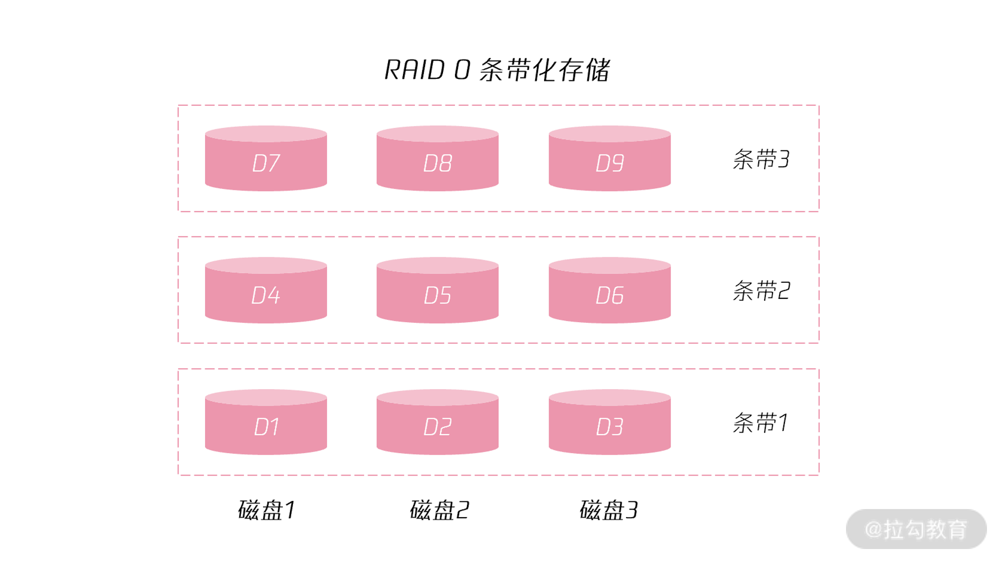
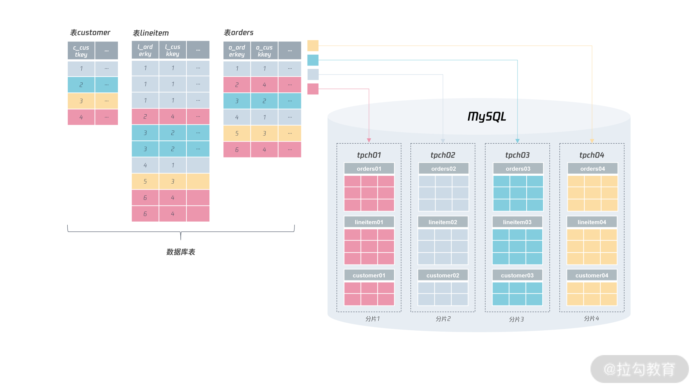
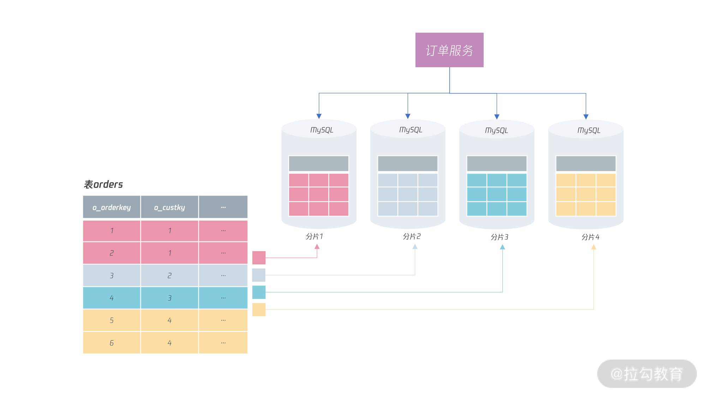
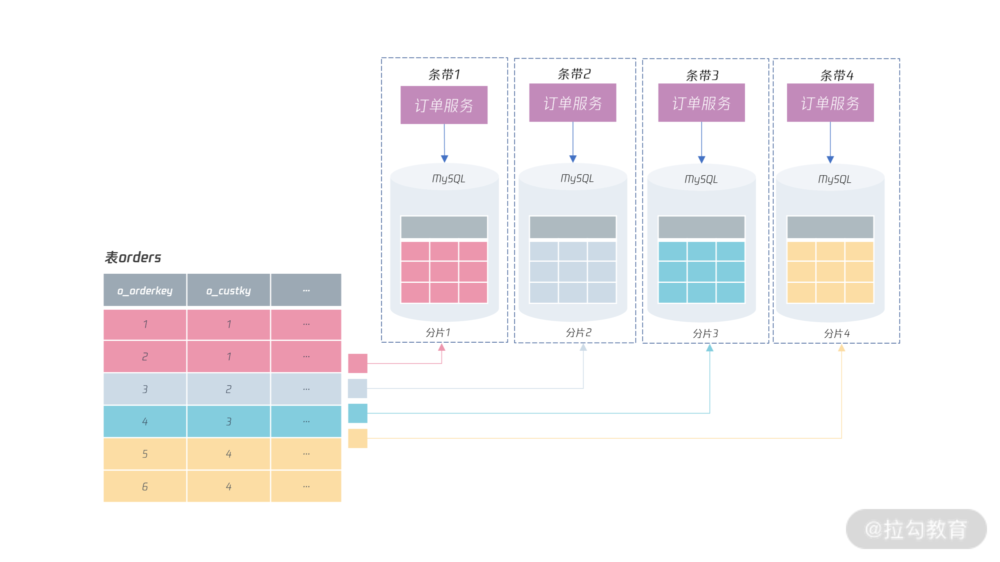
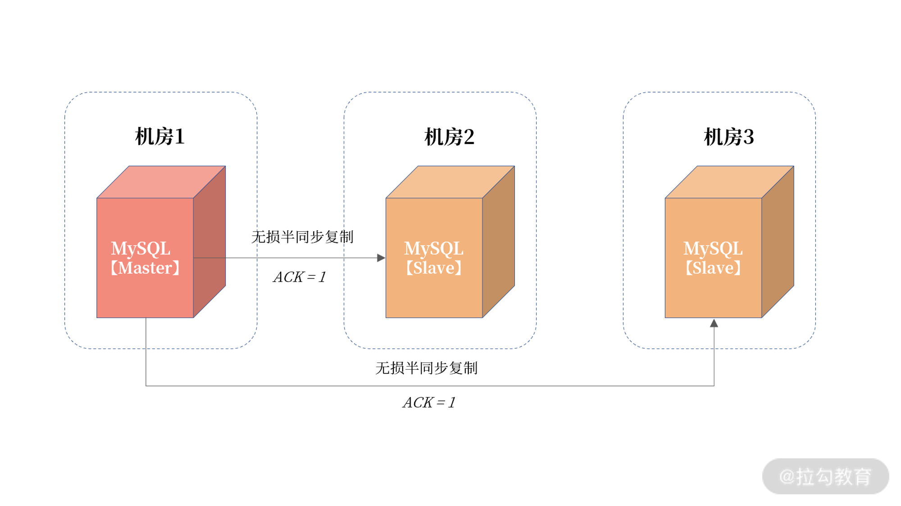
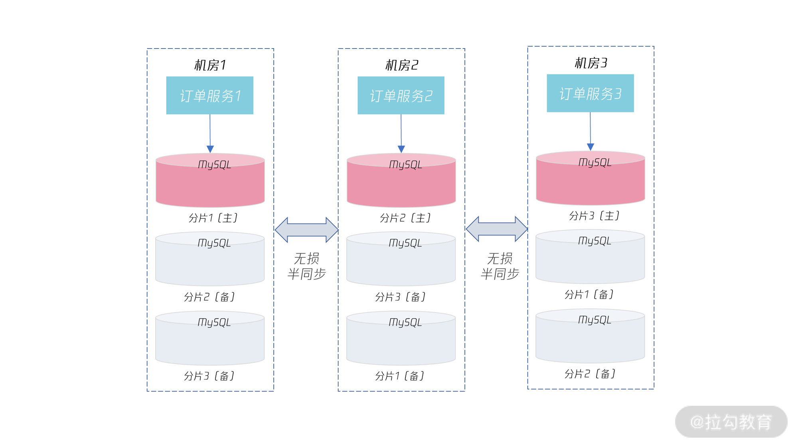

26 分布式设计之禅：全链路的条带化设计
====================

前面几讲，我们已经学习了分布式数据库架构的基本设计，完成了数据分片、表结构、索引的设计，相信学完这几讲之后，你已经基本了解分布式数据库了，也能够设计出一个分布式数据库的基础架构。

但这些远远不够，因为当我们提到分布式架构时，除了数据库要完成分布式架构的改造，业务层也要完成分布式架构的改造，最终完成条带化的设计。那什么是条带化，你又该怎么完成全链路的条带化设计呢？这就是我们今天探讨的话题。

### 什么是条带化

条带化是存储的一种技术，将磁盘进行条带化后，可以把连续的数据分割成相同大小的数据块，简单的说，条带化就是把每段数据分别写入阵列中不同磁盘上的方法。

可以看到，条带化的本质是通过将数据打散到多个磁盘，从而提升存储的整体性能， **这与分布式数据库的分片理念是不是非常类似呢** ？下图显示了 RAID0 的条带化存储：

从图中可以看到，进行 RAID 条带化后，数据存放在了三块磁盘上，分别是磁盘 1、磁盘 2、磁盘 3，存储的数据也进行了打散，分别存储在了条带 1、条带 2、条带 3 上。

这样一来，当访问某一个数据的时候，可以并行地从 3 个磁盘上取出数据，写入也可以同时写入 3 个磁盘，提升了存储的性能。

了解完条带化的基础知识之后，分布式数据库架构的“条带化”的访问情况又是怎么样的呢？

### 全链路的条带化设计

在 22 讲中，我们已经讲过分布式数据库的本质是：将数据根据某个或几个列（称之为“分片键”），然后依据预先设定的算法（分片算法）进行打散，形成一个个的分片。

更重要的是，分布式数据库中的表，要能选出一个统一的分片键，即大部分表都能根据这个分片键打散数据，这样当后续业务进行访问数据时，可以在一个分片中完成单元化的闭环操作，不用涉及跨分片的访问。

下图显示了对于 tpch 分布式架构改造后的分片效果：

从图中我们可以看到，这与我们之前所提倡的条带化的思想比较类似，即数据打散，性能得到提升，对于分布式数据库来说，分片越多，性能上限也就越高。

但是，这只是对数据库层做了条带化，没有站在全链路的角度上进行条带化设计。我们来看一个例子，假设是电商中比较重要的订单服务，并且对表 orders 进行了分布式的条带化设计：

可以看到，订单服务可以根据字段 o\_custkey 访问不同分片的数据，这也是大部分业务会进行的设计（由于服务层通常是无状态的，因此这里不考虑高可用的情况）。 **但是，这样的设计不符合全链路的条带化设计思想** 。

全链路的设计思想，要将上层服务也作为条带的一部分进行处理，也就是说，订单服务也要跟着分片进行分布式架构的改造。

所以，如果进行全链路的条带化设计，那么上面的订单服务应该设计成：

可以看到，如果要进行分布式的条带化设计时，上层业务服务也需要进行相应的分布式改造，将1个“大”订单服务层也拆分成多个“小”订单服务，其中每个订单服务访问自己分片的数据。

这样设计的好处在于：

* 安全性更好，每个服务可以校验访问用户是否本分片数据；
* 上层服务跟着数据分片进行条带化部署，业务性能更好；
* 上层服务跟着数据分片进行条带化部署，可用性更好；

第1点通常比较好理解，但是 2、3点 就不怎么好理解了。 **为什么性能也会更好呢** ？这里请你考虑一下业务的部署情况，也就是，经常听说的多活架构设计。

### 多活架构

在前面的高可用的章节中，我们已经说过，对于高可用的架构设计要做到跨机房部署，实现的方式是无损半同复制，以及最新的 MySQL Group Rreplication 技术。数据库实例通过三园区进行部署。这样，当一个机房发生宕机，可以快速切换到另一个机房。我们再来回顾下三园区的架构设计：

图中显示了通过无损半同步复制方式进行的三园区高可用架构设计，从而实现同城跨机房的切换能力。但这只是单实例 MySQL 数据库架构，如果到分布式架构呢？所有分片都是在一个机房吗？

如果所有分片都在一个机房，你会发现，这时机房 2、机房3 中的数据库都只是从机，只能进行读取操作，而无法实现写入操作，这就是我们说的单活架构。

与单活架构不同，多活架构是指不同地理位置上的系统，都能够提供业务读/写服务。这里的“活”是指实时提供读/写服务的意思，而不仅仅只是读服务。多活架构主要是为了提升系统的容灾能力，提高系统的可用性，保障业务持续可用。

要实现多活架构，首先要进行分布式数据库的改造，然后是将不同数据分片的主服务器放到不同机房，最后是实现业务条带化的部署。如下面的这张图：

可以看到，对于上一节的订单服务和订单数据分片，通过将其部署在不同的机房，使得订单服务1 部署在机房 1，可以对分片1进行读写；订单服务 2 部署在机房 1，可以对分片 2 进行读写；订单服务 3 部署在机房 3，可以对分片 3 进行读写。

这样每个机房都可以有写入流量，每个机房都是“活”的，这就是多活架构设计。

若一个机房发生宕机，如机房 1 宕机，则切换到另一个机房，上层服务和数据库跟着一起切换，切换后上层服务和数据库依然还是在一个机房，访问不用跨机房访问，依然能提供最好的性能和可用性保障。
