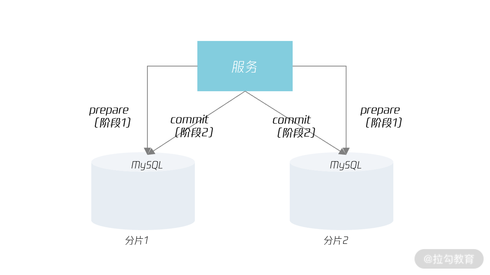
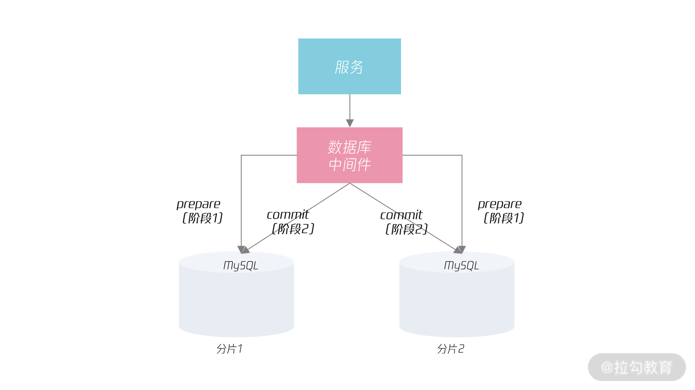
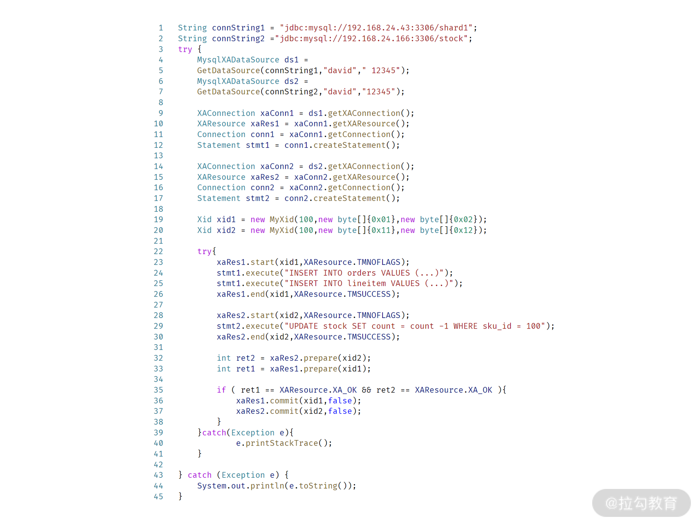
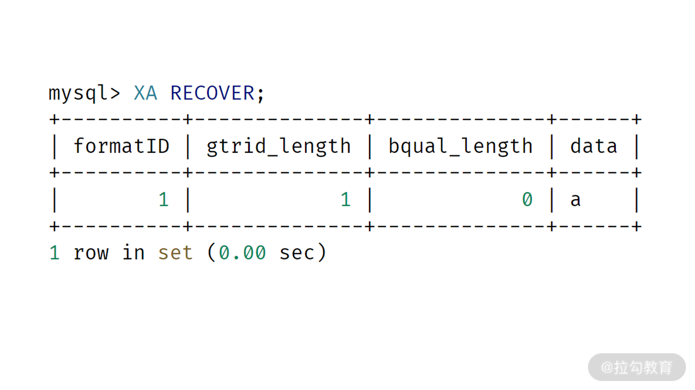
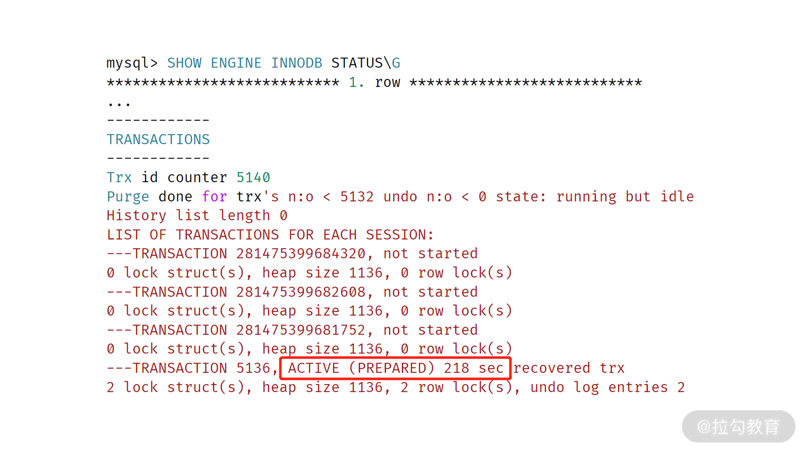
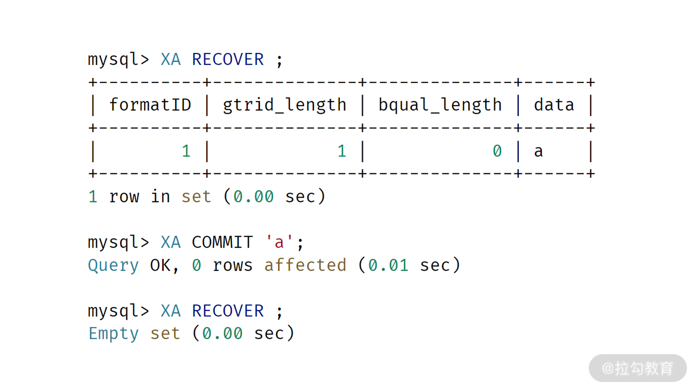

# 27 分布式事务：我们到底要不要使用 2PC？

你好，我是姜承尧，前面我们学习了分布式数据库中数据的分片设计、索引设计、中间件选型，全链路的条带化设计。但是我们一直在回避分布式数据库中最令人头疼的问题，那就是分布式事务。

今天，我们就来学习分布式事务的概念，以及如何在海量互联网业务中实现它。

### 分布式事务概念

事务的概念相信你已经非常熟悉了，事务就是要满足 ACID 的特性，总结来说。

- A（Atomicity） 原子性：事务内的操作，要么都做，要么都不做；
- C（Consistency） 一致性：事务开始之前和事务结束以后，数据的完整性没有被破坏；如唯一性约束，外键约束等；
- I（Isolation）隔离性：一个事务所做的操作对另一个事务不可见，好似是串行执行；
- D（Durability）持久性：事务提交后，数据的修改是永久的。即使发生宕机，数据也能修复；

特别需要注意的是，当前数据库的默认事务隔离级别都没有达到隔离性的要求，MySQL、Oracle、PostgreSQL等关系型数据库都是如此。大多数数据库事务隔离级别都默认设置为 READ-COMMITTED，这种事务隔离级别没有解决可重复度和幻读问题。

但由于在绝大部分业务中，都不会遇到这两种情况。若要达到完全隔离性的要求，性能往往又会比较低。因此在性能和绝对的隔离性前，大多数关系型数据库选择了一种折中。

那什么是分布式事务呢？简单来说，就是要在分布式数据库的架构下实现事务的ACID特性。

前面我们讲了分布式数据库架构设计的一个原则，即大部分的操作要能单元化。即在一个分片中完成。如对用户订单明细的查询，由于分片键都是客户ID，因此可以在一个分片中完成。那么他能满足事务的ACID特性。

但是，如果是下面的一个电商核心业务逻辑，那就无法实现在一个分片中完成，即用户购买商品，其大致逻辑如下所示：

```
START TRANSATION;
INSERT INTO orders VALUES (......);
INSERT INTO lineitem VALUES (......);
UPDATE STOCK SET COUNT = COUNT - 1 WHERE sku_id = ?
COMMIT;
```

可以看到，在分布式数据库架构下，表orders、linitem的分片键是用户ID。但是表stock是库存品，是商品维度的数据，没有用户ID的信息。因此stock的分片规则肯定与表orders和lineitem不同。

所以，上述的事务操作大部分情况下并不能在一个分片中完成单元化，因此就是一个分布式事务，它要求用户维度的表 orders、lineitem 和商品维度的表 stock 的变更，要么都完成，要么都完成不了。

常见的分布式事务的实现就是通过 2PC（two phase commit 两阶段提交）实现，接着我们来看下 2PC。

### 2PC的分布式事务实现

2PC 是数据库层面实现分布式事务的一种强一致性实现。在 2PC 中，引入事务协调者的角色用于协调管理各参与者（也可称之为各本地资源）的提交和回滚。而 2PC 所谓的两阶段是指parepare（准备）阶段和 commit（提交）两个阶段。

在 2PC 的实现中，参与者就是分钟的 MySQL 数据库实例，那事务协调者是谁呢？这取决于分布式数据库的架构。若分布式数据库的架构采用业务通过分库分表规则直连分片的话，那么事务协调者就是业务程序本身。如下图所示：



若采用数据库中间件的模式，那么事务协调者就是数据库中间件。如下图所示：



从上图可以发现，使用分布式数据库中间件后，可以对上层服务屏蔽分布式事务的实现，服务不需要关心下层的事务是本地事务还是分布式事务，就好像是单机事务本身一样。

2PC 要求第一段 prepare 的操作都成功，那么分布式事务才能提交，这样最终能够实现持久化，2PC 的代码逻辑如下所示：



上面就是 2PC 的 Java 代码实现，可以看到只有2个参与者第一阶段 prepare 都成功，那么分布式事务才能提交。

但是 2PC 的一个难点在于 prepare 都成功了，但是在进行第二阶段 commit 的时候，其中一个节点挂了。这时挂掉的那个节点在恢复后，或进行主从切换后，节点上之前执行成功的prepare 事务需要人为的接入处理，这个事务就称之为悬挂事务。

用户可以通过命令 XA_RECOVER 查看节点上事务有悬挂事务：



如果有悬挂事务，则这个事务持有的锁资源都是没有释放的。可以通过命令SHOW ENGINE INNODB STATUS 进行查看： 

从上图可以看到，事务 5136 处于 PREPARE状态，已经有 218 秒了，这就是一个悬挂事务，并且这个事务只有了两个行锁对象。

可以通过命令 XA RECOVER 人工的进行提交： 

讲到这，同学们应该都了了分布式事务的 2PC 实现和使用方法。它是一种由数据库层实现强一致事务解决方案。其优点是使用简单，当前大部分的语言都支持 2PC 的实现。若使用中间件，业务完全就不用关心事务是不是分布式的。

然而，他的缺点是，事务的提交开销变大了，从 1 次 COMMIT 变成了两次 PREPARE 和COMMIT。而对于海量的互联网业务来说，2PC 的性能是无法接受。因此，这就有了业务级的分布式事务实现，即柔性事务。

### 柔性事务

柔性事务是指分布式事务由业务层实现，通过最终一致性完成分布式事务的工作。可以说，通过牺牲了一定的一致性，达到了分布式事务的性能要求。

业界常见的柔性事务有 TCC、SAGA、SEATA 这样的框架、也可以通过消息表实现。它们实现原理本身就是通过补偿机制，实现最终的一致性。柔性事务的难点就在于对于错误逻辑的处理。

为了讲述简单，这里用消息表作为柔性事务的案例分享。对于上述电商的核心电商下单逻辑，用消息表就拆分为 3 个阶段：

```
阶段1：
START TRANSACTION;
# 订单号，订单状态
INSERT INTO orders VALUES (...) 
INSERT INTO lineitem VALUES (...)
COMMIT;
阶段2：
START TRANSACTION;
UPDATE stock SET count = count -1 WHERE sku_id = ?
# o_orderkey是消息表中的主键，具有唯一约束
INSERT INTO stock_message VALUES (o_orderkey, ... )  
COMMIT;
阶段3：
UPDATE orders SET o_orderststus = 'F' WHERE o_orderkey = ?
```

上面的柔性事务中，订单表中的列 o_orderstatus 用于记录柔性事务是否完成，初始状态都是未完成。表 stock_message 记录对应订单是否已经扣除过相应的库存。若阶段 2 完成，则柔性事务必须完成。阶段 3 就是将柔性事务设置为完成，最终一致性的确定。

接着我们来下，若阶段 2 执行失败，即执行过程中节点发生了宕机。则后台的补偿逻辑回去扫描订单表中 o_orderstatus 为未完成的超时订单有哪些，然后看一下是否在对应的表stock_message 有记录，若有，则执行阶段 3。若无，可选择告知用户下单失败。

若阶段 3 执行失败，处理逻辑与阶段 2 基本一致，只是这时 2 肯定是完成的，只需要接着执行阶段 3 即可。

所以，这里的补偿逻辑程序就是实时/定期扫描超时订单，通过消息表判断这个柔性事务是继续执行还是执行失败，执行失败又要做哪些业务处理。

上面介绍的框架实现的柔性事务原理大致如此，只不过对于补偿的逻辑处理有些不同，又或者使用上更为通用一些。

对于海量的互联网业务来说，柔性事务性能更好，因此支付宝、淘宝等互联网业务都是使用柔性事务完成分布式事务的实现。
