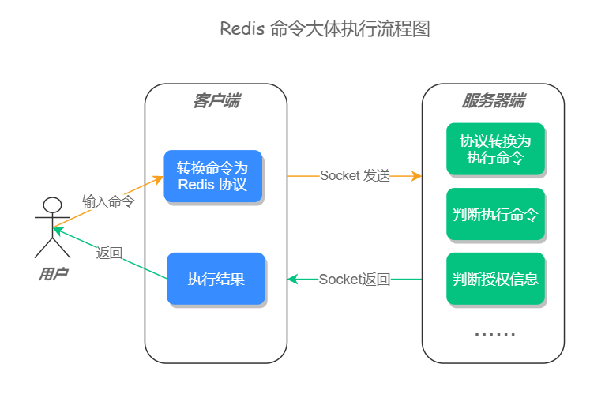
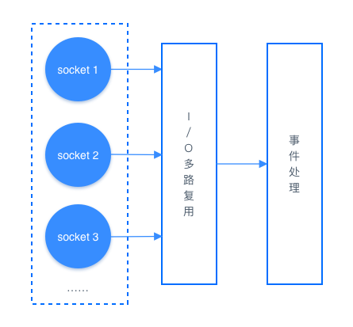
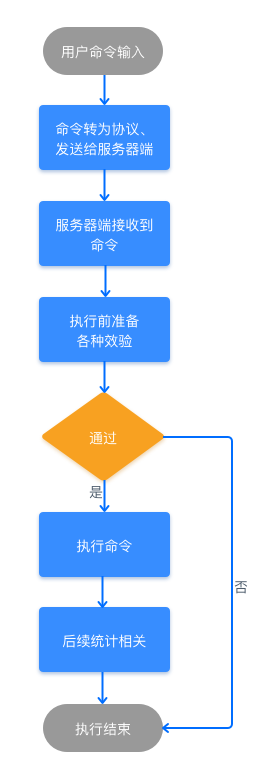

# 01 Redis 是如何执行的

在以往的面试中，当问到一些面试者：Redis 是如何执行的？收到的答案往往是：客户端发命令给服务器端，服务端收到执行之后再返回给客户端。然而对于执行细节却「避而不谈」 ，当继续追问服务器端是如何执行的？能回答上来的人更是寥寥无几，这未免让人有些遗憾，一个我们每天都在用的技术，知道原理的人却寥若晨星。

对于任何一门技术，如果你只停留在「会用」的阶段，那就很难有所成就，甚至还有被裁员和找不到工作的风险，我相信能看此篇文章的你，一定是积极上进想有所作为的人，那么借此机会，我们来深入的解一下 Redis 的执行细节。

### 命令执行流程

一条命令的执行过程有很多细节，但大体可分为：客户端先将用户输入的命令，转化为 Redis 相关的通讯协议，再用 socket 连接的方式将内容发送给服务器端，服务器端在接收到相关内容之后，先将内容转化为具体的执行命令，再判断用户授权信息和其他相关信息，当验证通过之后会执行最终命令，命令执行完之后，会进行相关的信息记录和数据统计，然后再把执行结果发送给客户端，这样一条命令的执行流程就结束了。如果是集群模式的话，主节点还会将命令同步至子节点，下面我们一起来看更加具体的执行流程。



**步骤一：用户输入一条命令 \*\*\*\* 步骤二：客户端先将命令转换成 Redis 协议，然后再通过 socket 连接发送给服务器端**

客户端和服务器端是基于 socket 通信的，服务器端在初始化时会创建了一个 socket 监听，用于监测链接客户端的 socket 链接，源码如下：

```c
void initServer(void) {
    //......
    // 开启 Socket 事件监听
    if (server.port != 0 &&
        listenToPort(server.port,server.ipfd,&server.ipfd_count) == C_ERR)
        exit(1);
    //......
}
```

> socket 小知识：每个 socket 被创建后，会分配两个缓冲区，输入缓冲区和输出缓冲区。 写入函数并不会立即向网络中传输数据，而是先将数据写入缓冲区中，再由 TCP 协议将数据从缓冲区发送到目标机器。一旦将数据写入到缓冲区，函数就可以成功返回，不管它们有没有到达目标机器，也不管它们何时被发送到网络，这些都是 TCP 协议负责的事情。 注意：数据有可能刚被写入缓冲区就发送到网络，也可能在缓冲区中不断积压，多次写入的数据被一次性发送到网络，这取决于当时的网络情况、当前线程是否空闲等诸多因素，不由程序员控制。 读取函数也是如此，它也是从输入缓冲区中读取数据，而不是直接从网络中读取。

当 socket 成功连接之后，客户端会先把命令转换成 Redis 通讯协议（RESP 协议，REdis Serialization Protocol）发送给服务器端，这个通信协议是为了保障服务器能最快速的理解命令的含义而制定的，如果没有这个通讯协议，那么 Redis 服务器端要遍历所有的空格以确认此条命令的含义，这样会加大服务器的运算量，而直接发送通讯协议，相当于把服务器端的解析工作交给了每一个客户端，这样会很大程度的提高 Redis 的运行速度。例如，当我们输入 `set key val` 命令时，客户端会把这个命令转换为 `*3\r\n$3\r\nSET\r\n$4\r\nKEY\r\n$4\r\nVAL\r\n` 协议发送给服务器端。 更多通讯协议，可访问官方文档：[https://redis.io/topics/protocol](https://redis.io/topics/protocol)

**扩展知识：I/O 多路复用**

Redis 使用的是 I/O 多路复用功能来监听多 socket 链接的，这样就可以使用一个线程链接来处理多个请求，减少线程切换带来的开销，同时也避免了 I/O 阻塞操作，从而大大提高了 Redis 的运行效率。

I/O 多路复用机制如下图所示： 

综合来说，此步骤的执行流程如下：

- 与服务器端以 socket 和 I/O 多路复用的技术建立链接；
- 将命令转换为 Redis 通讯协议，再将这些协议发送至缓冲区。

**步骤三：服务器端接收到命令 **服务器会先去输入缓冲中读取数据，然后判断数据的大小是否超过了系统设置的值(默认是 1GB)，如果大于此值就会返回错误信息，并关闭客户端连接。 默认大小如下图所示：  当数据大小验证通过之后，服务器端会对输入缓冲区中的请求命令进行分析，提取命令请求中包含的命令参数，存储在 client 对象(服务器端会为每个链接创建一个 Client 对象)的属性中。** 步骤四：执行前准备**① 判断是否为退出命令，如果是则直接返回；

② 非 null 判断，检查 client 对象是否为 null，如果是返回错误信息；

③ 获取执行命令，根据 client 对象存储的属性信息去 redisCommand 结构中查询执行命令；

④ 用户权限效验，未通过身份验证的客户端只能执行 AUTH(授权) 命令，未通过身份验证的客户端执行了 AUTH 之外的命令则返回错误信息；

⑤ 集群相关操作，如果是集群模式，把命令重定向到目标节点，如果是 master(主节点) 则不需要重定向；

⑥ 检查服务器端最大内存限制，如果服务器端开启了最大内存限制，会先检查内存大小，如果内存超过了最大值会对内存进行回收操作；

⑦ 持久化检测，检查服务器是否开启了持久化和持久化出错停止写入配置，如果开启了此配置并且有持久化失败的情况，禁止执行写命令；

⑧ 集群模式最少从节点(slave)验证，如果是集群模式并且配置了 repl_min_slaves_to_write(最小从节点写入)，当从节点的数量少于配置项时，禁止执行写命令；

⑨ 只读从节点验证，当此服务器为只读从节点时，只接受 master 的写命令；

⑩ 客户端订阅判断，当客户端正在订阅频道时，只会执行部分命令（只会执行 SUBSCRIBE、PSUBSCRIBE、UNSUBSCRIBE、PUNSUBSCRIBE，其他命令都会被拒绝）。

⑪ 从节点状态效验，当服务器为 slave 并且没有连接 master 时，只会执行状态查询相关的命令，如 info 等；

⑫ 服务器初始化效验，当服务器正在启动时，只会执行 loading 标志的命令，其他的命令都会被拒绝；

⑬ lua 脚本阻塞效验，当服务器因为执行 lua 脚本阻塞时，只会执行部分命令；

⑭ 事务命令效验，如果执行的是事务命令，则开启事务把命令放入等待队列；

⑮ 监视器 (monitor) 判断，如果服务器打开了监视器功能，那么服务器也会把执行命令和相关参数发送给监视器 (监视器是用于监控服务器运行状态的)。

当服务器经过以上操作之后，就可以执行真正的操作命令了。**步骤五：执行最终命令，调用 redisCommand 中的 proc 函数执行命令。 \*\*\*\* 步骤六：执行完后相关记录和统计 **① 检查慢查询是否开启，如果开启会记录慢查询日志； ② 检查统计信息是否开启，如果开启会记录一些统计信息，例如执行命令所耗费时长和计数器(calls)加1； ③ 检查持久化功能是否开启，如果开启则会记录持久化信息； ④ 如果有其它从服务器正在复制当前服务器，则会将刚刚执行的命令传播给其他从服务器。** 步骤七：返回结果给客户端** 命令执行完之后，服务器会通过 socket 的方式把执行结果发送给客户端，客户端再把结果展示给用户，至此一条命令的执行就结束了。

### 小结

当用户输入一条命令之后，客户端会以 socket 的方式把数据转换成 Redis 协议，并发送至服务器端，服务器端在接受到数据之后，会先将协议转换为真正的执行命令，在经过各种验证以保证命令能够正确并安全的执行，但验证处理完之后，会调用具体的方法执行此条命令，执行完成之后会进行相关的统计和记录，然后再把执行结果返回给客户端，整个执行流程，如下图所示：



更多执行细节，可在 Redis 的源码文件 `server.c` 中查看。
