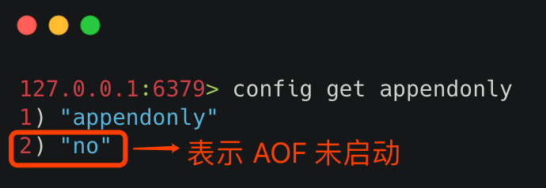
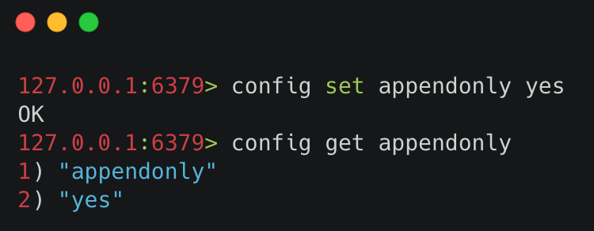
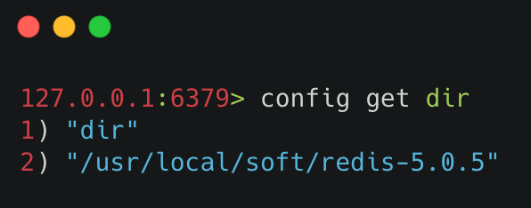
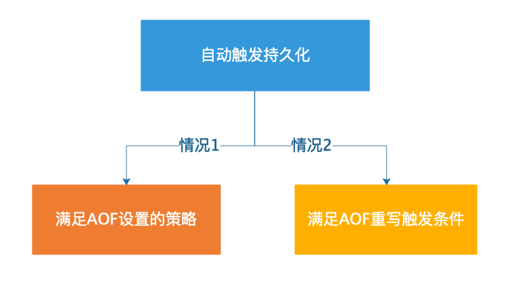
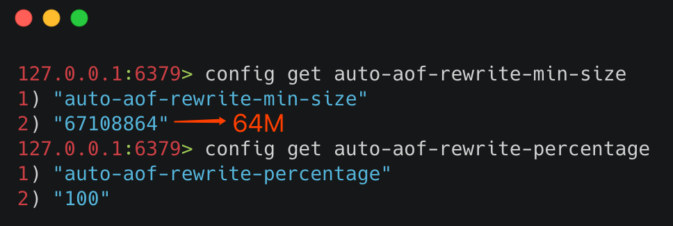

04 Redis 持久化——AOF
=================

使用 RDB 持久化有一个风险，它可能会造成最新数据丢失的风险。因为 RDB 的持久化有一定的时间间隔，在这个时间段内如果 Redis 服务意外终止的话，就会造成最新的数据全部丢失。

可能会操作 Redis 服务意外终止的条件：

* 安装 Redis 的机器停止运行，蓝屏或者系统崩溃；
* 安装 Redis 的机器出现电源故障，例如突然断电；
* 使用 `kill -9 Redis_PID` 等。

那么如何解决以上的这些问题呢？Redis 为我们提供了另一种持久化的方案——AOF。

### 1 简介

AOF（Append Only File）中文是附加到文件，顾名思义 AOF 可以把 Redis 每个键值对操作都记录到文件（appendonly.aof）中。

### 2 持久化查询和设置

#### 1）查询 AOF 启动状态

使用 `config get appendonly` 命令，如下图所示：  其中，第一行为 AOF 文件的名称，而最后一行表示 AOF 启动的状态，yes 表示已启动，no 表示未启动。

#### 2）开启 AOF 持久化

Redis 默认是关闭 AOF 持久化的，想要开启 AOF 持久化，有以下两种方式：

* 通过命令行的方式；
* 通过修改配置文件的方式（redis.conf）。

下面分别来看以上两种方式的实现。

##### ① 命令行启动 AOF

命令行启动 AOF，使用 `config set appendonly yes` 命令，如下图所示：  **命令行启动 AOF 的优缺点**：命令行启动优点是无需重启 Redis 服务，缺点是如果 Redis 服务重启，则之前使用命令行设置的配置就会失效。

##### ② 配置文件启动 AOF

Redis 的配置文件在它的根路径下的 redis.conf 文件中，获取 Redis 的根目录可以使用命令 `config get dir` 获取，如下图所示：  只需要在配置文件中设置 `appendonly yes` 即可，默认 `appendonly no` 表示关闭 AOF 持久化。**配置文件启动 AOF 的优缺点**：修改配置文件的缺点是每次修改配置文件都要重启 Redis 服务才能生效，优点是无论重启多少次 Redis 服务，配置文件中设置的配置信息都不会失效。

### 3 触发持久化

AOF 持久化开启之后，只要满足一定条件，就会触发 AOF 持久化。AOF 的触发条件分为两种：自动触发和手动触发。

#### 1）自动触发

有两种情况可以自动触发 AOF 持久化，分为是：**满足 AOF 设置的策略触发**和\*\*满足 AOF 重写触发。\*\*其中，AOF 重写触发会在本文的后半部分详细介绍，这里重点来说 AOF 持久化策略都有哪些。 AOF 持久化策略，分为以下三种：

* always：每条 Redis 操作命令都会写入磁盘，最多丢失一条数据；
* everysec：每秒钟写入一次磁盘，最多丢失一秒的数据；
* no：不设置写入磁盘的规则，根据当前操作系统来决定何时写入磁盘，Linux 默认 30s 写入一次数据至磁盘。

这三种配置可以在 Redis 的配置文件（redis.conf）中设置，如下代码所示：

```
# 开启每秒写入一次的持久化策略

appendfsync everysec


```

> 小贴士：因为每次写入磁盘都会对 Redis 的性能造成一定的影响，所以要根据用户的实际情况设置相应的策略，一般设置每秒写入一次磁盘的频率就可以满足大部分的使用场景了。

触发自动持久化的两种情况，如下图所示： 

#### 2）手动触发

在客户端执行 `bgrewriteaof` 命令就可以手动触发 AOF 持久化，如下图所示：  可以看出执行完 `bgrewriteaof` 命令之后，AOF 持久化就会被触发。

### 4 AOF 文件重写

AOF 是通过记录 Redis 的执行命令来持久化（保存）数据的，所以随着时间的流逝 AOF 文件会越来越多，这样不仅增加了服务器的存储压力，也会造成 Redis 重启速度变慢，为了解决这个问题 Redis 提供了 AOF 重写的功能。

#### 1）什么是 AOF 重写？

AOF 重写指的是它会直接读取 Redis 服务器当前的状态，并压缩保存为 AOF 文件。例如，我们增加了一个计数器，并对它做了 99 次修改，如果不做 AOF 重写的话，那么持久化文件中就会有 100 条记录执行命令的信息，而 AOF 重写之后，之后记录一条此计数器最终的结果信息，这样就去除了所有的无效信息。

#### 2）AOF 重写实现

触发 AOF 文件重写，要满足两个条件，这两个条件也是配置在 Redis 配置文件中的，它们分别：

* auto-aof-rewrite-min-size：允许 AOF 重写的最小文件容量，默认是 64mb 。
* auto-aof-rewrite-percentage：AOF 文件重写的大小比例，默认值是 100，表示 100%，也就是只有当前 AOF 文件，比最后一次（上次）的 AOF 文件大一倍时，才会启动 AOF 文件重写。

查询 auto-aof-rewrite-min-size 和 auto-aof-rewrite-percentage 的值，可使用 `config get xxx` 命令，如下图所示： 

> 小贴士：只有同时满足 auto-aof-rewrite-min-size 和 auto-aof-rewrite-percentage 设置的条件，才会触发 AOF 文件重写。

**注意**：使用 `bgrewriteaof` 命令，可以自动触发 AOF 文件重写。

#### 3）AOF 重写流程

AOF 文件重写是生成一个全新的文件，并把当前数据的最少操作命令保存到新文件上，当把所有的数据都保存至新文件之后，Redis 会交换两个文件，并把最新的持久化操作命令追加到新文件上。

### 5 配置说明

合理的设置 AOF 的配置，可以保障 Redis 高效且稳定的运行，以下是 AOF 的全部配置信息和说明。

AOF 的配置参数在 Redis 的配置文件中，也就是 Redis 根路径下的 `redis.conf` 文件中，配置参数和说明如下：

```
# 是否开启 AOF，yes 为开启，默认是关闭

appendonly no


# AOF 默认文件名

appendfilename "appendonly.aof"


# AOF 持久化策略配置

# appendfsync always

appendfsync everysec

# appendfsync no


# AOF 文件重写的大小比例，默认值是 100，表示 100%，也就是只有当前 AOF 文件，比最后一次的 AOF 文件大一倍时，才会启动 AOF 文件重写。

auto-aof-rewrite-percentage 100


# 允许 AOF 重写的最小文件容量

auto-aof-rewrite-min-size 64mb


# 是否开启启动时加载 AOF 文件效验，默认值是 yes，表示尽可能的加载 AOF 文件，忽略错误部分信息，并启动 Redis 服务。

# 如果值为 no，则表示，停止启动 Redis，用户必须手动修复 AOF 文件才能正常启动 Redis 服务。

aof-load-truncated yes


```

其中比较重要的是 appendfsync 参数，用它来设置 AOF 的持久化策略，可以选择按时间间隔或者操作次数来存储 AOF 文件，这个参数的三个值在文章开头有说明，这里就不再复述了。

### 6 数据恢复

#### 1）正常数据恢复

正常情况下，只要开启了 AOF 持久化，并且提供了正常的 appendonly.aof 文件，在 Redis 启动时就会自定加载 AOF 文件并启动，执行如下图所示：  其中 `DB loaded from append only file......` 表示 Redis 服务器在启动时，先去加载了 AOF 持久化文件。

> 小贴士：默认情况下 appendonly.aof 文件保存在 Redis 的根目录下。**持久化文件加载规则**

* 如果只开启了 AOF 持久化，Redis 启动时只会加载 AOF 文件（appendonly.aof），进行数据恢复；
* 如果只开启了 RDB 持久化，Redis 启动时只会加载 RDB 文件（dump.rdb），进行数据恢复；
* 如果同时开启了 RDB 和 AOF 持久化，Redis 启动时只会加载 AOF 文件（appendonly.aof），进行数据恢复。

在 AOF 开启的情况下，即使 AOF 文件不存在，只有 RDB 文件，也不会加载 RDB 文件。 AOF 和 RDB 的加载流程如下图所示： 

#### 2）简单异常数据恢复

在 AOF 写入文件时如果服务器崩溃，或者是 AOF 存储已满的情况下，AOF 的最后一条命令可能被截断，这就是异常的 AOF 文件。

在 AOF 文件异常的情况下，如果为修改 Redis 的配置文件，也就是使用 `aof-load-truncated` 等于 `yes` 的配置，Redis 在启动时会忽略最后一条命令，并顺利启动 Redis，执行结果如下：

```
* Reading RDB preamble from AOF file...

* Reading the remaining AOF tail...

# !!! Warning: short read while loading the AOF file !!!

# !!! Truncating the AOF at offset 439 !!!

# AOF loaded anyway because aof-load-truncated is enabled


```

#### 3）复杂异常数据恢复

AOF 文件可能出现更糟糕的情况，当 AOF 文件不仅被截断，而且中间的命令也被破坏，这个时候再启动 Redis 会提示错误信息并中止运行，错误信息如下：

```
* Reading the remaining AOF tail...

# Bad file format reading the append only file: make a backup of your AOF file, then use ./redis-check-aof --fix <filename>


```

出现此类问题的解决方案如下：

1. 首先使用 AOF 修复工具，检测出现的问题，在命令行中输入 `redis-check-aof` 命令，它会跳转到出现问题的命令行，这个时候可以尝试手动修复此文件；
2. 如果无法手动修复，我们可以使用 `redis-check-aof --fix` 自动修复 AOF 异常文件，不过执行此命令，可能会导致异常部分至文件末尾的数据全部被丢弃。

### 7 优缺点

#### AOF 优点

* AOF 持久化保存的数据更加完整，AOF 提供了三种保存策略：每次操作保存、每秒钟保存一次、跟随系统的持久化策略保存，其中每秒保存一次，从数据的安全性和性能两方面考虑是一个不错的选择，也是 AOF 默认的策略，即使发生了意外情况，最多只会丢失 1s 钟的数据；
* AOF 采用的是命令追加的写入方式，所以不会出现文件损坏的问题，即使由于某些意外原因，导致了最后操作的持久化数据写入了一半，也可以通过 redis-check-aof 工具轻松的修复；
* AOF 持久化文件，非常容易理解和解析，它是把所有 Redis 键值操作命令，以文件的方式存入了磁盘。即使不小心使用 `flushall` 命令删除了所有键值信息，只要使用 AOF 文件，删除最后的 `flushall` 命令，重启 Redis 即可恢复之前误删的数据。

#### AOF 缺点

* 对于相同的数据集来说，AOF 文件要大于 RDB 文件；
* 在 Redis 负载比较高的情况下，RDB 比 AOF 性能更好；
* RDB 使用快照的形式来持久化整个 Redis 数据，而 AOF 只是将每次执行的命令追加到 AOF 文件中，因此从理论上说，RDB 比 AOF 更健壮。

### 8 小结

AOF 保存数据更加完整，它可以记录每次 Redis 的键值变化，或者是选择每秒保存一次数据。AOF 的持久化文件更加易读，但相比与二进制的 RDB 来说，所占的存储空间也越大，为了解决这个问题，AOF 提供自动化重写机制，最大程度的减少了 AOF 占用空间大的问题。同时 AOF 也提供了很方便的异常文件恢复命令： `redis-check-aof --fix` ，为使用 AOF 提供了很好的保障。

**参考&鸣谢** [https://redis.io/topics/persistence](https://redis.io/topics/persistence) [https://blog.csdn.net/qq\_36318234/article/details/79994133](https://blog.csdn.net/qq_36318234/article/details/79994133) [https://www.cnblogs.com/wdliu/p/9377278.html](https://www.cnblogs.com/wdliu/p/9377278.html)
