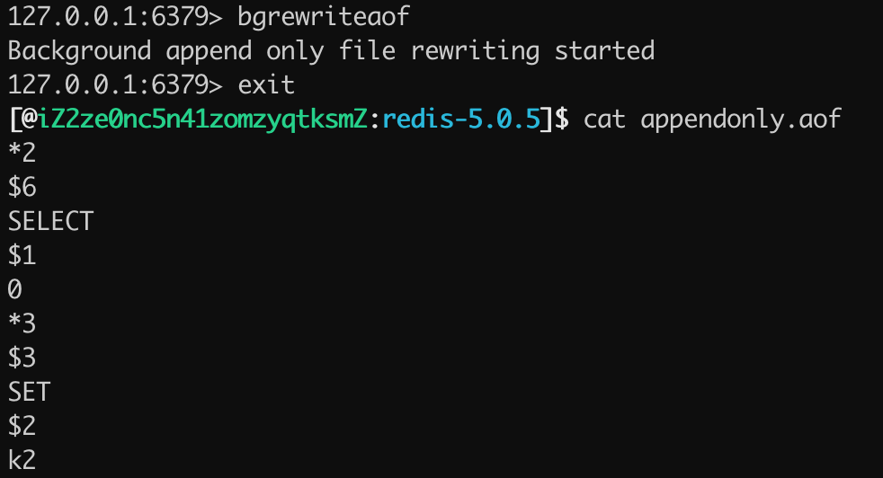

# 05 Redis 持久化——混合持久化

RDB 和 AOF 持久化各有利弊，RDB 可能会导致一定时间内的数据丢失，而 AOF 由于文件较大则会影响 Redis 的启动速度，为了能同时使用 RDB 和 AOF 各种的优点，Redis 4.0 之后新增了混合持久化的方式。

在开启混合持久化的情况下，AOF 重写时会把 Redis 的持久化数据，以 RDB 的格式写入到 AOF 文件的开头，之后的数据再以 AOF 的格式化追加的文件的末尾。

混合持久化的数据存储结构如下图所示： 

### 1 开启混合持久化

查询是否开启混合持久化可以使用 `config get aof-use-rdb-preamble` 命令，执行结果如下图所示：  其中 yes 表示已经开启混合持久化，no 表示关闭，Redis 5.0 默认值为 yes。 如果是其他版本的 Redis 首先需要检查一下，是否已经开启了混合持久化，如果关闭的情况下，可以通过以下两种方式开启：

- 通过命令行开启
- 通过修改 Redis 配置文件开启

#### 1）通过命令行开启

使用命令 `config set aof-use-rdb-preamble yes` 执行结果如下图所示： 

> 小贴士：命令行设置配置的缺点是重启 Redis 服务之后，设置的配置就会失效。

#### 2）通过修改 Redis 配置文件开启

在 Redis 的根路径下找到 redis.conf 文件，把配置文件中的 `aof-use-rdb-preamble no` 改为 `aof-use-rdb-preamble yes` 如下图所示： 

### 2 实例运行

当在混合持久化关闭的情况下，使用 `bgrewriteaof` 触发 AOF 文件重写之后，查看 appendonly.aof 文件的持久化日志，如下图所示：  可以看出，当混合持久化关闭的情况下 AOF 持久化文件存储的为标准的 AOF 格式的文件。 当混合持久化开启的模式下，使用 `bgrewriteaof` 命令触发 AOF 文件重写，得到 appendonly.aof 的文件内容如下图所示：  可以看出 appendonly.aof 文件存储的内容是 `REDIS` 开头的 RDB 格式的内容，并非为 AOF 格式的日志。

### 3 数据恢复和源码解析

混合持久化的数据恢复和 AOF 持久化过程是一样的，只需要把 appendonly.aof 放到 Redis 的根目录，在 Redis 启动时，只要开启了 AOF 持久化，Redis 就会自动加载并恢复数据。 Redis 启动信息如下图所示：  可以看出 Redis 在服务器初始化的时候加载了 AOF 文件的内容。

#### 1）混合持久化的加载流程

混合持久化的加载流程如下：

1. 判断是否开启 AOF 持久化，开启继续执行后续流程，未开启执行加载 RDB 文件的流程；
1. 判断 appendonly.aof 文件是否存在，文件存在则执行后续流程；
1. 判断 AOF 文件开头是 RDB 的格式, 先加载 RDB 内容再加载剩余的 AOF 内容；
1. 判断 AOF 文件开头不是 RDB 的格式，直接以 AOF 格式加载整个文件。

AOF 加载流程图如下图所示：  2）源码解析

Redis 判断 AOF 文件的开头是否是 RDB 格式的，是通过关键字 `REDIS` 判断的，RDB 文件的开头一定是 `REDIS` 关键字开头的，判断源码在 Redis 的 src/aof.c 中，核心代码如下所示：

```c
char sig[5]; /* "REDIS" */

if (fread(sig,1,5,fp) != 5 || memcmp(sig,"REDIS",5) != 0) {

    // AOF 文件开头非 RDB 格式，非混合持久化文件

    if (fseek(fp,0,SEEK_SET) == -1) goto readerr;

} else {

    /* RDB preamble. Pass loading the RDB functions. */

    rio rdb;


    serverLog(LL_NOTICE,"Reading RDB preamble from AOF file...");

    if (fseek(fp,0,SEEK_SET) == -1) goto readerr;

    rioInitWithFile(&rdb,fp);

    // AOF 文件开头是 RDB 格式，先加载 RDB 再加载 AOF

    if (rdbLoadRio(&rdb,NULL,1) != C_OK) {

        serverLog(LL_WARNING,"Error reading the RDB preamble of the AOF file, AOF loading aborted");

        goto readerr;

    } else {

        serverLog(LL_NOTICE,"Reading the remaining AOF tail...");

    }

}

// 加载 AOF 格式的数据


```

可以看出 Redis 是通过判断 AOF 文件的开头是否是 `REDIS` 关键字，来确定此文件是否为混合持久化文件的。

> 小贴士：AOF 格式的开头是 \*，而 RDB 格式的开头是 REDIS。

### 4 优缺点

**混合持久化优点：**

- 混合持久化结合了 RDB 和 AOF 持久化的优点，开头为 RDB 的格式，使得 Redis 可以更快的启动，同时结合 AOF 的优点，有减低了大量数据丢失的风险。

**混合持久化缺点：**

- AOF 文件中添加了 RDB 格式的内容，使得 AOF 文件的可读性变得很差；
- 兼容性差，如果开启混合持久化，那么此混合持久化 AOF 文件，就不能用在 Redis 4.0 之前版本了。

### 5 持久化最佳实践

持久化虽然保证了数据不丢失，但同时拖慢了 Redis 的运行速度，那怎么更合理的使用 Redis 的持久化功能呢？ Redis 持久化的最佳实践可从以下几个方面考虑。

#### 1）控制持久化开关

使用者可根据实际的业务情况考虑，如果对数据的丢失不敏感的情况下，可考虑关闭 Redis 的持久化，这样所以的键值操作都在内存中，就可以保证最高效率的运行 Redis 了。 持久化关闭操作：

- 关闭 RDB 持久化，使用命令： `config set save ""`
- 关闭 AOF 和 混合持久化，使用命令： `config set appendonly no`

#### 2）主从部署

使用主从部署，一台用于响应主业务，一台用于数据持久化，这样就可能让 Redis 更加高效的运行。

#### 3）使用混合持久化

混合持久化结合了 RDB 和 AOF 的优点，Redis 5.0 默认是开启的。

#### 4）使用配置更高的机器

Redis 对 CPU 的要求并不高，反而是对内存和磁盘的要求很高，因为 Redis 大部分时候都在做读写操作，使用更多的内存和更快的磁盘，对 Redis 性能的提高非常有帮助。

**参考&鸣谢** [https://redis.io/topics/persistence](https://redis.io/topics/persistence) [https://blog.csdn.net/qq_36318234/article/details/79994133](https://blog.csdn.net/qq_36318234/article/details/79994133) [https://www.cnblogs.com/wdliu/p/9377278.html](https://www.cnblogs.com/wdliu/p/9377278.html)
