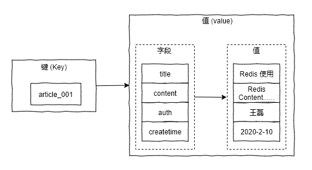
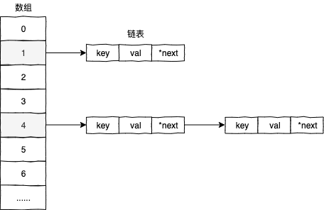
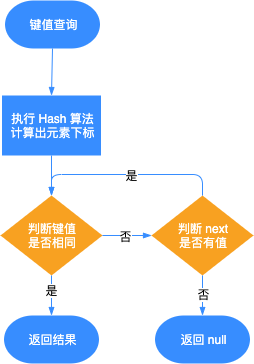

08 字典使用与内部实现原理
==============

字典类型 (Hash) 又被成为散列类型或者是哈希表类型，它是将一个键值 (key) 和一个特殊的“哈希表”关联起来，这个“哈希表”表包含两列数据：字段和值。例如我们使用字典类型来存储一篇文章的详情信息，存储结构如下图所示：  同理我们也可以使用字典类型来存储用户信息，并且使用字典类型来存储此类信息，是不需要手动序列化和反序列化数据的，所以使用起来更加的方便和高效。

### 1.基础使用

首先我们使用命令行工具 redis-cli，来对字典类型进行相关的操作。

#### 1）插入单个元素

语法：hset key field value 示例：

```shell
127.0.0.1:6379> hset myhash key1 value1

(integer) 1

127.0.0.1:6379> hset myhash key2 value2

(integer) 1


```

#### 2）当某键不存在时，插入数据

语法：hsetnx key field value 示例：

```shell
127.0.0.1:6379> hsetnx myhash k4 v4

(integer) 1

127.0.0.1:6379> hget myhash k4

"v4"


```

如果 **尝试插入已存在的键** ，不会改变原来的值，示例如下：

```shell
127.0.0.1:6379> hsetnx myhash k4 val4

(integer) 0

127.0.0.1:6379> hget myhash k4

"v4"


```

尝试修改已经存在的 k4 赋值为 val4，但并没有生效，查询 k4 的结果依然是原来的值 v4。

#### 3）查询单个元素

语法：hget key field 示例：

```shell
127.0.0.1:6379> hget myhash key1

"value1"


```

#### 4）删除 key 中的一个或多个元素

语法：hdel myhash field \[field ...\] 示例：

```shell
127.0.0.1:6379> hdel myhash key1 key2

(integer) 1


```

注意：不能使用类似于 `hdel myhash` 的命令删除整个 Hash 值的。

#### 5）某个整数值累加计算

语法：hincrby key field increment 示例：

```shell
127.0.0.1:6379> hset myhash k3 3

(integer) 1

127.0.0.1:6379> hincrby myhash k3 2

(integer) 5

127.0.0.1:6379> hget myhash k3

"5"


```

更多操作命令，详见附录部分。

### 2.代码实战

接下来我们用 Java 代码实现对 Redis 的操作，同样我们先引入 Jedis 框架 ，接下来再用代码来对字典类型进行操作，示例代码如下：

```java
import redis.clients.jedis.Jedis;

import java.util.Map;


public class HashExample {

    public static void main(String[] args) throws InterruptedException {

        Jedis jedis = new Jedis("127.0.0.1", 6379);

        // 把 Key 值定义为变量

        final String REDISKEY = "myhash";

        // 插入单个元素

        jedis.hset(REDISKEY, "key1", "value1");

        // 查询单个元素

        Map<String, String> singleMap = jedis.hgetAll(REDISKEY);

        System.out.println(singleMap.get("key1"));  // 输出：value1

        // 查询所有元素

        Map<String, String> allMap = jedis.hgetAll(REDISKEY);

        System.out.println(allMap.get("k2")); // 输出：val2

        System.out.println(allMap); // 输出：{key1=value1, k1=val1, k2=val2, k3=9.2, k4=v4...}

        // 删除单个元素

        Long delResult = jedis.hdel(REDISKEY, "key1");

        System.out.println("删除结果：" + delResult);    // 输出：删除结果：1

        // 查询单个元素

        System.out.println(jedis.hget(REDISKEY, "key1")); // 输出：返回 null

    }

}


```

从代码中可以看出，在 Jedis 中我们可以直接使用 Map 来接收 Redis 中读取的字典类型的数据，省去了手动转化的麻烦，还是比较方便的。

### 3.数据结构

字典类型本质上是由数组和链表结构组成的，来看字典类型的源码实现：

```c
typedef struct dictEntry { // dict.h

    void *key;

    union {

        void *val;

        uint64_t u64;

        int64_t s64;

        double d;

    } v;

    struct dictEntry *next; // 下一个 entry

} dictEntry;


```

字典类型的数据结构，如下图所示：



通常情况下字典类型会使用数组的方式来存储相关的数据，但发生哈希冲突时才会使用链表的结构来存储数据。

### 4.哈希冲突

字典类型的存储流程是先将键值进行 Hash 计算，得到存储键值对应的数组索引，再根据数组索引进行数据存储，但在小概率事件下可能会出完全不相同的键值进行 Hash 计算之后，得到相同的 Hash 值，这种情况我们称之为 **哈希冲突** 。

哈希冲突一般通过链表的形式解决，相同的哈希值会对应一个链表结构，每次有哈希冲突时，就把新的元素插入到链表的尾部，请参考上面数据结构的那张图。

键值查询的流程如下：

* 通过算法 (Hash，计算和取余等) 操作获得数组的索引值，根据索引值找到对应的元素；
* 判断元素和查找的键值是否相等，相等则成功返回数据，否则需要查看 next 指针是否还有对应其他元素，如果没有，则返回 null，如果有的话，重复此步骤。

键值查询流程，如下图所示：



### 5.渐进式rehash

Redis 为了保证应用的高性能运行，提供了一个重要的机制——渐进式 rehash。 渐进式 rehash 是用来保证字典缩放效率的，也就是说在字典进行扩容或者缩容是会采取渐进式 rehash 的机制。

#### 1）扩容

当元素数量等于数组长度时就会进行扩容操作，源码在 dict.c 文件中，核心代码如下：

```c
int dictExpand(dict *d, unsigned long size)

{

    /* 需要的容量小于当前容量，则不需要扩容 */

    if (dictIsRehashing(d) || d->ht[0].used > size)

        return DICT_ERR;

    dictht n; 

    unsigned long realsize = _dictNextPower(size); // 重新计算扩容后的值

    /* 计算新的扩容大小等于当前容量，不需要扩容 */

    if (realsize == d->ht[0].size) return DICT_ERR;

    /* 分配一个新的哈希表，并将所有指针初始化为NULL */

    n.size = realsize;

    n.sizemask = realsize-1;

    n.table = zcalloc(realsize*sizeof(dictEntry*));

    n.used = 0;

    if (d->ht[0].table == NULL) {

        // 第一次初始化

        d->ht[0] = n;

        return DICT_OK;

    }

    d->ht[1] = n; // 把增量输入放入新 ht[1] 中

    d->rehashidx = 0; // 非默认值 -1，表示需要进行 rehash

    return DICT_OK;

}


```

从以上源码可以看出，如果需要扩容则会申请一个新的内存地址赋值给 ht\[1\]，并把字典的 rehashindex 设置为 0，表示之后需要进行 rehash 操作。

#### 2）缩容

当字典的使用容量不足总空间的 10% 时就会触发缩容，Redis 在进行缩容时也会把 rehashindex 设置为 0，表示之后需要进行 rehash 操作。

#### 3）渐进式rehash流程

在进行渐进式 rehash 时，会同时保留两个 hash 结构，新键值对加入时会直接插入到新的 hash 结构中，并会把旧 hash 结构中的元素一点一点的移动到新的 hash 结构中，当移除完最后一个元素时，清空旧 hash 结构，主要的执行流程如下：

* 扩容或者缩容时把字典中的字段 rehashidx 标识为 0；
* 在执行定时任务或者执行客户端的 hset、hdel 等操作指令时，判断是否需要触发 rehash 操作（通过 rehashidx 标识判断），如果需要触发 rehash 操作，也就是调用 dictRehash 函数，dictRehash 函数会把 ht\[0\] 中的元素依次添加到新的 Hash 表 ht\[1\] 中；
* rehash 操作完成之后，清空 Hash 表 ht\[0\]，然后对调 ht\[1\] 和 ht\[0\] 的值，把新的数据表 ht\[1\] 更改为 ht\[0\]，然后把字典中的 rehashidx 标识为 -1，表示不需要执行 rehash 操作。

### 6.使用场景

哈希字典的典型使用场景如下：

* 商品购物车，购物车非常适合用哈希字典表示，使用人员唯一编号作为字典的 key，value 值可以存储商品的 id 和数量等信息；
* 存储用户的属性信息，使用人员唯一编号作为字典的 key，value 值为属性字段和对应的值；
* 存储文章详情页信息等。

### 7.小结

本文我们学习了字典类型的操作命令和在代码中的使用，也明白了字典类型实际是由数组和链表组成的，当字典进行扩容或者缩容时会进行渐进式 rehash 操作，渐进式 rehash 是用来保证 Redis 运行效率的，它的执行流程是同时保留两个哈希表，把旧表中的元素一点一点的移动到新表中，查询的时候会先查询两个哈希表，当所有元素都移动到新的哈希表之后，就会删除旧的哈希表。
