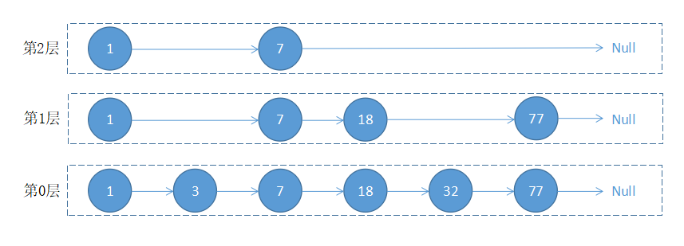

# 14 有序集合使用与内部实现原理

有序集合类型 (Sorted Set) 相比于集合类型多了一个排序属性 score（分值），对于有序集合 ZSet 来说，每个存储元素相当于有两个值组成的，一个是有序结合的元素值，一个是排序值。有序集合的存储元素值也是不能重复的，但分值是可以重复的。

当我们把学生的成绩存储在有序集合中时，它的存储结构如下图所示：


下面我们先从有序集合的使用开始说起。

### 1 基础使用

#### 1）添加一个或多个元素

语法：zadd key \[NX|XX\] \[CH\] \[INCR\] score member \[score member ...\] 示例：

```shell
127.0.0.1:6379> zadd zset1 10 java

(integer) 1

127.0.0.1:6379> zadd zset1 3 golang 4 sql 1 redis

(integer) 3


```

可以看出有序集合的添加是 `zadd 键值 分值1 元素值1 分值2 元素值2` 的形式添加的。

#### 2）查询所有元素列表

语法：zrange key start stop \[WITHSCORES\] 示例：

```shell
127.0.0.1:6379> zrange zset 0 -1

1) "redis"

2) "mysql"

3) "java"


```

其中 -1 表示最后一个元素，查询结果包含开始和结束元素。

#### 3）删除一个或多个元素(根据元素值)

语法：zrem key member \[member ...\] 示例：

```shell
127.0.0.1:6379> zrangebyscore zset1 0 -1 #查询所有元素

1) "golang"

2) "redis"

3) "sql"

4) "java"

127.0.0.1:6379> zrem zset1 redis sql #删除元素：reids、sql

(integer) 2

127.0.0.1:6379> zrange zset1 0 -1 #查询所有元素

1) "golang"

2) "java"


```

删除命令中如果包含了不存在的元素，并不会影响命令的正常执行，不存在的元素将会被忽略。

#### 4）查询某元素的 score 值

语法：zscore key member 示例：

```shell
127.0.0.1:6379> zscore zset1 redis

"1"


```

#### 5）查询 score 区间内元素

语法：zrangebyscore key min max \[WITHSCORES\] \[LIMIT offset count\] 示例：

```shell
127.0.0.1:6379> zrangebyscore zset1 3 10

1) "golang"

2) "redis"

3) "sql"

4) "java"


```

#### 6）查询某元素排名

语法：zrank key member 示例：

```shell
127.0.0.1:6379> zadd zset 5 redis 10 java 8 mysql #创建有序集合

(integer) 3

127.0.0.1:6379> zrank zset java #查询元素排序

(integer) 2

127.0.0.1:6379> zrank zset redis

(integer) 0


```

可以看出，排名是从 0 开始的，排名可以理解为元素排序后的下标值。

更多操作命令，详见附录部分。

### 2 代码实战

下面来看有序集合在 Java 中的使用，同样先添加 Jedis 框架，示例代码如下：

```java
import redis.clients.jedis.Jedis;

import java.util.HashMap;

import java.util.Map;

import java.util.Set;


public class ZSetExample {

    public static void main(String[] args) {

        Jedis jedis = new Jedis("127.0.0.1", 6379);

        Map<String, Double> map = new HashMap<>();

        map.put("小明", 80.5d);

        map.put("小红", 75d);

        map.put("老王", 85d);

        // 为有序集合(ZSet)添加元素

        jedis.zadd("grade", map);

        // 查询分数在 80 分到 100 分之间的人(包含 80 分和 100 分)

        Set<String> gradeSet = jedis.zrangeByScore("grade", 80, 100);

        System.out.println(gradeSet); // 输出：[小明, 老王]

        // 查询小红的排名(排名从 0 开始)

        System.out.println(jedis.zrank("grade", "小明")); // 输出：1

        // 从集合中移除老王

        jedis.zrem("grade", "老王");

        // 查询有序集合中的所有元素(根据排名从小到大)

        Set<String> range = jedis.zrange("grade", 0, -1);

        System.out.println(range); // 输出：[小红, 小明]

        // 查询有序集合中的所有元素(根据 score 从小到大)

        Set<String> rangeByScore = jedis.zrangeByScore("grade", 0, 100);

        System.out.println(rangeByScore);

    }

}


```

### 3 内部实现

有序集合是由 ziplist (压缩列表) 或 skiplist (跳跃表) 组成的。

#### 1）ziplist

当数据比较少时，有序集合使用的是 ziplist 存储的，如下代码所示：

```shell
127.0.0.1:6379> zadd myzset 1 db 2 redis 3 mysql

(integer) 3

127.0.0.1:6379> object encoding myzset

"ziplist"


```

从结果可以看出，有序集合把 myset 键值对存储在 ziplist 结构中了。 有序集合使用 ziplist 格式存储必须满足以下两个条件：

- 有序集合保存的元素个数要小于 128 个；
- 有序集合保存的所有元素成员的长度都必须小于 64 字节。

如果不能满足以上两个条件中的任意一个，有序集合将会使用 skiplist 结构进行存储。 接下来我们来测试以下，当有序集合中某个元素长度大于 64 字节时会发生什么情况？ 代码如下：

```shell
127.0.0.1:6379> zadd zmaxleng 1.0 redis

(integer) 1

127.0.0.1:6379> object encoding zmaxleng

"ziplist"

127.0.0.1:6379> zadd zmaxleng 2.0 aaaaaaaaaaaaaaaaaaaaaaaaaaaaaaaaaaaaaaaaaaaaaaaaaaaaaaaaaaaaaaaaa

(integer) 1

127.0.0.1:6379> object encoding zmaxleng

"skiplist"


```

通过以上代码可以看出，当有序集合保存的所有元素成员的长度大于 64 字节时，有序集合就会从 ziplist 转换成为 skiplist。

> 小贴士：可以通过配置文件中的 zset-max-ziplist-entries（默认 128）和 zset-max-ziplist-value（默认 64）来设置有序集合使用 ziplist 存储的临界值。

### 2）skiplist

skiplist 数据编码底层是使用 zset 结构实现的，而 zset 结构中包含了一个字典和一个跳跃表，源码如下：

```c
typedef struct zset {

    dict *dict;

    zskiplist *zsl;

} zset;


```

更多关于跳跃表的源码实现，会在后面的章节详细介绍。

##### ① 跳跃表实现原理

跳跃表的结构如下图所示： 

根据以上图片展示，当我们在跳跃表中查询值 32 时，执行流程如下：

- 从最上层开始找，1 比 32 小，在当前层移动到下一个节点进行比较；
- 7 比 32 小，当前层移动下一个节点比较，由于下一个节点指向 Null，所以以 7 为目标，移动到下一层继续向后比较；
- 18 小于 32，继续向后移动查找，对比 77 大于 32，以 18 为目标，移动到下一层继续向后比较；
- 对比 32 等于 32，值被顺利找到。

从上面的流程可以看出，跳跃表会想从最上层开始找起，依次向后查找，如果本层的节点大于要找的值，或者本层的节点为 Null 时，以上一个节点为目标，往下移一层继续向后查找并循环此流程，直到找到该节点并返回，如果对比到最后一个元素仍未找到，则返回 Null。

##### ② 为什么是跳跃表？而非红黑树？

因为跳跃表的性能和红黑树基本相近，但却比红黑树更好实现，所有 Redis 的有序集合会选用跳跃表来实现存储。

### 4 使用场景

有序集合的经典使用场景如下：

- 学生成绩排名
- 粉丝列表，根据关注的先后时间排序

### 5 小结

通过本文的学习我们了解到，有序集合具有唯一性和排序的功能，排序功能是借助分值字段 score 实现的，score 字段不仅可以实现排序功能，还可以实现数据的赛选与过滤的功能。我们还了解到了有序集合是由 压缩列表 (ziplist) 或跳跃列表 (skiplist) 来存储的，当元素个数小于 128 个，并且所有元素的值都小于 64 字节时，有序集合会采取 ziplist 来存储，反之则会用 skiplist 来存储，其中 skiplist 是从上往下、从前往后进行元素查找的，相比于传统的普通列表，可能会快很多，因为普通列表只能从前往后依次查找。
