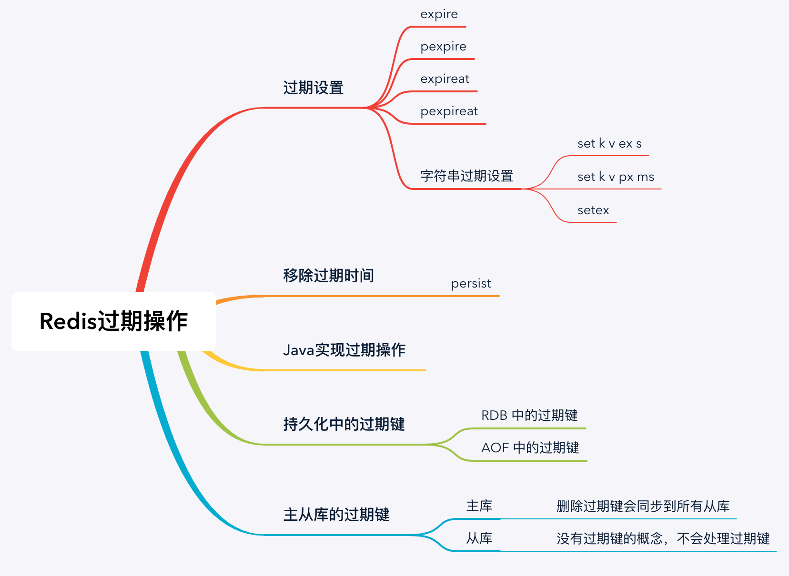

# 17 Redis 键值过期操作

### 过期设置

Redis 中设置过期时间主要通过以下四种方式：

- expire key seconds：设置 key 在 n 秒后过期；
- pexpire key milliseconds：设置 key 在 n 毫秒后过期；
- expireat key timestamp：设置 key 在某个时间戳（精确到秒）之后过期；
- pexpireat key millisecondsTimestamp：设置 key 在某个时间戳（精确到毫秒）之后过期；

下面分别来看以上这些命令的具体实现。

#### **expire：N 秒后过期**```shell

127.0.0.1:6379> set key value

OK

127.0.0.1:6379> expire key 100

(integer) 1

127.0.0.1:6379> ttl key

(integer) 97

```
其中命令 ttl 的全称是 Time To Live，表示此键值在 n 秒后过期。例如，上面的结果 97 表示 key 在 97s 后过期。
####** pexpire：N 毫秒后过期 **```shell
127.0.0.1:6379> set key2 value2

OK

127.0.0.1:6379> pexpire key2 100000

(integer) 1

127.0.0.1:6379> pttl key2

(integer) 94524
```

其中 `pexpire key2 100000` 表示设置 key2 在 100000 毫秒（100 秒）后过期。

#### **expireat：过期时间戳精确到秒**```shell

127.0.0.1:6379> set key3 value3
OK
127.0.0.1:6379> expireat key3 1573472683
(integer) 1
127.0.0.1:6379> ttl key3
(integer) 67

```

其中 `expireat key3 1573472683` 表示 key3 在时间戳 1573472683 后过期（精确到秒），使用 ttl 查询可以发现在 67s 后 key3 会过期。

> 小贴士：在 Redis 可以使用 time 命令查询当前时间的时间戳（精确到秒），示例如下：
> 
> 127.0.0.1:6379> time
> 
> 1.  "1573472563"
>     
> 2.  "248426"
>     

####** pexpireat：过期时间戳精确到毫秒 **```shell
127.0.0.1:6379> set key4 value4
OK
127.0.0.1:6379> pexpireat key4 1573472683000
(integer) 1
127.0.0.1:6379> pttl key4
(integer) 3522
```

其中 `pexpireat key4 1573472683000` 表示 key4 在时间戳 1573472683000 后过期（精确到毫秒），使用 ttl 查询可以发现在 3522ms 后 key4 会过期。

#### **字符串中的过期操作**

字符串中几个直接操作过期时间的方法，如下列表：

- set key value ex seconds：设置键值对的同时指定过期时间（精确到秒）；
- set key value px milliseconds：设置键值对的同时指定过期时间（精确到毫秒）；
- setex key seconds valule：设置键值对的同时指定过期时间（精确到秒）。

实现示例如下。

**1. set key value ex seconds**```shell
127.0.0.1:6379> set k v ex 100

OK

127.0.0.1:6379> ttl k

(integer) 97

`** 2\. set key value ex milliseconds **`shell
127.0.0.1:6379> set k2 v2 px 100000

OK

127.0.0.1:6379> pttl k2

(integer) 92483

`** 3\. setex key seconds valule **`shell
127.0.0.1:6379> setex k3 100 v3

OK

127.0.0.1:6379> ttl k3

(integer) 91

```
### 移除过期时间
使用命令： `persist key` 可以移除键值的过期时间，如下代码所示。
```shell
127.0.0.1:6379> ttl k3

(integer) 97

127.0.0.1:6379> persist k3

(integer) 1

127.0.0.1:6379> ttl k3

(integer) -1
```

可以看出第一次使用 ttl 查询 k3 会在 97s 后过期，当使用了 persist 命令之后，在查询 k3 的存活时间发现结果是 -1，它表示 k3 永不过期。

### Java实现过期操作

本文将使用 Jedis 框架来实现对 Redis 过期时间的操作，如下代码所示：

```java
public class TTLTest {

    public static void main(String[] args) throws InterruptedException {

        // 创建 Redis 连接

        Jedis jedis = new Jedis("xxx.xxx.xxx.xxx", 6379);

        // 设置 Redis 密码(如果没有密码，此行可省略)

        jedis.auth("xxx");

        // 存储键值对（默认情况下永不过期）

        jedis.set("k", "v");

        // 查询 TTL（过期时间）

        Long ttl = jedis.ttl("k");

        // 打印过期日志

        System.out.println("过期时间：" + ttl);

        // 设置 100s 后过期

        jedis.expire("k", 100);

        // 等待 1s 后执行

        Thread.sleep(1000);

        // 打印过期日志

        System.out.println("执行 expire 后的 TTL=" + jedis.ttl("k"));

    }

}
```

程序的执行结果为：

```
过期时间：-1

执行 expire 后的 TTL=99
```

可以看出使用 Jedis 来操作 Redis 的过期时间还是很方便的，可直接使用 `jedis.ttl("k")` 查询键值的生存时间，使用 `jedis.expire("k",seconds)` 方法设置过期时间（精确到秒）。

> 小贴士：使用 Jedis 之前，先要把 Jedis 引入到程序中，如果使用的是 Maven 项目的，直接在 pom.xml 文件中添加以下引用：

```java
<!-- https://mvnrepository.com/artifact/redis.clients/jedis -->

<dependency>

    <groupId>redis.clients</groupId>

    <artifactId>jedis</artifactId>

    <version>version</version>

</dependency>
```** 更多过期操作方法**，如下列表：
*   pexpire(String key, long milliseconds)：设置 n 毫秒后过期；
*   expireAt(String key, long unixTime)：设置某个时间戳后过期（精确到秒）；
*   pexpireAt(String key, long millisecondsTimestamp)：设置某个时间戳后过期（精确到毫秒）；
*   persist(String key)：移除过期时间。
完整示例代码如下：
```java
public class TTLTest {

    public static void main(String[] args) throws InterruptedException {

        // 创建 Redis 连接

        Jedis jedis = new Jedis("xxx.xxx.xxx.xxx", 6379);

        // 设置 Redis 密码(如果没有密码，此行可省略)

        jedis.auth("xxx");

        // 存储键值对（默认情况下永不过期）

        jedis.set("k", "v");

        // 查询 TTL（过期时间）

        Long ttl = jedis.ttl("k");

        // 打印过期日志

        System.out.println("过期时间：" + ttl);

        // 设置 100s 后过期

        jedis.expire("k", 100);

        // 等待 1s 后执行

        Thread.sleep(1000);

        // 打印过期日志

        System.out.println("执行 expire 后的 TTL=" + jedis.ttl("k"));

        // 设置 n 毫秒后过期

        jedis.pexpire("k", 100000);

        // 设置某个时间戳后过期（精确到秒）

        jedis.expireAt("k", 1573468990);

        // 设置某个时间戳后过期（精确到毫秒）

        jedis.pexpireAt("k", 1573468990000L);

        // 移除过期时间

        jedis.persist("k");

    }

}
```

### 持久化中的过期键

上面我们讲了过期键在 Redis 正常运行中一些使用案例，接下来，我们来看 Redis 在持久化的过程中是如何处理过期键的。
Redis 持久化文件有两种格式：RDB（Redis Database）和 AOF（Append Only File），下面我们分别来看过期键在这两种格式中的呈现状态。

#### **RDB 中的过期键 **RDB 文件分为两个阶段，RDB 文件生成阶段和加载阶段。** 1. RDB 文件生成 **从内存状态持久化成 RDB（文件）的时候，会对 key 进行过期检查，过期的键不会被保存到新的 RDB 文件中，因此 Redis 中的过期键不会对生成新 RDB 文件产生任何影响。** 2. RDB 文件加载**

RDB 加载分为以下两种情况：

- 如果 Redis 是主服务器运行模式的话，在载入 RDB 文件时，程序会对文件中保存的键进行检查，过期键不会被载入到数据库中。所以过期键不会对载入 RDB 文件的主服务器造成影响；
- 如果 Redis 是从服务器运行模式的话，在载入 RDB 文件时，不论键是否过期都会被载入到数据库中。但由于主从服务器在进行数据同步时，从服务器的数据会被清空。所以一般来说，过期键对载入 RDB 文件的从服务器也不会造成影响。
  RDB 文件加载的源码可以在 rdb.c 文件的 rdbLoad() 函数中找到，源码所示：

```c
/* Check if the key already expired. This function is used when loading

* an RDB file from disk, either at startup, or when an RDB was

* received from the master. In the latter case, the master is

* responsible for key expiry. If we would expire keys here, the

* snapshot taken by the master may not be reflected on the slave. 

*

* 如果服务器为主节点的话，

* 那么在键已经过期的时候，不再将它们关联到数据库中去

*/

if (server.masterhost == NULL && expiretime != -1 && expiretime < now) {

    decrRefCount(key);

    decrRefCount(val);

    // 跳过

    continue;

}
```

#### **AOF 中的过期键 \*\*\*\* 1. AOF 文件写入 **当 Redis 以 AOF 模式持久化时，如果数据库某个过期键还没被删除，那么 AOF 文件会保留此过期键，当此过期键被删除后，Redis 会向 AOF 文件追加一条 DEL 命令来显式地删除该键值。** 2. AOF 重写**

执行 AOF 重写时，会对 Redis 中的键值对进行检查已过期的键不会被保存到重写后的 AOF 文件中，因此不会对 AOF 重写造成任何影响。

### 主从库的过期键

当 Redis 运行在主从模式下时，从库不会进行过期扫描，从库对过期的处理是被动的。也就是即使从库中的 key 过期了，如果有客户端访问从库时，依然可以得到 key 对应的值，像未过期的键值对一样返回。

从库的过期键处理依靠主服务器控制，主库在 key 到期时，会在 AOF 文件里增加一条 del 指令，同步到所有的从库，从库通过执行这条 del 指令来删除过期的 key。

### 小结

本文我们知道了 Redis 中的四种设置过期时间的方式：expire、pexpire、expireat、pexpireat，其中比较常用的是 expire 设置键值 n 秒后过期。

字符串中可以在添加键值的同时设置过期时间，并可以使用 persist 命令移除过期时间。同时我们也知道了过期键在 RDB 写入和 AOF 重写时都不会被记录。

过期键在主从模式下，从库对过期键的处理要完全依靠主库，主库删除过期键之后会发送 del 命令给所有的从库。

本文的知识点，如下图所示：


