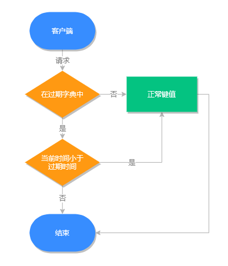
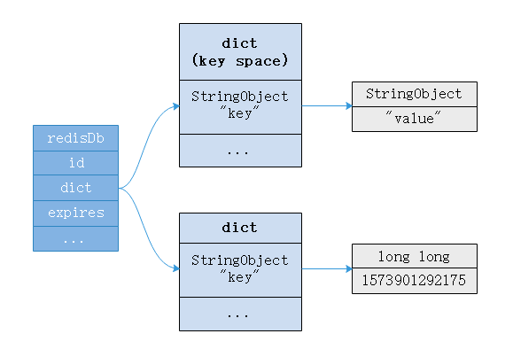
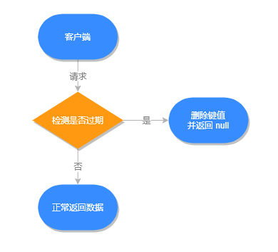
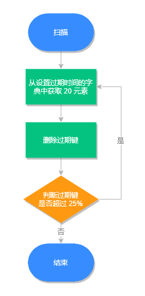

# 18 Redis 过期策略与源码分析

在 Redis 中我们可以给一些元素设置过期时间，那当它过期之后 Redis 是如何处理这些过期键呢？

### 过期键执行流程

Redis 之所以能知道那些键值过期，是因为在 Redis 中维护了一个字典，存储了所有设置了过期时间的键值，我们称之为过期字典。

过期键判断流程如下图所示：



### 过期键源码分析

过期键存储在 redisDb 结构中，源代码在 src/server.h 文件中：

```c
/* Redis database representation. There are multiple databases identified

 * by integers from 0 (the default database) up to the max configured

 * database. The database number is the 'id' field in the structure. */

typedef struct redisDb {

    dict *dict;                 /* 数据库键空间，存放着所有的键值对 */

    dict *expires;              /* 键的过期时间 */

    dict *blocking_keys;        /* Keys with clients waiting for data (BLPOP)*/

    dict *ready_keys;           /* Blocked keys that received a PUSH */

    dict *watched_keys;         /* WATCHED keys for MULTI/EXEC CAS */

    int id;                     /* Database ID */

    long long avg_ttl;          /* Average TTL, just for stats */

    list *defrag_later;         /* List of key names to attempt to defrag one by one, gradually. */

} redisDb;


```

> 小贴士：本文的所有源码都是基于 Redis 5。

过期键数据结构如下图所示：



### 过期策略

Redis 会删除已过期的键值，以此来减少 Redis 的空间占用，但因为 Redis 本身是单线的，如果因为删除操作而影响主业务的执行就得不偿失了，为此 Redis 需要制定多个（过期）删除策略来保证糟糕的事情不会发生。

常见的过期策略有以下三种：

- 定时删除
- 惰性删除
- 定期删除

下面分别来看每种策略有何不同。

#### **定时删除**

在设置键值过期时间时，创建一个定时事件，当过期时间到达时，由事件处理器自动执行键的删除操作。

- \*\*优点：\*\*保证内存可以被尽快地释放。
- \*\*缺点：\*\*在 Redis 高负载的情况下或有大量过期键需要同时处理时，会造成 Redis 服务器卡顿，影响主业务执行。

#### **惰性删除**

不主动删除过期键，每次从数据库获取键值时判断是否过期，如果过期则删除键值，并返回 null。

- \*\*优点：\*\*因为每次访问时，才会判断过期键，所以此策略只会使用很少的系统资源。
- \*\*缺点：\*\*系统占用空间删除不及时，导致空间利用率降低，造成了一定的空间浪费。

**源码解析**

惰性删除的源码位于 src/db.c 文件的 expireIfNeeded 方法中，源码如下：

```c
int expireIfNeeded(redisDb *db, robj *key) {

    // 判断键是否过期

    if (!keyIsExpired(db,key)) return 0;

    if (server.masterhost != NULL) return 1;

    /* 删除过期键 */

    // 增加过期键个数

    server.stat_expiredkeys++;

    // 传播键过期的消息

    propagateExpire(db,key,server.lazyfree_lazy_expire);

    notifyKeyspaceEvent(NOTIFY_EXPIRED,

        "expired",key,db->id);

    // server.lazyfree_lazy_expire 为 1 表示异步删除（懒空间释放），反之同步删除

    return server.lazyfree_lazy_expire ? dbAsyncDelete(db,key) :

                                         dbSyncDelete(db,key);

}

// 判断键是否过期

int keyIsExpired(redisDb *db, robj *key) {

    mstime_t when = getExpire(db,key);

    if (when < 0) return 0; /* No expire for this key */

    /* Don't expire anything while loading. It will be done later. */

    if (server.loading) return 0;

    mstime_t now = server.lua_caller ? server.lua_time_start : mstime();

    return now > when;

}

// 获取键的过期时间

long long getExpire(redisDb *db, robj *key) {

    dictEntry *de;

    /* No expire? return ASAP */

    if (dictSize(db->expires) == 0 ||

       (de = dictFind(db->expires,key->ptr)) == NULL) return -1;

    /* The entry was found in the expire dict, this means it should also

     * be present in the main dict (safety check). */

    serverAssertWithInfo(NULL,key,dictFind(db->dict,key->ptr) != NULL);

    return dictGetSignedIntegerVal(de);

}


```

所有对数据库的读写命令在执行之前，都会调用 expireIfNeeded 方法判断键值是否过期，过期则会从数据库中删除，反之则不做任何处理。

惰性删除执行流程，如下图所示：



#### **定期删除**每隔一段时间检查一次数据库，随机删除一些过期键

Redis 默认每秒进行 10 次过期扫描，此配置可通过 Redis 的配置文件 redis.conf 进行配置，配置键为 hz 它的默认值是 `hz 10`。

需要注意的是：Redis 每次扫描并不是遍历过期字典中的所有键，而是采用随机抽取判断并删除过期键的形式执行的。**定期删除流程**

1. 从过期字典中随机取出 20 个键；
1. 删除这 20 个键中过期的键；
1. 如果过期 key 的比例超过 25%，重复步骤 1。

同时为了保证过期扫描不会出现循环过度，导致线程卡死现象，算法还增加了扫描时间的上限，默认不会超过 25ms。

定期删除执行流程，如下图所示：



- \*\*优点：\*\*通过限制删除操作的时长和频率，来减少删除操作对 Redis 主业务的影响，同时也能删除一部分过期的数据减少了过期键对空间的无效占用。
- \*\*缺点：\*\*内存清理方面没有定时删除效果好，同时没有惰性删除使用的系统资源少。

**源码解析**

定期删除的核心源码在 src/expire.c 文件下的 activeExpireCycle 方法中，源码如下：

```c
void activeExpireCycle(int type) {

    static unsigned int current_db = 0; /* 上次定期删除遍历到的数据库ID */

    static int timelimit_exit = 0;      /* Time limit hit in previous call? */

    static long long last_fast_cycle = 0; /* 上一次执行快速定期删除的时间点 */

    int j, iteration = 0;

    int dbs_per_call = CRON_DBS_PER_CALL; // 每次定期删除，遍历的数据库的数量

    long long start = ustime(), timelimit, elapsed;

    if (clientsArePaused()) return;

    if (type == ACTIVE_EXPIRE_CYCLE_FAST) {

        if (!timelimit_exit) return;

        // ACTIVE_EXPIRE_CYCLE_FAST_DURATION 是快速定期删除的执行时长

        if (start < last_fast_cycle + ACTIVE_EXPIRE_CYCLE_FAST_DURATION*2) return;

        last_fast_cycle = start;

    }

    if (dbs_per_call > server.dbnum || timelimit_exit)

        dbs_per_call = server.dbnum;

    // 慢速定期删除的执行时长

    timelimit = 1000000*ACTIVE_EXPIRE_CYCLE_SLOW_TIME_PERC/server.hz/100;

    timelimit_exit = 0;

    if (timelimit <= 0) timelimit = 1;

    if (type == ACTIVE_EXPIRE_CYCLE_FAST)

        timelimit = ACTIVE_EXPIRE_CYCLE_FAST_DURATION; /* 删除操作的执行时长 */

    long total_sampled = 0;

    long total_expired = 0;

    for (j = 0; j < dbs_per_call && timelimit_exit == 0; j++) {

        int expired;

        redisDb *db = server.db+(current_db % server.dbnum);

        current_db++;

        do {

            // .......

            expired = 0;

            ttl_sum = 0;

            ttl_samples = 0;

            // 每个数据库中检查的键的数量

            if (num > ACTIVE_EXPIRE_CYCLE_LOOKUPS_PER_LOOP)

                num = ACTIVE_EXPIRE_CYCLE_LOOKUPS_PER_LOOP;

            // 从数据库中随机选取 num 个键进行检查

            while (num--) {

                dictEntry *de;

                long long ttl;

                if ((de = dictGetRandomKey(db->expires)) == NULL) break;

                ttl = dictGetSignedInteger

                // 过期检查，并对过期键进行删除

                if (activeExpireCycleTryExpire(db,de,now)) expired++;

                if (ttl > 0) {

                    /* We want the average TTL of keys yet not expired. */

                    ttl_sum += ttl;

                    ttl_samples++;

                }

                total_sampled++;

            }

            total_expired += expired;

            if (ttl_samples) {

                long long avg_ttl = ttl_sum/ttl_samples;

                if (db->avg_ttl == 0) db->avg_ttl = avg_ttl;

                db->avg_ttl = (db->avg_ttl/50)*49 + (avg_ttl/50);

            }

            if ((iteration & 0xf) == 0) { /* check once every 16 iterations. */

                elapsed = ustime()-start;

                if (elapsed > timelimit) {

                    timelimit_exit = 1;

                    server.stat_expired_time_cap_reached_count++;

                    break;

                }

            }

            /* 每次检查只删除 ACTIVE_EXPIRE_CYCLE_LOOKUPS_PER_LOOP/4 个过期键 */

        } while (expired > ACTIVE_EXPIRE_CYCLE_LOOKUPS_PER_LOOP/4);

    }

    // .......

}


```

activeExpireCycle 方法在规定的时间，分多次遍历各个数据库，从过期字典中随机检查一部分过期键的过期时间，删除其中的过期键。

这个函数有两种执行模式，一个是快速模式一个是慢速模式，体现是代码中的 timelimit 变量，这个变量是用来约束此函数的运行时间的。快速模式下 timelimit 的值是固定的，等于预定义常量 ACTIVE_EXPIRE_CYCLE_FAST_DURATION，慢速模式下，这个变量的值是通过 1000000\*ACTIVE_EXPIRE_CYCLE_SLOW_TIME_PERC/server.hz/100 计算的。

#### **Redis 使用的过期策略**

Redis 使用的是惰性删除加定期删除的过期策略。

### 小结

通过本文可知 Redis 是通过设置过期字典的形式来判断过期键的，Redis 采用的是惰性删除和定期删除的形式删除过期键的，Redis 的定期删除策略并不会遍历删除每个过期键，而是采用随机抽取的方式删除过期键，同时为了保证过期扫描不影响 Redis 主业务，Redis 的定期删除策略中还提供了最大执行时间，以保证 Redis 正常并高效地运行。
