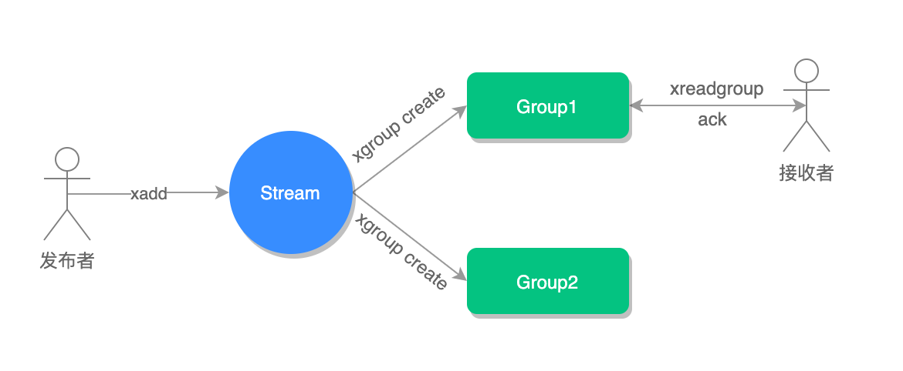

# 27 消息队列终极解决方案——Stream（下）

在开始使用消息分组之前，我们必须手动创建分组才行，以下是几个和 Stream 分组有关的命令，我们先来学习一下它的使用。

### 消息分组命令

#### **创建消费者群组**

```shell
127.0.0.1:6379> xgroup create mq group1 0-0 
OK
```

相关语法：

```
xgroup create stream-key group-key ID
```

其中：

- mq 为 Stream 的 key；
- group1 为分组的名称；
- 0-0 表示从第一条消息开始读取。

如果要从当前最后一条消息向后读取，使用 `$` 即可，命令如下：

```shell
127.0.0.1:6379> xgroup create mq group2 $
OK
```

#### **读取消息**

```shell
127.0.0.1:6379> xreadgroup group group1 c1 count 1 streams mq >
1) 1) "mq"
   2) 1) 1) "1580959593553-0"
         2) 1) "name"
            2) "redis"
            3) "age"
            4) "10"
```

相关语法：

```
xreadgroup group group-key consumer-key streams stream-key
```

其中：

- `>` 表示读取下一条消息；
- group1 表示分组名称；
- c1 表示 consumer（消费者）名称。

xreadgroup 命令和 xread 使用类似，也可以设置阻塞读取，命令如下：

```shell
127.0.0.1:6379> xreadgroup group group1 c2 streams mq >
1) 1) "mq"
   2) 1) 1) "1580959606181-0"
         2) 1) "name"
            2) "java"
            3) "age"
            4) "20"
127.0.0.1:6379> xreadgroup group group1 c2 streams mq >
(nil) #队列中的消息已经被读取完
127.0.0.1:6379> xreadgroup group group1 c1 count 1 block 0 streams mq > #阻塞读取
```

此时打开另一个命令行创建使用 xadd 添加一条消息，阻塞命令执行结果如下：

```shell
127.0.0.1:6379> xreadgroup group group1 c1 count 1 block 0 streams mq >
1) 1) "mq"
   2) 1) 1) "1580961475368-0"
         2) 1) "name"
            2) "sql"
            3) "age"
            4) "20"
(86.14s)
```

#### **消息消费确认**接收到消息之后，我们要手动确认一下（ack），命令如下

```shell
127.0.0.1:6379> xack mq group1 1580959593553-0
(integer) 1
```

相关语法：

```
xack key group-key ID [ID ...]
```

消费确认增加了消息的可靠性，一般在业务处理完成之后，需要执行 ack 确认消息已经被消费完成，整个流程的执行如下图所示：



#### **查询未确认的消费队列**\`\`\`shell

127.0.0.1:6379> xpending mq group1

1. (integer) 1 #未确认（ack）的消息数量为 1 条

1. "1580994063971-0"

1. "1580994063971-0"

1. 1. 1. "c1"

      1. "1"

127.0.0.1:6379> xack  mq group1 1580994063971-0 #消费确认

(integer) 1

127.0.0.1:6379> xpending mq group1

1. (integer) 0 #没有未确认的消息

1. (nil)

1. (nil)

1. (nil)

````
####** xinfo 查询相关命令 **** 1\. 查询流信息 **```shell
127.0.0.1:6379> xinfo stream mq

 1) "length"

 2) (integer) 2 #队列中有两个消息

 3) "radix-tree-keys"

 4) (integer) 1

 5) "radix-tree-nodes"

 6) (integer) 2

 7) "groups"

 8) (integer) 1 #一个消费分组

 9) "last-generated-id"

10) "1580959606181-0"

11) "first-entry"

12) 1) "1580959593553-0"

    2) 1) "name"

       2) "redis"

       3) "age"

       4) "10"

13) "last-entry"

14) 1) "1580959606181-0"

    2) 1) "name"

       2) "java"

       3) "age"

       4) "20"

````

相关语法：

````
xinfo stream stream-key

```** 2\. 查询消费组消息 **```shell
127.0.0.1:6379> xinfo groups mq

1) 1) "name"

   2) "group1" #消息分组名称

   3) "consumers"

   4) (integer) 1 #一个消费者客户端

   5) "pending"

   6) (integer) 1 #一个未确认消息

   7) "last-delivered-id"

   8) "1580959593553-0" #读取的最后一条消息 ID

````

相关语法：

````
xinfo groups stream-key

```** 3\. 查看消费者组成员信息 **```shell
127.0.0.1:6379> xinfo consumers mq group1

1) 1) "name"

   2) "c1" #消费者名称

   3) "pending"

   4) (integer) 0 #未确认消息

   5) "idle"

   6) (integer) 481855

````

相关语法：

```
xinfo consumers stream group-key

```

#### **删除消费者**\`\`\`shell

127.0.0.1:6379> xgroup delconsumer mq group1 c1
(integer) 1

```

相关语法：

```

xgroup delconsumer stream-key group-key consumer-key

````

####** 删除消费组**

```shell
127.0.0.1:6379> xgroup destroy mq group1
(integer) 1
````

相关语法：

```
xgroup destroy stream-key group-key
```

### 代码实战

接下来我们使用 Jedis 来实现 Stream 分组消息队列，代码如下：

```java
import com.google.gson.Gson;
import redis.clients.jedis.Jedis;
import redis.clients.jedis.StreamEntry;
import redis.clients.jedis.StreamEntryID;
import utils.JedisUtils;
import java.util.AbstractMap;
import java.util.HashMap;
import java.util.List;
import java.util.Map;
public class StreamGroupExample {
    private static final String _STREAM_KEY = "mq"; // 流 key
    private static final String _GROUP_NAME = "g1"; // 分组名称
    private static final String _CONSUMER_NAME = "c1"; // 消费者 1 的名称
    private static final String _CONSUMER2_NAME = "c2"; // 消费者 2 的名称
    public static void main(String[] args) {
        // 生产者
        producer();
        // 创建消费组
        createGroup(_STREAM_KEY, _GROUP_NAME);
        // 消费者 1
        new Thread(() -> consumer()).start();
        // 消费者 2
        new Thread(() -> consumer2()).start();
    }
    /**
     * 创建消费分组
     * @param stream    流 key
     * @param groupName 分组名称
     */
    public static void createGroup(String stream, String groupName) {
        Jedis jedis = JedisUtils.getJedis();
        jedis.xgroupCreate(stream, groupName, new StreamEntryID(), true);
    }
    /**
     * 生产者
     */
    public static void producer() {
        Jedis jedis = JedisUtils.getJedis();
        // 添加消息 1
        Map<String, String> map = new HashMap<>();
        map.put("data", "redis");
        StreamEntryID id = jedis.xadd(_STREAM_KEY, null, map);
        System.out.println("消息添加成功 ID：" + id);
        // 添加消息 2
        Map<String, String> map2 = new HashMap<>();
        map2.put("data", "java");
        StreamEntryID id2 = jedis.xadd(_STREAM_KEY, null, map2);
        System.out.println("消息添加成功 ID：" + id2);
    }
    /**
     * 消费者 1
     */
    public static void consumer() {
        Jedis jedis = JedisUtils.getJedis();
        // 消费消息
        while (true) {
            // 读取消息
            Map.Entry<String, StreamEntryID> entry = new AbstractMap.SimpleImmutableEntry<>(_STREAM_KEY,
                    new StreamEntryID().UNRECEIVED_ENTRY);
            // 阻塞读取一条消息（最大阻塞时间120s）
            List<Map.Entry<String, List<StreamEntry>>> list = jedis.xreadGroup(_GROUP_NAME, _CONSUMER_NAME, 1,
                    120 * 1000, true, entry);
            if (list != null && list.size() == 1) {
                // 读取到消息
                Map<String, String> content = list.get(0).getValue().get(0).getFields(); // 消息内容
                System.out.println("Consumer 1 读取到消息 ID：" + list.get(0).getValue().get(0).getID() +
                        " 内容：" + new Gson().toJson(content));
            }
        }
    }
    /**
     * 消费者 2
     */
    public static void consumer2() {
        Jedis jedis = JedisUtils.getJedis();
        // 消费消息
        while (true) {
            // 读取消息
            Map.Entry<String, StreamEntryID> entry = new AbstractMap.SimpleImmutableEntry<>(_STREAM_KEY,
                    new StreamEntryID().UNRECEIVED_ENTRY);
            // 阻塞读取一条消息（最大阻塞时间120s）
            List<Map.Entry<String, List<StreamEntry>>> list = jedis.xreadGroup(_GROUP_NAME, _CONSUMER2_NAME, 1,
                    120 * 1000, true, entry);
            if (list != null && list.size() == 1) {
                // 读取到消息
                Map<String, String> content = list.get(0).getValue().get(0).getFields(); // 消息内容
                System.out.println("Consumer 2 读取到消息 ID：" + list.get(0).getValue().get(0).getID() +
                        " 内容：" + new Gson().toJson(content));
            }
        }
    }
}
```

以上代码运行结果如下：

```
消息添加成功 ID：1580971482344-0
消息添加成功 ID：1580971482415-0
Consumer 1 读取到消息 ID：1580971482344-0 内容：{"data":"redis"}
Consumer 2 读取到消息 ID：1580971482415-0 内容：{"data":"java"}
```

其中，jedis.xreadGroup() 方法的第五个参数 noAck 表示是否自动确认消息，如果设置 true 收到消息会自动确认（ack）消息，否则则需要手动确认。

> 注意：Jedis 框架要使用最新版，低版本 block 设置大于 0 时，会有 bug 抛连接超时异常。

可以看出，同一个分组内的多个 consumer 会读取到不同消息，不同的 consumer 不会读取到分组内的同一条消息。

### 小结

本文我们介绍了 Stream 分组的相关知识，使用 Jedis 的 xreadGroup() 方法实现了消息的阻塞读取，并且使用此方法自带 noAck 参数，实现了消息的自动确认，通过本文我们也知道了，一个分组内的多个 consumer 会轮询收到消息队列的消息，并且不会出现一个消息被多个 consumer 读取的情况。

如果你看了本文的知识还是觉得没看懂，那是因为你没有结合实践去理解，所以如果对本文还有疑问，跟着本文一步一步实践起来吧。
