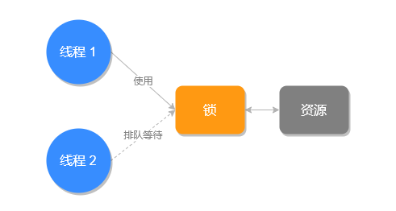
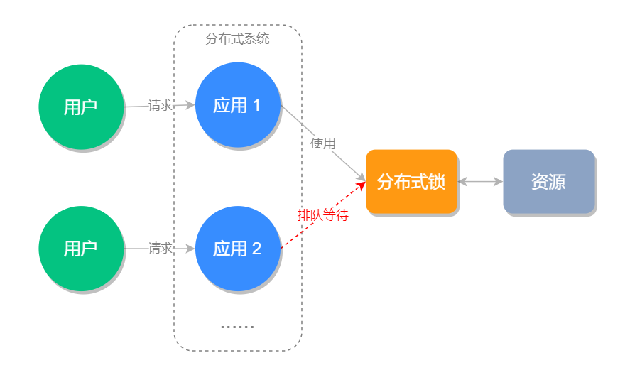
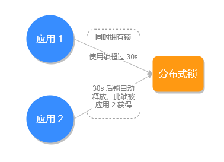
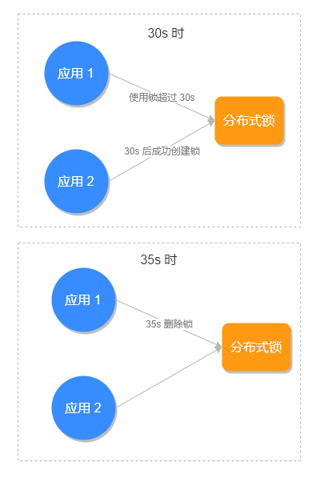

28 实战：分布式锁详解与代码
===============

### 什么是锁？

锁是一种常用的并发控制机制，用于保证一项资源在任何时候只能被一个线程使用，如果其他线程也要使用同样的资源，必须排队等待上一个线程使用完。

锁的示意图，如下所示：



### 什么是分布式锁？

上面说的锁指的是程序级别的锁，例如 Java 语言中的 synchronized 和 ReentrantLock 在单应用中使用不会有任何问题，但如果放到分布式环境下就不适用了，这个时候我们就要使用分布式锁。

分布式锁比较好理解就是用于分布式环境下并发控制的一种机制，用于控制某个资源在同一时刻只能被一个应用所使用。

分布式锁示意图，如下所示：



### 怎么实现分布式锁？

分布式锁比较常见的实现方式有三种：

1. Memcached 实现的分布式锁：使用 add 命令，添加成功的情况下，表示创建分布式锁成功。
2. ZooKeeper 实现的分布式锁：使用 ZooKeeper 顺序临时节点来实现分布式锁。
3. Redis 实现的分布式锁。

本文要重点来说的是第三种，也就是 Redis 分布式锁的实现方式。

Redis 分布式锁的实现思路是使用 setnx（set if not exists），如果创建成功则表明此锁创建成功，否则代表这个锁已经被占用创建失败。

#### **分布式锁实现**```shell

127.0.0.1:6379> setnx lock true

(integer) 1 #创建锁成功

# 逻辑业务处理

127.0.0.1:6379> del lock

(integer) 1 #释放锁

```

从以上代码可以看出，释放锁使用 `del lock` 即可，如果在锁未被删除之前，其他程序再来执行 setnx 是不会创建成功的，结果如下：

```shell
127.0.0.1:6379> setnx lock true

(integer) 0


```

执行结果为 0 表示失败。

#### **setnx 的问题 **setnx 虽然可以成功地创建分布式锁，但存在一个问题，如果此程序在创建了锁之后，程序异常退出了，那么这个锁将永远不会被释放，就造成了** 死锁的问题**

这个时候有人想到，我们可以使用 `expire key seconds` 设置超时时间，即使出现程序中途崩溃的情况，超过超时时间之后，这个锁也会解除，不会出现死锁的情况了，实现命令如下：

```shell
127.0.0.1:6379> setnx lock true

(integer) 1

127.0.0.1:6379> expire lock 30

(integer) 1

#逻辑业务处理...

127.0.0.1:6379> del lock

(integer) 1 #释放锁


```

但这样依然会有问题，因为命令 setnx 和 expire 处理是一前一后非原子性的，因此如果在它们执行之间，出现断电和 Redis 异常退出的情况，因为超时时间未设置，依然会造成死锁。

#### **带参数的 Set**因为 setnx 和 expire 存在原子性的问题，所以之后出现了很多类库用于解决此问题的，这样就增加了使用的成本，意味着你不但要添加 Redis 本身的客户端，并且为了解决 setnx 分布式锁的问题，还需要额外第三方类库

然而，这个问题到 Redis 2.6.12 时得到了解决，因为这个版本可以使用 set 并设置超时和非空判定等参数了。


这样我们就可以使用 set 命令来设置分布式锁，并设置超时时间了，而且 set 命令可以保证原子性，实现命令如下所示：

```shell
127.0.0.1:6379> set lock true ex 30 nx

OK #创建锁成功

127.0.0.1:6379> set lock true ex 30 nx

(nil) #在锁被占用的时候，企图获取锁失败


```

其中， `ex n` 为设置超时时间，nx 为元素非空判断，用来判断是否能正常使用锁的。

### 分布式锁的执行超时问题

使用 set 命令之后好像所有问题都解决了，然后真相是“没那么简单”。使用 set 命令只解决创建锁的问题，那执行中的极端问题，和释放锁极端问题，我们依旧要考虑。

例如，我们设置锁的最大超时时间是 30s，但业务处理使用了 35s，这就会导致原有的业务还未执行完成，锁就被释放了，新的程序和旧程序一起操作就会带来线程安全的问题。

此执行流程如下图所示：



执行超时的问题处理带来线程安全问题之外，还引发了另一个问题：**锁被误删**。

假设锁的最大超时时间是 30s，应用 1 执行了 35s，然而应用 2 在 30s，锁被自动释放之后，用重新获取并设置了锁，然后在 35s 时，应用 1 执行完之后，就会把应用 2 创建的锁给删除掉，如下图所示：



锁被误删的解决方案是在使用 set 命令创建锁时，给 value 值设置一个归属人标识，例如给应用关联一个 UUID，每次在删除之前先要判断 UUID 是不是属于当前的线程，如果属于在删除，这样就避免了锁被误删的问题。

注意：如果是在代码中执行删除，不能使用先判断再删除的方法，伪代码如下：

```java
if(xxx.equals(xxx)){ // 判断是否是自己的锁

    del(luck); // 删除锁

}


```

因为判断代码和删除代码不具备原子性，因此也不能这样使用，这个时候可以使用 Lua 脚本来执行判断和删除的操作，因为多条 Lua 命令可以保证原子性，Java 实现代码如下：

```java
/**

 * 释放分布式锁

 * @param jedis Redis 客户端

 * @param lockKey 锁的 key

 * @param flagId 锁归属标识

 * @return 是否释放成功

 */

public static boolean unLock(Jedis jedis, String lockKey, String flagId) {

    String script = "if redis.call('get', KEYS[1]) == ARGV[1] then return redis.call('del', KEYS[1]) else return 0 end";

    Object result = jedis.eval(script, Collections.singletonList(lockKey), Collections.singletonList(flagId));

    if ("1L".equals(result)) { // 判断执行结果

        return true;

    }

    return false;

}


```

其中，Collections.singletonList() 方法的作用是将 String 转成 List，因为 jedis.eval() 最后两个参数的类型必须是 List。

说完了锁误删的解决方案，咱们回过头来看如何解决执行超时的问题，执行超时的问题可以从以下两方面来解决：

1. 把执行比较耗时的任务不要放到加锁的方法内，锁内的方法尽量控制执行时长；
2. 把最大超时时间可以适当的设置长一点，正常情况下锁用完之后会被手动的删除掉，因此适当的把最大超时时间设置的长一点，也是可行的。

### 代码实战

下面我们使用 Java 代码来实现分布式锁，代码如下：

```java
import org.apache.commons.lang3.StringUtils;

import redis.clients.jedis.Jedis;

import redis.clients.jedis.params.SetParams;

import utils.JedisUtils;


import java.util.Collections;

public class LockExample {

    static final String _LOCKKEY = "REDISLOCK"; // 锁 key

    static final String _FLAGID = "UUID:6379";  // 标识（UUID）

    static final Integer _TimeOut = 90;     // 最大超时时间


    public static void main(String[] args) {

        Jedis jedis = JedisUtils.getJedis();

        // 加锁

        boolean lockResult = lock(jedis, _LOCKKEY, _FLAGID, _TimeOut);

        // 逻辑业务处理

        if (lockResult) {

            System.out.println("加锁成功");

        } else {

            System.out.println("加锁失败");

        }

        // 手动释放锁

        if (unLock(jedis, _LOCKKEY, _FLAGID)) {

            System.out.println("锁释放成功");

        } else {

            System.out.println("锁释放成功");

        }

    }

    /**

     * @param jedis       Redis 客户端

     * @param key         锁名称

     * @param flagId      锁标识（锁值），用于标识锁的归属

     * @param secondsTime 最大超时时间

     * @return

     */

    public static boolean lock(Jedis jedis, String key, String flagId, Integer secondsTime) {

        SetParams params = new SetParams();

        params.ex(secondsTime);

        params.nx();

        String res = jedis.set(key, flagId, params);

        if (StringUtils.isNotBlank(res) && res.equals("OK"))

            return true;

        return false;

    }

    /**

     * 释放分布式锁

     * @param jedis   Redis 客户端

     * @param lockKey 锁的 key

     * @param flagId  锁归属标识

     * @return 是否释放成功

     */

    public static boolean unLock(Jedis jedis, String lockKey, String flagId) {

        String script = "if redis.call('get', KEYS[1]) == ARGV[1] then return redis.call('del', KEYS[1]) else return 0 end";

        Object result = jedis.eval(script, Collections.singletonList(lockKey), Collections.singletonList(flagId));

        if ("1L".equals(result)) { // 判断执行结果

            return true;

        }

        return false;

    }

}


```

以上代码执行结果如下所示：

```
加锁成功

锁释放成功


```

### 小结

本文介绍了锁和分布式锁的概念，锁其实就是用来保证同一时刻只有一个程序可以去操作某一个资源，以此来保证并发时程序能正常执行的。使用 Redis 来实现分布式锁不能使用 setnx 命令，因为它可能会带来死锁的问题，因此我们可以使用 Redis 2.6.12 带来的多参数的 set 命令来申请锁，但在使用的时候也要注意锁内的业务流程执行的时间，不能大于锁设置的最大超时时间，不然会带来线程安全问题和锁误删的问题。
