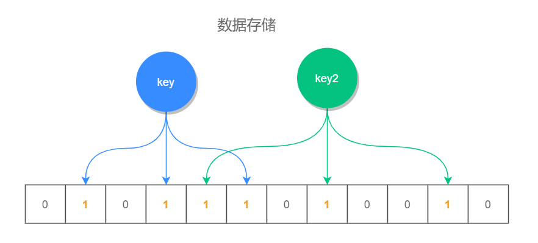

29 实战：布隆过滤器安装与使用及原理分析
=====================

我们前面有讲到过 HyperLogLog 可以用来做基数统计，但它没提供判断一个值是否存在的查询方法，那我们如何才能查询一个值是否存在于海量数据之中呢？

如果使用传统的方式，例如 SQL 中的传统查询，因为数据量太多，查询效率又低有占用系统的资源，因此我们需要一个优秀的算法和功能来实现这个需求，这是我们今天要讲的——布隆过滤器。

### 开启布隆过滤器

在 Redis 中不能直接使用布隆过滤器，但我们可以通过 Redis 4.0 版本之后提供的 modules（扩展模块）的方式引入，本文提供两种方式的开启方式。

#### **方式一：编译方式 **** 1\. 下载并安装布隆过滤器**```

git clone <https://github.com/RedisLabsModules/redisbloom.git>

cd redisbloom

make # 编译redisbloom

```

编译正常执行完，会在根目录生成一个 redisbloom.so 文件。** 2\. 启动 Redis 服务器 **```
> ./src/redis-server redis.conf --loadmodule ./src/modules/RedisBloom-master/redisbloom.so


```

其中 `--loadmodule` 为加载扩展模块的意思，后面跟的是 redisbloom.so 文件的目录。

#### **方式二：Docker 方式**```

docker pull redislabs/rebloom &nbsp;# 拉取镜像

docker run -p6379:6379 redislabs/rebloom &nbsp;# 运行容器

```

####** 启动验证 **服务启动之后，我们需要判断布隆过滤器是否正常开启，此时我们只需使用 redis-cli 连接到服务端，输入 bf.add 看有没有命令提示，就可以判断是否正常启动了，如下图所示：


如果有命令提示则表名 Redis 服务器已经开启了布隆过滤器。

### 布隆过滤器的使用

布隆过滤器的命令不是很多，主要包含以下几个：

1.  bf.add：添加元素
2.  bf.exists：判断某个元素是否存在
3.  bf.madd：添加多个元素
4.  bf.mexists：判断多个元素是否存在
5.  bf.reserve：** 设置布隆过滤器的准确率**

具体使用如下所示：

```shell
127.0.0.1:6379> bf.add user xiaoming

(integer) 1

127.0.0.1:6379> bf.add user xiaohong

(integer) 1

127.0.0.1:6379> bf.add user laowang

(integer) 1

127.0.0.1:6379> bf.exists user laowang

(integer) 1

127.0.0.1:6379> bf.exists user lao

(integer) 0

127.0.0.1:6379> bf.madd user huahua feifei

1) (integer) 1

2) (integer) 1

127.0.0.1:6379> bf.mexists user feifei laomiao

1) (integer) 1

2) (integer) 0


```

可以看出以上结果没有任何误差，我们再来看一下准确率 bf.reserve 的使用：

```shell
127.0.0.1:6379> bf.reserve user 0.01 200

(error) ERR item exists #已经存的 key 设置会报错

127.0.0.1:6379> bf.reserve userlist 0.9 10

OK


```

可以看出此命令必须在元素刚开始执行，否则会报错，它有三个参数：key、error\_rate 和 initial\_size。

其中：

* error\_rate：允许布隆过滤器的错误率，这个值越低过滤器占用空间也就越大，以为此值决定了位数组的大小，位数组是用来存储结果的，它的空间占用的越大（存储的信息越多），错误率就越低，它的默认值是 0.01。
* initial\_size：布隆过滤器存储的元素大小，实际存储的值大于此值，准确率就会降低，它的默认值是 100。

后面原理部分会讲到 error\_rate 和 initial\_size 对准确率影响的具体原因。

### 代码实战

下面我们用 Java 客户端来实现布隆过滤器的操作，因为 Jedis 没有直接操作布隆过滤器的方法，所以我们使用 Jedis 操作 Lua 脚本的方式来实现布隆过滤器，代码如下：

```java
import redis.clients.jedis.Jedis;

import utils.JedisUtils;


import java.util.Arrays;


public class BloomExample {

    private static final String _KEY = "user";


    public static void main(String[] args) {

        Jedis jedis = JedisUtils.getJedis();

        for (int i = 1; i < 10001; i++) {

            bfAdd(jedis, _KEY, "user_" + i);

            boolean exists = bfExists(jedis, _KEY, "user_" + i);

            if (!exists) {

                System.out.println("未找到数据 i=" + i);

                break;

            }

        }

        System.out.println("执行完成");

    }

    /**

     * 添加元素

     * @param jedis Redis 客户端

     * @param key   key

     * @param value value

     * @return boolean

     */

    public static boolean bfAdd(Jedis jedis, String key, String value) {

        String luaStr = "return redis.call('bf.add', KEYS[1], KEYS[2])";

        Object result = jedis.eval(luaStr, Arrays.asList(key, value),

                Arrays.asList());

        if (result.equals(1L)) {

            return true;

        }

        return false;

    }

    /**

     * 查询元素是否存在

     * @param jedis Redis 客户端

     * @param key   key

     * @param value value

     * @return boolean

     */

    public static boolean bfExists(Jedis jedis, String key, String value) {

        String luaStr = "return redis.call('bf.exists', KEYS[1], KEYS[2])";

        Object result = jedis.eval(luaStr, Arrays.asList(key, value),

                Arrays.asList());

        if (result.equals(1L)) {

            return true;

        }

        return false;

    }

}


```

但我们发现执行了半天，执行的结果竟然是：

```
执行完成


```

没有任何误差，奇怪了，于是我们在循环次数后面又加了一个 0，执行了大半天之后，发现依旧是相同的结果，依旧没有任何误差。

这是因为 **对于布隆过滤器来说，它说没有的值一定没有，它说有的值有可能没有** 。

于是我们把程序改一下，重新换一个 key 值，把条件改为查询存在的数据，代码如下：

```java
import redis.clients.jedis.Jedis;

import utils.JedisUtils;


import java.util.Arrays;


public class BloomExample {

    private static final String _KEY = "userlist";


    public static void main(String[] args) {

        Jedis jedis = JedisUtils.getJedis();

        for (int i = 1; i < 100001; i++) {

            bfAdd(jedis, _KEY, "user_" + i);

            boolean exists = bfExists(jedis, _KEY, "user_" + (i + 1));

            if (exists) {

                System.out.println("找到了" + i);

                break;

            }

        }

        System.out.println("执行完成");

    }


    /**

     * 添加元素

     * @param jedis Redis 客户端

     * @param key   key

     * @param value value

     * @return boolean

     */

    public static boolean bfAdd(Jedis jedis, String key, String value) {

        String luaStr = "return redis.call('bf.add', KEYS[1], KEYS[2])";

        Object result = jedis.eval(luaStr, Arrays.asList(key, value),

                Arrays.asList());

        if (result.equals(1L)) {

            return true;

        }

        return false;

    }


    /**

     * 查询元素是否存在

     * @param jedis Redis 客户端

     * @param key   key

     * @param value value

     * @return boolean

     */

    public static boolean bfExists(Jedis jedis, String key, String value) {

        String luaStr = "return redis.call('bf.exists', KEYS[1], KEYS[2])";

        Object result = jedis.eval(luaStr, Arrays.asList(key, value),

                Arrays.asList());

        if (result.equals(1L)) {

            return true;

        }

        return false;

    }

}


```

这次我们发现执行不一会就出现了如下信息：

```
找到了344

执行完成


```

说明循环执行了一会之后就出现误差了，代码执行也符合布隆过滤器的预期。

### 原理

上面我们学会了布隆过滤器的使用，下面我们就来看下它的实现原理。

Redis 布隆过滤器的实现，依靠的是它数据结构中的一个位数组，每次存储键值的时候，不是直接把数据存储在数据结构中，因为这样太占空间了，它是利用几个不同的无偏哈希函数，把此元素的 hash 值均匀的存储在位数组中，也就是说，每次添加时会通过几个无偏哈希函数算出它的位置，把这些位置设置成 1 就完成了添加操作。

当进行元素判断时，查询此元素的几个哈希位置上的值是否为 1，如果全部为 1，则表示此值存在，如果有一个值为 0，则表示不存在。因为此位置是通过 hash 计算得来的，所以即使这个位置是 1，并不能确定是那个元素把它标识为 1 的，因此 **布隆过滤器查询此值存在时，此值不一定存在，但查询此值不存在时，此值一定不存在** 。

并且当位数组存储值比较稀疏的时候，查询的准确率越高，而当位数组存储的值越来越多时，误差也会增大。

位数组和 key 之间的关系，如下图所示：



### 布隆过滤器使用场景

它的经典使用场景包括以下几个：

* 垃圾邮件过滤
* 爬虫里的 URL 去重
* 判断一个元素在亿级数据中是否存在

布隆过滤器在数据库领域的使用也比较广泛，例如：HBase、Cassandra、LevelDB、RocksDB 内部都有使用布隆过滤器。

### 小结

通过本文我们知道可以使用 Redis 4.0 之后提供的 modules 方式来开启布隆过滤器，并学习了布隆过滤器的三个重要操作方法 bf.add 添加元素、bf.exists 查询元素是否存在，还有 bf.reserve 设置布隆过滤器的准确率，其中 bf.reserve 有 2 个重要的参数：错误率和数组大小，错误率设置的越低，数组设置的越大，需要存储的空间就越大，相对来说查询的错误率也越低，需要如何设置需要使用者根据实际情况进行调整。我们也知道布隆过滤器的特点：当它查询有数据时，此数据不一定真的存在，当它查询没有此数据时，此数据一定不存在。
