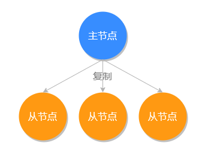
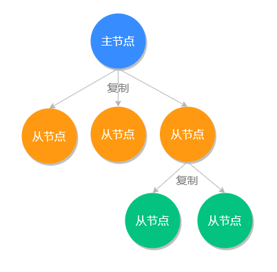

36 实战：Redis 主从同步
================

主从同步（主从复制）是 Redis 高可用服务的基石，也是多机运行中最基础的一个。我们把主要存储数据的节点叫做主节点 (master），把其他通过复制主节点数据的副本节点叫做从节点 (slave），如下图所示：



在 Redis 中一个主节点可以拥有多个从节点，一个从节点也可以是其他服务器的主节点，如下图所示：



### 主从同步的优点

主从同步具有以下三个优点：

* 性能方面：有了主从同步之后，可以把查询任务分配给从服务器，用主服务器来执行写操作，这样极大的提高了程序运行的效率，把所有压力分摊到各个服务器了；
* 高可用：当有了主从同步之后，当主服务器节点宕机之后，可以很迅速的把从节点提升为主节点，为 Redis 服务器的宕机恢复节省了宝贵的时间；
* 防止数据丢失：当主服务器磁盘坏掉之后，其他从服务器还保留着相关的数据，不至于数据全部丢失。

既然主从同步有这么多的优点，那接下来我们来看如何开启和使用主从同步功能。

### 开启主从同步

#### **运行中设置从服务器**在 Redis 运行过程中，我们可以使用 `replicaof host port` 命令，把自己设置为目标 IP 的从服务器，执行命令如下

```shell
127.0.0.1:6379> replicaof 127.0.0.1 6380

OK


```

如果主服务设置了密码，需要在从服务器输入主服务器的密码，使用 `config set masterauth 主服务密码` 命令的方式，例如：

```shell
127.0.0.1:6377> config set masterauth pwd654321

OK


```** 1\. 执行流程 **在执行完 replicaof 命令之后，从服务器的数据会被清空，主服务会把它的数据副本同步给从服务器。** 2\. 测试同步功能 **主从服务器设置完同步之后，我们来测试一下主从数据同步，首先我们先在主服务器上执行保存数据操作，再去从服务器查询。

主服务器执行命令：

```shell
127.0.0.1:6379> set lang redis

OK


```

从服务执行查询：

```shell
127.0.0.1:6379> get lang

"redis"


```

可以看出数据已经被正常同步过来了。

#### **启动时设置从服务器**我们可以使用命令 `redis-server --port 6380 --replicaof 127.0.0.1 6379` 将自己设置成目标服务器的从服务器

### 数据同步

#### **完整数据同步**当有新的从服务器连接时，为了保障多个数据库的一致性，主服务器会执行一次 bgsave 命令生成一个 RDB 文件，然后再以 Socket 的方式发送给从服务器，从服务器收到 RDB 文件之后再把所有的数据加载到自己的程序中，就完成了一次全量的数据同步

#### **部分数据同步**在 Redis 2.8 之前每次从服务器离线再重新上线之前，主服务器会进行一次完整的数据同步，然后这种情况如果发生在离线时间比较短的情况下，只有少量的数据不同步却要同步所有的数据是非常笨拙和不划算的，在 Redis 2.8 这个功能得到了优化

Redis 2.8 的优化方法是当从服务离线之后，主服务器会把离线之后的写入命令，存储在一个特定大小的队列中，队列是可以保证先进先出的执行顺序的，当从服务器重写恢复上线之后，主服务会判断离线这段时间内的命令是否还在队列中，如果在就直接把队列中的数据发送给从服务器，这样就避免了完整同步的资源浪费。

> 小贴士：存储离线命令的队列大小默认是 1MB，使用者可以自行修改队列大小的配置项 repl-backlog-size。

#### **无盘数据同步**从前面的内容我们可以得知，在第一次主从连接的时候，会先产生一个 RDB 文件，再把 RDB 文件发送给从服务器，如果主服务器是非固态硬盘的时候，系统的 I/O 操作是非常高的，为了缓解这个问题，Redis 2.8.18 新增了无盘复制功能，无盘复制功能不会在本地创建 RDB 文件，而是会派生出一个子进程，然后由子进程通过 Socket 的方式，直接将 RDB 文件写入到从服务器，这样主服务器就可以在不创建RDB文件的情况下，完成与从服务器的数据同步

要使用无须复制功能，只需把配置项 repl-diskless-sync 的值设置为 yes 即可，它默认配置值为 no。

### 查询服务器的角色

我们使用 role 命令，来查询当前服务器的主从角色信息。

#### **主服务查看**在主服务器上执行 role 结果如下

```shell
127.0.0.1:6379> role

1) "master"

2) (integer) 546

3) 1) 1) "172.17.0.1"

      2) "6379"

      3) "546"


```

master 表示主服务器，底下是从服务器的 IP、端口和连接时间。

#### **从服务器查看**在从服务器执行 role 命令，执行结果如下

```shell
127.0.0.1:6379> role

1) "slave"

2) "192.168.1.71"

3) (integer) 6380

4) "connected"

5) (integer) 14


```

slave 表示从服务器，底下主服务器的 IP、端口和连接时间。

### 关闭主从同步

我们可以使用 `replicaof no one` 命令来停止从服务器的复制，操作命令如下：

```shell
127.0.0.1:6379> role #查询当前角色

1) "slave" #从服务器

2) "192.168.1.71"

3) (integer) 6380

4) "connected"

5) (integer) 14

127.0.0.1:6379> replicaof no one #关闭同步

OK

127.0.0.1:6379> role #查询当前角色

1) "master" #主服务器

2) (integer) 1097

3) (empty list or set)


```

可以看出执行了 `replicaof no one` 命令之后，自己就从服务器变成主服务器了。

> 小贴士：服务器类型的转换并不会影响数据，这台服务器的数据将会被保留。

### 注意事项

主从同步有一些需要注意的点，我们来看一下。

#### **数据一致性问题**当从服务器已经完成和主服务的数据同步之后，再新增的命令会以异步的方式发送至从服务器，在这个过程中主从同步会有短暂的数据不一致，如在这个异步同步发生之前主服务器宕机了，会造成数据不一致

#### **从服务器只读性**

默认在情况下，处于复制模式的主服务器既可以执行写操作也可以执行读操作，而从服务器则只能执行读操作。

可以在从服务器上执行 `config set replica-read-only no` 命令，使从服务器开启写模式，但需要注意以下几点：

* 在从服务器上写的数据不会同步到主服务器；
* 当键值相同时主服务器上的数据可以覆盖从服务器；
* 在进行完整数据同步时，从服务器数据会被清空。

#### **复制命令的变化**

Redis 5.0 之前使用的复制命令是 slaveof，在 Redis 5.0 之后复制命令才被改为 replicaof，在高版本（Redis 5+）中我们应该尽量使用 replicaof，因为 slaveof 命令可能会被随时废弃掉。

### 小结

本文我们了解了 Redis 多机运行的基础功能主从同步，主从同步可以通过 `replicaof host port` 命令开启，知道了同步的三种方式：完整数据同步（第一次全量 RDB 同步），部分数据同步（Redis 2.8 对于短时间离线的同步功能优化），无盘同步（非 RDB 生成的方式同步数据），我们也可以使用 `replicaof no one` 命令来停止从服务器的复制功能。
