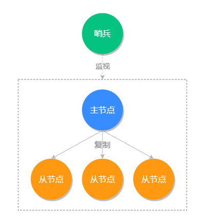
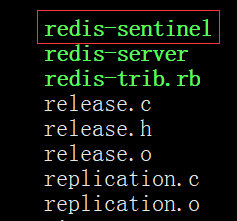
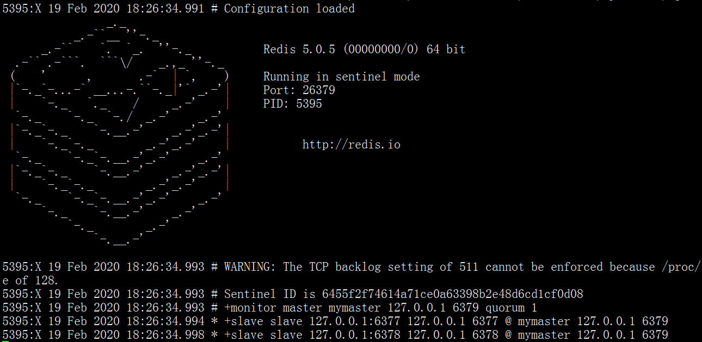

# 37 实战：Redis哨兵模式（上）

上一篇我们讲了主从复制模式，它是属于 Redis 多机运行的基础，但这种模式本身存在一个致命的问题，当主节点奔溃之后，需要人工干预才能恢复 Redis 的正常使用。

例如，我们有 3 台服务器做了主从复制，一个主服务器 A 和两个从服务器 B、C，当 A 发生故障之后，需要人工把 B 服务器设置为主服务器，同时再去 C 服务器设置成从服务器并且从主服务器 B 同步数据，如果是发生在晚上或者从服务器节点很多的情况下，对于人工来说想要立即实现恢复的难度很多，所以我们需要一个自动的工具——Redis Sentinel（哨兵模式）来把手动的过程变成自动的，让 Redis 拥有自动容灾恢复（failover）的能力。

哨兵模式如下所示：



> 小贴士：Redis Sentinel 的最小分配单位是一主一从。

### Redis Sentinel 搭建

Redis 官方提供了 Redis Sentinel 的功能，它的运行程序保存在 src 目录下，如图所示：



我们需要使用命令 `./src/redis-sentinel sentinel.conf` 来启动 Sentinel，可以看出我们在启动它时必须设置一个 sentinel.conf 文件，这个配置文件中必须包含监听的主节点信息：

```
sentinel monitor master-name ip port quorum
```

例如：

```
sentinel monitor mymaster 127.0.0.1 6379 1
```

其中：

- master-name 表示给监视的主节点起一个名称；
- ip 表示主节点的 IP；
- port 表示主节点的端口；
- quorum 表示确认主节点下线的 Sentinel 数量，如果 quorum 设置为 1 表示只要有一台 Sentinel 判断它下线了，就可以确认它真的下线了。

注意：如果主节点 Redis 服务器有密码，还必须在 sentinel.conf 中添加主节点的密码，不然会导致 Sentinel 不能自动监听到主节点下面的从节点。

所以如果 Redis 有密码，sentinel.conf 必须包含以下内容：

```
sentinel monitor mymaster 127.0.0.1 6379 1
sentinel auth-pass mymaster pwd654321
```

当我们配置好 sentinel.conf 并执行启动命令 `./src/redis-sentinel sentinel.conf` 之后，Redis Sentinel 就会被启动，如下图所示：



从上图可以看出 Sentinel 只需配置监听主节点的信息，它会自动监听对应的从节点。

### 启动 Sentinel 集群

上面我们演示了单个 Sentinel 的启动，但生产环境我们不会只启动一台 Sentinel，因为如果启动一台 Sentinel 假如它不幸宕机的话，就不能提供自动容灾的服务了，不符合我们高可用的宗旨，所以我们会在不同的物理机上启动多个 Sentinel 来组成 Sentinel 集群，来保证 Redis 服务的高可用。

启动 Sentinel 集群的方法很简单，和上面启动单台的方式一样，我们只需要把多个 Sentinel 监听到一个主服务器节点，那么多个 Sentinel 就会自动发现彼此，并组成一个 Sentinel 集群。

我们启动第二个 Sentinel 来试一下，执行结果如下：

````shell
[@iZ2ze0nc5n41zomzyqtksmZ:redis2]$ ./src/redis-sentinel sentinel.conf
5547:X 19 Feb 2020 20:29:30.047 # oO0OoO0OoO0Oo Redis is starting oO0OoO0OoO0Oo
5547:X 19 Feb 2020 20:29:30.047 # Redis version=5.0.5, bits=64, commit=00000000, modified=0, pid=5547, just started
5547:X 19 Feb 2020 20:29:30.047 # Configuration loaded
                _._                                                  
           _.-``__ ''-._                                             
      _.-``    `.  `_.  ''-._           Redis 5.0.5 (00000000/0) 64 bit
  .-`` .-```.  ```\/    _.,_ ''-._                                   
 (    '      ,       .-`  | `,    )     Running in sentinel mode
 |`-._`-...-` __...-.``-._|'` _.-'|     Port: 26377
 |    `-._   `._    /     _.-'    |     PID: 5547
  `-._    `-._  `-./  _.-'    _.-'                                   
 |`-._`-._    `-.__.-'    _.-'_.-'|                                  
 |    `-._`-._        _.-'_.-'    |           http://redis.io        
  `-._    `-._`-.__.-'_.-'    _.-'                                   
 |`-._`-._    `-.__.-'    _.-'_.-'|                                  
 |    `-._`-._        _.-'_.-'    |                                  
  `-._    `-._`-.__.-'_.-'    _.-'                                   
      `-._    `-.__.-'    _.-'                                       
          `-._        _.-'                                           
              `-.__.-'                                               
5547:X 19 Feb 2020 20:29:30.049 # WARNING: The TCP backlog setting of 511 cannot be enforced because /proc/sys/net/core/somaxconn is set to the lower value of 128.
5547:X 19 Feb 2020 20:29:30.049 # Sentinel ID is 6455f2f74614a71ce0a63398b2e48d6cd1cf0d06
5547:X 19 Feb 2020 20:29:30.049 # +monitor master mymaster 127.0.0.1 6379 quorum 1
5547:X 19 Feb 2020 20:29:30.049 * +slave slave 127.0.0.1:6377 127.0.0.1 6377 @ mymaster 127.0.0.1 6379
5547:X 19 Feb 2020 20:29:30.052 * +slave slave 127.0.0.1:6378 127.0.0.1 6378 @ mymaster 127.0.0.1 6379
5547:X 19 Feb 2020 20:29:30.345 * +sentinel sentinel 6455f2f74614a71ce0a63398b2e48d6cd1cf0d08 127.0.0.1 26379 @ mymaster 127.0.0.1 6379
````

从以上启动命令可以看出，比单机模式多了最后一行发现其他 Sentinel 服务器的命令，说明这两个 Sentinel 已经组成一个集群了。

Sentinel 集群示意图如下：


一般情况下 Sentinel 集群的数量取大于 1 的奇数，例如 3、5、7、9，而 quorum 的配置要根据 Sentinel 的数量来发生变化，例如 Sentinel 是 3 台，那么对应的 quorum 最好是 2，如果 Sentinel 是 5 台，那么 quorum 最好是 3，它表示当有 3 台 Sentinel 都确认主节点下线了，就可以确定主节点真的下线了。

与 quorum 参数相关的有两个概念：主观下线和客观下线。

当 Sentinel 集群中，有一个 Sentinel 认为主服务器已经下线时，它会将这个主服务器标记为主观下线（Subjectively Down，SDOWN），然后询问集群中的其他 Sentinel，是否也认为该服务器已下线，当同意主服务器已下线的 Sentinel 数量达到 quorum 参数所指定的数量时，Sentinel 就会将相应的主服务器标记为客观下线（Objectively down，ODOWN），然后开始对其进行故障转移。

### 自动容灾测试

前面我们已经搭建了 Redis Sentinel，接下来我们就尝试一下自动容灾的功能，为了模拟故障我们先把主节点手动 kill 掉，执行命令如下：

```shell
[@iZ2ze0nc5n41zomzyqtksmZ:~]$ ps -ef|grep redis #找到主节点的进程id
root      5186     1  0 16:54 ?        00:00:23 ./src/redis-server *:6377
root      5200     1  0 16:56 ?        00:00:22 ./src/redis-server *:6378
root      5304  5287  0 17:31 pts/2    00:00:00 redis-cli -a pwd654321
root      5395  5255  0 18:26 pts/1    00:00:19 ./src/redis-sentinel *:26379 [sentinel]
root      5547  5478  0 20:29 pts/4    00:00:02 ./src/redis-sentinel *:26377 [sentinel]
root      5551  5517  0 20:29 pts/5    00:00:00 redis-cli -h 127.0.0.1 -p 26377 -a pwd654321
root      5568  5371  0 20:48 pts/0    00:00:00 grep --color=auto redis
root     28517     1  0 Feb13 ?        00:15:33 ./src/redis-server *:6379
[@iZ2ze0nc5n41zomzyqtksmZ:~]$ kill -9 28517 #关闭主节点服务
```

这个时候我们在连接上另一台 Redis 服务器，查看当前主从服务器信息，执行命令如下：

```shell
[@iZ2ze0nc5n41zomzyqtksmZ:~]$ redis-cli -h 127.0.0.1 -p 6377 -a pwd654321 2>/dev/null
127.0.0.1:6377> role
1) "master"
2) (integer) 770389
3) 1) 1) "127.0.0.1"
      2) "6378"
      3) "770389"
```

可以看出之前的从服务 6377 被提升为主服务器了，还剩下一台从服务 6378，而之前的主服务器 6379 被我们手动下线了，可以看出 Sentinel 已经完美的完成的它的故障自动转移的任务。

### 主服务竞选规则

上面我们模拟了 Redis Sentinel 自动容灾恢复，那接下来我们来看一下，主服务器竞选的规则和相关设置项。

#### **新主节点竞选优先级设置**我们可以 redis.conf 中的 replica-priority 选项来设置竞选新主节点的优先级，它的默认值是 100，它的最大值也是 100，这个值越小它的权重就越高，例如从节点 A 的 replica-priority 值为 100，从节点 B 的值为 50，从节点 C 的值为 5，那么在竞选时从节点 C 会作为新的主节点

#### **新主节点竞选规则**新主节点的竞选会排除不符合条件的从节点，然后再剩余的从节点按照优先级来挑选。首先来说，存在以下条件的从节点会被排除

1. 排除所有已经下线以及长时间没有回复心跳检测的疑似已下线从服务器；
1. 排除所有长时间没有与主服务器通信，数据状态过时的从服务器；
1. 排除所有优先级（replica-priority）为 0 的服务器。

符合条件的从节点竞选顺序：

1. 优先级最高的从节点将会作为新主节点；
1. 优先级相等则判断复制偏移量，偏移量最大的从节点获胜；
1. 如果以上两个条件都相同，选择 Redis 运行时随机生成 ID 最小那个为新的主服务器。

#### **旧主节点恢复上线**

如果之前的旧主节点恢复上线，会作为从节点运行在主从服务器模式中。

### 哨兵工作原理

哨兵的工作原理是这样的，首先每个 Sentinel 会以每秒钟 1 次的频率，向已知的主服务器、从服务器和以及其他 Sentinel 实例，发送一个 PING 命令。

如果最后一次有效回复 PING 命令的时间超过 down-after-milliseconds 所配置的值（默认 30s），那么这个实例会被 Sentinel 标记为主观下线。

如果一个主服务器被标记为主观下线，那么正在监视这个主服务器的所有 Sentinel 节点，要以每秒 1 次的频率确认 主服务器的确进入了主观下线状态。

如果有足够数量（quorum 配置值）的 Sentinel 在指定的时间范围内同意这一判断，那么这个主服务器被标记为客观下线。此时所有的 Sentinel 会按照规则协商自动选出新的主节点。

> 注意：一个有效的 PING 回复可以是：+PONG、-LOADING 或者 -MASTERDOWN。如果返回值非以上三种回复，或者在指定时间内没有回复 PING 命令， 那么 Sentinel 认为服务器返回的回复无效（non-valid)。

### 小结

本文我们讲了主从模式的步骤，需要手动切换故障服务器的弊端，引出了 Sentinel 模式，可以实现监控和自动容灾，我们通过 Redis 提供的 Redis-Sentinel 来启动哨兵模式，当我们启动多个哨兵模式监视同一个主节点时，它们就会彼此发现形成一个新的高可用的 Sentinel 网络。同时我们讲了 Sentinel 的工作原理是通过 PING 命令来检查节点是否存活的，并通过配置项和复制偏移量 ID 来确定新主节点，下文我们讲一下哨兵管理命令和代码实战。
