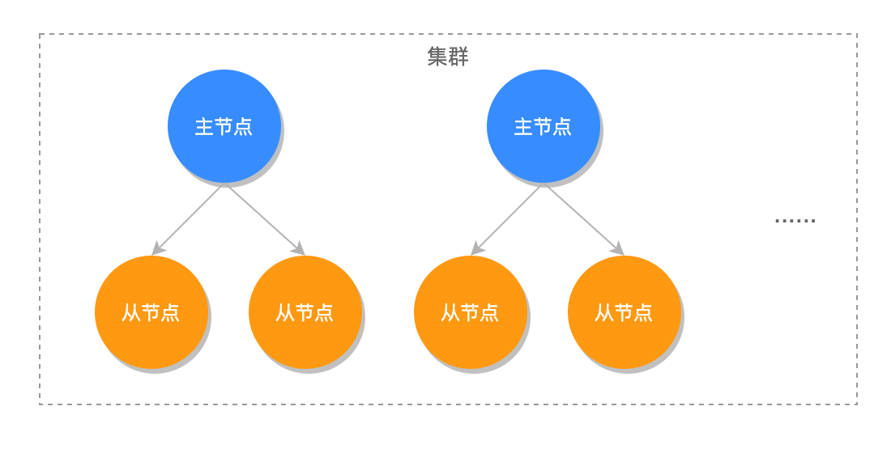
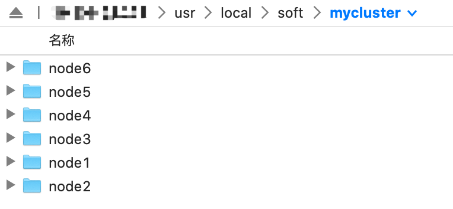
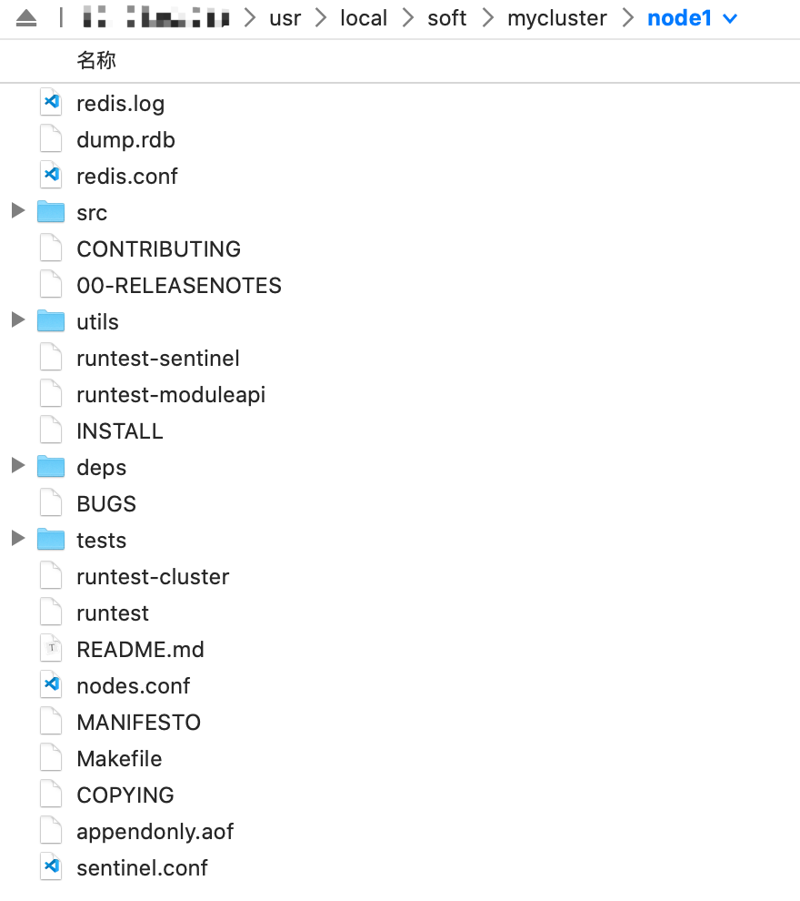
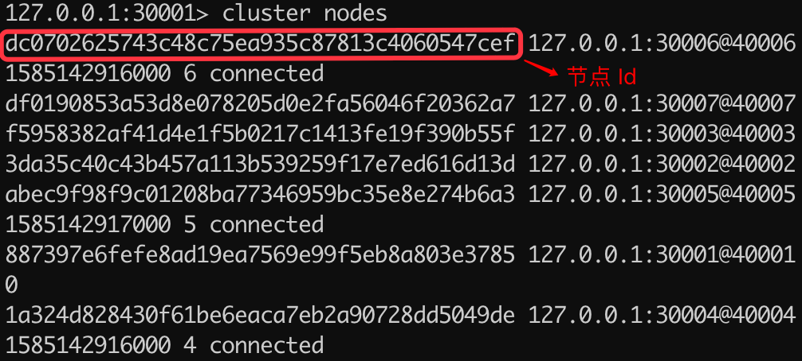

# 39 实战：Redis 集群模式（上）

Redis Cluster 是 Redis 3.0 版本推出的 Redis 集群方案，它将数据分布在不同的服务区上，以此来降低系统对单主节点的依赖，并且可以大大的提高 Redis 服务的读写性能。

Redis 将所有的数据分为 16384 个 slots（槽），每个节点负责其中的一部分槽位，当有 Redis 客户端连接集群时，会得到一份集群的槽位配置信息，这样它就可以直接把请求命令发送给对应的节点进行处理。

Redis Cluster 是无代理模式去中心化的运行模式，客户端发送的绝大数命令会直接交给相关节点执行，这样大部分情况请求命令无需转发，或仅转发一次的情况下就能完成请求与响应，所以集群单个节点的性能与单机 Redis 服务器的性能是非常接近的，因此在理论情况下，当水平扩展一倍的主节点就相当于请求处理的性能也提高了一倍，所以 Redis Cluster 的性能是非常高的。

Redis Cluster 架构图如下所示：



### 搭建 Redis Cluster

Redis Cluster 的搭建方式有两种，一种是使用 Redis 源码中提供的 create-cluster 工具快速的搭建 Redis 集群环境，另一种是配置文件的方式手动创建 Redis 集群环境。

#### **快速搭建 Redis Cluster**create-cluster 工具在 utils/create-cluster 目录下，如下图所示


使用命令 `./create-cluster start` 就可以急速创建一个 Redis 集群，执行如下：

```shell
 ./create-cluster start # 创建集群
Starting 30001
Starting 30002
Starting 30003
Starting 30004
Starting 30005
Starting 30006
```

接下来我们需要把以上创建的 6 个节点通过 create 命令组成一个集群，执行如下：

```shell
[@iZ2ze0nc5n41zomzyqtksmZ:create-cluster] ./create-cluster create # 组建集群
>>> Performing hash slots allocation on 6 nodes...
Master[0] -> Slots 0 - 5460
Master[1] -> Slots 5461 - 10922
Master[2] -> Slots 10923 - 16383
Adding replica 127.0.0.1:30005 to 127.0.0.1:30001
Adding replica 127.0.0.1:30006 to 127.0.0.1:30002
Adding replica 127.0.0.1:30004 to 127.0.0.1:30003
>>> Trying to optimize slaves allocation for anti-affinity
[WARNING] Some slaves are in the same host as their master
M: 445f2a86fe36d397613839d8cc1ae6702c976593 127.0.0.1:30001
   slots:[0-5460] (5461 slots) master
M: 63bb14023c0bf58926738cbf857ea304bff8eb50 127.0.0.1:30002
   slots:[5461-10922] (5462 slots) master
M: 864d4dfe32e3e0b81a64cec8b393bbd26a65cbcc 127.0.0.1:30003
   slots:[10923-16383] (5461 slots) master
S: 64828ab44566fc5ad656e831fd33de87be1387a0 127.0.0.1:30004
   replicates 445f2a86fe36d397613839d8cc1ae6702c976593
S: 0b17b00542706343583aa73149ec5ff63419f140 127.0.0.1:30005
   replicates 63bb14023c0bf58926738cbf857ea304bff8eb50
S: e35f06ca9b700073472d72001a39ea4dfcb541cd 127.0.0.1:30006
   replicates 864d4dfe32e3e0b81a64cec8b393bbd26a65cbcc
Can I set the above configuration? (type 'yes' to accept): yes
>>> Nodes configuration updated
>>> Assign a different config epoch to each node
>>> Sending CLUSTER MEET messages to join the cluster
Waiting for the cluster to join
.
>>> Performing Cluster Check (using node 127.0.0.1:30001)
M: 445f2a86fe36d397613839d8cc1ae6702c976593 127.0.0.1:30001
   slots:[0-5460] (5461 slots) master
   1 additional replica(s)
M: 864d4dfe32e3e0b81a64cec8b393bbd26a65cbcc 127.0.0.1:30003
   slots:[10923-16383] (5461 slots) master
   1 additional replica(s)
S: e35f06ca9b700073472d72001a39ea4dfcb541cd 127.0.0.1:30006
   slots: (0 slots) slave
   replicates 864d4dfe32e3e0b81a64cec8b393bbd26a65cbcc
S: 0b17b00542706343583aa73149ec5ff63419f140 127.0.0.1:30005
   slots: (0 slots) slave
   replicates 63bb14023c0bf58926738cbf857ea304bff8eb50
M: 63bb14023c0bf58926738cbf857ea304bff8eb50 127.0.0.1:30002
   slots:[5461-10922] (5462 slots) master
   1 additional replica(s)
S: 64828ab44566fc5ad656e831fd33de87be1387a0 127.0.0.1:30004
   slots: (0 slots) slave
   replicates 445f2a86fe36d397613839d8cc1ae6702c976593
[OK] All nodes agree about slots configuration.
>>> Check for open slots...
>>> Check slots coverage...
[OK] All 16384 slots covered.
```

在执行的过程中会询问你是否通过把 30001、30002、30003 作为主节点，把 30004、30005、30006 作为它们的从节点，输入 `yes` 后会执行完成。

我们可以先使用 redis-cli 连接到集群，命令如下：

```shell
 redis-cli -c -p 30001
```

在使用 nodes 命令来查看集群的节点信息，命令如下：

```shell
127.0.0.1:30001> cluster nodes
864d4dfe32e3e0b81a64cec8b393bbd26a65cbcc 127.0.0.1:[email protected] master - 0 1585125835078 3 connected 10923-16383
e35f06ca9b700073472d72001a39ea4dfcb541cd 127.0.0.1:[email protected] slave 864d4dfe32e3e0b81a64cec8b393bbd26a65cbcc 0 1585125835078 6 connected
0b17b00542706343583aa73149ec5ff63419f140 127.0.0.1:[email protected] slave 63bb14023c0bf58926738cbf857ea304bff8eb50 0 1585125835078 5 connected
63bb14023c0bf58926738cbf857ea304bff8eb50 127.0.0.1:[email protected] master - 0 1585125834175 2 connected 5461-10922
445f2a86fe36d397613839d8cc1ae6702c976593 127.0.0.1:[email protected] myself,master - 0 1585125835000 1 connected 0-5460
64828ab44566fc5ad656e831fd33de87be1387a0 127.0.0.1:[email protected] slave 445f2a86fe36d397613839d8cc1ae6702c976593 0 1585125835000 4 connected
```

可以看出 30001、30002、30003 都为主节点，30001 对应的槽位是 0~5460，30002 对应的槽位是 5461~10922，30003 对应的槽位是 10923~16383，总共有槽位 16384 个（0~16383）。

create-cluster 搭建的方式虽然速度很快，但是该方式搭建的集群主从节点数量固定以及槽位分配模式固定，并且安装在同一台服务器上，所以只能用于测试环境。

我们测试完成之后，可以**使用以下命令，关闭并清理集群**：

```shell
 ./create-cluster stop # 关闭集群
Stopping 30001
Stopping 30002
Stopping 30003
Stopping 30004
Stopping 30005
Stopping 30006
 ./create-cluster clean # 清理集群
```

#### **手动搭建 Redis Cluster**由于 create-cluster 本身的限制，在实际生产环境中我们需要使用手动添加配置的方式搭建 Redis 集群，为此我们先要把 Redis 安装包复制到 node1 到 node6 文件中，因为我们要安装 6 个节点，3 主 3 从，如下图所示





接下来我们进行配置并启动 Redis 集群。**1. 设置配置文件 **我们需要修改每个节点内的 redis.conf 文件，设置 `cluster-enabled yes` 表示开启集群模式，并且修改各自的端口，我们继续使用 30001 到 30006，通过 `port 3000X` 设置。** 2. 启动各个节点**redis.conf 配置好之后，我们就可以启动所有的节点了，命令如下：

````shell
cd /usr/local/soft/mycluster/node1 
./src/redis-server redis.conf
```** 3\. 创建集群并分配槽位 **之前我们已经启动了 6 个节点，但这些节点都在各自的集群之内并未互联互通，因此接下来我们需要把这些节点串连成一个集群，并为它们指定对应的槽位，执行命令如下：

```shell
redis-cli --cluster create 127.0.0.1:30001 127.0.0.1:30002 127.0.0.1:30003 127.0.0.1:30004 127.0.0.1:30005 127.0.0.1:30006 --cluster-replicas 1
````

其中 create 后面跟多个节点，表示把这些节点作为整个集群的节点，而 cluster-replicas 表示给集群中的主节点指定从节点的数量，1 表示为每个主节点设置一个从节点。

在执行了 create 命令之后，系统会为我们指定节点的角色和槽位分配计划，如下所示：

```shell
>>> Performing hash slots allocation on 6 nodes...
Master[0] -> Slots 0 - 5460
Master[1] -> Slots 5461 - 10922
Master[2] -> Slots 10923 - 16383
Adding replica 127.0.0.1:30005 to 127.0.0.1:30001
Adding replica 127.0.0.1:30006 to 127.0.0.1:30002
Adding replica 127.0.0.1:30004 to 127.0.0.1:30003
>>> Trying to optimize slaves allocation for anti-affinity
[WARNING] Some slaves are in the same host as their master
M: bdd1c913f87eacbdfeabc71befd0d06c913c891c 127.0.0.1:30001
   slots:[0-5460] (5461 slots) master
M: bdd1c913f87eacbdfeabc71befd0d06c913c891c 127.0.0.1:30002
   slots:[5461-10922] (5462 slots) master
M: bdd1c913f87eacbdfeabc71befd0d06c913c891c 127.0.0.1:30003
   slots:[10923-16383] (5461 slots) master
S: bdd1c913f87eacbdfeabc71befd0d06c913c891c 127.0.0.1:30004
   replicates bdd1c913f87eacbdfeabc71befd0d06c913c891c
S: bdd1c913f87eacbdfeabc71befd0d06c913c891c 127.0.0.1:30005
   replicates bdd1c913f87eacbdfeabc71befd0d06c913c891c
S: bdd1c913f87eacbdfeabc71befd0d06c913c891c 127.0.0.1:30006
   replicates bdd1c913f87eacbdfeabc71befd0d06c913c891c
Can I set the above configuration? (type 'yes' to accept): 
```

从以上信息可以看出，Redis 打算把 30001、30002、30003 设置为主节点，并为他们分配的槽位，30001 对应的槽位是 0~5460，30002 对应的槽位是 5461~10922，30003 对应的槽位是 10923~16383，并且把 30005 设置为 30001 的从节点、30006 设置为 30002 的从节点、30004 设置为 30003 的从节点，我们只需要输入 `yes` 即可确认并执行分配，如下所示：

```shell
Can I set the above configuration? (type 'yes' to accept): yes
>>> Nodes configuration updated
>>> Assign a different config epoch to each node
>>> Sending CLUSTER MEET messages to join the cluster
Waiting for the cluster to join
....
>>> Performing Cluster Check (using node 127.0.0.1:30001)
M: 887397e6fefe8ad19ea7569e99f5eb8a803e3785 127.0.0.1:30001
   slots:[0-5460] (5461 slots) master
   1 additional replica(s)
S: abec9f98f9c01208ba77346959bc35e8e274b6a3 127.0.0.1:30005
   slots: (0 slots) slave
   replicates 887397e6fefe8ad19ea7569e99f5eb8a803e3785
S: 1a324d828430f61be6eaca7eb2a90728dd5049de 127.0.0.1:30004
   slots: (0 slots) slave
   replicates f5958382af41d4e1f5b0217c1413fe19f390b55f
S: dc0702625743c48c75ea935c87813c4060547cef 127.0.0.1:30006
   slots: (0 slots) slave
   replicates 3da35c40c43b457a113b539259f17e7ed616d13d
M: 3da35c40c43b457a113b539259f17e7ed616d13d 127.0.0.1:30002
   slots:[5461-10922] (5462 slots) master
   1 additional replica(s)
M: f5958382af41d4e1f5b0217c1413fe19f390b55f 127.0.0.1:30003
   slots:[10923-16383] (5461 slots) master
   1 additional replica(s)
[OK] All nodes agree about slots configuration.
>>> Check for open slots...
>>> Check slots coverage...
[OK] All 16384 slots covered.
```

显示 OK 表示整个集群就已经成功启动了。

接下来，我们使用 redis-cli 连接并测试一下集群的运行状态，代码如下：

```shell
 redis-cli -c -p 30001 # 连接到集群
127.0.0.1:30001> cluster info # 查看集群信息
cluster_state:ok # 状态正常
cluster_slots_assigned:16384 # 槽位数
cluster_slots_ok:16384 # 正常的槽位数
cluster_slots_pfail:0 
cluster_slots_fail:0
cluster_known_nodes:6 # 集群的节点数
cluster_size:3 # 集群主节点数
cluster_current_epoch:6
cluster_my_epoch:1
cluster_stats_messages_ping_sent:130
cluster_stats_messages_pong_sent:127
cluster_stats_messages_sent:257
cluster_stats_messages_ping_received:122
cluster_stats_messages_pong_received:130
cluster_stats_messages_meet_received:5
cluster_stats_messages_received:257
```

相关字段的说明已经标识在上述的代码中了，这里就不再赘述。

### 动态增删节点

某些情况下，我们需要根据实际的业务情况，对已经在运行的集群进行动态的添加或删除节点，那我们就需要进行以下操作。

#### **增加主节点 \*\*\*\* 添加方式一：cluster meet**使用 `cluster meet ip:port` 命令就可以把一个节点加入到集群中，执行命令如下

```shell
127.0.0.1:30001> cluster meet 127.0.0.1 30007
OK
127.0.0.1:30001> cluster nodes
dc0702625743c48c75ea935c87813c4060547cef 127.0.0.1:[email protected] slave 3da35c40c43b457a113b539259f17e7ed616d13d 0 1585142916000 6 connected
df0190853a53d8e078205d0e2fa56046f20362a7 127.0.0.1:[email protected] master - 0 1585142917740 0 connected
f5958382af41d4e1f5b0217c1413fe19f390b55f 127.0.0.1:[email protected] master - 0 1585142916738 3 connected 10923-16383
3da35c40c43b457a113b539259f17e7ed616d13d 127.0.0.1:[email protected] master - 0 1585142913000 2 connected 5461-10922
abec9f98f9c01208ba77346959bc35e8e274b6a3 127.0.0.1:[email protected] slave 887397e6fefe8ad19ea7569e99f5eb8a803e3785 0 1585142917000 5 connected
887397e6fefe8ad19ea7569e99f5eb8a803e3785 127.0.0.1:[email protected] myself,master - 0 1585142915000 1 connected 0-5460
1a324d828430f61be6eaca7eb2a90728dd5049de 127.0.0.1:[email protected] slave f5958382af41d4e1f5b0217c1413fe19f390b55f 0 1585142916000 4 connected
```

可以看出端口为 30007 的节点并加入到集群中，并设置成了主节点。**添加方式二：add-node**使用 `redis-cli --cluster add-node 添加节点ip:port 集群某节点ip:port` 也可以把一个节点添加到集群中，执行命令如下：

```shell
 redis-cli --cluster add-node 127.0.0.1:30008 127.0.0.1:30001
>>> Adding node 127.0.0.1:30008 to cluster 127.0.0.1:30001
>>> Performing Cluster Check (using node 127.0.0.1:30001)
M: 887397e6fefe8ad19ea7569e99f5eb8a803e3785 127.0.0.1:30001
   slots:[0-5460] (5461 slots) master
   1 additional replica(s)
S: dc0702625743c48c75ea935c87813c4060547cef 127.0.0.1:30006
   slots: (0 slots) slave
   replicates 3da35c40c43b457a113b539259f17e7ed616d13d
M: df0190853a53d8e078205d0e2fa56046f20362a7 127.0.0.1:30007
   slots: (0 slots) master
M: f5958382af41d4e1f5b0217c1413fe19f390b55f 127.0.0.1:30003
   slots:[10923-16383] (5461 slots) master
   1 additional replica(s)
M: 1d09d26fd755298709efe60278457eaa09cefc26 127.0.0.1:30008
   slots: (0 slots) master
M: 3da35c40c43b457a113b539259f17e7ed616d13d 127.0.0.1:30002
   slots:[5461-10922] (5462 slots) master
   1 additional replica(s)
S: abec9f98f9c01208ba77346959bc35e8e274b6a3 127.0.0.1:30005
   slots: (0 slots) slave
   replicates 887397e6fefe8ad19ea7569e99f5eb8a803e3785
S: 1a324d828430f61be6eaca7eb2a90728dd5049de 127.0.0.1:30004
   slots: (0 slots) slave
   replicates f5958382af41d4e1f5b0217c1413fe19f390b55f
[OK] All nodes agree about slots configuration.
>>> Check for open slots...
>>> Check slots coverage...
[OK] All 16384 slots covered.
[ERR] Node 127.0.0.1:30008 is not empty. Either the node already knows other nodes (check with CLUSTER NODES) or contains some key in database 0.
```

从以上结果可以看出 30008 节点也被设置成了主节点。

#### **添加从节点**使用 `cluster replicate nodeId` 命令就可以把当前节点设置为目标节点的从节点，执行命令如下

```shell
127.0.0.1:30008> cluster replicate df0190853a53d8e078205d0e2fa56046f20362a7
OK
127.0.0.1:30008> cluster nodes
df0190853a53d8e078205d0e2fa56046f20362a7 127.0.0.1:[email protected] master - 0 1585147827000 0 connected
abec9f98f9c01208ba77346959bc35e8e274b6a3 127.0.0.1:[email protected] slave 887397e6fefe8ad19ea7569e99f5eb8a803e3785 0 1585147827000 1 connected
1a324d828430f61be6eaca7eb2a90728dd5049de 127.0.0.1:[email protected] slave f5958382af41d4e1f5b0217c1413fe19f390b55f 0 1585147823000 3 connected
887397e6fefe8ad19ea7569e99f5eb8a803e3785 127.0.0.1:[email protected] master - 0 1585147826000 1 connected 0-5460
dc0702625743c48c75ea935c87813c4060547cef 127.0.0.1:[email protected] slave 3da35c40c43b457a113b539259f17e7ed616d13d 0 1585147826930 2 connected
f5958382af41d4e1f5b0217c1413fe19f390b55f 127.0.0.1:[email protected] master - 0 1585147826000 3 connected 10923-16383
1d09d26fd755298709efe60278457eaa09cefc26 127.0.0.1:[email protected] myself,slave df0190853a53d8e078205d0e2fa56046f20362a7 0 1585147823000 7 connected
3da35c40c43b457a113b539259f17e7ed616d13d 127.0.0.1:[email protected] master - 0 1585147827933 2 connected 5461-10922
```

可以看出 30008 已经变为 30007 的从节点了。

#### **删除节点**

使用 `cluster forget nodeId` 命令就可以把一个节点从集群中移除。

此命令和 meet 命令不同的时，删除节点需要把使用节点的 Id 进行删除，可以通过 `cluster nodes` 命令查看所有节点的 Id 信息，其中每一行的最前面的 40 位字母和数组的组合就是该节点的 Id，如下图所示：



执行命令如下：

```shell
127.0.0.1:30001> cluster forget df0190853a53d8e078205d0e2fa56046f20362a7
OK
```

此时我们使用 `cluster nodes` 命令查看集群的所有节点信息：

```shell
127.0.0.1:30001> cluster nodes
dc0702625743c48c75ea935c87813c4060547cef 127.0.0.1:[email protected] slave 3da35c40c43b457a113b539259f17e7ed616d13d 0 1585143789940 6 connected
f5958382af41d4e1f5b0217c1413fe19f390b55f 127.0.0.1:[email protected] master - 0 1585143791000 3 connected 10923-16383
3da35c40c43b457a113b539259f17e7ed616d13d 127.0.0.1:[email protected] master - 0 1585143789000 2 connected 5461-10922
abec9f98f9c01208ba77346959bc35e8e274b6a3 127.0.0.1:[email protected] slave 887397e6fefe8ad19ea7569e99f5eb8a803e3785 0 1585143789000 5 connected
887397e6fefe8ad19ea7569e99f5eb8a803e3785 127.0.0.1:[email protected] myself,master - 0 1585143786000 1 connected 0-5460
1a324d828430f61be6eaca7eb2a90728dd5049de 127.0.0.1:[email protected] slave f5958382af41d4e1f5b0217c1413fe19f390b55f 0 1585143791945 4 connected
```

可以看出之前的端口为 30007 的节点已经被我们成功的移除了。

### 小结

本文讲了 Redis 集群的两种搭建方式：create-cluster start 和 cluster create，前一种方式虽然速度比较快，但它只能创建数量固定的主从节点，并且所有节点都在同一台服务器上，因此只能用于测试环境。我们还讲了 Redis 集群动态添加主、从节点和删除任意节点的功能。
