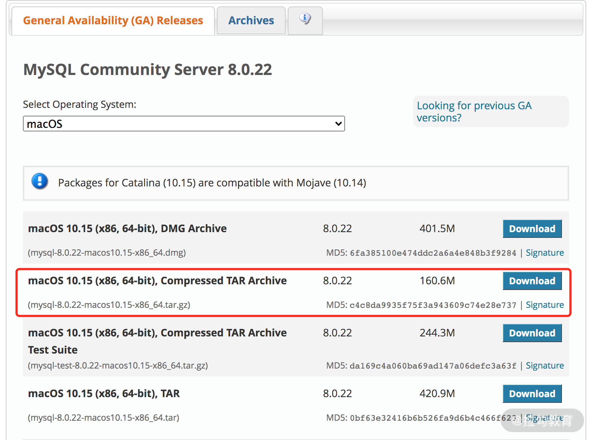
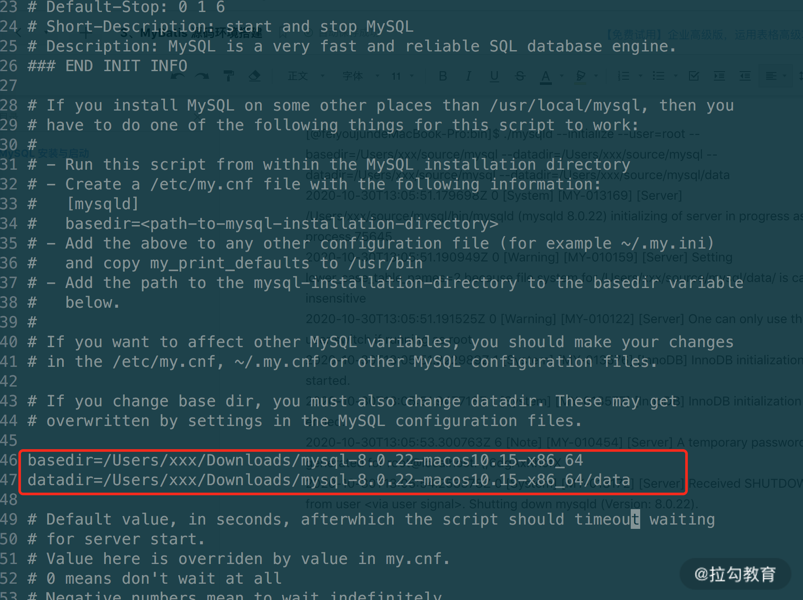
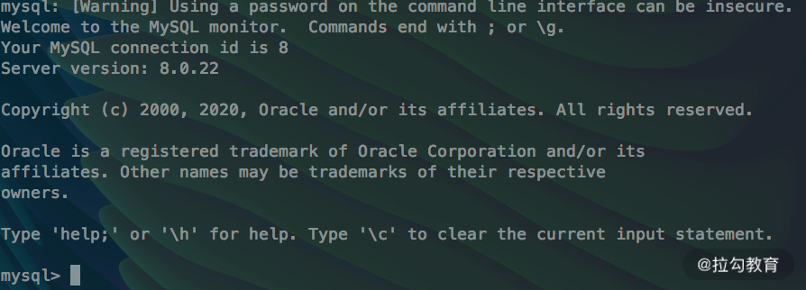
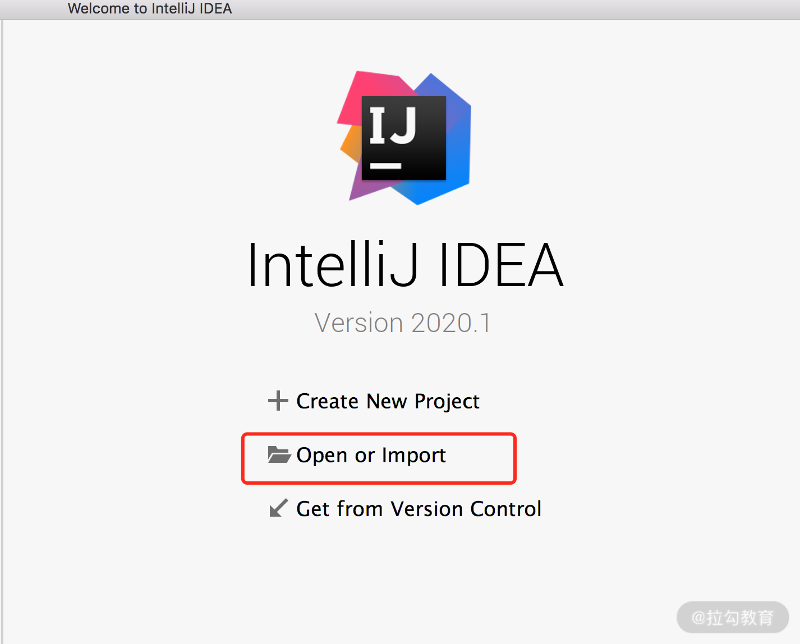
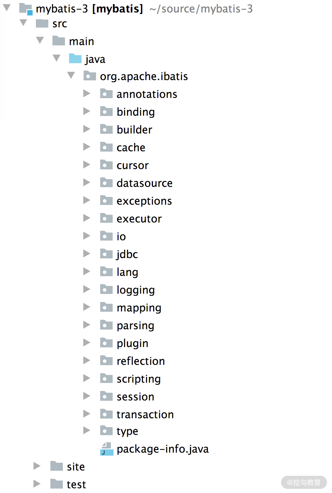
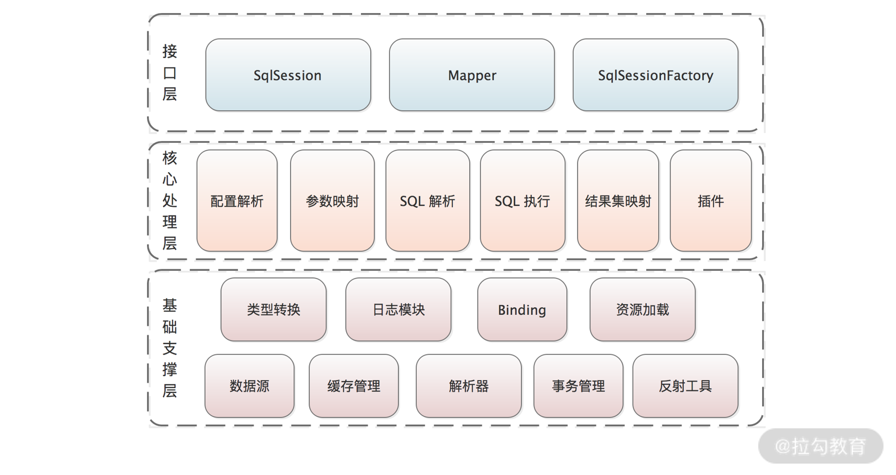
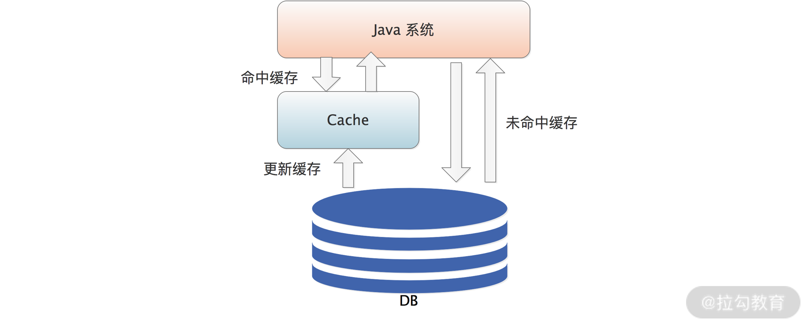

# 03 MyBatis 源码环境搭建及整体架构解析

在上一讲中，我通过一个订单系统的示例，展示了 MyBatis 在实践项目中的基本使用，以帮助你快速上手使用 MyBatis 框架。在这一讲，我就来带你搭建 MyBatis 源码调试的环境，并为你解析 MyBatis 的源码结构，这些都是在为后面的源码分析做铺垫。

### MySQL 安装与启动

**安装并启动一个关系型数据是调试 MyBatis 源码的基础** 。目前很多互联网公司都将 MySQL 作为首选数据库，所以这里我也就选用 MySQL 数据库来配合调试 MyBatis 源码。

#### 1. 下载 MySQL

首先，从 [MySQL 官网](https://dev.mysql.com/downloads/mysql/)下载最新版本的 MySQL Community Server。MySQL Community Server 是社区版本的 MySQL 服务端，可以免费试用。这里我选择使用 tar.gz 的方式进行安装，所以需要下载对应的 tar.gz 安装包，如下图红框所示：



MySQL 下载界面

#### 2. 配置 MySQL

下载完 tar.gz 安装包后，我执行如下命令，就可以解压缩该 tar.gz 包，得到 mysql-8.0.22-macos10.15-x86_64 目录。

```
tar -zxf mysql-8.0.22-macos10.15-x86_64.tar.gz
```

紧接着执行如下命令进入 support-files 目录：

```
cd ./mysql-8.0.22-macos10.15-x86_64/support-files
```

执行如下命令打开 mysql.server 文件进行编辑：

```
vim mysql.server
```

这里我需要将 basedir 和 datadir 变量分别设置为 MySQL 所在根目录以及 MySQL 目录下的 data 目录（如下图所示），最后再执行 :wq 命令保存 mysql.server 的修改并退出。



mysql.server 文件修改示例图

#### 3. 启动 MySQL

随后，我执行了如下命令，进入 MySQL 的 bin 目录：

```
cd ../bin/
```

并执行如下的 mysqld 命令，初始化 MySQL，但需要注意这里添加的参数信息，可以通过 basedir 和 datadir 参数指定根目录和 data 目录。

```
./mysqld --initialize --user=root --basedir=/Users/xxx/Downloads/mysql-8.0.22-macos10.15-x86_64 --datadir=/Users/xxx/Downloads/mysql-8.0.22-macos10.15-x86_64/data
```

正常完成初始化过程之后，就可以在命令行中得到 MySQL 的初始默认密码，如下图所示：


成功初始化 MySQL 示例图

通过该默认密码，我就可以启动并登录 MySQL 服务了，首先需要跳转到 support-files 目录中：

```
cd ../support-files/
```

然后执行如下命令，启动 MySQL 服务：

```
./mysql.server start
```

MySQL 服务正常启动之后，就可以看到如下图所示的输出：


成功启动 MySQL 示例图

#### 4. 登录 MySQL

接下来跳转到 bin 目录：

```
cd ../bin/
```

并执行如下命令，即可使用前面获得的默认密码登录到 MySQL。

```
./mysql -uroot -p'rAUhw9e&VPCs'
```

登录之后即可进入 MySQL Shell 中，如下图所示：



成功登录 MySQL 示例图

然后我就可以在 MySQL Shell 中修改密码，具体命令如下所示：

```
ALTER USER 'root'@'localhost' IDENTIFIED BY '新密码';
```

执行成功之后，下次再使用 MySQL Shell 连接的时候，就需要使用新密码进行登录了。

最后，如果要关闭 MySQL 服务，可以跳转到 support-files 目录下，执行如下命令即可：

```
cd ../support-files/
./mysql.server stop
```

得到如下输出，即表示 MySQL 服务成功关闭：


成功关闭 MySQL 示例图

这里还需要说明的是，在实际开发过程中，一般会使用到 MySQL 的图形界面客户端，例如 Navicat、MySQL Workbench Community Edition 等，一般只会在线上机器的 Linux 命令行中，才会直接使用 MySQL Shell 执行一些操作。

当然，我个人也很推荐你使用这些图形界面客户端，它可以提高你日常的开发效率。

### MyBatis 源码环境搭建

完成 MySQL 的安装和启动之后，就可以开始搭建 MyBatis 的源码环境了。

首先，需要安装 JDK、Maven、Git 等 Java 开发的基础环境，这些软件的安装这里我就不再展开介绍了，你应该已经都非常熟悉了。

接下来，执行下面的命令，即可从 GitHub 下载 MyBatis 的源码：

```
git clone https://github.com/mybatis/mybatis-3.git
```

网速不同，这个下载过程的耗时也会有所不同。下载完成后，可得到如下输出：


MyBatis 下载示例图

此时，在本地我就得到了一个 mybatis-3 目录，执行如下 cd 命令即可进入该目录：

```
cd ./mybatis-3/
```

然后执行如下 git 命令就可以切换分支（本课程是以 MyBatis 3.5.6 版本的代码为基础进行分析）：

```
git checkout -b mybatis-3.5.6 mybatis-3.5.6
```

切换完成之后，我还可以通过如下 git 命令查看分支切换是否成功：

```
git branch -vv
```

这里我得到了如下图所示的输出，这表示我已经切换到了 mybatis-3.5.6 这个 tag 上了。


git 分支示例图

最后，我打开 IDEA ，选择 Open or Import，导入 MyBatis 源码，如下图所示：



IDEA 导入选项图

导入完成之后，就可以看到 MyBatis 的源码结构，如下图所示：



MyBatis 的源码结构图

### MyBatis 架构简介

完成 MyBatis 源码环境搭建之后，我再来带你分析一下 MyBatis 的架构。

MyBatis 分为三层架构，分别是 **基础支撑层、核心处理层** 和 **接口层** ，如下图所示：



MyBatis 三层架构图

#### 1. 基础支撑层 **基础支撑层是整个 MyBatis 框架的地基，为整个 MyBatis 框架提供了非常基础的功能** ，其中每个模块都提供了一个内聚的、单一的能力，MyBatis 基础支撑层按照这些单一的能力可以划分为上图所示的九个基础模块

由于资源加载模块的功能非常简单，使用频率也不高，这里我就不介绍了，你若感兴趣可以自行查阅相关资料去了解和学习。下面我就来简单描述这剩下的八个模块的基本功能，在本课程第二个模块，我还会带你详细分析这些基础模块的具体实现。 **第一个，类型转换模块。** 在上一讲展示的订单系统实现中，我们可以在 mybatis-config.xml 配置文件中通过 `<typeAliase>` 标签为一个类定义一个别名，这里用到的“别名机制”就是由 MyBatis 基础支撑层中的类型转换模块实现的。

除了“别名机制”，类型转换模块还 **实现了 MyBatis 中 JDBC 类型与 Java 类型之间的相互转换** ，这一功能在绑定实参、映射 ResultSet 场景中都有所体现：

- 在 SQL 模板绑定用户传入实参的场景中，类型转换模块会将 Java 类型数据转换成 JDBC 类型数据；
- 在将 ResultSet 映射成结果对象的时候，类型转换模块会将 JDBC 类型数据转换成 Java 类型数据。

具体情况如下图所示：


类型转换基本功能示意图

**第二个，日志模块。** 日志是我们生产实践中排查问题、定位 Bug、锁定性能瓶颈的主要线索来源，在任何一个成熟系统中都会有级别合理、信息翔实的日志模块，MyBatis 也不例外。MyBatis 提供了日志模块来集成 Java 生态中的第三方日志框架，该模块目前可以集成 Log4j、Log4j2、slf4j 等优秀的日志框架。 **第三个，反射工具模块。** Java 中的反射功能非常强大，许多开源框架都会依赖反射实现一些相对灵活的需求，但是大多数 Java 程序员在实际工作中很少会直接使用到反射技术。MyBatis 的反射工具箱是在 Java 反射的基础之上进行的一层封装，为上层使用方提供更加灵活、方便的 API 接口，同时缓存 Java 的原生反射相关的元数据，提升了反射代码执行的效率，优化了反射操作的性能。 **第四个，Binding 模块。** 在上一讲介绍的订单系统示例中，我们可以通过 SqlSession 获取 Mapper 接口的代理，然后通过这个代理执行关联 Mapper.xml 文件中的数据库操作。通过这种方式，可以将一些错误提前到编译期，该功能就是通过 Binding 模块完成的。

这里特别说明的是，在使用 MyBatis 的时候，我们无须编写 Mapper 接口的具体实现，而是利用 Binding 模块自动生成 Mapper 接口的动态代理对象。有些简单的数据操作，我们还可以直接在 Mapper 接口中使用注解完成，连 Mapper.xml 配置文件都无须编写，但如果 ResultSet 映射以及动态 SQL 非常复杂，还是建议在 Mapper.xml 配置文件中维护会比较方便。 **第五个，数据源模块。** 持久层框架核心组件之一就是数据源，一款性能出众的数据源可以成倍提升系统的性能。MyBatis 自身提供了一套不错的数据源实现，也是 MyBatis 的默认实现。另外，在 Java 生态中，就有很多优异开源的数据源可供选择，MyBatis 的数据源模块中也提供了与第三方数据源集成的相关接口，这也为用户提供了更多的选择空间，提升了数据源切换的灵活性。 **第六个，缓存模块。** 数据库是实践生成中非常核心的存储，很多业务数据都会落地到数据库，所以数据库性能的优劣直接影响了上层业务系统的优劣。我们很多线上业务都是读多写少的场景，在数据库遇到瓶颈时，缓存是最有效、最常用的手段之一（如下图所示），正确使用缓存可以将一部分数据库请求拦截在缓存这一层，这就能够减少一部分数据库的压力，提高系统性能。



缓存模块结构图

除了使用 Redis、Memcached 等外置的第三方缓存以外，持久化框架一般也会自带内置的缓存，例如，MyBatis 就提供了一级缓存和二级缓存，具体实现位于基础支撑层的缓存模块中。 **第七个，解析器模块** 。在上一讲的订单系统示例中，我们可以看到 MyBatis 中有两大部分配置文件需要解析，一个是 mybatis-config.xml 配置文件，另一个是 Mapper.xml 配置文件。这两个文件都是由 MyBatis 的解析器模块进行解析的，其中主要是依赖 XPath 实现 XML 配置文件以及各类表达式的高效解析。 **第八个，事务管理模块。** 持久层框架一般都会提供一套事务管理机制实现数据库的事务控制，MyBatis 对数据库中的事务进行了一层简单的抽象，提供了简单易用的事务接口和实现。一般情况下，Java 项目都会集成 Spring，并由 Spring 框架管理事务。在后面的课程中，我还会深入讲解 MyBatis 与 Spring 集成的原理，其中就包括事务管理相关的集成。

#### 2. 核心处理层

介绍完 MyBatis 的基础支撑层之后，我们再来分析 MyBatis 的核心处理层。 **核心处理层是 MyBatis 核心实现所在，其中涉及 MyBatis 的初始化以及执行一条 SQL 语句的全流程** 。下面我就针对核心处理层中的各部分实现进行介绍。 **第一个，配置解析。** 我们知道，MyBatis 有三处可以添加配置信息的地方，分别是：mybatis-config.xml 配置文件、Mapper.xml 配置文件以及 Mapper 接口中的注解信息。在 MyBatis 初始化过程中，会加载这些配置信息，并将解析之后得到的配置对象保存到 Configuration 对象中。

例如，在订单系统示例中使用的 `<resultMap>` 标签（也就是自定义的查询结果集映射规则）会被解析成 ResultMap 对象。我们可以利用得到的 Configuration 对象创建 SqlSessionFactory 对象（也就是创建 SqlSession 对象的工厂对象），之后即可创建 SqlSession 对象执行数据库操作了。 **第二个，SQL 解析与 scripting 模块。** MyBatis 的最大亮点应该要数其动态 SQL 功能了，只需要通过 MyBatis 提供的标签即可根据实际的运行条件动态生成实际执行的 SQL 语句。MyBatis 提供的动态 SQL 标签非常丰富，包括 `<where>` 标签、`<if>` 标签、`<foreach>` 标签、`<set>` 标签等。 **MyBatis 中的 scripting 模块就是负责动态生成 SQL 的核心模块** 。它会根据运行时用户传入的实参，解析动态 SQL 中的标签，并形成 SQL 模板，然后处理 SQL 模板中的占位符，用运行时的实参填充占位符，得到数据库真正可执行的 SQL 语句。 **第三个，SQL 执行。** 在 MyBatis 中，要执行一条 SQL 语句，会涉及非常多的组件，比较核心的有：Executor、StatementHandler、ParameterHandler 和 ResultSetHandler。

其中，Executor 会调用事务管理模块实现事务的相关控制，同时会通过缓存模块管理一级缓存和二级缓存。SQL 语句的真正执行将会由 StatementHandler 实现。那具体是怎么完成的呢？StatementHandler 会先依赖 ParameterHandler 进行 SQL 模板的实参绑定，然后由 java.sql.Statement 对象将 SQL 语句以及绑定好的实参传到数据库执行，从数据库中拿到 ResultSet，最后，由 ResultSetHandler 将 ResultSet 映射成 Java 对象返回给调用方，这就是 SQL 执行模块的核心。

下图展示了 MyBatis 执行一条 SQL 语句的核心过程：


执行 SQL 语句的核心流程图 **第四个，插件。** 很多成熟的开源框架，都会以各种方式提供扩展能力。当框架原生能力不能满足某些场景的时候，就可以针对这些场景实现一些插件来满足需求，这样的框架才能有足够的生命力。这也是 MyBatis 插件接口存在的意义。

与此同时，在实际应用的时候，你也可以通过自定义插件来扩展 MyBatis，或者改变 MyBatis 的默认行为。因为插件会影响 MyBatis 内核的行为，所以在自定义插件之前，你必须非常了解 MyBatis 内部的运行原理，以避免写出不符合预期的插件，引入一些诡异的功能 Bug 或性能问题。

#### 3. 接口层 **接口层是 MyBatis 暴露给调用的接口集合** ，这些接口都是使用 MyBatis 时最常用的一些接口，例如，SqlSession 接口、SqlSessionFactory 接口等。其中，最核心的是 SqlSession 接口，你可以通过它实现很多功能，例如，获取 Mapper 代理、执行 SQL 语句、控制事务开关等

### 总结

在今天这一讲，我为你详细讲解了 MyBatis 源码环境的搭建流程以及其核心模块的功能。

- 首先，我带你安装了最新版本的 MySQL 数据库，并成功启动了 MySQL 实例，你可以按照我所列的步骤一步一步去操作、去实现。
- 其次，我又下载了 MyBatis 的源码并导入 IDEA 中，这个不是特别麻烦，还是比较好操作的。
- 最后，我又详细介绍了 MyBatis 的三层架构以及其中各个模块的核心功能，这是我们课程模块设置的基础，同时，掌握这些知识点也可以为后面学习源码打好基础。

在了解了 MyBatis 的三层架构之后，你可以简单思考一下，MyBatis 这种架构都带来了哪些好处呢？期待在留言区看到你的分享。
