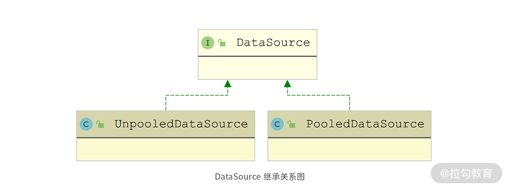
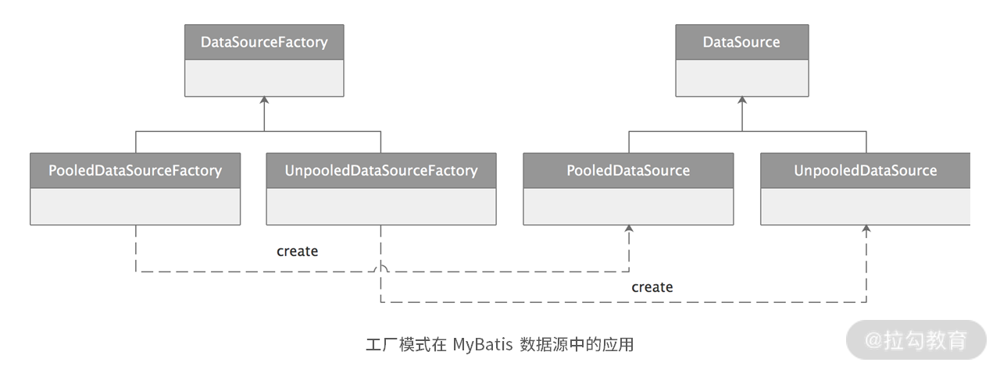
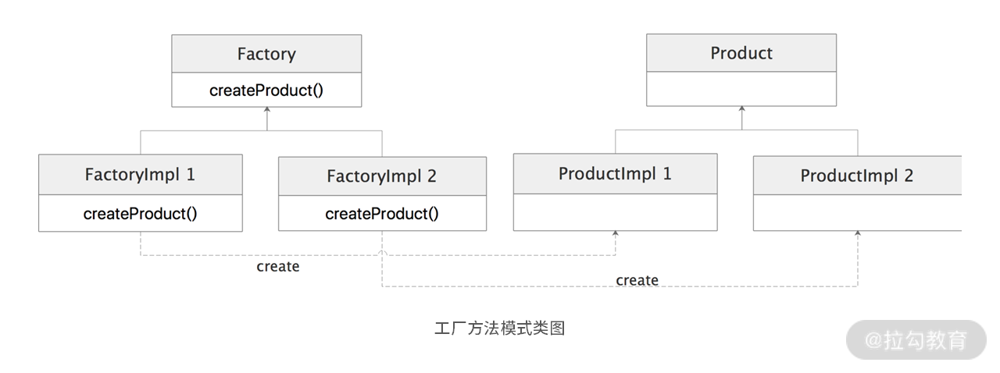
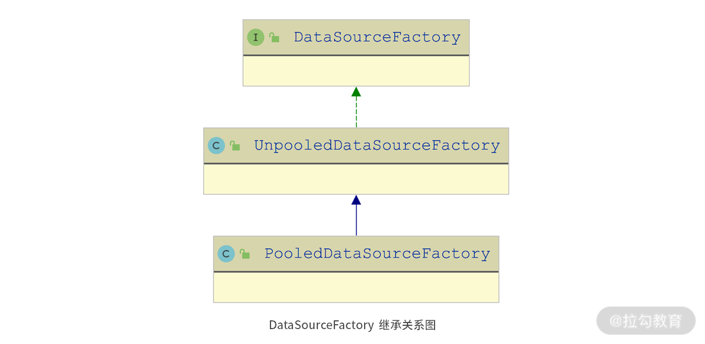
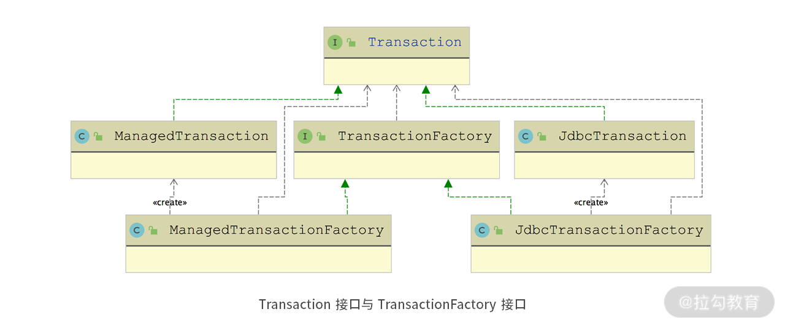

# 07 深入数据源和事务，把握持久化框架的两个关键命脉

数据源是持久层框架中最核心的组件之一，在实际工作中比较常见的数据源有 C3P0、Apache Common DBCP、Proxool 等。作为一款成熟的持久化框架，MyBatis 不仅自己提供了一套数据源实现，而且还能够方便地集成第三方数据源。

**javax.sql.DataSource 是 Java 语言中用来抽象数据源的接口**，其中定义了所有数据源实现的公共行为，MyBatis 自身提供的数据源实现也要实现该接口。MyBatis 提供了两种类型的数据源实现，分别是 PooledDataSource 和 UnpooledDataSource，继承关系如下图所示：



针对不同的 DataSource 实现，MyBatis 提供了不同的工厂实现来进行创建，如下图所示，这是工厂方法模式的一个典型应用场景。

**编写一个设计合理、性能优秀的数据源只是第一步 **，在通过数据源拿到数据库连接之后，还需要开启事务，才能进行数据的修改。MyBatis 对数据库事务进行了一层抽象，也就是我们这一讲后面要介绍的 Transaction 接口，它可以** 管理事务的开启、提交和回滚**。

### 工厂方法模式

工厂方法模式中定义了 Factory 这个工厂接口，如下图所示，其中定义了 createProduct() 方法创建右侧继承树中的对象，不同的工厂接口实现类会创建右侧继承树中不同 Product 实现类（例如 ProductImpl 1 和 ProductImpl 2）。



从上图中，我们可以看到工厂方法模式由四个核心角色构成。

- Factory 接口：工厂方法模式的核心接口之一。使用方会依赖 Factory 接口创建 Product 对象实例。
- Factory 实现类（图中的 FactoryImpl 1 和 FactoryImpl 2）：用于创建 Product 对象。不同的 Factory 实现会根据需求创建不同的 Product 实现类。
- Product 接口：用于定义业务类的核心功能。Factory 接口创建出来的所有对象都需要实现 Product 接口。使用方依赖 Product 接口编写其他业务实现，所以使用方关心的是 Product 接口这个抽象，而不是其中的具体实现逻辑。
- Product 实现类（图中的 ProductImpl 1 和 ProductImpl 2）：实现了 Product 接口中定义的方法，完成了具体的业务逻辑。

这里假设一个场景：目前我们要做一个注册中心模块，已经有了 ZookeeperImpl 和 EtcdImpl 两个业务实现类，分别支持了与 ZooKeeper 交互和与 etcd 交互，此时来了个新需求，需要支持与 Consul 交互。该怎么解决这个需求呢？那就是使用工厂方法模式，我们只需要添加新的 ConsulFactory 实现类和 ConsulImpl 实现类即可完成扩展。

通过上面这个场景的描述，你可以看出： **工厂方法模式最终也是符合“开放-封闭”原则的，可以通过添加新的 Factory 接口实现和 Product 接口实现来扩展整个体系的功能** 。另外，工厂方法模式对使用方暴露的是 Factory 和 Product 这两个抽象的接口，而不是具体的实现，也就帮助使用方面向接口编程。

### 数据源工厂

了解了工厂方法模式的基础知识之后，下面我们回到 MyBatis 的数据源实现上来。\*\*MyBatis 的数据源模块也是用到了工厂方法模式，如果需要扩展新的数据源实现时，只需要添加对应的 Factory 实现类，新的数据源就可以被 MyBatis 使用。\*\*DataSourceFactory 接口就扮演了 MyBatis 数据源实现中的 Factory 接口角色。UnpooledDataSourceFactory 和 PooledDataSourceFactory 实现了 DataSourceFactory 接口，也就是 Factory 接口实现类的角色。三者的继承关系如下图所示：



DataSourceFactory 接口中最核心的方法是 getDataSource() 方法，该方法用来生成一个 DataSource 对象。

在 UnpooledDataSourceFactory 这个实现类的初始化过程中，会直接创建 UnpooledDataSource 对象，其中的 dataSource 字段会指向该 UnpooledDataSource 对象。接下来调用的 setProperties() 方法会根据传入的配置信息，完成对该 UnpooledDataSource 对象相关属性的设置。

UnpooledDataSourceFactory 对于 getDataSource() 方法的实现就相对简单了，其中直接返回了上面创建的 UnpooledDataSource 对象。

从前面介绍的 DataSourceFactory 继承关系图中可以看到，**PooledDataSourceFactory 是通过继承 UnpooledDataSourceFactory 间接实现了 DataSourceFactory 接口**。在 PooledDataSourceFactory 中并没有覆盖 UnpooledDataSourceFactory 中的任何方法，唯一的变化就是将 dataSource 字段指向的 DataSource 对象类型改为 PooledDataSource 类型。

### DataSource**JDK 提供的 javax.sql.DataSource 接口在 MyBatis 数据源中扮演了 Product 接口的角色。** MyBatis 提供的数据源实现有两个，一个 UnpooledDataSource 实现，另一个 PooledDataSource 实现，它们都是 Product 具体实现类的角色

#### 1. UnpooledDataSource

我们先来看 UnpooledDataSource 的实现，其中的核心字段有如下。

- driverClassLoader（ClassLoader 类型）：加载 Driver 类的类加载器。
- driverProperties（Properties 类型）：数据库连接驱动的相关配置。
- registeredDrivers（Map\<String, Driver> 类型）：缓存所有已注册的数据库连接驱动。
- defaultTransactionIsolationLevel（Integer 类型）：事务隔离级别。

**在 Java 世界中，几乎所有数据源实现的底层都是依赖 JDBC 操作数据库的，而使用 JDBC 的第一步就是向 DriverManager 注册 JDBC 驱动类，之后才能创建数据库连接。**

DriverManager 中定义了 registeredDrivers 字段用于记录注册的 JDBC 驱动，这是一个 CopyOnWriteArrayList 类型的集合，是线程安全的。

MyBatis 的 UnpooledDataSource 实现中定义了如下静态代码块，从而在 UnpooledDataSource 加载时，将已在 DriverManager 中注册的 JDBC 驱动器实例复制一份到 UnpooledDataSource.registeredDrivers 集合中。

```
static {
    // 从DriverManager中读取JDBC驱动
    Enumeration<Driver> drivers = DriverManager.getDrivers();
    while (drivers.hasMoreElements()) {
        Driver driver = drivers.nextElement();
        // 将DriverManager中的全部JDBC驱动记录到registeredDrivers集合
        registeredDrivers.put(driver.getClass().getName(), driver);
    }
}
```

在 getConnection() 方法中，UnpooledDataSource 会调用 doGetConnection() 方法获取数据库连接，具体实现如下：

```
private Connection doGetConnection(Properties properties) throws SQLException {
    // 初始化数据库驱动
    initializeDriver();
    // 创建数据库连接
    Connection connection = DriverManager.getConnection(url, properties);
    // 配置数据库连接
    configureConnection(connection);
    return connection;
}
```

这里需要注意两个方法：

- 在调用的 initializeDriver() 方法中，完成了 JDBC 驱动的初始化，其中会创建配置中指定的 Driver 对象，并将其注册到 DriverManager 以及上面介绍的 UnpooledDataSource.registeredDrivers 集合中保存；
- configureConnection() 方法会对数据库连接进行一系列配置，例如，数据库连接超时时长、事务是否自动提交以及使用的事务隔离级别。

#### 2. PooledDataSource

JDBC 连接的创建是非常耗时的，从数据库这一侧看，能够建立的连接数也是有限的，所以在绝大多数场景中，我们都 **需要使用数据库连接池来缓存、复用数据库连接** 。

使用池化技术缓存数据库连接会带来很多好处，例如：

- 在空闲时段 **缓存** 一定数量的数据库连接备用，防止被突发流量冲垮；
- 实现数据库连接的 **重用** ，从而提高系统的响应速度；
- **控制**数据库连接上限，防止连接过多造成数据库假死；
- **统一**管理数据库连接，避免连接泄漏。

数据库连接池在初始化时，一般会**同时初始化特定数量的数据库连接，并缓存在连接池中备用**。当我们需要操作数据库时，会从池中获取连接；当使用完一个连接的时候，会将其释放。这里需要说明的是，在使用连接池的场景中，并不会直接将连接关闭，而是将连接返回到池中缓存，等待下次使用。

数据库连接池中缓存的连接总量是有上限的，不仅如此，连接池中维护的空闲连接数也是有上限的，下面是使用数据库连接池时几种特殊场景的描述。

- 如果连接池中维护的总连接数达到上限，且所有连接都已经被调用方占用，则后续获取数据库连接的线程将会被阻塞（进入阻塞队列中等待），直至连接池中出现可用的数据库连接，这个可用的连接是由其他使用方释放得到的。
- 如果连接池中空闲连接数达到了配置上限，则后续返回到池中的空闲连接不会进入连接池缓存，而是直接关闭释放掉，这主要是为了减少维护空闲数据库连接带来的压力，同时减少数据库的资源开销。
- 如果将连接总数的上限值设置得过大，可能会导致数据库因连接过多而僵死或崩溃，影响整个服务的可用性；而如果设置得过小，可能会无法完全发挥出数据库的性能，造成数据库资源的浪费。
- 如果将空闲连接数的上限值设置得过大，可能会造成服务资源以及数据库资源的浪费，毕竟要维护这些空闲连接；如果设置得过小，当出现瞬间峰值请求时，服务的响应速度就会比较慢。

因此，在设置数据库连接池的最大连接数以及最大空闲连接数时，需要进行折中和权衡，当然也要执行一些性能测试来辅助我们判断。

介绍完了数据库连接池的基础知识之后，我们再来看 PooledDataSource 实现中提供的数据库连接池的相关实现。

在 PooledDataSource 中并没有直接维护数据库连接的集合，而是维护了一个 PooledState 类型的字段（state 字段），而 **这个 PooledState 才是管理连接的地方** 。在 PooledState 中维护的数据库连接并不是真正的数据库连接（不是 java.sql.Connection 对象），而是 PooledConnection 对象。

##### （1）PooledConnection

**PooledConnection 是 MyBatis 中定义的一个 InvocationHandler 接口实现类**，其中封装了真正的 java.sql.Connection 对象以及相关的代理对象，这里的代理对象就是通过上一讲介绍的 JDK 动态代理产生的。

下面来看 PooledConnection 中的核心字段。

- dataSource（PooledDataSource 类型）：记录当前 PooledConnection 对象归属的 PooledDataSource 对象。也就是说，当前的 PooledConnection 是由该 PooledDataSource 对象创建的；在通过 close() 方法关闭当前 PooledConnection 的时候，当前 PooledConnection 会被返还给该 PooledDataSource 对象。
- realConnection（Connection 类型）：当前 PooledConnection 底层的真正数据库连接对象。
- proxyConnection（Connection 类型）：指向了 realConnection 数据库连接的代理对象。
- checkoutTimestamp（long 类型）：使用方从连接池中获取连接的时间戳。
- createdTimestamp（long 类型）：连接创建的时间戳。
- lastUsedTimestamp（long 类型）：连接最后一次被使用的时间戳。
- connectionTypeCode（int 类型）：数据库连接的标识。该标识是由数据库 URL、username 和 password 三部分组合计算出来的 hash 值，主要用于连接对象确认归属的连接池。
- valid（boolean 类型）：用于标识 PooledConnection 对象是否有效。该字段的主要目的是防止使用方将连接归还给连接池之后，依然保留该 PooledConnection 对象的引用并继续通过该 PooledConnection 对象操作数据库。

下面来看 PooledConnection 的构造方法，其中会初始化上述字段，这里尤其关注 proxyConnection 这个 Connection 代理对象的初始化，使用的是 JDK 动态代理的方式实现的，其中传入的 InvocationHandler 实现正是 PooledConnection 自身。

**PooledConnection.invoke() 方法中只对 close() 方法进行了拦截**，具体实现如下：

```
public Object invoke(Object proxy, Method method, Object[] args) throws Throwable {
    String methodName = method.getName();
    if (CLOSE.equals(methodName)) {
        // 如果调用close()方法，并没有直接关闭底层连接，而是将其归还给关联的连接池
        dataSource.pushConnection(this);
        return null;
    }
    if (!Object.class.equals(method.getDeclaringClass())) {
        // 只要不是Object的方法，都需要检测当前PooledConnection是否可用
        checkConnection();
    }
    // 调用realConnection的对应方法
    return method.invoke(realConnection, args);
}
```

##### （2）PoolState

接下来看**PoolState **这个类，它** 负责管理连接池中所有 PooledConnection 对象的状态**，维护了两个 ArrayList `<PooledConnection>` 集合按照 PooledConnection 对象的状态分类存储，其中 idleConnections 集合用来存储空闲状态的 PooledConnection 对象，activeConnections 集合用来存储活跃状态的 PooledConnection 对象。

另外，PoolState 中还定义了多个 long 类型的统计字段。

- requestCount：请求数据库连接的次数。
- accumulatedRequestTime：获取连接的累积耗时。
- accumulatedCheckoutTime：所有连接的 checkoutTime 累加。PooledConnection 中有一个 checkoutTime 属性，表示的是使用方从连接池中取出连接到归还连接的总时长，也就是连接被使用的时长。
- claimedOverdueConnectionCount：当连接长时间未归还给连接池时，会被认为该连接超时，该字段记录了超时的连接个数。
- accumulatedCheckoutTimeOfOverdueConnections：记录了累积超时时间。
- accumulatedWaitTime：当连接池全部连接已经被占用之后，新的请求会阻塞等待，该字段就记录了累积的阻塞等待总时间。
- hadToWaitCount：记录了阻塞等待总次数。
- badConnectionCount：无效的连接数。

#### （3）获取连接

在了解了 PooledConnection 和 PooledState 的核心实现之后，我们再来看 PooledDataSource 实现，这里按照使用方的逻辑依次分析 PooledDataSource 的核心方法。

首先是 getConnection() 方法，其中先是依赖 popConnection() 方法获取 PooledConnection 对象，然后从 PooledConnection 中获取数据库连接的代理对象（即前面介绍的 proxyConnection 字段）。

**这里调用的 popConnection() 方法是从连接池中获取数据库连接的核心**，具体步骤如下。

1. 检测当前连接池中是否有空闲的有效连接，如果有，则直接返回连接；如果没有，则继续执行下一步。
1. 检查连接池当前的活跃连接数是否已经达到上限值，如果未达到，则尝试创建一个新的数据库连接，并在创建成功之后，返回新建的连接；如果已达到最大上限，则往下执行。
1. 检查活跃连接中是否有连接超时，如果有，则将超时的连接从活跃连接集合中移除，并重复步骤 2；如果没有，则执行下一步。
1. 当前请求数据库连接的线程阻塞等待，并定期执行前面三步检测相应的分支是否可能获取连接。

下面是 popConnection() 方法的具体实现代码：

```
private PooledConnection popConnection(String username, String password) throws SQLException {
    while (conn == null) {
        synchronized (state) { // 加锁同步
            // 步骤1：检测空闲连接集合
            if (!state.idleConnections.isEmpty()) { 
                // 获取空闲连接
                conn = state.idleConnections.remove(0);
            } else { // 没有空闲连接
                // 步骤2：活跃连接数没有到上限值，则创建新连接
                if (state.activeConnections.size() < poolMaximumActiveConnections) {
                    // 创建新数据库连接，并封装成PooledConnection对象
                    conn = new PooledConnection(dataSource.getConnection(), this);
                } else {// 活跃连接数已到上限值，则无法创建新连接
                    // 步骤3：检测超时连接
                    // 获取最早的活跃连接
                    PooledConnection oldestActiveConnection = state.activeConnections.get(0);
                    long longestCheckoutTime = oldestActiveConnection.getCheckoutTime();
                    // 检测该连接是否超时
                    if (longestCheckoutTime > poolMaximumCheckoutTime) {
                        // 对超时连接的信息进行统计
                        state.claimedOverdueConnectionCount++;
                        state.accumulatedCheckoutTimeOfOverdueConnections += longestCheckoutTime;
                        state.accumulatedCheckoutTime += longestCheckoutTime;
                        // 将超时连接移出activeConnections集合
                        state.activeConnections.remove(oldestActiveConnection);
                        // 如果超时连接上有未提交的事务，则自动回滚
                        if (!oldestActiveConnection.getRealConnection().getAutoCommit()) {
                            try {
                                oldestActiveConnection.getRealConnection().rollback();
                            } catch (SQLException e) {
                            }
                        }
                        // 创建新PooledConnection对象，但是真正的数据库连接
                        conn = new PooledConnection(oldestActiveConnection.getRealConnection(), this);
                        conn.setCreatedTimestamp(oldestActiveConnection.getCreatedTimestamp());
                        conn.setLastUsedTimestamp(oldestActiveConnection.getLastUsedTimestamp());
                        // 将超时PooledConnection设置为无效
                        oldestActiveConnection.invalidate();
                    } else {
                        // 步骤4：无空闲连接、无法创建新连接且无超时连接，则只能阻塞等待
                        if (!countedWait) { // 统计阻塞等待次数
                            state.hadToWaitCount++;
                            countedWait = true;
                        }
                        long wt = System.currentTimeMillis();
                        state.wait(poolTimeToWait);// 阻塞等待
                        // 统计累积的等待时间
                        state.accumulatedWaitTime += System.currentTimeMillis() - wt;
                    }
                }
            }
            if (conn != null) { // 对连接进行统计
                if (conn.isValid()) { // 检测PooledConnection是否有效
                    // 配置PooledConnection的相关属性，设置connectionTypeCode、checkoutTimestamp、lastUsedTimestamp字段的值
                    conn.setConnectionTypeCode(assembleConnectionTypeCode(dataSource.getUrl(), username, password));
                    conn.setCheckoutTimestamp(System.currentTimeMillis());
                    conn.setLastUsedTimestamp(System.currentTimeMillis());
                    state.activeConnections.add(conn); // 添加到活跃连接集合
                    state.requestCount++;
                    state.accumulatedRequestTime += System.currentTimeMillis() - t;
                } else { 
                    ... ...// 统计失败的情况
                }
            }
        }
    }
    return conn;
}
```

##### （4）释放连接

前面介绍 PooledConnection 的时候，我们提到当调用 proxyConnection 对象的 close() 方法时，连接并没有真正关闭，而是**通过 PooledDataSource.pushConnection() 方法将 PooledConnection 归还给了关联的 PooledDataSource**。pushConnection() 方法的关键步骤如下所示。

1. 从活跃连接集合（即前面提到的 activeConnections 集合）中删除传入的 PooledConnection 对象。
1. 检测该 PooledConnection 对象是否可用。如果连接已不可用，则递增 badConnectionCount 字段进行统计，之后，直接丢弃 PooledConnection 对象即可。如果连接依旧可用，则执行下一步。
1. 检测当前 PooledDataSource 连接池中的空闲连接是否已经达到上限值。如果达到上限值，则 PooledConnection 无法放回到池中，正常关闭其底层的数据库连接即可。如果未达到上限值，则继续执行下一步。
1. 将底层连接重新封装成 PooledConnection 对象，并添加到空闲连接集合（也就是前面提到的 idleConnections 集合），然后唤醒所有阻塞等待空闲连接的线程。

介绍完关键步骤之后，我们来具体分析 pushConnection() 方法的核心实现：

```
protected void pushConnection(PooledConnection conn) throws SQLException {
    synchronized (state) {
        state.activeConnections.remove(conn); // 步骤1：从活跃连接集合中删除该连接
        if (conn.isValid()) {// 步骤2：检测该 PooledConnection 对象是否可用
            // 步骤3：检测当前PooledDataSource连接池中的空闲连接是否已经达到上限值
            if (state.idleConnections.size() < poolMaximumIdleConnections && conn.getConnectionTypeCode() == expectedConnectionTypeCode) {
                // 累计增加accumulatedCheckoutTime
                state.accumulatedCheckoutTime += conn.getCheckoutTime();
                if (!conn.getRealConnection().getAutoCommit()) {
                    // 回滚未提交的事务
                    conn.getRealConnection().rollback();
                }
                // 步骤4：将底层连接重新封装成PooledConnection对象，
                // 并添加到空闲连接集合（也就是前面提到的 idleConnections 集合）
                PooledConnection newConn = new PooledConnection(conn.getRealConnection(), this);
                state.idleConnections.add(newConn);
                // 设置新PooledConnection对象的创建时间戳和最后使用时间戳
                newConn.setCreatedTimestamp(conn.getCreatedTimestamp());
                newConn.setLastUsedTimestamp(conn.getLastUsedTimestamp());
                conn.invalidate(); // 丢弃旧PooledConnection对象
                // 唤醒所有阻塞等待空闲连接的线程
                state.notifyAll();
            } else {
                // 当前PooledDataSource连接池中的空闲连接已经达到上限值
                // 当前数据库连接无法放回到池中
                // 累计增加accumulatedCheckoutTime
                state.accumulatedCheckoutTime += conn.getCheckoutTime();
                if (!conn.getRealConnection().getAutoCommit()) {
                    // 回滚未提交的事务
                    conn.getRealConnection().rollback();
                }
                // 关闭真正的数据库连接
                conn.getRealConnection().close();
                // 将PooledConnection对象设置为无效
                conn.invalidate(); 
            }
        } else {
            // 统计无效PooledConnection对象个数
            state.badConnectionCount++; 
        }
    }
}
```

#### （5）检测连接可用性

通过对上述 pushConnection() 方法和 popConnection() 方法的分析，我们大致了解了 PooledDataSource 的核心实现。正如我们看到的那样，**这两个方法都需要检测一个数据库连接是否可用，这是通过 PooledConnection.isValid() 方法实现的**，在该方法中会检测三个方面：

- valid 字段值为 true；
- realConnection 字段值不为空；
- 执行 PooledDataSource.pingConnection() 方法，返回值为 true。

只有这三个条件都成立，才认为这个 PooledConnection 对象可用。其中，PooledDataSource.pingConnection() 方法会尝试请求数据库，并执行一条测试 SQL 语句，检测是否真的能够访问到数据库，该方法的核心代码如下：

```
protected boolean pingConnection(PooledConnection conn) {
    boolean result = true; // 记录此次ping操作是否成功完成
    try {
        // 检测底层数据库连接是否已经关闭
        result = !conn.getRealConnection().isClosed();
    } catch (SQLException e) {
        result = false;
    }
    // 如果底层与数据库的网络连接没断开，则需要检测poolPingEnabled字段的配置，决定
    // 是否能执行ping操作。另外，ping操作不能频繁执行，只有超过一定时长
    // (超过poolPingConnectionsNotUsedFor指定的时长)未使用的连接，才需要ping
    // 操作来检测数据库连接是否正常
    if (result && poolPingEnabled && poolPingConnectionsNotUsedFor >= 0
            && conn.getTimeElapsedSinceLastUse() > poolPingConnectionsNotUsedFor) {
        try {
            // 执行poolPingQuery字段中记录的测试SQL语句
            Connection realConn = conn.getRealConnection();
            try (Statement statement = realConn.createStatement()) {
                statement.executeQuery(poolPingQuery).close();
            }
            if (!realConn.getAutoCommit()) {
                realConn.rollback();
            }
            result = true; // 不抛异常，即为成功
        } catch (Exception e) {
            conn.getRealConnection().close();
            result = false;  // 抛异常，即为失败
        }
    }
    return result;
}
```

### 事务接口

介绍完 MyBatis 对数据源的实现之后，我们接下来看与数据源紧密关联的另一个概念——事务。

当我们从数据源中得到一个可用的数据库连接之后，就可以开启一个数据库事务了，事务成功开启之后，我们才能修改数据库中的数据。在修改完成之后，我们需要提交事务，完成整个事务内的全部修改操作，如果修改过程中出现异常，我们也可以回滚事务，放弃整个事务中的全部修改操作。

可见， **控制事务在一个以数据库为基础的服务中，是一件非常重要的工作** 。为此，MyBatis 专门抽象出来一个 Transaction 接口，好在相较于我们上面讲述的数据源，这部分内容还是比较简单、比较好理解的。

**Transaction 接口是 MyBatis 中对数据库事务的抽象 **，其中定义了** 提交事务、回滚事务 **，以及** 获取事务底层数据库连接**的方法。

JdbcTransaction、ManagedTransaction 是 MyBatis 自带的两个 Transaction 接口实现，这里也使用到了工厂方法模式，如下图所示：

**TransactionFactory 是用于创建 Transaction 的工厂接口**，其中最核心的方法是 newTransaction() 方法，它会根据数据库连接或数据源创建 Transaction 对象。

JdbcTransactionFactory 和 ManagedTransactionFactory 是 TransactionFactory 的两个实现类，分别用来创建 JdbcTransaction 对象和 ManagedTransaction 对象，具体实现比较简单，这里就不再展示，你若感兴趣的话可以参考[源码](https://github.com/xxxlxy2008/mybatis)进行学习。

接下来，我们看一下 JdbcTransaction 的实现，其中维护了事务关联的数据库连接以及数据源对象，同时还记录了事务自身的属性，例如，事务隔离级别和是否自动提交。

在构造函数中，JdbcTransaction 并没有立即初始化数据库连接（也就是 connection 字段），connection 字段会被延迟初始化，具体的初始化时机是在调用 getConnection() 方法时，通过dataSource.getConnection() 方法完成初始化。

在日常使用数据库事务的时候，我们最常用的操作就是提交和回滚事务，Transaction 接口将这两个操作抽象为 commit() 方法和 rollback() 方法。在 commit() 方法和 rollback() 方法中，JdbcTransaction 都是通过 java.sql.Connection 的同名方法实现事务的提交和回滚的。

ManagedTransaction 的实现相较于 JdbcTransaction 来说，有些许类似，也是依赖关联的 DataSource 获取数据库连接，但其 commit()、rollback() 方法都是空实现，事务的提交和回滚都是**依靠容器管理**的，这也是它被称为 ManagedTransaction 的原因。

另外，与 JdbcTransaction 不同的是，ManagedTransaction 会根据初始化时传入的 closeConnection 值确定是否在事务关闭时，同时关闭关联的数据库连接（即调用其 close() 方法）。

### 总结

在这一讲，我重点介绍了 MyBatis 中非常重要的两个概念——数据源和事务。

- 首先，讲解了 MyBatis 数据源模块中用到的工厂方法模式的基础知识。
- 然后，深入分析了 DataSourceFactory 和 DataSource 接口的核心实现，其中重点介绍了 PooledDataSource 这个连接池实现。
- 最后，还分析了 MyBatis 对数据库事务的一层简单抽象，也就是 Transaction 接口及其实现，这部分内容还是比较简单的。
