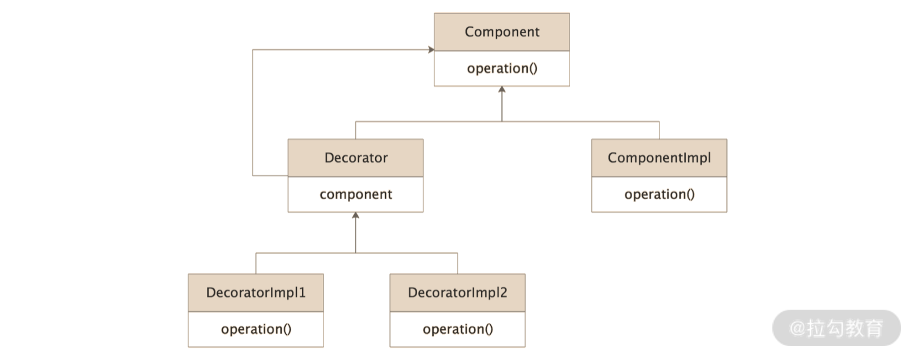
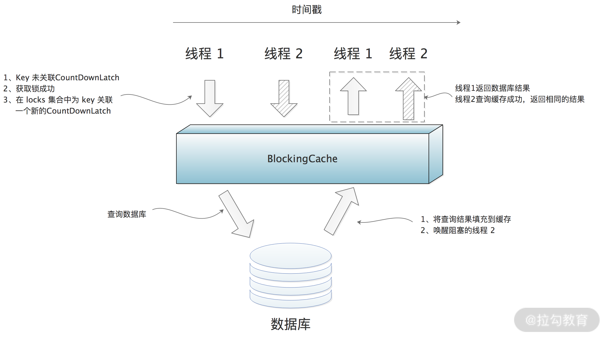

09 基于 MyBatis 缓存分析装饰器模式的最佳实践
============================

缓存是优化数据库性能的常用手段之一，我们在实践中经常使用的是 Memcached、Redis 等外部缓存组件，很多持久化框架提供了集成这些外部缓存的功能，同时自身也提供了内存级别的缓存，MyBatis 作为持久化框架中的佼佼者，自然也提供了这些功能。

MyBatis 的缓存分为一级缓存、二级缓存两个级别，并且都实现了 Cache 接口，所以这一讲我们就重点来介绍 Cache 接口及其核心实现类，这也是一级缓存和二级缓存依赖的基础实现。

不过在讲解这些内容之前，我先来介绍下装饰器模式，因为 Cache 模块除了提供基础的缓存功能外，还提供了多种扩展功能，而这些功能都是通过装饰器的形式提供的。

### 装饰器模式

我们在做一个产品的时候，需求会以多期的方式执行，随着产品的不断迭代，新需求也会不断出现，我们开始设计一个类的时候，可能并没有考虑到新需求的场景，此时就需要为某些组件添加新的功能来满足这些需求。

如果要符合开放-封闭的原则，我们最好不要直接修改已有的具体实现类，因为会破坏其已有的稳定性，在自测、集成测试以及线上回测的时候，除了要验证新需求外，还要回归测试波及的历史功能，这是让开发人员和测试人员都非常痛苦的地方，也是违反开放-封闭原则带来的最严重的问题之一。

除了修改原有实现之外，还有一种修改方案，那就是 **继承，也就是需要创建一个新的子类，然后在子类中覆盖父类的相关方法，并添加实现新需求的扩展** 。

但继承在某些场景下是不可行的，例如，要覆盖的方法被 final 关键字修饰了，那么在 Java 的语法中就无法被覆盖。使用继承方案的另一个缺点就是整个继承树的膨胀，例如，当新需求存在多种排列组合或是复杂的判断时，那就需要写非常多的子类实现。

正是由于这些缺点的存在，所以应该尽量多地使用组合方式进行扩展，尽量少使用继承方式进行扩展，除非迫不得已。

**装饰器模式就是一种通过组合方式实现扩展的设计模式 **，它可以完美地解决上述功能增强的问题。装饰器的核心思想是为已有实现类创建多个包装类，由这些新增的包装类完成新需求的扩展。** 装饰器模式使用的是组合方式，相较于继承这种静态的扩展方式，装饰器模式可以在运行时根据系统状态，动态决定为一个实现类添加哪些扩展功能。**

装饰器模式的核心类图，如下所示：



装饰器模式类图

从图中可以看到，装饰器模式中的核心类主要有下面四个。

* Component 接口：已有的业务接口，是 **整个功能的核心抽象** ，定义了 Decorator 和 ComponentImpl 这些实现类的核心行为。JDK 中的 IO 流体系就使用了装饰器模式，其中的 InputStream 接口就扮演了 Component 接口的角色。
* ComponentImpl 实现类：实现了上面介绍的 Component 接口，其中 **实现了 Component 接口最基础、最核心的功能** ，也就是被装饰的、原始的基础类。在 JDK IO 流体系之中的 FileInputStream 就扮演了 ComponentImpl 的角色，它实现了读取文件的基本能力，例如，读取单个 byte、读取 byte\[\] 数组。
* Decorator 抽象类：所有装饰器的父类，实现了 Component 接口， **其核心不是提供新的扩展能力，而是封装一个 Component 类型的字段，也就是被装饰的目标对象** 。需要注意的是，这个被装饰的对象可以是 ComponentImpl 对象，也可以是 Decorator 实现类的对象，之所以这么设计，就是为了实现下图的装饰器嵌套。这里的 DecoratorImpl1 装饰了 DecoratorImpl2，DecoratorImpl2 装饰了 ComponentImpl，经过了这一系列装饰之后得到的 Component 对象，除了具有 ComponentImpl 的基础能力之外，还拥有了 DecoratorImpl1 和 DecoratorImpl2 的扩展能力。JDK IO 流体系中的 FilterInputStream 就扮演了 Decorator 的角色。


Decorator 与 Component 的引用关系

* DecoratorImpl1、DecoratorImpl2：Decorator 的具体实现类，它们的 **核心就是在被装饰对象的基础之上添加新的扩展功能** 。在 JDK IO 流体系中的 BufferedInputStream 就扮演了 DecoratorImpl 的角色，它在原有的 InputStream 基础上，添加了一个 byte\[\] 缓冲区，提供了更加高效的读文件操作。

### Cache 接口及核心实现

Cache 接口是 MyBatis 缓存中 **最顶层的抽象接口** ，位于 org.apache.ibatis.cache 包中， **定义了 MyBatis 缓存最核心、最基础的行为** 。

**Cache 接口中的核心方法主要是 putObject()、getObject() 和 removeObject() 三个方法，分别用来写入、查询和删除缓存数据。 **Cache 接口有非常多的实现类（如下图），** 其中的 PerpetualCache 扮演了装饰器模式中 ComponentImpl 这个角色**，实现了 Cache 接口缓存数据的基本能力。


Cache 接口实现关系图

PerpetualCache 中有两个核心字段：一个是 id 字段（String 类型），记录了缓存对象的唯一标识；另一个是 cache 字段（HashMap 类型），真正实现 Cache 存储的数据结构，对 Cache 接口的实现也会直接委托给这个 HashMap 对象的相关方法，例如，PerpetualCache 中 putObject() 方法就是调用 cache 的 put() 方法写入缓存数据的。

### Cache 接口装饰器**除了 PerpetualCache 之外的其他所有 Cache 接口实现类，都是装饰器实现，也就是 DecoratorImpl 的角色**。下面我们就逐个分析这些 Cache 接口的装饰器都提供了哪些功能上的扩展

#### 1\. BlockingCache

顾名思义，BlockingCache 是**在原有 Cache 实现之上添加了阻塞线程的特性**。

对于一个 Key 来说，同一时刻，BlockingCache 只会让一个业务线程到数据库中去查找，查找到结果之后，会添加到 BlockingCache 中缓存。

作为一个装饰器，BlockingCache 自然会包含一个 Cache 类型的字段，也就是 delegate 字段。除此之外，BlockingCache 还包含了一个 locks 集合（ConcurrentHashMap<Object, CountDownLatch> 类型）和一个 timeout 字段（long 类型），其中 locks 为每个 Key 分配了一个 CountDownLatch 用来控制并发访问，timeout 指定了一个线程在 BlockingCache 上阻塞的最长时间。

下面我们来看 BlockingCache 的 getObject() 方法实现，其中需要先调用 acquireLock() 方法获取锁，才能查询 delegate 缓存，命中缓存之后会立刻调用 releaseLock() 方法释放锁，如果未命中缓存则不会释放锁。

在 acquireLock() 方法中，通过 locks 这个 ConcurrentHashMap 集合以及其中各个 Key 关联的 CountDownLatch 对象，实现了锁的效果，具体实现如下：

```
private void acquireLock(Object key) {


    // 初始化一个全新的CountDownLatch对象


    CountDownLatch newLatch = new CountDownLatch(1);


    while (true) {


        // 尝试将key与newLatch这个CountDownLatch对象关联起来


        // 如果没有其他线程并发，则返回的latch为null


        CountDownLatch latch = locks.putIfAbsent(key, newLatch);


        if (latch == null) {


            // 如果当前key未关联CountDownLatch，


            // 则无其他线程并发，当前线程获取锁成功


            break;


        }


        // 当前key已关联CountDownLatch对象，则表示有其他线程并发操作当前key，


        // 当前线程需要阻塞在并发线程留下的CountDownLatch对象(latch)之上，


        // 直至并发线程调用latch.countDown()唤醒该线程


        if (timeout > 0) { // 根据timeout的值，决定阻塞超时时间


            boolean acquired = latch.await(timeout, TimeUnit.MILLISECONDS);


            if (!acquired) { // 超时未获取到锁，则抛出异常


                throw new CacheException("...");


            }


        } else { // 死等


            latch.await();


        }


    }


}

```

在 releaseLock() 方法中，会从 locks 集合中删除 Key 关联的 CountDownLatch 对象，并唤醒阻塞在这个 CountDownLatch 对象上的业务线程。

看到这里，你可能会问：假设业务线程 1、2 并发访问某个 Key，线程 1 查询 delegate 缓存失败，不释放锁，timeout <=0 的时候，线程 2 就会阻塞吗？是的，但是线程 2 不会永久阻塞，因为我们需要保证线程 1 接下来会查询数据库，并调用 putObject() 方法或 removeObject() 方法，其中会通过 releaseLock() 方法释放锁。

最终，我们得到 BlockingCache 的核心原理如下图所示：



BlockingCache 核心原理图

#### 2\. FifoCache

MyBatis 中的缓存本质上就是 JVM 堆中的一块内存，我们需要严格控制 Cache 的大小，防止 Cache 占用内存过大而影响程序的性能。操作系统有很多缓存淘汰规则，MyBatis 也提供了类似的规则来清理缓存。

这就引出了 FifoCache 装饰器，它是 FIFO（先入先出）策略的装饰器。在系统运行过程中，我们会不断向 Cache 中增加缓存条目，**当 Cache 中的缓存条目达到上限的时候，则会将 Cache 中最早写入的缓存条目清理掉，这也就是先入先出的基本原理**。

FifoCache 作为一个 Cache 装饰器，自然也会包含一个指向 Cache 的字段（也就是 delegate 字段），同时它还维护了两个与 FIFO 相关的字段：一个是 keyList 队列（LinkedList），主要利用 LinkedList 集合有序性，记录缓存条目写入 Cache 的先后顺序；另一个是当前 Cache 的大小上限（size 字段），当 Cache 大小超过该值时，就会从 keyList 集合中查找最早的缓存条目并进行清理。

FifoCache 的 getObject() 方法和 removeObject() 方法实现非常简单，都是直接委托给底层 delegate 这个被装饰的 Cache 对象的同名方法。FifoCache 的关键实现在 putObject() 方法中，在将数据写入被装饰的 Cache 对象之前，FifoCache 会通过 cycleKeyList() 方法执行 FIFO 策略清理缓存，然后才会调用 delegate.putObject() 方法完成数据写入。

#### 3\. LruCache

除了 FIFO 策略之外，MyBatis 还支持 LRU（Least Recently Used，近期最少使用算法）策略来清理缓存。LruCache 就是使用 LRU 策略清理缓存的装饰器实现，如果 LruCache 发现缓存需要清理，它会**清除最近最少使用的缓存条目**。

LruCache 中除了有一个 delegate 字段指向被装饰 Cache 对象之外，还维护了一个 LinkedHashMap 集合（keyMap 字段），用来记录各个缓存条目最近的使用情况，以及一个 eldestKey 字段（Object 类型），用来指向最近最少使用的 Key。

LinkedHashMap 继承了 HashMap，底层使用数组来存储 KV 数据，数组中存储的是 LinkedHashMap.Entry 类型的元素。在 LinkedHashMap.Entry 中除了存储 KV 数据之外，还维护了 before、after 两个字段分别指向当前 Entry 前后的两个 Entry 节点。在 LinkedHashMap 中维护了 head、tail 两个指针，分别指向了第一个和最后一个 Entry 节点。LinkedHashMap 的原理如下图所示：


LinkedHashMap 原理图

在上图（1）中，通过 Entry 中的 before 和 after 指针形成了一个链表，当我们调用 get() 方法访问 Key 4 时，LinkedHashMap 除了返回 Value 4 之外，还会默默修改 Entry 链表，将 Key 4 项移动到链表的尾部，得到上图（2）中的结构。

LruCache 中的 keyMap 覆盖了 LinkedHashMap 默认的 removeEldestEntry() 方法实现，当 LruCache 中缓存条目达到上限的时候，返回 true，即删除 Entry 链表中 head 指向的 Entry。LruCache 就是依赖 LinkedHashMap 上述的这些特点来确定最久未使用的缓存条目并完成删除的。

下面是 LruCache 初始化过程中，keyMap 对 LinkedHashMap.removeEldestEntry() 方法的覆盖：

```
keyMap = new LinkedHashMap<Object, Object>(size, .75F, true) {


    // 调用LinkedHashMap.put()方法时，会调用removeEldestEntry()方法


    // 决定是否删除head指向的Entry数据


    protected boolean removeEldestEntry(Map.Entry<Object, Object> eldest) {


        boolean tooBig = size() > size;


        if (tooBig) { // 已到达缓存上限，更新eldestKey字段，并返回true，LinkedHashMap会删除该Key


            eldestKey = eldest.getKey();


        }


        return tooBig;


    }


};

```

了解了 LruCache 核心原理之后，我们再来看 getObject()、putObject() 等 Cache 接口方法的实现。

首先是 getObject() 方法，除了委托给底层被装饰的 Cache 对象获取缓存数据之外，还会执行 keyMap.get() 方法更新 Key 在这个 LinkedHashMap 集合中的顺序。

在 putObject() 方法中，除了将 KV 数据写入底层被装饰的 Cache 对象中，还会调用 cycleKeyList() 方法将 KV 数据写入 keyMap 集合中，此时可能会触发 eldestKey 数据的清理，具体实现如下：

```
private void cycleKeyList(Object key) {


    keyMap.put(key, key); // 将KV数据写入keyMap集合


    if (eldestKey != null) {


        // 如果eldestKey不为空，则将从底层Cache中删除


        delegate.removeObject(eldestKey);


        eldestKey = null;


    }


}

```

#### 4\. SoftCache

看到 SoftCache 这个名字，有一定 Java 经验的同学可能会立刻联想到 Java 中的软引用（Soft Reference），所以这里我们就先来简单回顾一下什么是强引用和软引用，以及这些引用的相关机制。**强引用是 JVM 中最普遍的引用，我们常用的赋值操作就是强引用**，例如，`Person p = new Person();` 这条语句会将新创建的 Person 对象赋值为 p 这个变量，p 这个变量指向这个 Person 对象的引用，就是强引用。这个 Person 对象被引用的时候，即使是 JVM 内存空间不足触发 GC，甚至是内存溢出（OutOfMemoryError），也不会回收这个 Person 对象。

软引用比强引用稍微弱一些。当 JVM 内存不足时，GC 才会回收那些只被软引用指向的对象，从而避免 OutOfMemoryError。当 GC 将只被软引用指向的对象全部回收之后，内存依然不足时，JVM 才会抛出 OutOfMemoryError。根据软引用的这一特性，我们会发现**软引用特别适合做缓存，因为缓存中的数据可以从数据库中恢复，所以即使因为 JVM 内存不足而被回收掉，也可以通过数据库恢复缓存中的对象**。

在使用软引用的时候，需要注意一点：**当拿到一个软引用的时候，我们需要先判断其 get() 方法返回值是否为 null**。如果为 null，则表示这个软引用指向的对象在之前的某个时刻，已经被 GC 掉了；如果不为 null，则表示这个软引用指向的对象还存活着。

在有的场景中，我们可能需要在一个对象的可达性（是否已经被回收）发生变化时，得到相应的通知，**引用队列（Reference Queue）**就是用来实现这个需求的。在创建 SoftReference 对象的时候，我们可以为其关联一个引用队列，当这个 SoftReference 指向的对象被回收的时候，JVM 就会将这个 SoftReference 作为通知，添加到与其关联的引用队列，之后我们就可以从引用队列中，获取这些通知信息，也就是 SoftReference 对象。

下面我们正式开始介绍 SoftCache。SoftCache 中的 value 是 SoftEntry 类型的对象，这里的 SoftEntry 是 SoftCache 的内部类，继承了 SoftReference，**其中指向 key 的引用是强引用，指向 value 的引用是软引用**，具体实现如下：

```
private static class SoftEntry extends SoftReference<Object> {


    private final Object key;


    SoftEntry(Object key, Object value, ReferenceQueue<Object> garbageCollectionQueue) {


        // 指向value的是软引用，并且关联了引用队列


        super(value, garbageCollectionQueue);


        // 指向key的是强引用


        this.key = key;


    }


}

```

了解了 SoftCache 存储的对象类型之后，下面我们再来看它的核心字段。

* delegate（Cache 类型）：SoftCache 装饰的底层 Cache 对象。
* queueOfGarbageCollectedEntries（ReferenceQueue`<Object>` 类型）：该引用队列会与每个 SoftEntry 对象关联，用于记录已经被回收的缓存条目，即 SoftEntry 对象，SoftEntry 又通过 key 这个强引用指向缓存的 Key 值，这样我们就可以知道哪个 Key 被回收了。
* hardLinksToAvoidGarbageCollection（LinkedList`<Object>`类型）：在 SoftCache 中，最近经常使用的一部分缓存条目（也就是热点数据）会被添加到这个集合中，正如其名称的含义，该集合会使用强引用指向其中的每个缓存 Value，防止它被 GC 回收。
* numberOfHardLinks（int 类型）：指定了强连接的个数，默认值是 256，也就是最近访问的 256 个 Value 无法直接被 GC 回收。

了解了核心字段的含义之后，我们再来看 SoftCache 对 Cache 接口中核心方法的实现。

首先是 putObject() 方法，它除了将 KV 数据放入底层被装饰的 Cache 对象中保存之外，还会调用 removeGarbageCollectedItems() 方法，根据 queueOfGarbageCollectedEntries 集合，清理已被 GC 回收的缓存条目，具体实现如下：

```
private void removeGarbageCollectedItems() {


    SoftEntry sv;


    // 遍历queueOfGarbageCollectedEntries集合，其中记录了被GC回收的Key


    while ((sv = (SoftEntry) queueOfGarbageCollectedEntries.poll()) != null) {


        delegate.removeObject(sv.key); // 清理被回收的Key


    }


}

```

接下来看 getObject() 方法，在查询缓存的同时，如果发现 Value 已被 GC 回收，则同步进行清理；如果查询到缓存的 Value 值，则会同步调整 hardLinksToAvoidGarbageCollection 集合的顺序，具体实现如下：

```
public Object getObject(Object key) {


    Object result = null;


    // 从底层被装饰的缓存中查找数据


    SoftReference<Object> softReference = (SoftReference<Object>) delegate.getObject(key);


    if (softReference != null) {


        result = softReference.get();


        if (result == null) {


            // Value为null，则已被GC回收，直接从缓存删除该Key


            delegate.removeObject(key);


        } else { // 未被GC回收


            // 将Value添加到hardLinksToAvoidGarbageCollection集合中，防止被GC回收


            synchronized (hardLinksToAvoidGarbageCollection) {


                hardLinksToAvoidGarbageCollection.addFirst(result);


                // 检查hardLinksToAvoidGarbageCollection长度，超过上限，则清理最早添加的Value


                if (hardLinksToAvoidGarbageCollection.size() > numberOfHardLinks) {


                    hardLinksToAvoidGarbageCollection.removeLast();


                }


            }


        }


    }


    return result;


}

```

最后来看 removeObject() 和 clear() 这两个清理方法，它们除了清理被装饰的 Cache 对象之外，还会清理 hardLinksToAvoidGarbageCollection 集合，具体实现比较简单，这里就不再展示，你若感兴趣的话可以参考[源码](https://github.com/xxxlxy2008/mybatis)进行学习。

#### 5\. WeakCache

WeakCache 涉及 Java 的弱引用概念，所以这里我就先带你回顾一下弱引用（WeakReference）的一些特性。

**弱引用比软引用的引用强度还要弱**。弱引用可以引用一个对象，但无法阻止这个对象被 GC 回收，也就是说，在 JVM 进行垃圾回收的时候，若发现某个对象只有一个弱引用指向它，那么这个对象会被 GC 立刻回收。

从这个特性我们可以得到一个结论：**只被弱引用指向的对象只在两次 GC 之间存活**。而只被软引用指向的对象是在 JVM 内存紧张的时候才被回收，它是可以经历多次 GC 的，这就是两者最大的区别。在 WeakReference 指向的对象被回收时，也会将 WeakReference 对象添加到关联的队列中。

JDK 提供了一个基于弱引用实现的 HashMap 集合—— WeakHashMap，其中的 Entry 继承了 WeakReference，Entry 中使用弱引用指向 Key，使用强引用指向 Value。当没有强引用指向 Key 的时候，Key 可以被 GC 回收。当再次操作 WeakHashMap 的时候，就会遍历关联的引用队列，从 WeakHashMap 中清理掉相应的 Entry。

下面我们回到 WeakCache，它的实现与 SoftCache 十分类似，两者的唯一区别在于：WeakCache 中存储的是 WeakEntry 对象，它继承了 WeakReference，通过 WeakReference 指向 Value 对象。具体的实现与 SoftCache 基本相同，这里就不再展示，你若感兴趣的话可以参考[源码](https://github.com/xxxlxy2008/mybatis)进行学习。

至于剩下的 Cache 装饰器，理解起来就比较简单了，这里我就不赘述了，如有需要你同样可以参考[源码](https://github.com/xxxlxy2008/mybatis)来理解和学习。

### 总结

在这一讲我们重点介绍了 MyBatis 中缓存的基础实现。

* 首先，我们说明了 MyBatis 中缓存存在的必要性，以及其中使用到的经典设计模式——装饰器模式。
* 然后，我们介绍了 Cache 这个顶层接口的设计以及 PerpetualCache 这个基础实现类的原理。
* 最后，我们深入分析了 MyBatis 中常用的 Cache 装饰器实现，主要讲解了 BlockingCache、FifoCache、LruCache、SoftCache、WeakCache 这五个装饰器。

当然，MyBatis 中还有很多其他的 Cache 装饰器，例如，ScheduledCache、LoggingCache、SynchronizedCache、SerializedCache 等，这些装饰器实现并不复杂，就作为课后题留给你自己来分析了。如有什么问题或不理解的地方，欢迎在留言区与我分享和交流。
