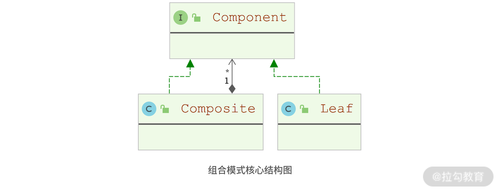

# 12 深入分析动态 SQL 语句解析全流程（上）

在前面两讲中，我们详细介绍了 mybatis-config.xml 全局配置文件以及 Mapper.xml 映射文件的解析流程，MyBatis 会将 Mapper 映射文件中定义的 SQL 语句解析成 SqlSource 对象，其中的动态标签、SQL 语句文本等，会解析成对应类型的 SqlNode 对象。

在开始介绍 SqlSource 接口、SqlNode 接口等核心接口的相关内容之前，我们需要先来了解一下动态 SQL 中使用到的基础知识和基础组件。

### OGNL 表达式语言

**OGNL 表达式语言是一款成熟的、面向对象的表达式语言**。在动态 SQL 语句中使用到了 OGNL 表达式读写 JavaBean 属性值、执行 JavaBean 方法这两个基础功能。

OGNL 表达式是相对完备的一门表达式语言，我们可以通过“对象变量名称.方法名称（或属性名称）”调用一个 JavaBean 对象的方法（或访问其属性），还可以通过“@\[类的完全限定名\]@\[静态方法（或静态字段）\]”调用一个 Java 类的静态方法（或访问静态字段）。OGNL 表达式还支持很多更复杂、更强大的功能，这里不再一一介绍。

下面我就通过一个示例来帮助你快速了解 OGNL 表达式的基础使用：

```
public class OGNLDemo {
    private static Customer customer;
    private static OgnlContext context;
    private static Customer createCustomer() {
        customer = new Customer();
        customer.setId(1);
        customer.setName("Test Customer");
        customer.setPhone("1234567");
        Address address = new Address();
        address.setCity("city-001");
        address.setId(1);
        address.setCountry("country-001");
        address.setStreet("street-001");
        ArrayList<Address> addresses = new ArrayList<>();
        addresses.add(address);
        customer.setAddresses(addresses);
        return customer;
    }
    public static void main(String[] args) throws Exception {
        customer = createCustomer(); // 创建Customer对象以及Address对象
        // 创建OgnlContext上下文对象
        context = new OgnlContext(new DefaultClassResolver(),
                new DefaultTypeConverter(),
                new OgnlMemberAccess());
        // 设置root以及address这个key，默认从root开始查找属性或方法
        context.setRoot(customer);
        context.put("address", customer.getAddresses().get(0));
        // Ognl.paraseExpression()方法负责解析OGNL表达式，获取Customer的addresses属性
        Object obj = Ognl.getValue(Ognl.parseExpression("addresses"),
                context, context.getRoot());
        System.out.println(obj);
        // 输出是[Address{id=1, street='street-001', city='city-001', country='country-001'}]
        // 获取city属性
        obj = Ognl.getValue(Ognl.parseExpression("addresses[0].city"),
                context, context.getRoot());
        System.out.println(obj); // 输出是city-001
        // #address表示访问的不是root对象，而是OgnlContext中key为addresses的对象
        obj = Ognl.getValue(Ognl.parseExpression("#address.city"), context,
                context.getRoot());
        System.out.println(obj); // 输出是city-001
        // 执行Customer的getName()方法
        obj = Ognl.getValue(Ognl.parseExpression("getName()"), context,
                context.getRoot());
        System.out.println(obj);
        // 输出是Test Customer
    }
}
```

MyBatis 为了提高 OGNL 表达式的工作效率，添加了一层 OgnlCache 来**缓存 **表达式编译之后的结果（不是表达式的执行结果），OgnlCache 通过一个 ConcurrentHashMap\<String, Object> 类型的集合（expressionCache 字段，静态字段）来** 记录**OGNL 表达式编译之后的结果。通过缓存拿到表达式编译的结果之后，OgnlCache 底层还会依赖上述示例中的 OGNL 工具类以及 OgnlContext 完成表达式的执行。

### DynamicContext 上下文

在 MyBatis 解析一条动态 SQL 语句的时候，可能整个流程非常长，其中涉及多层方法的调用、方法的递归、复杂的循环等，其中**产生的中间结果需要有一个地方进行存储，那就是 DynamicContext 上下文对象**。

DynamicContext 中有两个核心属性：一个是 sqlBuilder 字段（StringJoiner 类型），用来记录解析之后的 SQL 语句；另一个是 bindings 字段，用来记录上下文中的一些 KV 信息。

DynamicContext 定义了一个 ContextMap 内部类，ContextMap 用来记录运行时用户传入的、用来替换“#{}”占位符的实参。在 DynamicContext 构造方法中，会**根据传入的实参类型决定如何创建对应的 ContextMap 对象**，核心代码如下：

```
public DynamicContext(Configuration configuration, Object parameterObject) {
    if (parameterObject != null && !(parameterObject instanceof Map)) {
        // 对于非Map类型的实参，会创建对应的MetaObject对象，并封装成ContextMap对象
        MetaObject metaObject = configuration.newMetaObject(parameterObject);
        boolean existsTypeHandler = configuration.getTypeHandlerRegistry().hasTypeHandler(parameterObject.getClass());
        bindings = new ContextMap(metaObject, existsTypeHandler);
    } else {
        // 对于Map类型的实参，这里会创建一个空的ContextMap对象
        bindings = new ContextMap(null, false);
    }
    // 这里实参对应的Key是_parameter
    bindings.put(PARAMETER_OBJECT_KEY, parameterObject);
    bindings.put(DATABASE_ID_KEY, configuration.getDatabaseId());
}
```

ContextMap 继承了 HashMap 并覆盖了 get() 方法，在 get() 方法中有一个简单的降级逻辑：

- 首先，尝试按照 Map 的规则查找 Key，如果查找成功直接返回；
- 然后，再尝试检查 parameterObject 这个实参对象是否包含 Key 这个属性，如果包含的话，则直接读取该属性值返回；
- 最后，根据当前是否包含 parameterObject 相应的 TypeHandler 决定是返回整个 parameterObject 对象，还是返回 null。

后面在介绍 `<foreach>`、`<trim>` 等标签的处理逻辑中，你可以看到向 DynamicContext.bindings 集合中写入 KV 数据的操作，但是读取这个 ContextMap 的地方主要是在 OGNL 表达式中，也就是在 DynamicContext 中定义了一个静态代码块，指定了 OGNL 表达式读写 ContextMap 集合的逻辑，这部分读取逻辑封装在 ContextAccessor 中。除此之外，你还可以看到 ContextAccessor 中的 getProperty() 方法会将传入的 target 参数（实际上就是 ContextMap）转换为 Map，并先尝试按照 Map 规则进行查找；查找失败之后，会尝试获取“\_parameter”对应的 parameterObject 对象，从 parameterObject 中获取指定的 Value 值。

### 组合模式

**组合模式（有时候也被称为“部分-整体”模式）是将同一类型的多个对象组合成一个树形结构。在使用这个树形结构的时候，我们可以像处理一个对象那样进行处理，而不用关心其复杂的树形结构。**

组合模式的核心结构如下图所示：



从上图中，我们可以看出组合模式的核心组件有下面三个。

- **Component 接口：定义了整个树形结构中每个节点的基础行为**。一般情况下会定义两类方法，一类是真正的业务行为，另一类是管理子节点的行为，例如 addChild()、removeChild()、getChildren() 等方法。
- **Leaf 类：抽象的是树形结构中的叶子节点**。Leaf 类只实现了 Component 接口中的业务方法，而管理子节点的方法是空实现或直接抛出异常。
- **Composite 类：抽象了树形结构中的树枝节点（非叶子节点）**。Composite 类不仅要实现 Component 接口的业务方法，而且还需要实现子节点管理的相关方法，并在内部维护一个集合类来管理这些子节点。Composite 实现的业务方法一般逻辑比较简单，大都是直接循环调用所有子节点的业务方法。

通过以上对组合模式的介绍，你可以看出组合模式有以下两个优势：

- 由于使用方并不关心自己使用的是树形 Component 结构还是单个 Component 对象，所以可以帮助上层使用方屏蔽复杂的树形结构，将使用方的逻辑与树形结构解耦；
- 如果要在树形结构中添加新的功能，只需要增加树形结构中的节点即可，也就是提供新的 Component 接口实现并添加到树中，这符合“开放-封闭”原则。

### SqlNode

在 MyBatis 处理动态 SQL 语句的时候，会将动态 SQL 标签解析为 SqlNode 对象， **多个 SqlNode 对象就是通过组合模式组成树形结构供上层使用的** 。

下面我们就来讲解一下 SqlNode 的相关实现。首先，介绍一下 SqlNode 接口的定义，如下所示：

```
public interface SqlNode {
    // apply()方法会根据用户传入的实参，解析该SqlNode所表示的动态SQL内容并
    // 将解析之后的SQL片段追加到DynamicContext.sqlBuilder字段中暂存。
    // 当SQL语句中全部的动态SQL片段都解析完成之后，就可以从DynamicContext.sqlBuilder字段中
    // 得到一条完整的、可用的SQL语句了
    boolean apply(DynamicContext context);
}
```

MyBatis 为 SqlNode 接口提供了非常多的实现类（如下图），其中很多实现类都对应一个动态 SQL 标签，但是也有 SqlNode 实现扮演了组合模式中 Composite 的角色，例如，MixedSqlNode 实现类。


SqlNode 继承关系图

下面我们就来逐一介绍这每个 SqlNode 实现类的功能和核心实现。

#### 1. StaticTextSqlNode 和 MixedSqlNode

**StaticTextSqlNode 用于表示非动态的 SQL 片段 **，其中维护了一个 text 字段（String 类型），用于记录非动态 SQL 片段的文本内容，其 apply() 方法会直接将 text 字段值追加到 DynamicContext.sqlBuilder 的最末尾。** MixedSqlNode 在整个 SqlNode 树中充当了树枝节点，也就是扮演了组合模式中 Composite 的角色**，其中维护了一个 `List<SqlNode>` 集合用于记录 MixedSqlNode 下所有的子 SqlNode 对象。MixedSqlNode 对于 apply() 方法的实现也相对比较简单，核心逻辑就是遍历 `List<SqlNode>` 集合中全部的子 SqlNode 对象并调用 apply() 方法，由子 SqlNode 对象完成真正的动态 SQL 处理逻辑。

#### 2. TextSqlNode**TextSqlNode 实现抽象了包含 “${}”占位符的动态 SQL 片段**。TextSqlNode 通过一个 text 字段（String 类型）记录了包含“{}”占位符的 SQL 文本内容，在 apply() 方法实现中会结合用户给定的实参解析“{}”占位符，核心代码片段如下

```
public boolean apply(DynamicContext context) {
    // 创建GenericTokenParser解析器，这里指定的占位符的起止符号分别是"{"和"}"
    GenericTokenParser parser = createParser(
            new BindingTokenParser(context, injectionFilter));
    // 将解析之后的SQL片段追加到DynamicContext暂存
    context.appendSql(parser.parse(text));
    return true;
}
```

这里**使用 GenericTokenParser 识别“${}”占位符 **，在识别到占位符之后，会** 通过 BindingTokenParser 将“${}”占位符替换为用户传入的实参**。BindingTokenParser 继承了TokenHandler 接口，在其 handleToken() 方法实现中，会根据 DynamicContext.bindings 这个 ContextMap 中的 KV 数据替换 SQL 语句中的“{}”占位符，相关的代码片段如下：

```
public String handleToken(String content) {
    // 获取用户提供的实参数据
    Object parameter = context.getBindings().get("_parameter");
    if (parameter == null) { // 通过value占位符，也可以查找到parameter对象
        context.getBindings().put("value", null);
    } else if (SimpleTypeRegistry.isSimpleType(parameter.getClass())) {
        context.getBindings().put("value", parameter);
    }
    // 通过Ognl解析"{}"占位符中的表达式，解析失败的话会返回空字符串
    Object value = OgnlCache.getValue(content, context.getBindings());
    String srtValue = value == null ? "" : String.valueOf(value); 
    checkInjection(srtValue); // 对解析后的值进行过滤
    return srtValue; // 通过过滤的值才能正常返回
}
```

#### 3. IfSqlNode**IfSqlNode 实现类对应了动态 SQL 语句中的 标签**，在 MyBatis 的 `<if>` 标签中使用可以通过 test 属性指定一个表达式，当表达式成立时，`<if>` 标签内的 SQL 片段才会出现在完整的 SQL 语句中

在 IfSqlNode 中，通过 test 字段（String 类型）记录了 `<if>` 标签中的 test 表达式，通过 contents 字段（SqlNode 类型）维护了 `<if>` 标签下的子 SqlNode 对象。在 IfSqlNode 的 apply() 方法实现中，会依赖 ExpressionEvaluator 工具类解析 test 表达式，只有 test 表达式为 true，才会调用子 SqlNode 对象（即 contents 字段）的 apply() 方法。需要说明的是：这里使用到的 ExpressionEvaluator 工具类底层也是依赖 OGNL 表达式实现 test 表达式解析的。

#### 4. TrimSqlNode**TrimSqlNode 对应 MyBatis 动态 SQL 语句中的 标签**

在使用 `<trim>` 标签的时候，我们可以指定 prefix 和 suffix 属性添加前缀和后缀，也可以指定 prefixesToOverrides 和 suffixesToOverrides 属性来删除多个前缀和后缀（使用“|”分割不同字符串）。在 TrimSqlNode 中维护了同名的四个字段值，即 prefix 字段、suffix 字段（这两个是 String 类型）以及 prefixesToOverride 字段、suffixesToOverride 字段（这两个是 List`<String>` 类型）。

下面先来看一下 TrimSqlNode 的 apply() 方法的实现：

```
public boolean apply(DynamicContext context) {
    FilteredDynamicContext filteredDynamicContext = new FilteredDynamicContext(context);
    // 首先执行子SqlNode对象的apply()方法完成对应动态SQL片段的解析
    boolean result = contents.apply(filteredDynamicContext);
    // 使用FilteredDynamicContext.applyAll()方法完成前后缀的处理操作
    filteredDynamicContext.applyAll();
    return result;
}
```

从 apply() 方法的实现可以看出，TrimSqlNode 处理前后缀的核心逻辑是在 FilteredDynamicContext 中完成的。**FilteredDynamicContext 可以看作是 DynamicContext 的装饰器**。除了 DynamicContext 本身临时存储解析结果和参数的功能之外，FilteredDynamicContext 还通过其 applyAll() 方法实现了前后缀的处理，其中会判断 TrimSqlNode 下子 SqlNode 的解析结果的长度，然后执行 applyPrefix() 方法处理前缀，执行 applySuffix() 方法处理后缀。

- applyPrefix() 方法在处理前缀的时候，首先会遍历 prefixesToOverride 集合，从 SQL 片段的 **头部** 逐个尝试进行删除，之后在 SQL 片段的头部插入一个空格以及 prefix 字段指定的前缀字符串。
- applySuffix() 方法在处理后缀的时候，首先会遍历 suffixesToOverride 集合，从 SQL 片段的 **尾部** 逐个尝试进行删除，之后在 SQL 片段的尾部插入一个空格以及 suffix 字段指定的后缀字符串。

另外，从前面的 SqlNode 继承关系图中还可以看出，WhereSqlNode 和 SetSqlNode 是 TrimSqlNode 的子类。

在 WhereSqlNode 中将 prefix 设置为“WHERE”字符串，prefixesToOverride 集合包含 “OR”“AND”“OR\\n”“AND\\n”“OR\\r”“AND\\r” 等字符串，这样就实现了删除 SQL 片段开头多余的 “AND”“OR” 关键字，并添加“WHERE”关键字的效果。

在 SetSqlNode 中将 prefix 设置为“SET”关键字，prefixesToOverride 集合和 suffixesToOverride 集合只包含“，”（逗号）字符串，这样就实现了删除 SQL 片段开头和结尾多余的逗号，并添加“SET”关键字的效果。

### 总结

这一讲我们重点介绍了 MyBatis 中动态 SQL 语句中涉及的核心内容。

- 首先，说明了动态 SQL 语句中使用的 OGNL 表达式语言，这样你就了解了动态 SQL 语句中占位符的处理逻辑。
- 然后，介绍了 DynamicContext 对象，其中维护了解析动态 SQL 语句上下文信息；随后我还分析了组合模式，因为它是 MyBatis 组合各动态 SQL 节点的设计思想。
- 最后，讲解了 TextSqlNode、IfSqlNode、TrimSqlNode 等多个 SqlNode 节点的实现。
