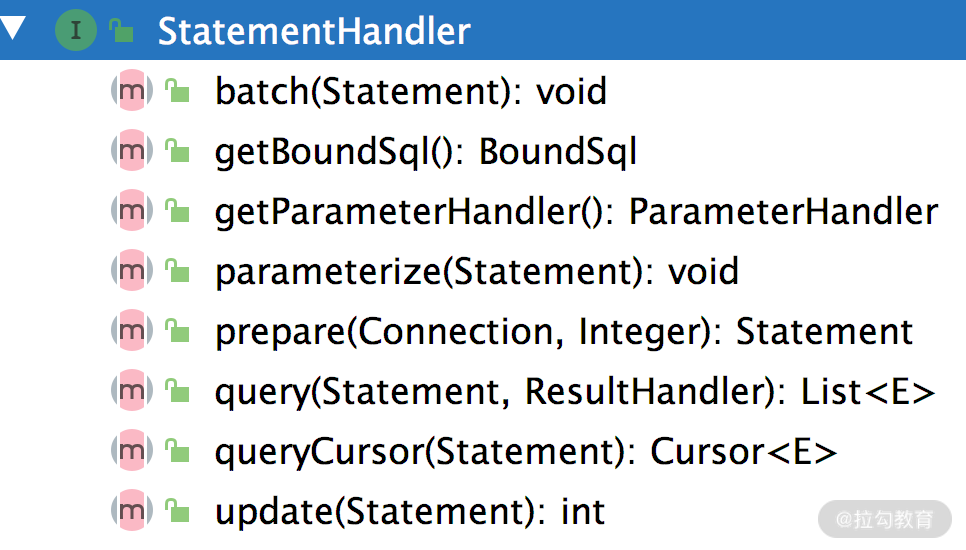

16 StatementHandler：参数绑定、SQL 执行和结果映射的奠基者
========================================

**StatementHandler 接口是 MyBatis 中非常重要的一个接口**，其实现类完成 SQL 语句执行中最核心的一系列操作，这也是后面我们要介绍的 Executor 接口实现的基础。

StatementHandler 接口的定义如下图所示：



StatementHandler 接口中定义的方法

可以看到，其中提供了创建 Statement 对象（prepare() 方法）、为 SQL 语句绑定实参（parameterize() 方法）、执行单条 SQL 语句（query() 方法和 update() 方法）、批量执行 SQL 语句（batch() 方法）等多种功能。

下图展示了 MyBatis 中提供的所有 StatementHandler 接口实现类，以及它们的继承关系：


StatementHandler 接口继承关系图

今天这一讲我们就来详细分析该继承关系图中每个 StatementHandler 实现的核心逻辑。

### RoutingStatementHandler

RoutingStatementHandler 这个 StatementHandler 实现，有点**策略模式**的意味。在 RoutingStatementHandler 的构造方法中，会根据 MappedStatement 中的 statementType 字段值，选择相应的 StatementHandler 实现进行创建，这个新建的 StatementHandler 对象由 RoutingStatementHandler 中的 delegate 字段维护。

RoutingStatementHandler 的构造方法如下：

```
public RoutingStatementHandler(Executor executor, MappedStatement ms, Object parameter, RowBounds rowBounds, ResultHandler resultHandler, BoundSql boundSql) {


    // 下面就是根据MappedStatement的配置，生成一个相应的StatementHandler对


    // 象，并设置到delegate字段中维护


    switch (ms.getStatementType()) {


        case STATEMENT:


            // 创建SimpleStatementHandler对象


            delegate = new SimpleStatementHandler(executor, ms, parameter, rowBounds, resultHandler, boundSql);


            break;


        case PREPARED:


            // 创建PreparedStatementHandler对象


            delegate = new PreparedStatementHandler(executor, ms, parameter, rowBounds, resultHandler, boundSql);


            break;


        case CALLABLE:


            // 创建CallableStatementHandler对象


            delegate = new CallableStatementHandler(executor, ms, parameter, rowBounds, resultHandler, boundSql);


            break;


        default: // 抛出异常


            throw new ExecutorException("...");


    }


}

```

在 RoutingStatementHandler 的其他方法中，**都会委托给底层的 delegate 对象来完成具体的逻辑**。

### BaseStatementHandler

作为一个抽象类，BaseStatementHandler 只实现了 StatementHandler 接口的 prepare() 方法，其 prepare() 方法实现为新建的 Statement 对象设置了一些参数，例如，timeout、fetchSize 等。BaseStatementHandler 还新增了一个 instantiateStatement() 抽象方法给子类实现，来完成 Statement 对象的其他初始化操作。不过，BaseStatementHandler 中并没有实现 StatementHandler 接口中的数据库操作等核心方法。

了解了 BaseStatementHandler 对 StatementHandler 接口的实现情况之后，我们再来看一下 BaseStatementHandler 的构造方法，其中会**初始化执行 SQL 需要的 Executor 对象 **、** 为 SQL 绑定实参的 ParameterHandler 对象 **以及** 生成结果对象的 ResultSetHandler 对象**。这三个核心对象中，ResultSetHandler 对象我们已经在\[《14 | 探究 MyBatis 结果集映射机制背后的秘密（上）》\]中介绍过了，ParameterHandler 和 Executor 在后面会展开介绍。

#### 1\. KeyGenerator

这里需要关注的是 generateKeys() 方法，其中会**通过 KeyGenerator 接口生成主键**，下面我们就来看看 KeyGenerator 接口的相关内容。

我们知道不同数据库的自增 id 生成策略并不完全一样。例如，我们常见的 Oracle DB 是通过sequence 实现自增 id 的，如果使用自增 id 作为主键，就需要我们先获取到这个自增的 id 值，然后再使用；MySQL 在使用自增 id 作为主键的时候，insert 语句中可以不指定主键，在插入过程中由 MySQL 自动生成 id。KeyGenerator 接口支持 insert 语句执行前后获取自增的 id，分别对应 processBefore() 方法和 processAfter() 方法，下图展示了 MyBatis 提供的两个 KeyGenerator 接口实现：


KeyGenerator 接口继承关系图**Jdbc3KeyGenerator 用于获取数据库生成的自增 id（例如 MySQL 那种生成模式）**，其 processBefore() 方法是空实现，processAfter() 方法会将 insert 语句执行后生成的主键保存到用户传递的实参中。我们在使用 MyBatis 执行单行 insert 语句时，一般传入的实参是一个 POJO 对象或是 Map 对象，生成的主键会设置到对应的属性中；执行多条 insert 语句时，一般传入实参是 POJO 对象集合或 Map 对象的数组或集合，集合中每一个元素都对应一次插入操作，生成的多个自增 id 也会设置到每个元素的相应属性中。

Jdbc3KeyGenerator 中获取数据库自增 id 的核心代码片段如下：

```
// 将数据库生成的自增id作为结果集返回


try (ResultSet rs = stmt.getGeneratedKeys()) { 


    final ResultSetMetaData rsmd = rs.getMetaData();


    final Configuration configuration = ms.getConfiguration();


    if (rsmd.getColumnCount() < keyProperties.length) {


    } else {


        // 处理rs这个结果集，将生成的id设置到对应的属性中


        assignKeys(configuration, rs, rsmd, keyProperties, parameter);


    }


} catch (Exception e) {


    throw new ExecutorException("...");


}

```** 如果使用像 Oracle 这种不支持自动生成主键自增 id 的数据库时，我们可以使用 SelectkeyGenerator 来生成主键 id **。Mapper 映射文件中的`<selectKey>`标签会被解析成 SelectkeyGenerator 对象，其中的 executeBefore 属性（boolean 类型）决定了是在 insert 语句执行之前获取主键，还是在 insert 语句执行之后获取主键 id。

SelectkeyGenerator 中的 processBefore() 方法和 processAfter() 方法都是通过 processGeneratedKeys() 这个私有方法获取主键 id 的，processGeneratedKeys() 方法会执行`<selectKey>`标签中指定的 select 语句，查询主键信息，并记录到用户传入的实参对象的对应属性中，核心代码片段如下所示：

```

// 创建一个新的Executor对象来执行指定的select语句

Executor keyExecutor = configuration.newExecutor(executor.getTransaction(), ExecutorType.SIMPLE);

// 拿到主键信息

List<Object> values = keyExecutor.query(keyStatement, parameter, RowBounds.DEFAULT, Executor.NO_RESULT_HANDLER);

if (values.size() == 0) {

    throw new ExecutorException("SelectKey returned no data.");

} else if (values.size() > 1) {

    throw new ExecutorException("SelectKey returned more than one value.");

} else {

    // 创建实参对象的MetaObject对象


    final MetaObject metaParam = configuration.newMetaObject(parameter);


    MetaObject metaResult = configuration.newMetaObject(values.get(0));


    if (keyProperties.length == 1) {


        // 将主键信息记录到用户传入的实参对象中


        if (metaResult.hasGetter(keyProperties[0])) {


            setValue(metaParam, keyProperties[0], metaResult.getValue(keyProperties[0]));


        } else {


            setValue(metaParam, keyProperties[0], values.get(0));


        }


    } else {


        ... // 多结果集的处理


    }

}

```

#### 2\. ParameterHandler

介绍完 KeyGenerator 接口之后，我们再来看一下 BaseStatementHandler 中依赖的另一个辅助类—— ParameterHandler。

经过前面\[《13 | 深入分析动态 SQL 语句解析全流程（下）》\]介绍的一系列 SqlNode 的处理之后，我们得到的 SQL 语句（维护在 BoundSql 对象中）可能包含多个“?”占位符，与此同时，用于替换每个“?”占位符的实参都记录在 BoundSql.parameterMappings 集合中。

ParameterHandler 接口中定义了两个方法：一个是 getParameterObject() 方法，用来获取传入的实参对象；另一个是 setParameters() 方法，用来替换“?”占位符，这是 ParameterHandler 的** 核心方法 **。** DefaultParameterHandler 是 ParameterHandler 接口的唯一实现，其 setParameters() 方法会遍历 BoundSql.parameterMappings 集合**，根据参数名称查找相应实参，最后会通过 PreparedStatement.set\*() 方法与 SQL 语句进行绑定。setParameters() 方法的具体代码如下：

```

for (int i = 0; i < parameterMappings.size(); i++) {

    ParameterMapping parameterMapping = parameterMappings.get(i);


    Object value;


    String propertyName = parameterMapping.getProperty();


    // 获取实参值


    if (boundSql.hasAdditionalParameter(propertyName)) {


        value = boundSql.getAdditionalParameter(propertyName);


    } else if (parameterObject == null) {


        value = null;


    } else if (typeHandlerRegistry.hasTypeHandler(parameterObject.getClass())) {


        value = parameterObject;


    } else {


        MetaObject metaObject = configuration.newMetaObject(parameterObject);


        value = metaObject.getValue(propertyName);


    }


    // 获取TypeHandler


    TypeHandler typeHandler = parameterMapping.getTypeHandler();


    JdbcType jdbcType = parameterMapping.getJdbcType();


    // 底层会调用PreparedStatement.set*()方法完成绑定


    typeHandler.setParameter(ps, i + 1, value, jdbcType);

}

```

### SimpleStatementHandler

SimpleStatementHandler 是 StatementHandler 的具体实现之一，继承了 BaseStatementHandler 抽象类。SimpleStatementHandler 各个方法接收的是 java.sql.Statement 对象，并通过该对象来完成 CRUD 操作，所以在 SimpleStatementHandler 中 **维护的 SQL 语句不能存在“?”占位符** ，填充占位符的 parameterize() 方法也是空实现。

在 instantiateStatement() 这个初始化方法中，SimpleStatementHandler 会直接通过 JDBC Connection 创建 Statement 对象，这个对象也是后续 SimpleStatementHandler 其他方法的入参。

在 query() 方法实现中，SimpleStatementHandler 会直接通过上面创建的 Statement 对象，执行 SQL 语句，返回的结果集由 ResultSetHandler 完成映射，核心代码如下：

```

public <E> List<E> query(Statement statement, ResultHandler resultHandler) throws SQLException {、

    // 获取SQL语句


    String sql = boundSql.getSql();


    // 执行SQL语句


    statement.execute(sql);


    // 处理ResultSet映射，得到结果对象


    return resultSetHandler.handleResultSets(statement);

}

```

queryCursor() 方法与 query() 方法实现类似，这里就不再赘述。

batch() 方法调用的是 Statement.addBatch() 方法添加批量执行的 SQL 语句，但并不是立即执行，而是等待 Statement.executeBatch() 方法执行时才会批量执行，这点你稍微注意一下即可。

至于 update() 方法，首先会通过 Statement.execute() 方法执行 insert、update 或 delete 类型的 SQL 语句，然后执行 KeyGenerator.processAfter() 方法查询主键并填充相应属性（processBefore() 方法已经在 prepare() 方法中执行过了），最后通过 Statement.getUpdateCount() 方法获取 SQL 语句影响的行数并返回。

### PreparedStatementHandler

PreparedStatementHandler 是 StatementHandler 的具体实现之一，也是最常用的 StatementHandler 实现，它同样继承了 BaseStatementHandler 抽象类。PreparedStatementHandler 各个方法接收的是 java.sql.PreparedStatement 对象，并通过该对象来完成 CRUD 操作，在其 parameterize() 方法中会通过前面介绍的 ParameterHandler调用 PreparedStatement.set\*() 方法为 SQL 语句绑定参数，所以在 PreparedStatementHandler 中 **维护的 SQL 语句是可以包含“?”占位符的** 。

在 instantiateStatement() 方法中，PreparedStatementHandler 会直接通过 JDBC Connection 的 prepareStatement() 方法创建 PreparedStatement 对象，该对象就是 PreparedStatementHandler 其他方法的入参。

PreparedStatementHandler 的 query() 方法、batch() 方法以及 update() 方法与 SimpleStatementHandler 的实现基本相同，只不过是把 Statement API 换成了 PrepareStatement API 而已。下面我们以 update() 方法为例进行简单介绍：

```

public int update(Statement statement) throws SQLException {

    PreparedStatement ps = (PreparedStatement) statement;


    ps.execute(); // 执行SQL语句，修改数据


    int rows = ps.getUpdateCount(); // 获取影响行数


    // 获取实参对象


    Object parameterObject = boundSql.getParameterObject();


    // 执行KeyGenerator


    KeyGenerator keyGenerator = mappedStatement.getKeyGenerator();


    keyGenerator.processAfter(executor, mappedStatement, ps, parameterObject);


    return rows; // 返回影响行数

}

```

### CallableStatementHandler

**CallableStatementHandler 是处理存储过程的 StatementHandler 实现**，其 instantiateStatement() 方法会通过 JDBC Connection 的 prepareCall() 方法为指定存储过程创建对应的 java.sql.CallableStatement 对象。在 parameterize() 方法中，CallableStatementHandler 除了会通过 ParameterHandler 完成实参的绑定之外，还会指定输出参数的位置和类型。

在 CallableStatementHandler 的 query()、queryCursor()、update() 方法中，除了处理 SQL 语句本身的结果集（ResultSet 结果集或是影响行数），还会通过 ResultSetHandler 的 handleOutputParameters() 方法处理输出参数，这是与 PreparedStatementHandler 最大的不同。下面我们以 query() 方法为例进行简单分析：

```

public <E> List<E> query(Statement statement, ResultHandler resultHandler) throws SQLException {

    CallableStatement cs = (CallableStatement) statement;


    cs.execute(); // 执行存储过程


    // 处理存储过程返回的结果集


    List<E> resultList = resultSetHandler.handleResultSets(cs);


    // 处理输出参数，可能修改resultList集合


    resultSetHandler.handleOutputParameters(cs);


    // 返回最后的结果对象


    return resultList;

}

```

### 总结

这一讲我们重点讲解了 MyBatis 中的 StatementHandler 接口及其核心实现，StatementHandler 接口中定义了执行一条 SQL 语句的核心方法。

*   首先，分析了 RoutingStatementHandler 实现，它可以帮助我们选择真正的 StatementHandler 实现类。
*   接下来，介绍了 BaseStatementHandler 这个抽象类的实现，同时还详细阐述了其中使用到的 KeyGenerator 和 ParameterHandler。
*   最后，又介绍了 SimpleStatementHandler、PreparedStatementHandler 等实现，它们基于 JDBC API 接口，实现了完整的 StatementHandler 功能。
