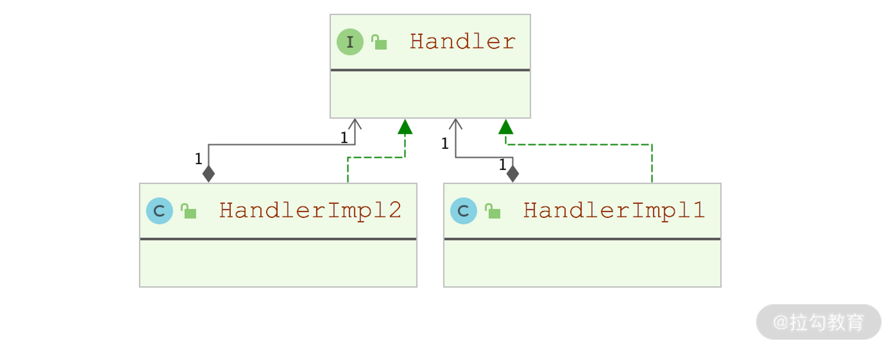
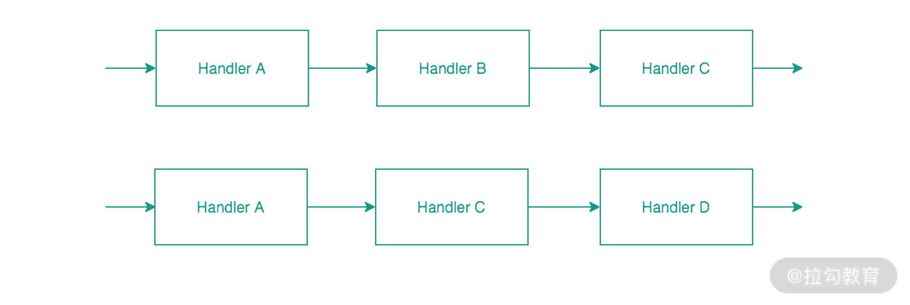

20 插件体系让 MyBatis 世界更加精彩
=======================

插件是应用程序中最常见的一种扩展方式，比如，在Chrome 浏览器上我们可以安装各种插件来增强浏览器自身的功能。在 Java 世界中，很多开源框架也使用了插件扩展方式，例如，Dubbo 通过 SPI 方式实现了插件化的效果，SkyWalking 依赖“微内核+插件”的架构轻松加载插件，实现扩展效果。

MyBatis 作为持久层框架中的佼佼者，也提供了类似的插件扩展机制。MyBatis 将插件单独分离出一个模块，位于 org.apache.ibatis.plugin 包中，在该模块中主要使用了两种设计模式： **代理模式** 和**责任链模式**。

插件模块使用的代理模式是通过 JDK 动态代理实现的，代理模式的基础知识以及 JDK 动态代理的核心原理我们已经在前面《06 | 日志框架千千万，MyBatis 都能兼容的秘密是什么？》中介绍过了。下面我们就重点来看一下责任链模式的基础知识。

### 责任链模式

我们在写业务系统的时候，最常用的协议就是 HTTP 协议，最常用的 HTTP Server 是 Tomcat，所以这里我们就结合 Tomcat 处理 HTTP 请求的场景来说明责任链模式的核心思想。

HTTP 协议可简单分为请求头和请求体两部分，Tomcat 在收到一条完整的 HTTP 请求时，也会将其分为请求头和请求体两部分进行处理的。不过在真正的 Tomcat 实现中，会将 HTTP 请求细分为更多部分，然后逐步进行处理，整个 Tomcat 代码处理 HTTP 请求的实现也更为复杂。

试想一下，Tomcat 将处理请求的各个细节的实现代码都堆到一个类中，那这个类的代码会非常长，维护起来也非常痛苦，可以说是“牵一发而动全身”。如果 HTTP 请求升级，那就需要修改这个臃肿的类，显然是不符合“开放-封闭”原则的。

为了实现像 HTTP 这种多部分构成的协议的处理逻辑，我们可以使用责任链模式来划分协议中各个部分的处理逻辑，将那些臃肿实现类**拆分成多个 Handler（或 Interceptor）处理器，在每个 Handler（或 Interceptor）处理器中只专注于 HTTP 协议中一部分数据的处理**。我们可以开发多个 Handler 处理器，然后按照业务需求将多个 Handler 对象组合成一个链条，从而实现整个 HTTP 请求的处理。

这样做既可以将复杂、臃肿的逻辑拆分，便于维护，又能将不同的 Handler 处理器分配给不同的程序员开发，提高开发效率。**在责任链模式中，Handler 处理器会持有对下一个 Handler 处理器的引用**，也就是说当一个 Handler 处理器完成对关注部分的处理之后，会将请求通过这个引用传递给下一个 Handler 处理器，如此往复，直到整个责任链中全部的 Handler 处理器完成处理。责任链模式的核心类图如下所示：



责任链模式核心类图

下面我们再从复用的角度看一下责任链模式带来的好处。

假设我们自定义了一套协议，其请求中包含 A、B、C 三个核心部分，业务系统使用 Handler A、Handler B、Handler C 三个处理器来处理这三部分的数据。如果业务变化导致我们的自定义协议也发生了变化，协议中的数据变成了 A、C、D 这三部分，那么我们只需要动态调整构成责任链的 Handler 处理器即可，最新的责任链变为 Handler A、Handler C、Handler D。如下图所示：



责任链示意图

由此可见，**责任链模式可以帮助我们复用 Handler 处理器的实现逻辑，提高系统的可维护性和灵活性**，很好地符合了“开放-封闭”原则。

### Interceptor

介绍完责任链模式的基础知识之后，我们接着就来讲解MyBatis 中插件的相关内容。**MyBatis 插件模块中最核心的接口就是 Interceptor 接口，它是所有 MyBatis 插件必须要实现的接口**，其核心定义如下：

```
public interface Interceptor {


  // 插件实现类中需要实现的拦截逻辑


  Object intercept(Invocation invocation) throws Throwable;


  // 在该方法中会决定是否触发intercept()方法


  default Object plugin(Object target) {


    return Plugin.wrap(target, this);


  }


  default void setProperties(Properties properties) {


    // 在整个MyBatis初始化过程中用来初始化该插件的方法


  }


}

```

MyBatis允许我们自定义 Interceptor 拦截 SQL 语句执行过程中的某些关键逻辑，允许拦截的方法有：Executor 类中的 update()、query()、flushStatements()、commit()、rollback()、getTransaction()、close()、isClosed()方法，ParameterHandler 中的 setParameters()、getParameterObject() 方法，ResultSetHandler中的 handleOutputParameters()、handleResultSets()方法，以及StatementHandler 中的parameterize()、prepare()、batch()、update()、query()方法。

通过本课程模块三的介绍我们知道，上述方法都是 MyBatis 执行 SQL 语句的核心组件，所以在使用自定义 Interceptor 拦截这些方法之前，我们需要非常了解 MyBatis 的核心原理以及 Interceptor 的拦截行为。

下面我们就结合一个 MyBatis 插件示例，介绍一下 MyBatis 中 Interceptor 接口的具体使用方式。这里我们首先定义一个DemoPlugin 类，定义如下：

```
@Intercepts({


        @Signature(type = Executor.class, method = "query", args = {


                MappedStatement.class, Object.class, RowBounds.class,


                ResultHandler.class}),


        @Signature(type = Executor.class, method = "close", args = {boolean.class})


})


public class DemoPlugin implements Interceptor {


    private int logLevel; 


    ... // 省略其他方法的实现


}

```

我们看到 DemoPlugin 这个示例类除了实现 Interceptor 接口外，还被标注了 @Intercepts 和 @Signature 两个注解。@Intercepts 注解中可以配置多个 @Signature 注解，**@Signature 注解用来指定 DemoPlugin 插件实现类要拦截的目标方法信息**，其中的 type 属性指定了要拦截的类，method 属性指定了要拦截的目标方法名称，args 属性指定了要拦截的目标方法的参数列表。通过 @Signature 注解中的这三个配置，DemoPlugin 就可以确定要拦截的目标方法的方法签名。在上面的示例中，DemoPlugin 会拦截 Executor 接口中的 query(MappedStatement, Object, RowBounds, ResultHandler) 方法和 close(boolean) 方法。

完成 DemoPlugin 实现类的编写之后，为了让 MyBatis 知道这个类的存在，我们要在 mybatis-config.xml 全局配置文件中对 DemoPlugin 进行配置，相关配置片段如下：

```
<plugins>


    <plugin interceptor="design.Interceptor.DemoPlugin">


        <!-- 对拦截器中的属性进行初始化 -->


        <property name="logLevel" value="1"/>


    </plugin>


</plugins>

```

通过前面《10 | 鸟瞰 MyBatis 初始化，把握 MyBatis 启动流程脉络（上）》对初始化流程的介绍我们知道，MyBatis 会在初始化流程中解析 mybatis-config.xml 全局配置文件，其中的 `<plugin>` 节点就会被处理成相应的 Interceptor 对象，同时调用 setProperties() 方法完成配置的初始化，最后MyBatis 会将 Interceptor 对象添加到Configuration.interceptorChain 这个全局的 Interceptor 列表中保存。

介绍完 Interceptor 的加载和初始化原理之后，我们再来看 Interceptor 是如何拦截目标类中的目标方法的。通过本课程模块三的介绍，我们知道 MyBatis 中 Executor、ParameterHandler、ResultSetHandler、StatementHandler 等与 SQL 执行相关的核心组件都是通过 Configuration.new\*() 方法生成的。以 newExecutor() 方法为例，我们会看到下面这行代码，InterceptorChain.pluginAll() 方法会为目标对象（也就是这里的 Executor 对象）创建代理对象并返回。

```
executor = (Executor) interceptorChain.pluginAll(executor);

```

从名字就可以看出， **InterceptorChain 是 Interceptor 构成的责任链** ，在其 interceptors 字段（ArrayList`<Interceptor>`类型）中维护了 MyBatis 初始化过程中加载到的全部 Interceptor 对象，在其 pluginAll() 方法中，会调用每个 Interceptor 的 plugin() 方法创建目标类的代理对象，核心实现如下：

```
public Object pluginAll(Object target) {


  for (Interceptor interceptor : interceptors) {


    // 遍历interceptors集合，调用每个Interceptor对象的plugin()方法


    target = interceptor.plugin(target);


  }


  return target;


}

```

### Plugin

了解了 Interceptor 的加载流程和基本工作原理之后，我们再来介绍一下自定义 Interceptor 的实现。我们首先回到 DemoPlugin 这个示例，关注其中 plugin() 方法的实现：

```
@Override


public Object plugin(Object target) {


    // 依赖Plugin工具类创建代理对象


    return Plugin.wrap(target, this);


}

```

从 DemoPlugin 示例中，我们 **可以看到 plugin() 方法依赖 MyBatis 提供的 Plugin.wrap() 工具方法创建代理对象，这也是我们推荐的实现方式** 。

MyBatis 提供的 Plugin 工具类实现了 JDK 动态代理中的 InvocationHandler 接口，同时维护了下面三个关键字段。

* target（Object 类型）：要拦截的目标对象。
* signatureMap（Map<Class<?>, Set > 类型）：记录了 @Signature 注解中配置的方法信息，也就是代理要拦截的目标方法信息。
* interceptor（Interceptor 类型）：目标方法被拦截后，要执行的逻辑就写在了该 Interceptor 对象的 intercept() 方法中。

既然 Plugin 实现了 InvocationHandler 接口，我们自然需要关注其 invoke() 方法实现。在 invoke() 方法中，Plugin 会检查当前要执行的方法是否在 signatureMap 集合中，如果在其中的话，表示当前待执行的方法是我们要拦截的目标方法之一，也就会调用 intercept() 方法执行代理逻辑；如果未在其中的话，则表示当前方法不应被代理，直接执行当前的方法即可。下面就是 Plugin.invoke() 方法的核心实现：

```
public Object invoke(Object proxy, Method method, Object[] args) throws Throwable {


    try {


        // 获取当前待执行方法所属的类


        Set<Method> methods = signatureMap.get(method.getDeclaringClass());


        // 如果当前方法需要被代理，则执行intercept()方法进行拦截处理


        if (methods != null && methods.contains(method)) {


            return interceptor.intercept(new Invocation(target, method, args));


        }


        // 如果当前方法不需要被代理，则调用target对象的相应方法


        return method.invoke(target, args);


    } catch (Exception e) {


        throw ExceptionUtil.unwrapThrowable(e);


    }


}

```

这里传入 Interceptor.intercept() 方法的是一个 Invocation 对象，其中封装了目标对象、目标方法以及目标方法的相关参数，在 DemoInterceptor.intercept() 方法实现中，就是通过调用 Invocation.proceed() 方法完成目标方法的执行。当然，我们自定义的 Interceptor 实现并不一定必须调用目标方法。这样，经过DemoInterceptor 的拦截之后，也就改变了 MyBatis 核心组件的行为。

最后，我们来看一下 Plugin 工具类对外提供的 wrap() 方法是如何创建 JDK 动态代理的。在 wrap() 方法中，Plugin 工具类会解析传入的 Interceptor 实现的 @Signature 注解信息，并与当前传入的目标对象类型进行匹配， **只有在匹配的情况下，才会生成代理对象，否则直接返回目标对象** 。具体的代码实现以及注释说明如下所示：

```
public static Object wrap(Object target, Interceptor interceptor) {


    // 获取自定义Interceptor实现类上的@Signature注解信息，


    // 这里的getSignatureMap()方法会解析@Signature注解，得到要拦截的类以及要拦截的方法集合


    Map<Class<?>, Set<Method>> signatureMap = getSignatureMap(interceptor);


    Class<?> type = target.getClass();


    // 检查当前传入的target对象是否为@Signature注解要拦截的类型，如果是的话，就


    // 使用JDK动态代理的方式创建代理对象


    Class<?>[] interfaces = getAllInterfaces(type, signatureMap);


    if (interfaces.length > 0) {


        // 创建JDK动态代理


        return Proxy.newProxyInstance(


                type.getClassLoader(),


                interfaces,


                // 这里使用的InvocationHandler就是Plugin本身


                new Plugin(target, interceptor, signatureMap));


    }


    return target;


}

```

### 总结

这一讲我们重点介绍了 MyBatis 中插件模块的内容。

* 首先，讲解了责任链模式的核心内容，它是 MyBatis 插件底层设计的核心思想。
* 然后，介绍了 Interceptor 接口，通过实现 Interceptor 接口，我们可以自定义插件的具体逻辑。
* 最后，分析了 Plugin 这个辅助类的核心功能，它是实现自定义 Interceptor 必不可少的辅助工具。Plugin 工具类通过 JDK 动态代理的方式，帮助我们完成了对 @Signature 等注解的解析，也帮助我们真正拦截了 MyBatis 中的核心方法，改变了MyBatis 内核的行为。
