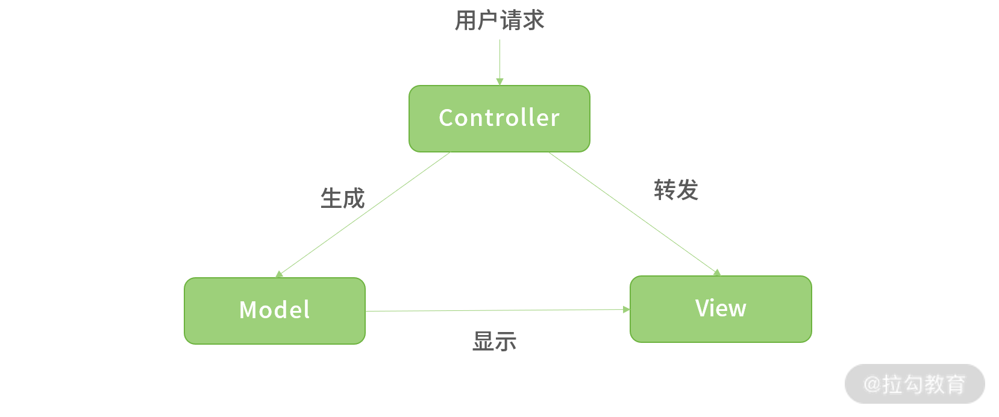
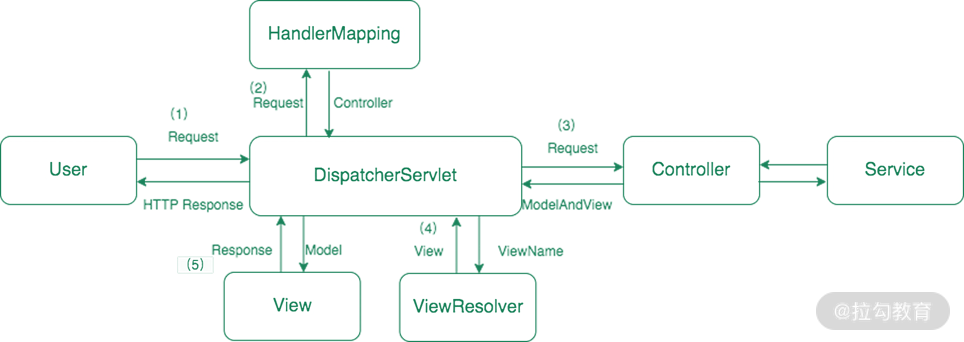
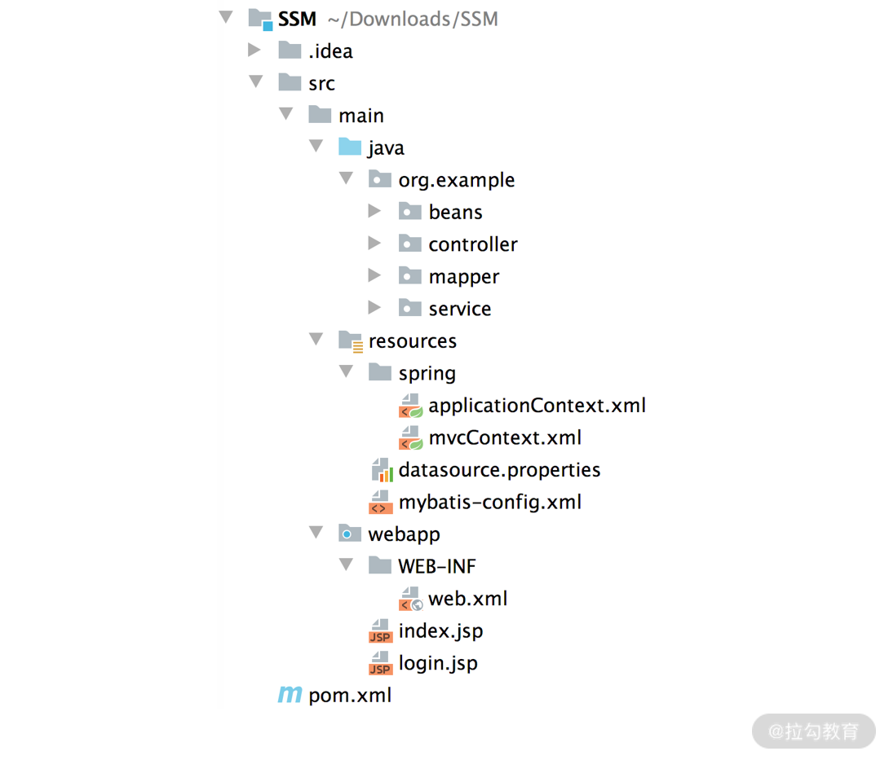
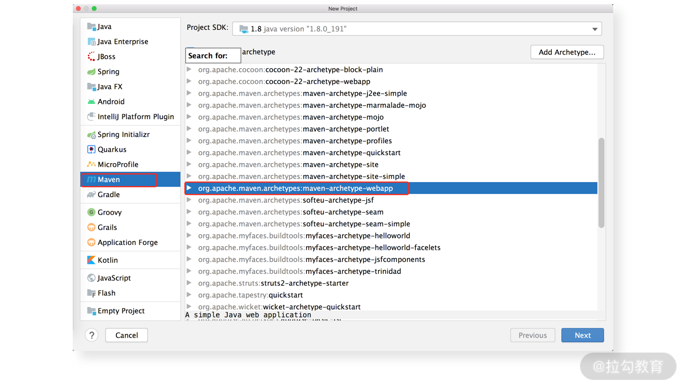

21 深挖 MyBatis 与 Spring 集成底层原理
=============================

在实际开发过程中，一般我们不会只使用单个的开源框架，而是会使用多种开源框架和开源工具相互配合来实现需求。在 Java 世界中，最出名的开源框架就要数 Spring 了。Spring 是 2002 年出现的一个轻量级 Java 框架，它最开始就是为了替换掉 EJB 这种复杂的企业开发框架。时至 2021 年，几乎所有的 Java 后端项目都会使用到 Spring，Spring 已经成为业界标准，我们在 **实践中常用的 SSM 三层架构其实就是 Spring、Spring MVC和MyBatis这三个核心框架的简称** 。

搭建一个 SSM 环境是非常简单的，今天这一讲我们不仅要搭建 SSM 开发环境，还要深入剖析这三个框架能够协同工作的原理。不过，在开始讲解 SSM 开发环境搭建之前，我们先来简单介绍一下 Spring 和 Spring MVC 的基础知识。

### Spring

Spring 中最核心的概念就要数 IoC 了。IoC（Inversion of Control， **控制反转** ）的核心思想是将业务对象交由 IoC 容器管理，由 IoC 容器控制业务对象的初始化以及不同业务对象之间的依赖关系，这样就可以降低代码的耦合性。

**依赖注入**（Dependency Injection）是实现 IoC 的常见方式之一。所谓依赖注入，就是我们的系统不再主动维护业务对象之间的依赖关系，而是将依赖关系转移到 IoC 容器中动态维护。Spring 提供了依赖注入机制，我们只需要通过 XML 配置或注解，就可以确定业务对象之间的依赖关系，轻松实现业务逻辑的组合。

Spring 中另一个比较重要的概念是 AOP（Aspect Oriented Programming），也就是**面向切面编程**。它是面向对象思想的补充和完善，毕竟在面对一个问题的时候，从更多的角度、用更多的思维模型去审视问题，才能更好地解决问题。

在面向对象的思想中，我们关注的是代码的封装性、类间的继承关系和多态、对象之间的依赖关系等，通过对象的组合就可以实现核心的业务逻辑，但是总会有一些重要的重复性代码散落在业务逻辑类中，例如，权限检测、日志打印、事务管理相关的逻辑，这些重复逻辑与我们的核心业务逻辑并无直接关系，却又是系统正常运行不能缺少的功能。

AOP 可以帮我们将这些碎片化的功能抽取出来，封装到一个组件中进行重用，这也被称为切面。**通过 AOP 的方式，可以有效地减少散落在各处的碎片化代码，提高系统的可维护性**。为了方便你后面理解 Spring AOP 的代码，这里我简单介绍 AOP中的几个关键概念。

* 横切关注点：如果某些业务逻辑代码横跨业务系统的多个模块，我们可以将这些业务代码称为横切关注点。
* 切面：对横切关注点的抽象。面向对象思想中的类是事物特性的抽象，与之相对的切面则是对横切关注点的抽象。
* 连接点：业务逻辑中的某个方法，该方法会被 AOP 拦截。
* 切入点：对连接点进行拦截的定义。
* 通知：拦截到连接点之后要执行的代码，可以分为5类，分别是前置通知、后置通知、异常通知、最终通知和环绕通知。

### Spring MVC

Spring MVC 是 Spring 生态中的一个 Web 框架，也是现在市面上用得最多的 Web 框架，其 **底层的核心设计思想就是经典的 MVC 架构模式** 。

所谓 MVC 架构模式指的就是 Model、View和Controller 三部分，其中，Model 负责封装业务逻辑以及业务数据；View 只负责展示数据，其中不包含任何逻辑代码或只会包含非常简单的、与展示相关的逻辑控制代码；Controller 用来接收用户发起的请求，调用设计的 Service 层来完成具体的业务逻辑，产生的数据会返回到 View上进行展示。下图展示了 MVC 架构中三个核心组件的关系：



MVC 模式示意图

在 Spring MVC 框架中，Model 层一般使用普通的 Service Bean 对象，View 层目前常用的是一些前端框架，以实现更好的渲染效果，Controller 是由 Spring MVC 特殊配置过的 Servlet，它会将用户请求分发给 Model，将响应转发给 View。

了解了 SpringMVC核心思想之后，我们再进一步分析Spring MVC 工作的核心原理。

**DispatcherServlet 是 Spring MVC 中的前端控制器**，也是 Spring MVC 内部非常核心的一个组件，负责 Spring MVC 请求的调度。当 Spring MVC 接收到用户的 HTTP 请求之后，会由 DispatcherServlet 进行截获，然后根据请求的 URL 初始化 WebApplicationContext（上下文信息），最后转发给业务的 Controller 进行处理。待 Controller 处理完请求之后，DispatcherServlet 会根据返回的视图名称选择具体的 View 进行渲染。

下图展示了 Spring MVC 处理一次 HTTP 请求的完整流程：



Spring MVC 处理请求示意图

可以看到，Spring MVC 框架处理 HTTP 请求的核心步骤如下。

1. 用户的请求到达服务器后，经过HTTP Server 处理得到 HTTP Request 对象，并传到 Spring MVC 框架中的 DispatcherServlet 进行处理。
2. DispatcherServlet 在接收到请求之后，会根据请求查找对应的 HandlerMapping，在 HandlerMapping 中维护了请求路径与 Controller 之间的映射。
3. DispatcherServlet 根据步骤 2 中的 HandlerMapping 拿到请求相应的 Controller ，并将请求提交到该 Controller 进行处理。Controller 会调用业务 Service 完成请求处理，得到处理结果；Controller 会根据 Service 返回的处理结果，生成相应的 ModelAndView 对象并返回给 DispatcherServlet。
4. DispatcherServlet 会从 ModelAndView 中解析出 ViewName，并交给 ViewResolver 解析出对应的 View 视图。
5. DispatcherServlet 会从 ModelAndView 中拿到 Model（在 Model 中封装了我们要展示的数据），与步骤 4 中得到的 View 进行整合，得到最终的 Response 响应。

### SSM 环境搭建

了解了 Spring 以及 Spring MVC 的基本概念之后，我们开始搭建 SSM 的开发环境（建议结合示例代码一起学习，效果更佳），最终搭建的SSM 项目结构如下图所示：



SSM 项目结构图

首先，在 IDEA 中创建一个新的 Maven Web 项目，具体选项如下图所示： 

选择 Web 类型的 Maven 项目

Maven 项目创建完成之后，我们就可以编写项目中的核心配置文件。

第一个是 web.xml 配置文件。其中指定了初始化 Spring 上下文的 ContextLoaderListener 监听器，在 Spring 初始化过程中，ContextLoaderListener会读取Spring 的 XML 配置文件，这里通过 contextConfigLocation 参数就可以指定applicationContext.xml 配置文件的位置。另外，web.xml 中还会配置Spring MVC 中的 DispatcherServlet，这里同样需要指定 Spring MVC 要读取的 XML 配置文件地址。

第二个是Spring 初始化时读取的 applicationContext.xml 配置文件，这里简单说明其中的几个关键 Bean。

* DriverManagerDataSource 数据源，这是 Spring 提供的一个数据源实现，它连接的数据库信息定义在 datasource.properties 配置文件中。
* SqlSessionFactoryBean，这个工厂 Bean 是 Spring 与 MyBatis 集成的关键，在后面分析两者集成原理的时候会深入该类的实现。我们这里为 SqlSessionFactoryBean 指定了三个属性：dataSource 属性指向了上面的 DriverManagerDataSource Bean，configLocation 指向了 mybatis-config.xml 全局配置文件，typeAliasesPackage 指向了要扫描的包名，该包内的 Java 类的类名会被作为该类的别名。
* MapperScannerConfigurer，这个是用来扫描 MyBatis 中的 Mapper.xml 配置文件的扫描器，在后面分析 Spring 与 MyBatis 集成原理的时候也会深入该类的实现。
* DataSourceTransactionManager，这是 Spring 提供的事务管理器，会与下面的 AOP 配置一起完成事务的管理。事务相关的 AOP 配置示例如下：

```
<!-- 定义个通知，指定事务管理器控制事务 -->


<tx:advice id="txAdvice" transaction-manager="txManager">


    <tx:attributes>


        <!-- propagation属性指定了事务的传播属性，即在拦截到save开头的方法时，必须在一个事务的上下文中，如果没有事务的话，需要新开启事务，rollback-for属性表示遇到异常时回滚事务，read-only表示当前操作不是一个只读操作，会修改数据 -->


        <tx:method name="save*" propagation="REQUIRED" 


                   read-only="false"


                   rollback-for="java.lang.Exception"/>


        <!-- 省略其他方法的配置 -->


    </tx:attributes>


</tx:advice>


<aop:config>


    <!-- 配置一个切入点，将会拦截org.example包中以ServiceImpl结尾的类的全部方法-->


    <aop:pointcut id="serviceMethods"


                  expression="execution(* org.example.*ServiceImpl.*(..))"/>


    <aop:advisor advice-ref="txAdvice" pointcut-ref="serviceMethods"/>


</aop:config>

```

除了上述 Spring Bean 的配置之外，我们还要配置 Spring 自动扫描功能，不过需要注意的是，这里需要指明不扫描 @Controller 注解修饰的 Bean。

我们可以在[Spring MVC 的配置文件](https://github.com/xxxlxy2008/SSM/blob/master/src/main/resources/spring/springmvc-servlet.xml?fileGuid=YKT99KVjwRT8jhxJ)中看到，@Controller 修饰的 Bean将会由 Spring MVC 的上下文完成加载。另外，[该示例代码](https://github.com/xxxlxy2008/SSM?fileGuid=YKT99KVjwRT8jhxJ)使用 JSP 作为前端界面，所以我们需要在 Spring MVC 配置文件中配置一个 UrlBasedViewResolver 来解析 viewName 与 JSP 页面的映射。

SSM 开发环境中最核心的配置就介绍完了，关于其完整配置，[你](https://github.com/xxxlxy2008/SSM?fileGuid=YKT99KVjwRT8jhxJ)[可以参考 SSM 的示例代码进行分析](https://github.com/xxxlxy2008/SSM?fileGuid=YKT99KVjwRT8jhxJ)。在这份示例代码中，除了上述介绍的配置之外，还提供了一个简单的登录示例，其中的 UserBean 抽象了用户基本信息，例如用户名、密码；UserMapper 接口和 UserMapper.xml 实现了 DAO 层，实现了基本的数据库操作；ILoginService 接口和 LoginServiceImpl 实现类构成了 Service 层，完成了登录这个业务逻辑；LoginController 则是 Controller 层的实现，依赖 Service 层完成登录业务之后，会控制页面的跳转；最后，还有两个 JSP 页面用来展示用户登录前后的数据。这些内容就留给你自己分析了。

### Spring 集成 MyBatis 原理剖析

在搭建 SSM 开发环境的时候，我们引入了一个 mybatis-spring-\*.jar 的依赖，这个依赖是 Spring 集成 MyBatis 的关键所在，该依赖内部会将 MyBatis 管理的事务交给 Spring 的事务管理器进行管理，同时还会由 Spring IoC 容器来控制 SqlSession 对象的注入。

下面我们就来看一下 Spring 集成 MyBatis 的几个关键实现。

#### 1\. SqlSessionFactoryBean

在搭建 SSM 环境的时候，我们会在 applicationContext.xml 中配置一个 SqlSessionFactoryBean，其核心作用就是 **读取 MyBatis 配置，初始化 Configuration 全局配置对象，并创建 SqlSessionFactory 对象** ，对应的核心方法是 buildSqlSessionFactory() 方法。

下面是 buildSqlSessionFactory() 方法的核心代码片段：

```
protected SqlSessionFactory buildSqlSessionFactory() throws IOException {


    Configuration configuration;


    XMLConfigBuilder xmlConfigBuilder = null;


    if (this.configLocation != null) {


        // 创建XMLConfigBuilder对象，读取指定的配置文件


        xmlConfigBuilder = new XMLConfigBuilder(this.configLocation.getInputStream(),


            null, this.configurationProperties);


        configuration = xmlConfigBuilder.getConfiguration();


    } else {


        // 其他方式初始化Configuration全局配置对象


    }


    // 下面会根据前面第10、11讲介绍的初始化流程，初始化MyBatis的相关配置和对象，其中包括：


    // 扫描typeAliasesPackage配置指定的包，并为其中的类注册别名


    // 注册plugins集合中指定的插件


    // 扫描typeHandlersPackage指定的包，并注册其中的TypeHandler


    // 配置缓存、配置数据源、设置Environment等一系列操作


    if (this.transactionFactory == null) {


        // 默认使用的事务工厂类


        this.transactionFactory = new SpringManagedTransactionFactory();


    }


    // 根据mapperLocations配置，加载Mapper.xml映射配置文件以及对应的Mapper接口


    for (Resource mapperLocation : this.mapperLocations) {


        XMLMapperBuilder xmlMapperBuilder = new XMLMapperBuilder(...);


        xmlMapperBuilder.parse();


    }


    // 最后根据前面创建的Configuration全局配置对象创建SqlSessionFactory对象


    return this.sqlSessionFactoryBuilder.build(configuration);


}

```

#### 2\. SpringManagedTransaction

通过对 SqlSessionFactoryBean 的分析我们可以看出，在 SSM 集成环境中默认使用 SpringManagedTransactionFactory 这个 TransactionFactory 接口实现来创建 Transaction 对象，其中创建的 Transaction 对象是 SpringManagedTransaction。需要说明的是，这里的 Transaction 和 TransactionFactory 接口都是 MyBatis 中的接口。

SpringManagedTransaction 中除了维护事务关联的数据库连接和数据源之外，还维护了一个 isConnectionTransactional 字段（boolean 类型）用来标识当前事务是否由 Spring 的事务管理器管理，这个标识会控制 commit() 方法和rollback() 方法是否真正提交和回滚事务，相关的代码片段如下：

```
public void commit() throws SQLException {


    if (this.connection != null && !this.isConnectionTransactional && !this.autoCommit){


        // 当事务不由Spring事务管理器管理的时候，会立即提交事务，否则由Spring事务管理器管理事务的提交和回滚


        this.connection.commit();


    }


}

```

#### 3\. SqlSessionTemplate

当 Spring 集成 MyBatis 使用的时候，SqlSession 接口的实现不再直接使用 MyBatis 提供的 DefaultSqlSession 默认实现，而是使用 SqlSessionTemplate，如果我们没有使用 Mapper 接口的方式编写 DAO 层，而是直接使用 Java 代码手写 DAO 层，那么我们就可以使用 SqlSessionTemplate。

**SqlSessionTemplate 是线程安全的，可以在多个线程之间共享使用。**SqlSessionTemplate 内部持有一个 SqlSession 的代理对象（sqlSessionProxy 字段），这个代理对象是通过 JDK 动态代理方式生成的；使用的 InvocationHandler 接口是 SqlSessionInterceptor，其 invoke() 方法会拦截 SqlSession 的全部方法，并检测当前事务是否由 Spring 管理。相关代码片段如下：

```
public Object invoke(Object proxy, Method method, Object[] args) throws Throwable {


    // 通过静态方法SqlSessionUtils.getSqlSession()获取SqlSession对象


    SqlSession sqlSession = SqlSessionUtils.getSqlSession(


            SqlSessionTemplate.this.sqlSessionFactory,


            SqlSessionTemplate.this.executorType,


            SqlSessionTemplate.this.exceptionTranslator);


    // 调用SqlSession对象的相应方法


    Object result = method.invoke(sqlSession, args);


    // 检测事务是否由Spring进行管理，并据此决定是否提交事务


    if (!isSqlSessionTransactional(sqlSession, 


             SqlSessionTemplate.this.sqlSessionFactory)) {


        sqlSession.commit(true);


    }


    return result; // 返回操作结果


}

```

这里使用的SqlSessionUtils.getSqlSession() 方法会尝试从 Spring 事务管理器中获取 SqlSession对象并返回，如果获取失败，则新建一个 SqlSession 对象并交由 Spring 事务管理器管理，同时将这个 SqlSession 返回。

SqlSessionDaoSupport 实现了 Spring DaoSupport 接口，核心功能是辅助我们手写 DAO 层的代码。SqlSessionDaoSupport 内部持有一个 SqlSessionTemplate 对象（sqlSession字段），并提供了getSqlSession() 方法供子类获取该 SqlSessionTemplate 对象，所以我们**在手写 DAO 层代码的时候，可以通过继承 SqlSessionDaoSupport 这个抽象类的方式，拿到 SqlSessionTemplate 对象，实现访问数据库的相关操作**。

#### 4\. MapperFactoryBean 与 MapperScannerConfigurer

使用 SqlSessionDaoSupport 或 SqlSessionTemplate 编写 DAO 毕竟是需要我们手写代码的，为了进一步简化 DAO 层的实现，我们可以通过 MapperFactoryBean 直接将 Mapper 接口注入 Service 层的 Bean 中，**由 Mapper 接口完成 DAO 层的功能**。

下面是一段 MapperFactoryBean 的配置示例：

```
<!-- 配置id为customerMapper的Bean -->


<bean id="customerMapper" class="org.mybatis.spring.mapper.MapperFactoryBean">


   <!-- 配置Mapper接口 -->


   <property name="mapperInterface" value="com.example.mapper.CustomerMapper" />


   <!-- 配置SqlSessionFactory，用于创建底层的SqlSessionTemplate -->


   <property name="sqlSessionFactory" ref="sqlSessionFactory" />


</bean>

```

在 MapperFactoryBean 这个 Bean 初始化的时候，会加载 mapperInterface 配置项指定的 Mapper 接口，并调用 Configuration.addMapper() 方法将 Mapper 接口注册到 MapperRegistry，在注册过程中同时会解析对应的 Mapper.xml 配置文件。这个注册过程以及解析 Mapper.xml 配置文件的过程，在前面\[第 11 讲\]中我们已经分析过了，这里不再重复。

完成 Mapper 接口的注册之后，我们就可以通过 MapperFactoryBean.getObject() 方法获取相应 Mapper 接口的代理对象，相关代码片段如下：

```
public T getObject() throws Exception {


  // 这里通过SqlSession.getMapper()方法获取Mapper接口的代理对象


  return getSqlSession().getMapper(this.mapperInterface);


}

```

虽然通过 MapperFactoryBean 可以不写一行 Java 代码就能实现 DAO 层逻辑，但还是需要在 Spring 的配置文件中为每个 Mapper 接口配置相应的 MapperFactoryBean，这依然是有一定工作量的。如果连配置信息都不想写，那我们就可以使用 MapperScannerConfigurer 扫描指定包下的全部 Mapper 接口，这也是我们在前文 SSM 开发环境中使用的方式。

这里我们简单介绍一下 MapperScannerConfigurer 的实现。MapperScannerConfigurer 实现了 BeanDefinitionRegistryPostProcessor 接口，在 Spring 容器初始化的时候会触发其 postProcessBeanDefinitionRegistry() 方法，完成扫描逻辑，其核心代码逻辑如下：

```
public void postProcessBeanDefinitionRegistry(BeanDefinitionRegistry registry) {


    if (this.processPropertyPlaceHolders) {


        // 解析Spring配置文件中MapperScannerConfigurer配置的占位符


        processPropertyPlaceHolders();


    }


    // 创建ClassPathMapperScanner


    ClassPathMapperScanner scanner = new ClassPathMapperScanner(registry);


    // 根据配置信息决定ClassPathMapperScanner如何扫描指定的包，也就是确定扫描的过滤条件，例如，有几个包需要扫描、是否关注Mapper接口的注解、是否关注Mapper接口的父类等


    // 开始扫描basePackage字段中指定的包及其子包


    scanner.scan(StringUtils.tokenizeToStringArray(this.basePackage, 


       ConfigurableApplicationContext.CONFIG_LOCATION_DELIMITERS));


}

```

ClassPathMapperScanner.scan() 这个扫描方法底层会调用其 doScan() 方法完成扫描，扫描过程中首先会遍历配置中指定的所有包，并根据过滤条件得到符合条件的BeanDefinitionHolder 对象；之后对这些 BeanDefinitionHolder 中记录的 Bean 类型进行改造，改造成 MapperFactoryBean 类型，同时填充 MapperFactoryBean 初始化所需的信息。这样就可以在 Spring 容器初始化的时候，为扫描到的 Mapper 接口创建对应的 MapperFactoryBean，从而进一步降低DAO 的编写成本。

### 总结

这一讲我们重点介绍了 MyBatis 与 Spring 的相关内容。

* 首先，简单介绍了 Spring 和 Spring MVC 两大框架的核心思想，其中阐述了 IoC、AOP、MVC 等基本概念。
* 然后，一起搭建了一个 Spring、Spring MVC、MyBatis 的集成开发环境，也就是我们的 SSM 项目，你可以参考该项目的源码搭建自己项目的基础框架。
* 最后，深入分析了 mybatis-spring-\*.jar 这个依赖，其中包含了实现 Spring 与 MyBatis 无缝集成的核心逻辑。
