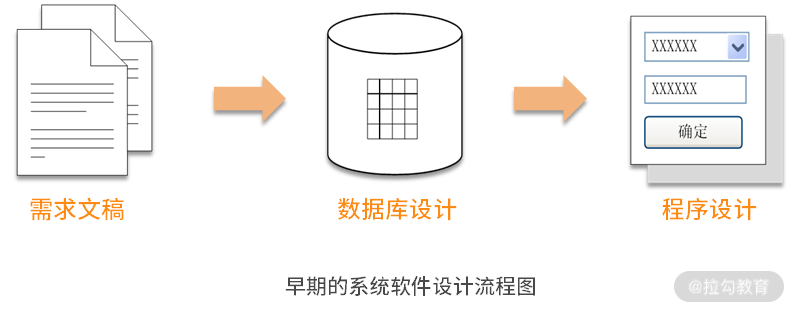
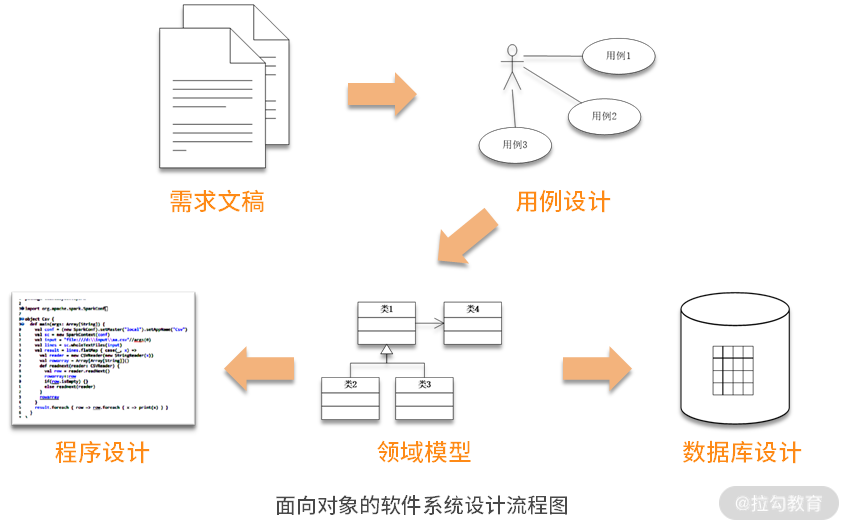
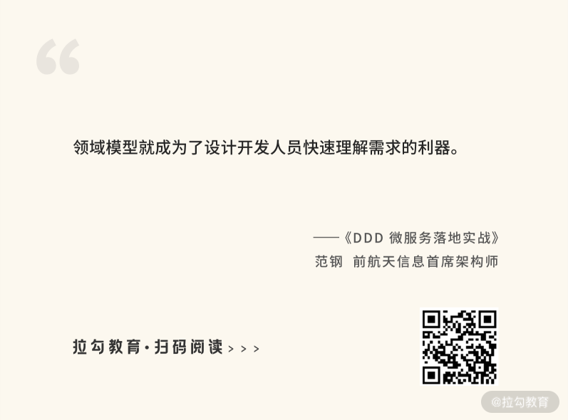
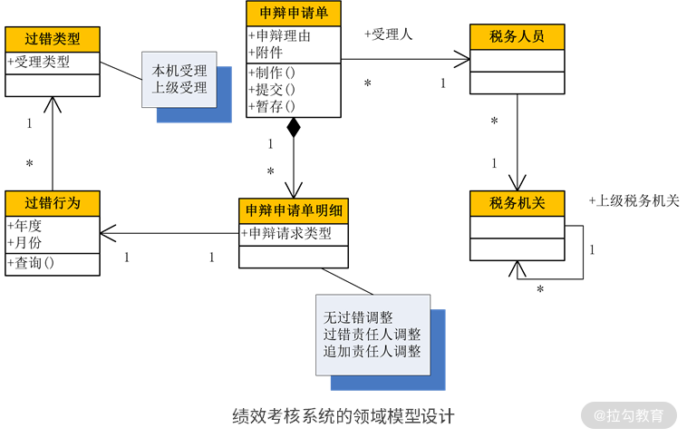
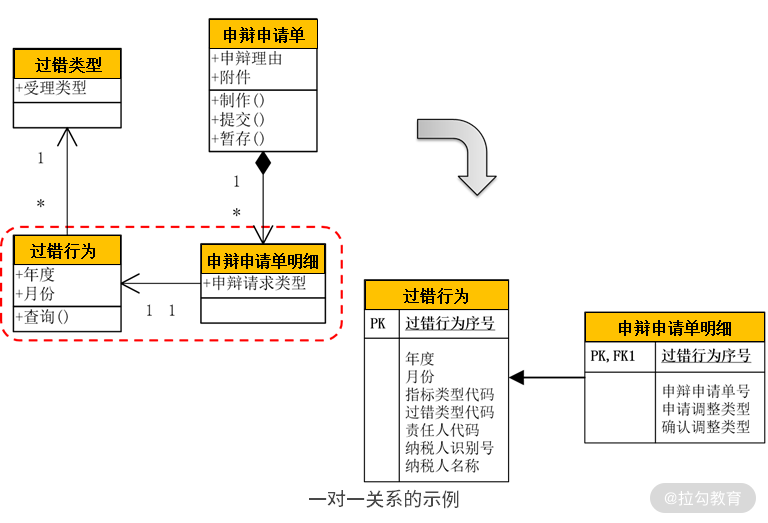
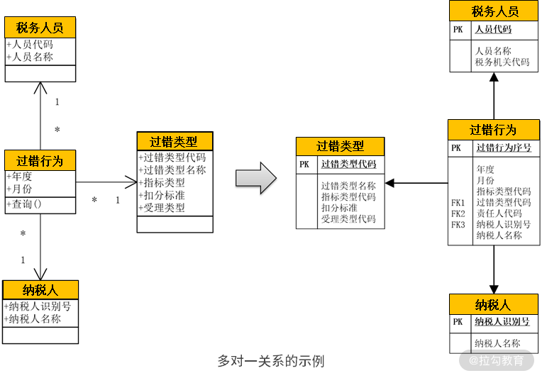
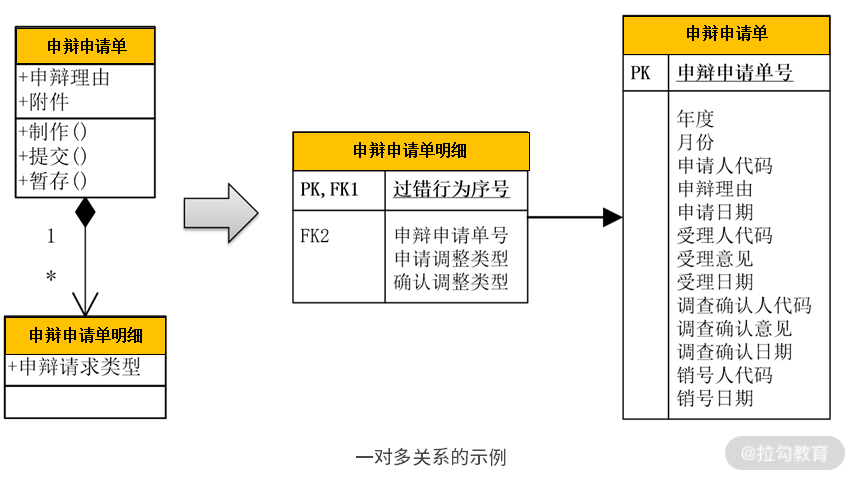

03 DDD 是如何落地到数据库设计的？
====================

过去，系统的软件设计是以数据库设计为核心，当需求确定下来以后，团队首先开始进行数据库设计。因为数据库是各个模块唯一的接口，当整个团队将数据库设计确定下来以后，就可以按照模块各自独立地进行开发了，如下图所示。



在上面的过程中，为了提高团队开发速度，尽量让各个模块不要交互，从而达到各自独立开发的效果。但是，随着系统规模越来越大，业务逻辑越来越复杂，我们越来越难于保证各个模块独立不交互了。

**随着软件业的不断发展，软件系统变得越来越复杂，各个模块间的交互也越来越频繁，这时，原有的设计过程已经不能满足我们的需要了。**因为如果要先进行数据库设计，但数据库设计只能描述数据结构，而不能描述系统对这些数据结构的处理。因此，在第一次对整个系统的梳理过程中，只能梳理系统的所有数据结构，形成数据库设计；接着，又要再次梳理整个系统，分析系统对这些数据结构的处理过程，形成程序设计。为什么不能一次性地把整个系统的设计梳理到位呢？



现如今，我们已经按照**面向对象的软件设计过程 **来分析设计系统了。当开始需求分析时，首先进行** 用例模型 **的设计，分析整个系统要实现哪些功能；接着进行** 领域模型**的设计，分析系统的业务实体。在领域模型分析中，采用类图的形式，每个类可以通过它的属性来表述数据结构，又可以通过添加方法来描述对这个数据结构的处理。因此，在领域模型的设计过程中，既完成了对数据结构的梳理，又确定了系统对这些数据结构的处理，这样就把两项工作一次性地完成了。

在这个设计过程中，其核心是**领域模型的设计**。以领域模型作为核心，可以指导系统的数据库设计与程序设计，此时，数据库设计就弱化为了领域对象持久化设计的一种实现方式。

### 领域对象持久化的思想

什么叫**领域对象的持久化**呢？在当今软件架构设计的主流思想中，面向对象设计成了主流思想，在整个系统运行的过程中，所有的数据都是以领域对象的形式存在的。譬如：

* 要插入一条记录就是创建一个领域对象；
* 要更新一条记录就是根据 key 值去修改相应的领域对象；
* 删除数据则是摧毁这个领域对象。

假如我们的服务器是一台超级强大的服务器，那实际上不需要任何数据库，直接操作这些领域对象就可以了，但在现实世界中没有那么强大的服务器。因此，必须将暂时不用的领域对象持久化存储到磁盘中，而数据库只是这种持久化存储的一种实现方式。

按照这种设计思想，我们将暂时不使用的领域对象从内存中持久化存储到磁盘中。当日后需要再次使用这个领域对象时，根据 key 值到数据库查找到这条记录，然后将其恢复成领域对象，应用程序就可以继续使用它了，这就是 **领域对象持久化存储的设计思想** 。

所以，今天的数据库设计，实际上就是将领域对象的设计按照某种对应关系，转换成数据库的设计。同时，随着整个产业的大数据转型，今后的数据库设计思想也将发生巨大的转变，有可能数据库就不一定是关系型数据库了，也许是 NoSQL 数据库或者大数据平台。数据库的设计也不一定遵循 3NF（第三范式）了，可能会增加更多的冗余，甚至是宽表。

数据库设计在发生剧烈的变化，但唯一不变的是领域对象。这样，当系统在大数据转型时，可以保证业务代码不变，变化的是 **数据访问层** （DAO）。这将使得日后大数据转型的成本更低，让我们更快地跟上技术快速发展的脚步。

### 领域模型的设计

此外，这里有个有趣的问题值得探讨：领域模型的设计到底是谁的职责，是需求分析人员还是设计开发人员？我认为，它是两个角色相互协作的产物。而未来敏捷开发的组织形成，团队将更加扁平化。过去是需求分析人员做需求分析，然后交给设计人员设计开发，这种方式就使得软件设计质量低下而结构臃肿。未来“大前端”的思想将支持更多设计开发人员直接参与需求分析，实现 **从需求分析到设计开发的一体化组织形式** 。这样，领域模型就成为了设计开发人员快速理解需求的利器。



总之，\*\*DDD 的数据库设计实际上已经变成了：以领域模型为核心，如何将领域模型转换成数据库设计的过程。\*\*那么怎样进行转换呢？在领域模型中是一个一个的类，而在数据库设计中是一个一个的表，因此就是将类转换成表的过程。



上图是一个绩效考核系统的领域模型图，该绩效考核系统首先进行自动考核，发现一批过错，然后再给一个机会，让过错责任人对自己的过错进行申辩。这时，过错责任人可以填写一张申辩申请单，在申辩申请单中有多个明细，每个明细对应一个过错行为，每个过错行为都对应了一个过错类型，这样就形成了一个领域模型。

接着，要将这个领域模型转换成数据库设计，怎么做呢？很显然，领域模型中的一个类可以转换成数据库中的一个表，类中的属性可以转换成表中的字段。但这里的关键是如何处理类与类之间的关系，如何转换成表与表之间的关系。这时候，就有 5 种类型的关系需要转换，即传统的 4 种关系 + 继承关系。

#### 传统的 4 种关系

**传统的关系包含一对一、多对一、一对多、多对多这 4 种，它们既存在于类与类之间，又存在于表与表之间，所以可以直接进行转换。 **** 1\. 一对一关系**在以上案例中，“申辩申请单明细”与“过错行为”就是一对“一对一”关系。在该关系中，一个“申辩申请单明细”必须要对应一个“过错行为”，没有一个“过错行为”的对应就不能成为一个“申辩申请单明细”。这种约束在数据库设计时，可以通过外键来实现。但是，一对一关系还有另外一个约束，那就是一个“过错行为”最多只能有一个“申辩申请单明细”与之对应。

也就是说，一个“过错行为”可以没有“申辩申请单明细”与之对应，但如果有，最多只能有一个“申辩申请单明细”与之对应，这个约束暗含的是一种**唯一性**的约束。因此，将过错行为表中的主键，作为申辩申请单明细表的外键，并将该字段升级为申辩申请单明细表的主键。

**2\. 多对一关系**是日常的分析设计中最常见的一种关系。在以上案例中，一个过错行为对应一个税务人员、一个纳税人与一个过错类型；同时，一个税务人员，或纳税人，或过错类型，都可以对应多个过错行为。它们就形成了“多对一”关系。在数据库设计时，通过外键就可以建立这种“多对一”关系。因此，我们进行了如下数据库的设计：



多对一关系在数据库设计上比较简单，然而落实到程序设计时，需要好好探讨一下。比如，以上案例，在按照这样的方式设计以后，在查询时往往需要在查询过错行为的同时，显示它们对应的税务人员、纳税人与过错类型。这时，以往的设计是增加一个 join 语句。然而，这样的设计在随着数据量不断增大时，查询性能将受到极大的影响。

也就是说，join 操作往往是关系型数据库在面对大数据时最大的瓶颈之一。因此，一个更好的方案就是先查询过错行为表，分页，然后再补填当前页的其他关联信息。这时，就需要在“过错行为”这个值对象中通过属性变量，增加对税务人员、纳税人与过错类型等信息的引用。**3\. 一对多关系 **该关系往往表达的是一种** 主-子表**的关系。譬如，以上案例中的“申辩申请单”与“申辩申请单明细”就是一对“一对多”关系。除此之外，订单与订单明细、表单与表单明细，都是一对多关系。一对多关系在数据库设计上比较简单，就是在子表中增加一个外键去引用主表中的主键。比如本案例中，申辩申请单明细表通过一个外键去引用申辩申请单表中的主键，如下图所示。



除此之外，在程序的值对象设计时，主对象中也应当有一个集合的属性变量去引用子对象。如本例中，在“申辩申请单”值对象中有一个集合属性去引用“申辩申请单明细”。这样，当通过申辩申请单号查找到某个申辩申请单时，同时就可以获得它的所有申辩申请单明细，如下代码所示：

```


```java

public class Sbsqd {


    private Set<SbsqdMx> sbsqdMxes;

    

    public void setSbsqdMxes(Set<SbsqdMx> sbsqdMxes){

    

          this.sbsqdMxes = sbsqdMxes;

    

    }

    

    public Set<SbsqdMx> getSbsqdMxes(){

    

          return this.sbsqdMxes;

    

    }

    

}

```** 4\. 多对多关系 **比较典型的例子就是“用户角色”与“功能权限”。一个“用户角色”可以申请多个“功能权限”；而一个“功能权限”又可以分配给多个“用户角色”使用，这样就形成了一个“多对多”关系。这种多对多关系在对象设计时，可以通过一个“功能-角色关联类”来详细描述。因此，在数据库设计时就可以添加一个“角色功能关联表”，而该表的主键就是关系双方的主键进行的组合，形成的联合主键，如下图所示：


以上是领域模型和数据库都有的 4 种关系。因此，在数据库设计时，直接将相应的关系转换成数据库设计就可以了。同时，在数据库设计时还要将它们进一步细化。如在领域模型中，不论对象还是属性，在命名时都采用中文，这样有利于沟通与理解。但到了数据库设计时，就要将它们细化为英文命名，或者汉语拼音首字母，同时还要确定它们的字段类型与是否为空等其他属性。

#### 继承关系的 3 种设计** 第 5 种关系就不太一样了：继承关系是在领域模型设计中有，但在数据库设计中却没有。 **如何将领域模型中的继承关系转换成数据库设计呢？有 3 种方案可以选择。** 1\. 继承关系的第一种方案 **首先，看看以上案例。“执法行为”通过继承分为“正确行为”和“过错行为”。如果这种继承关系的子类不多（一般就 2 ~ 3 个），并且每个子类的个性化字段也不多（3 个以内）的话，则可以使用一个表来记录整个继承关系。在这个表的中间有一个** 标识字段 **，标识表中的每条记录到底是哪个子类，这个字段的前面部分罗列的是父类的字段，后面依次罗列各个子类的个性化字段。


采用这个方案的优点是简单，整个继承关系的数据全部都保存在这个表里。但是，它会造成“表稀疏”。在该案例中，如果是一条“正确行为”的记录，则字段“过错类型”与“扣分”永远为空；如果是一条“过错行为”的记录，则字段“加分”永远为空。假如这个继承关系中各子类的个性化字段很多，就会造成该表中出现大量字段为空，称为“表稀疏”。在关系型数据库中，为空的字段是要占用空间的。因此，这种“表稀疏”既会浪费大量存储空间，又会影响查询速度，是需要极力避免的。所以，当子类比较多，或者子类个性化字段多的情况是不适合该方案（第一种方案）的。** 2\. 继承关系的第二种方案 **如果执法行为按照考核指标的类型进行继承，分为“考核指标1”“考核指标2”“考核指标3”……如下图所示：


并且每个子类都有很多的个性化字段，则采用前面那个方案就不合适了。这时，用另外两个方案进行数据库设计。其中一个方案是将每个子类都对应到一个表，有几个子类就有几个表，这些表共用一个主键，即这几个表的主键生成器是一个，某个主键值只能存在于某一个表中，不能存在于多个表中。每个表的前面是父类的字段，后面罗列各个子类的字段，如下图所示：


如果业务需求是在前端查询时，每次只能查询某一个指标，那么采用这种方案就能将每次查询落到某一个表中，方案就最合适。但如果业务需求是要查询某个过错责任人涉及的所有指标，则采用这种方案就必须要在所有的表中进行扫描，那么查询效率就比较低，并不适用。** 3\. 继承关系的第三种方案 **如果业务需求是要查询某个过错责任人涉及的所有指标，则更适合采用以下方案，将父类做成一个表，各个子类分别对应各自的表（如图所示）。这样，当需要查询某个过错责任人涉及的所有指标时，只需要查询父类的表就可以了。如果要查看某条记录的详细信息，再根据主键与类型字段，查询相应子类的个性化字段。这样，这种方案就可以完美实现该业务需求。


综上所述，将领域模型中的继承关系转换成数据库设计有 3 种方案，并且每个方案都有各自的优缺点。因此，需要根据业务场景的特点与需求去评估，选择哪个方案更适用。

### NoSQL 数据库的设计

前面我们讲的数据库设计，还是基于传统的关系型数据库、基于第三范式的数据库设计。但是，随着互联网高并发与分布式技术的发展，另一种全新的数据库类型孕育而生，那就是** NoSQL 数据库 **。正是由于互联网应用带来的高并发压力，采用关系型数据库进行集中式部署不能满足这种高并发的压力，才使得分布式 NoSQL 数据库得到快速发展。

也正因为如此，NoSQL 数据库与关系型数据库的设计套路是完全不同的。关系型数据库的设计是遵循第三范式进行的，它使得数据库能够大幅度降低冗余，但又从另一个角度使得数据库查询需要频繁使用 join 操作，在高并发场景下性能低下。

所以，NoSQL 数据库的设计思想就是尽量干掉 join 操作，即将需要 join 的查询在写入数据库表前先进行 join 操作，然后直接写到一张单表中进行分布式存储，这张表称为“宽表”。这样，在面对海量数据进行查询时，就不需要再进行 join 操作，直接在这个单表中查询。同时，因为 NoSQL 数据库自身的特点，使得它在存储为空的字段时不占用空间，不担心“表稀疏”，不影响查询性能。** 因此，NoSQL 数据库在设计时的套路就是，尽量在单表中存储更多的字段，只要避免数据查询中的 join 操作，即使出现大量为空的字段也无所谓了。**


增值税发票票样图

正因为 NoSQL 数据库在设计上有以上特点，因此将领域模型转换成 NoSQL 数据库时，设计就完全不一样了。比如，这样一张增值税发票，如上图所示，在数据库设计时就需要分为发票信息表、发票明细表与纳税人表，而在查询时需要进行 4 次 join 才能完成查询。但在 NoSQL 数据库设计时，将其设计成这样一张表：

```

{ _id: ObjectId(7df78ad8902c)

  fpdm: '3700134140', fphm: '02309723‘,

  kprq: '2016-1-25 9:22:45',

  je: 70451.28, se: 11976.72,

  gfnsr: {

     nsrsbh: '370112582247803',


     nsrmc:'联通华盛通信有限公司济南分公司',…

  },

  xfnsr: {

     nsrsbh: '370112575587500',


     nsrmc:'联通华盛通信有限公司济南分公司',…

  },

  spmx: [

     { qdbz:'00', wp_mc:'蓝牙耳机 车语者S1 蓝牙耳机', sl:2, dj:68.37,… },


     { qdbz:'00', wp_mc:'车载充电器 新在线', sl:1, dj:11.11,… },


     { qdbz:'00', wp_mc:'保护壳 非尼膜属 iPhone6 电镀壳', sl:1, dj:24,…  }

  ]

}

```

在该案例中，对于“一对一”和“多对一”关系，在发票信息表中通过一个类型为“对象”的字段来存储，比如“购方纳税人（gfnsr）”与“销方纳税人（xfnsr）”字段。对于“一对多”和“多对多”关系，通过一个类型为“对象数组”的字段来存储，如“商品明细（spmx）”字段。在这样一个发票信息表中就可以完成对所有发票的查询，无须再进行任何 join 操作。

同样，采用 NoSQL 数据库怎样实现继承关系的设计呢？由于 NoSQL 数据库自身的特点决定了不用担心“表稀疏”，同时要避免 join 操作，所以比较适合采用第一个方案，即将整个继承关系放到同一张表中进行设计。这时，NoSQL 数据库的每一条记录可以有不一定完全相同的字段，可以设计成这样：

```

{ _id: ObjectId(79878ad8902c),

  name: ‘Jack’,

  type: ‘parent’,

  partner: ‘Elizabeth’,

  children: [

    { name: ‘Tom’, gender: ‘male’ },

    

    { name: ‘Mary’, gender: ‘female’}

  ]

},

{ _id: ObjectId(79878ad8903d),

  name: ‘Bob’,

  type: ‘kid’,

  mother: ‘Anna’,

  father: ‘David’

}

```

以上案例是一个用户档案表，有两条记录：Jack 与 Bob。但是，Jack 的类型是“家长”，因此其个性化字段是“伴侣”与“孩子”；而 Bob 的类型是“孩子”，因此他的个性化字段是“父亲”与“母亲”。显然，在 NoSQL 数据库设计时就会变得更加灵活。

### 总结

将领域模型落地到系统设计包含 2 部分内容，本讲演练了第一部分内容——从 DDD 落实到数据库设计的整个过程：

*   传统的 4 种关系可以直接转换；
*   继承关系有 3 种设计方案；
*   转换成 NoSQL 数据库则是完全不同的思路。

**有了 DDD 的指导，可以帮助我们理清数据间的关系，以及对数据的操作。** 不仅如此，在未来面对大数据转型时更加从容。
