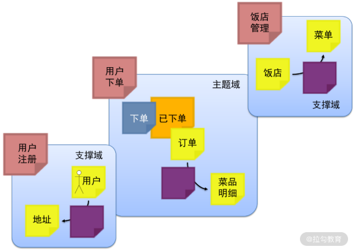
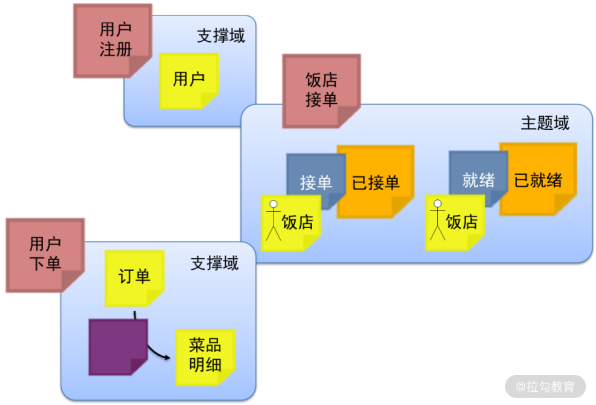
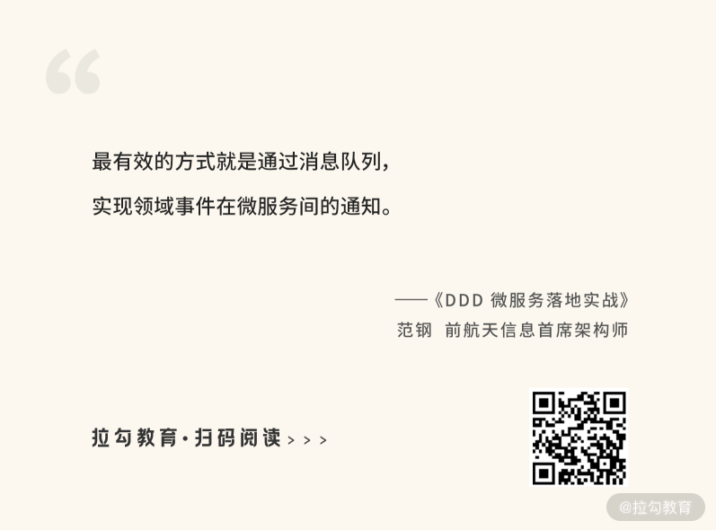
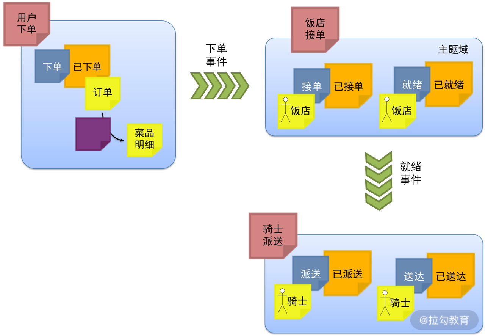
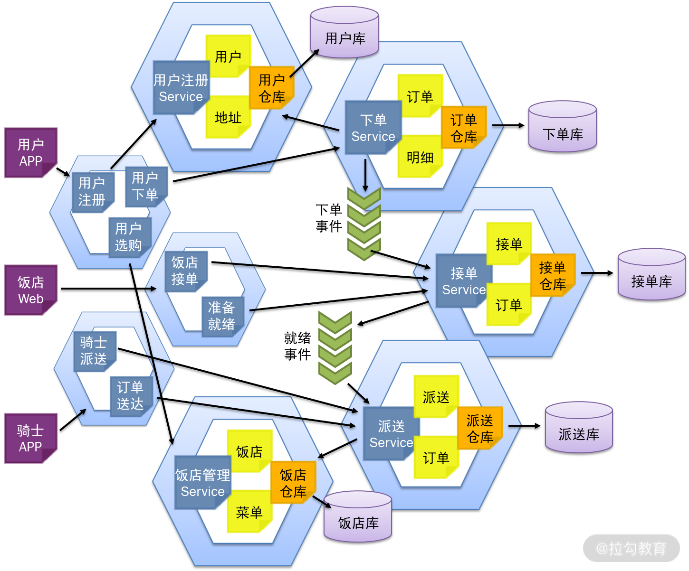

08 DDD 是如何解决微服务拆分难题的？
=====================

微服务的技术架构其实并不难。很多开发团队在微服务转型初期，将关注点主要放到了对微服务技术架构的学习。然而，当他们真正开始将微服务落地到具体的业务中时，才发现，真正的难题是微服务按照什么原则拆分、如何拆分，以及会面对哪些潜在风险。下面我们来一一解决。

### 微服务拆分的原则

在前面的内容中，我们多次提到过微服务的拆分原则，接下来我将为你详细讲解下。

**微服务的拆分原则就是“小而专”，即微服务内高内聚、微服务间低耦合。 **** “微服务内高内聚” **，** 就是单一职责原则 **，即每个微服务中的代码都是软件变化的一个原因。因这个原因而需要变更的代码都在这个微服务中，与其他微服务无关，那么就可以将代码修改的范围缩小到这个微服务内。把这个微服务修改好了，独立修改、独立发布，该需求就实现了。这样，微服务的优势就发挥出来了。** “微服务间低耦合”**，就是说在微服务实现自身业务的过程中，如果需要执行的某些过程不是自己的职责，就应当将这些过程交给其他微服务去实现，你只需要对它的接口进行调用。譬如，“用户下单”微服务在下单过程中需要查询用户信息，但“查询用户信息”不是它的职责，而是“用户注册”微服务的职责。这样，“用户下单”微服务就不需要再去执行对用户信息的查询，而是直接调用“用户注册”微服务的接口。那么，怎样调用呢？直接调用可能会形成耦合。通过注册中心，“用户下单”微服务调用的只是在注册中心中名称叫“用户注册”的微服务。而在软件设计时，“用户注册”可以有多个实现，哪个注册到注册中心中，就调用哪个。这样，微服务之间的调用就实现了解耦。

通过 DDD 进行业务建模，再基于领域模型进行限界上下文划分，就能保证系统的设计，在限界上下文内高内聚，在限界上下文间低耦合。所以，基于限界上下文进行微服务的拆分，就能保证微服务设计的高质量。同时，通过对上下文地图的分析，就能理清微服务之间的接口调用关系，从而协调多个开发团队协同开发。

### 子域划分与限界上下文

正如第 06 讲中谈到，领域模型的绘制，不是将整个系统的领域对象都绘制在一张大图上，那样绘制很费劲，阅读也很费劲，不利于相互的交流。因此，领域建模就是将一个系统划分成了多个子域，每个子域都是一个独立的业务场景。围绕着这个业务场景进行分析建模，该业务场景会涉及许多领域对象，而这些领域对象又可能与其他子域的对象进行关联。这样，每个子域的实现就是“限界上下文”，而它们之间的关联关系就是“上下文地图”。

在本案例中，围绕着领域事件“已下单”进行分析。它属于“用户下单”这个限界上下文，但与之相关的“用户”及其“地址”来源于“用户注册”这个限界上下文，与之相关的“饭店”及其“菜单”来源于“饭店管理”这个限界上下文。因此，**在这个业务场景中 **，“** 用户下单 **”** 限界上下文属于 **“** 主题域 **”，** 而**“ **用户注册** ”**与 **“** 饭店管理 **”** 限界上下文属于 **“** 支撑域**”。同理，围绕着本案例的各个领域事件进行了如下一些设计：

“已下单”的限界上下文分析图

通过这样的设计，就能将“用户下单”限界上下文的范围，与之相关的上下文地图以及如何接口，分析清楚了。有了这些设计，就可以按照限界上下文进行微服务拆分。按照这样的设计拆分的微服务，所有与用户下单相关的需求变更都在“用户下单”微服务中实现。但是，订单在读取用户信息的时候，不是直接去 join 用户信息表，而是调用“用户注册”微服务的接口。这样，当用户信息发生变更时，与“用户下单”微服务无关，只需要在“用户注册”微服务中独立开发、独立升级，从而使系统维护的成本得到降低。

“已接单”与“已就绪”的限界上下文分析图

同样，如上图所示，我们围绕着“已接单”与“已就绪”的限界上下文进行了分析，并将它们都划分到“饭店接单”限界上下文中，后面就会设计成“饭店接单”微服务。这些场景的主题域就是“饭店接单”限界上下文，而与之相关的支撑域就是“用户注册”与“用户下单”限界上下文。通过这些设计，不仅合理划分了微服务的范围，也明确了微服务之间的接口，实现了微服务内的高内聚与微服务间的低耦合。

### 领域事件通知机制

按照 07 讲所讲到的领域模型设计，以及基于该模型的限界上下文划分，将整个系统划分为了“用户下单”“饭店接单”“骑士派送”等微服务。但是，在设计实现的时候，还有一个设计难题，即**领域事件该如何通知 **。譬如，当用户在“用户下单”微服务中下单，那么会在该微服务中形成一个订单；但是，“饭店接单”是另外一个微服务，它必须要及时获得已下单的订单信息，才能执行接单。那么，如何通知“饭店接单”微服务已经有新的订单。诚然，可以让“饭店接单”微服务按照一定的周期不断地去查询“用户下单”微服务中已下单的订单信息。然而，这样的设计，不仅会加大“用户下单”与“饭店接单”微服务的系统负载，形成资源的浪费，还会带来这两个微服务之间的耦合，不利于之后的维护。因此，** 最有效的方式就是通过消息队列 **，** 实现领域事件在微服务间的通知**。

在线订餐系统的领域事件通知

如上图所示，具体的设计就是，当“用户下单”微服务在完成下单并保存订单以后，将该订单做成一个消息发送到消息队列中；这时，“饭店接单”微服务就会有一个守护进程不断监听消息队列；一旦有消息就会触发接收消息，并向饭店发送“接收订单”的通知。在这样的设计中：

* “ **用户下单** ”**微服务只负责发送消息**，至于谁会接收并处理这些消息，与“用户下单”微服务无关；
* “ **饭店接单** ”**微服务只负责接收消息 **，至于谁发送的这个消息，与“饭店接单”微服务无关。** 这样的设计就实现了微服务之间的解耦，使得日后变更的成本降低**。同样，饭店餐食就绪以后，也是通过消息队列通知“骑士接单”。在整个微服务系统中，微服务与微服务之间的领域事件通知会经常存在，所以最好在架构设计中将这个机制下沉到技术中台中。

### DDD 的微服务设计

通过第 07 讲所讲到的一系列领域驱动设计：

* **首先通过事件风暴会议进行领域建模**；
* **接着基于领域建模进行限界上下文的设计**。

所有这些设计都是为了指导最终微服务的设计。

在 DDD 指导微服务设计的过程中：

* 首先按照限界上下文进行 **微服务的拆分** ，按照上下文地图定义 **各微服务之间的接口与调用关系** ；
* 在此基础上，通过限界上下文的划分，将 **领域模型划分到多个问题子域** ，每个子域都有一个领域模型的设计；
* 这样，按照各子域的领域模型，基于充血模型与贫血模型 **设计各个微服务的业务领域层** ，即各自的 Service、Entity 与 Value Object；
* 同时，按照领域模型 **设计各个微服务的数据库** 。

最后，将以上的设计最终落实到微服务之间的调用、领域事件的通知，以及前端微服务的设计。如下图所示：

在线订餐系统的微服务设计

这里可以看到，前端微服务与后端微服务的设计是不一致的。前面讲的都是后端微服务的设计，而前端微服务的设计与用户 UI 是密切关联的，因此通过不同角色的规划，将前端微服务划分为用户 App、饭店 Web 与骑士 App。在用户 App 中，所有面对用户的诸如“用户注册”“用户下单”“用户选购”等功能都设计在用户 App 中。它相当于一个聚合服务，用于接收用户请求：

* “用户注册”时，调用“用户注册”微服务；
* “用户选购”时，查询“饭店管理”微服务；
* “用户下单”时，调用“用户下单”微服务。

### 总结

采用 DDD 进行需求的分析建模，可以帮助微服务的设计质量提高，实现“低耦合、高内聚”，进而充分发挥微服务的优势。然而，在微服务的设计实现还要解决诸多的难题。本讲一一拆解了微服务设计实现的这些难题，及其解决思路。然而，要更加完美地解决以上问题，不是让每个微服务都去见招拆招，而是应当有一个微服务的技术中台统一去解决。这些方面的设计将在后面微服务技术中台建设的相关章节进行讲解。

下一讲我们将演练在以上领域模型与微服务设计的基础上，如何落实每一个微服务的设计，以及可能面临的设计难题。
