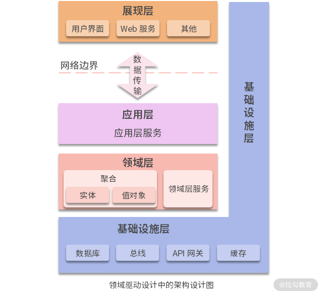
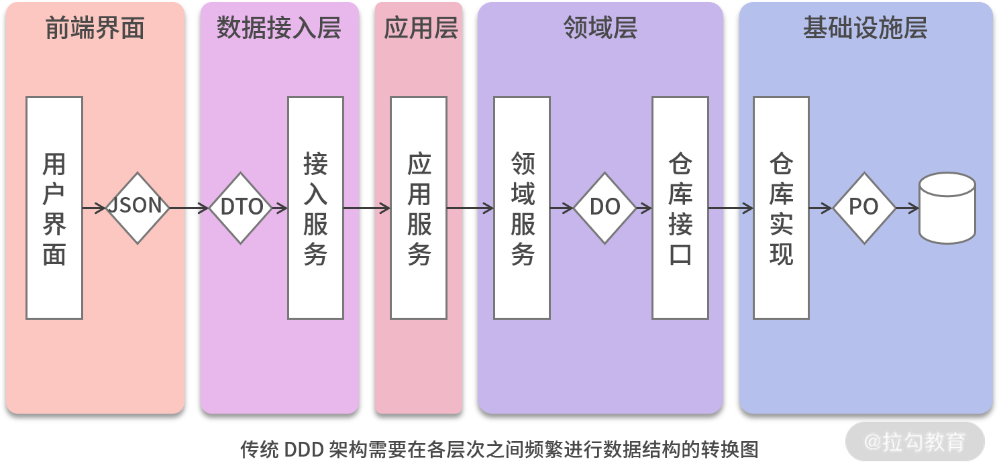
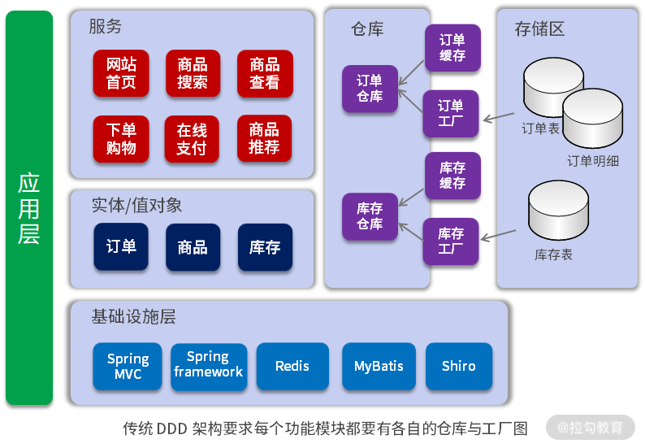
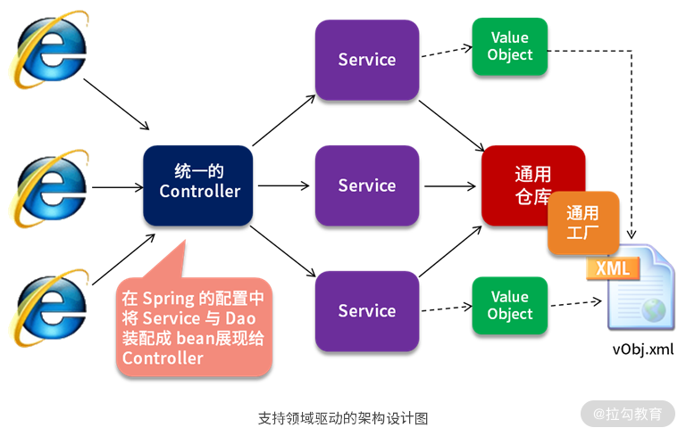
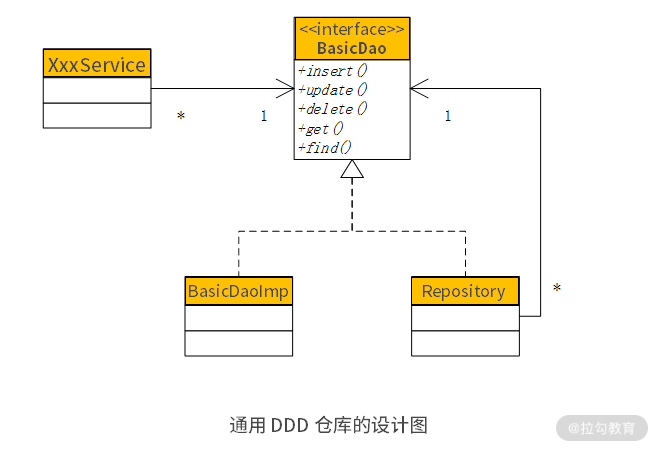

14 如何设计支持 DDD 的技术中台？
====================

DDD 要落地实践，最大的“坑”就是支持 DDD 的技术架构如何设计。很多团队在工作开展前期，一切都很顺利：通过对业务需求的理解，建立领域模型；将领域模型通过一系列的设计，落实程序设计，准确地说是程序设计中业务领域层的设计。然而就在编码实现的时候，出现了各种问题：

* 要么是不能准确掌握 DDD 的分层架构；
* 要么是把程序写得非常乱，频繁地在各种 TDO、DO、PO 之间进行数据转换，耗费大量代码，使得日后变更异常困难。

因此，还需要有一个强有力的技术中台的支持，来简化 DDD 的设计实现，解决“最后一公里”的问题。唯有这样，DDD 才能在项目中真正落地。

### 传统 DDD 的架构设计



通常，在支持领域驱动的软件项目中，架构设计如上图所示。

* **展现层**是前端的 UI，它通过网络与后台的应用层交互。
* **应用层**类似于 MVC 层，主要用于前后端交互，在接收用户请求后，会去调用领域层的服务，也就是 Service。
* 在 **领域层** 中，用户请求首先由 Service 接收，然后在执行业务操作的过程中，使用领域对象作为参数（贫血模型的实现），或者去调用领域对象中的相应方法（充血模型的实现）。在领域对象的设计上，可以是实体，也可以是值对象，也可以将它们制作成一个聚合（如果多个领域对象间存在整体与部分的关系）。
* 最后，通过仓库将领域对象中的 **数据持久化到数据库** ；使用工厂将数据从数据库中 **读取** 、**拼装 **并** 还原**成领域对象。

这些都是将领域驱动落地到软件设计时所采用的方式。从架构分层上说，DDD 的仓库和工厂的设计介于业务领域层与基础设施层之间，即接口在业务领域层，而实现在基础设施层。DDD 的基础设施层相当于支撑 DDD 的基础技术架构，通过各种技术框架支持软件系统完成除了领域驱动以外的各种功能。



然而，传统的软件系统采用 DDD 进行架构设计时，需要在各个层次之间进行各种数据结构的转换：

* 首先，前端的数据结构是 JSON，传递到后台数据接入层时需要将其转换为数据传输对象DTO；
* 然后应用层去调用领域层时，需要将 DTO 转换为领域对象 DO；
* 最后，将数据持久化到数据库时，又要将 DO 转换为持久化对象 PO。

在这个过程中，需要编写大量代码进行 **数据的转换** ，无疑将加大软件开发的工作量与日后变更的维护成本。因此，我们可不可以考虑上一讲所提到的设计，将各个层次的数据结构统一起来呢？



另外，传统的软件系统在采用 DDD 进行架构设计时，需要为每一个功能模块编写各自的仓库与工厂，如订单模块有订单仓库与订单工厂、库存模块有库存仓库与库存工厂。各个模块在编写仓库与工厂时，虽然实现了各自不同的业务，却形成了 **大量重复的代码** 。这样的问题与前面探讨的 Dao 的问题一样，是否可以通过配置与建模，设计成一个统一的仓库与工厂。如果是这样，那么仓库与工厂又与 Dao 是什么关系呢？基于对以上问题的思考，我提出了统一数据建模、内置聚合的实现、通用仓库和工厂，来简化 DDD 业务开发。因此，进行了如下的架构设计。

### 通用仓库与通用工厂的设计



该设计与上一讲的架构设计相比，差别仅是将单 Dao 替换为了通用仓库与通用工厂。也就是说，与 Dao 相比，DDD 的仓库就是在 Dao 的基础上 **扩展了一些新的功能** 。

* 例如在 **装载或查询订单** 时，不仅要查询订单表，还要补填与订单相关的订单明细与客户信息、商品信息，并装配成一个订单对象。在这个过程中，查询订单是 Dao 的功能，但其他类似补填、装配等操作，则是仓库在 Dao 基础上进行的功能扩展。
* 同样，在 **保存订单** 时，不仅要保存订单表，还要保存订单明细表，并将它们放到同一个事务中。保存订单表是 Dao 原有的功能，保存订单明细表并添加事务，则是仓库在 Dao 基础上进行的功能扩展。

这就是 DDD 的仓库与 Dao 的关系。

基于这种扩展关系，该如何设计这个通用仓库呢？如果熟悉设计模式，则会想到“装饰者模式”。“装饰者模式”的目的，就是在原有功能的基础上进行“透明功能扩展”。这种“透明功能扩展”，既可以扩展原有功能，又不影响原有的客户程序，使客户程序不用修改任何代码就能实现新功能，从而降低变更的维护成本。因此，将“通用仓库”设计成了这样。



即在原有的 BasicDao 与 BasicDaoImpl 的基础上，增加了通用仓库 Repository。将 Repository 设计成装饰者，它也是接口 BasicDao 的实现类，是通过一个属性变量引用的 BasicDao。使用时，在 BasicDaoImpl 的基础上包一个 Repository，就可以扩展出那些 DDD 的功能。因此，所有的 Service 在注入 Dao 的时候：

* 如果不使用 DDD，则像以前一样注入BasicDaoImpl；
* 如果需要使用 DDD，则注入 Repository。

配置如下：

```
<?xml version="1.0" encoding="UTF-8"?>


<beans xmlns="http://www.springframework.org/schema/beans" ...>


 <description>The application context for orm</description>


 <bean id="basicDao" class="com...impl.BasicDaoJdbcImpl"></bean>


 <bean id="redisCache" class="com...cache.RedisCache"></bean>


 <bean id="repository" class="com...RepositoryWithCache">


  <property name="dao" ref="basicDao"></property>


  <property name="cache" ref="redisCache"></property>


 </bean>


 <bean id="product" class="com.demo2...impl.ProductServiceImpl">


  <property name="dao" ref="repository"></property>


 </bean>


 <bean id="supplier" class="com.demo2...impl.SupplierServiceImpl">


  <property name="dao" ref="basicDao"></property>


 </bean>


 <bean id="productQry" class="com.demo2...AutofillQueryServiceImpl">


  <property name="queryDao">


   <bean class="com.demo2.support.dao.impl.QueryDaoMybatisImpl">


    <property name="sqlMapper" value="com.demo2...dao.ProductMapper.query"></property>


   </bean>


  </property>


  <property name="dao" ref="basicDao"></property>


 </bean>


</beans>

```

在这一配置中可以看到，Repository 中有一个属性 Dao 配置的是 BasicDao。这样当 Repository 访问数据库时，通过 BasicDao 进行访问。同时，这里实现了两个通用仓库：Repository 与 RepositoryWithCache。如果配置后者则可以实现缓存的功能。

在以上示例中，Product 将 Dao 配置为 Repository。这样，Product 在通过 ID 装载时，就会在产品对象中加载与其关联的供应商 Supplier。同时，productQry 将 queryDao 配置为 AutofillQueryServiceImpl，则在查询产品信息以后，会自动补填与其关联的供应商 Supplier。

这里，通用仓库是如何指导 Product 关联 Supplier 的呢？关键就在于文件 vObj.xml 进行了以下配置：

```
<?xml version="1.0" encoding="UTF-8"?>


<vobjs>


  <vo class="com.demo2.trade.entity.Product" tableName="Product">


    <property name="id" column="id" isPrimaryKey="true"></property>


    <property name="name" column="name"></property>


    <property name="price" column="price"></property>


    <property name="unit" column="unit"></property>


    <property name="classify" column="classify"></property>


    <property name="supplier_id" column="supplier_id"></property>


    <join name="supplier" joinKey="supplier_id" joinType="manyToOne"       class="com.demo2.trade.entity.Supplier"></join>


  </vo>


  <vo class="com.demo2.trade.entity.Supplier" tableName="Supplier">


    <property name="id" column="id" isPrimaryKey="true"></property>


    <property name="name" column="name"></property>


  </vo>


</vobjs>

```

在 Product 中增加了 **join 标签** ，**标注领域对象间的关联关系**。其中 joinKey=“supplier\_id”，代表在 Product 对象中的属性 supplier\_id 用于与 Supplier 的 key 值关联。joinType 代表关联类型，支持 oneToOne、manyToOne、oneToMany 三种类型的关联，但基于性能的考虑，不支持 manyToMany。当类型是 oneToMany 时，补填的是一个集合，因此领域对象中也应当是一个集合属性，例如 Customer 中有一个 Address 是 oneToMany，因此领域对象设计成这样：

```
/**


 * The customer entity


 * @author fangang


 */


public class Customer extends Entity<Long> {


 ......


 private List<Address> addresses;


 /**


  * @return the addresses


  */


 public List<Address> getAddresses() {


  return addresses;


 }


 /**


  * @param addresses the addresses to set


  */


 public void setAddresses(List<Address> addresses) {


  this.addresses = addresses;


 }


}

```

因此，在 vObj.xml 中进行如下配置：

```
<?xml version="1.0" encoding="UTF-8"?>


<vobjs>


  <vo class="com.demo2.customer.entity.Customer" tableName="Customer">


    <property name="id" column="id" isPrimaryKey="true"></property>


    <property name="name" column="name"></property>


    <property name="sex" column="sex"></property>


    <property name="birthday" column="birthday"></property>


    <property name="identification" column="identification"></property>


    <property name="phone_number" column="phone_number"></property>


    <join name="addresses" joinKey="customer_id" joinType="oneToMany" isAggregation="true" class="com.demo2.customer.entity.Address"></join>


  </vo>


  <vo class="com.demo2.customer.entity.Address" tableName="Address">


   <property name="id" column="id" isPrimaryKey="true"></property>


   <property name="customer_id" column="customer_id"></property>


   <property name="country" column="country"></property>


   <property name="province" column="province"></property>


   <property name="city" column="city"></property>


   <property name="zone" column="zone"></property>


   <property name="address" column="address"></property>


   <property name="phone_number" column="phone_number"></property>


  </vo>


</vobjs>

```

这样，在装载和查询 Customer 时，内置就将它关联的 Address 也加载出来了。在加载中，通过 Dao 去数据库中查询数据，然后将查询到的 Customer 与多个 Address 交给通用工厂去装配。如果配置的是 RepositoryWithCache，则加载 Customer 时会先检查缓存中有没有该客户。如果没有则到数据库中查询。

### **内置聚合功能 **** 聚合**是领域驱动设计中一个非常重要的概念，它代表在真实世界中的整体与部分的关系。比如，Order（订单）与 OrderItem（订单明细）就是一个整体与部分的关系。当加载一个订单时，应当同时加载其订单明细，而保存订单时应当同时保存订单与订单明细，并放在同一事务中。在设计支持领域驱动的技术中台时，应当简化聚合的设计与实现，让业务开发人员不必每次都编写大量代码，而是通过一个配置就可以完成聚合的实现

例如，订单与订单明细存在聚合关系，则在 vObj.xml 中建模时，通过 join 标签关联它们，并置 join 标签的 isAggregation=true。这样，在查询或装载订单的同时，装载它的所有订单明细，而在保存订单时保存订单明细，并将它们置于同一事务中。具体配置如下：

```
<?xml version="1.0" encoding="UTF-8"?>


<vobjs>


  <vo class="com.demo2.order.entity.Customer" tableName="Customer">


    <property name="id" column="id" isPrimaryKey="true"></property>


    <property name="name" column="name"></property>


    <property name="sex" column="sex"></property>


    <property name="birthday" column="birthday"></property>


    <property name="identification" column="identification"></property>


    <property name="phone_number" column="phone_number"></property>


    <join name="addresses" joinKey="customer_id" joinType="oneToMany" isAggregation="true" class="com.demo2.order.entity.Address"></join>


  </vo>


  <vo class="com.demo2.order.entity.Address" tableName="Address">


   <property name="id" column="id" isPrimaryKey="true"></property>


   <property name="customer_id" column="customer_id"></property>


   <property name="country" column="country"></property>


   <property name="province" column="province"></property>


   <property name="city" column="city"></property>


   <property name="zone" column="zone"></property>


   <property name="address" column="address"></property>


   <property name="phone_number" column="phone_number"></property>


  </vo>


  <vo class="com.demo2.order.entity.Product" tableName="Product">


    <property name="id" column="id" isPrimaryKey="true"></property>


    <property name="name" column="name"></property>


    <property name="price" column="price"></property>


    <property name="unit" column="unit"></property>


    <property name="classify" column="classify"></property>


    <property name="supplier_id" column="supplier_id"></property>


  </vo>


  <vo class="com.demo2.order.entity.Order" tableName="Order">


   <property name="id" column="id" isPrimaryKey="true"></property>


   <property name="customer_id" column="customer_id"></property>


   <property name="address_id" column="address_id"></property>


   <property name="amount" column="amount"></property>


   <property name="order_time" column="order_time"></property>


   <property name="flag" column="flag"></property>


   <join name="customer" joinKey="customer_id" joinType="manyToOne" class="com.demo2.order.entity.Customer"></join>


   <join name="address" joinKey="address_id" joinType="manyToOne" class="com.demo2.order.entity.Address"></join>


   <join name="orderItems" joinKey="order_id" joinType="oneToMany" isAggregation="true" class="com.demo2.order.entity.OrderItem"></join>


  </vo>


  <vo class="com.demo2.order.entity.OrderItem" tableName="OrderItem">


   <property name="id" column="id" isPrimaryKey="true"></property>


   <property name="order_id" column="order_id"></property>


   <property name="product_id" column="product_id"></property>


   <property name="quantity" column="quantity"></property>


   <property name="price" column="price"></property>


   <property name="amount" column="amount"></property>


   <join name="product" joinKey="product_id" joinType="manyToOne" class="com.demo2.order.entity.Product"></join>


  </vo>


</vobjs>

```

在该配置中可以看到，订单不仅与订单明细关联，还与客户、客户地址等信息关联。但是，订单与客户、客户地址等信息不存在聚合关系，当保存订单时不需要保存或更改这些信息。只有订单明细与订单具有聚合关系，在订单中配置订单明细的 join 标签时，才需要增加isAggregation=true。这样，当保存订单时，同时也保存订单明细，并将它们放到同一事务中。通过这样的设计，既**简化了聚合的实现 **，又使得** 聚合实现在底层技术中台中**，与业务代码无关。因此，系统可以通过底层不断优化对聚合的设计实现，使变更成本更低。

### 总结

本讲通过一个支持 DDD 的技术中台，将许多 DDD 繁杂的设计实现，做成通用的仓库与工厂，封装在了底层的技术中台中。这样，业务开发人员就可以更加专注于领域建模，将模型按照一定的规范进行配置，来完成基于 DDD 的设计开发。而底层的技术中台就可以根据这些配置，完成相应的数据持久化与查询装载了。

同时，以上设计简化了系统设计，不再需要将数据在 JSON、TDO、DO、PO 中进行转换，而是通过规范，将 JSON 与 DO 设计一致，将 DO 与数据库进行配置，就可以完成开发。代码减少了，日后的维护与变更也变得容易了。

另外，有同学问了一个有趣的问题：我在查询订单的时候本来不想加载订单明细，而加载了订单明细，是不是会影响性能。答案是肯定的，所以说未来在面对高并发时，应当采用富客户端以减少前后交互次数。因此，在设计上应当尽量多加载一些数据到前端，使更多操作直接在前端进行。这样就有效减少了交互次数，降低了系统压力。

下一讲将进一步探讨支持 DDD 的微服务，技术中台该如何设计。

[点击 GitHub 链接](https://github.com/mooodo/demo-service2-support)，查看源码。
