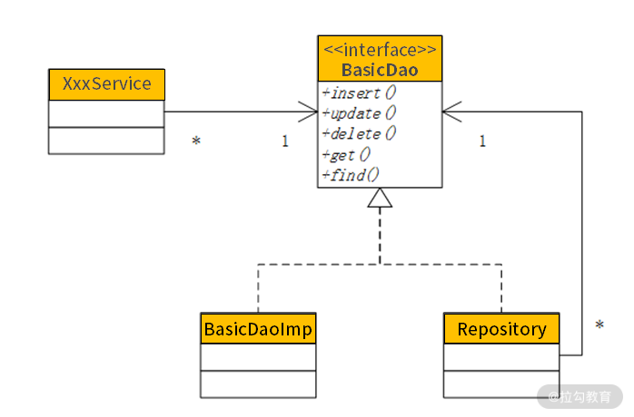

# 17 基于 DDD 的微服务设计演示（含支持微服务的 DDD 技术中台设计）

上一讲，我们讲解了基于 DDD 的代码设计思路，这一讲，接着来讲解我设计的、支持微服务的 DDD 技术中台的设计开发思路。

### 单 Service 实现数据查询

前面讲过通过单 Dao 实现对数据库的增删改，然而在查询的时候却是反过来，用单 Service 注入不同的 Dao，实现各种不同的查询。这样的设计也是在我以往的项目中被“逼”出来的。

几年前，我组织了一个大数据团队，开始 **大数据相关产品的设计开发** 。众所周知，大数据相关产品，就是运用大数据技术对海量的数据进行分析处理，并且最终的结果是通过各种报表来查询并且展现。因此，这样的项目，除了后台的各种分析处理以外，还要在前端展现各种报表，而且这些报表非常多而繁杂，动辄就是数百张之多。同时，使用这个系统的都是决策层领导，他们一会儿这样分析，一会儿那样分析，每个需求还非常急，恨不得马上就能用上。因此，我们必须具备快速开发报表的能力，而传统的从头一个一个制作报表根本来不及。

通过对现有报表进行反复分析，提取共性、保留个性，我发现每个报表都有许多相同或者相似的地方。 **每个报表在 Service 中的代码基本相同** ，无非就是从前端获取查询参数，然后调用 Dao 执行查询，最多再做一些翻页的操作。既然如此，那么何必要为每个功能设计 Service 呢？把它们合并到一个 Service，然后注入不同的 Dao，不就可以进行不同的查询了吗？

那么，这些 Dao 怎么设计呢？以往采用 MyBatis 的方式，每个 Dao 都要写一个自己的接口，然后配置一个 Mapper。然而，这些 Dao 接口都长得一模一样，只是接口名与 Mapper 不 同。此外，过去的设计，每个 Service 都对应一个 Dao，现在一个 Service 要对应很多个Dao，那用注解的方式就搞不定了。针对以上的设计难题，经过反复的调试，将架构设计成这样。

首先，整个系统的查询只有一个 QueryService，它有一个 QueryDao，可以注入不同的 Dao。然而，也不需要为每个 Dao 写接口，这样设计过于麻烦。用一个 QueryDaoImpl 注入不同的 Mapper，就可以做成不同的 Dao，再装配 Service，就能在 Spring 中装配成不同的 bean，做不同的查询：

```
<?xml version="1.0" encoding="UTF-8"?>


<beans xmlns="http://www.springframework.org/schema/beans" ...>


 <description>The application context for query</description>


 <bean id="customerQry" class="com.demo2.support.service.impl.QueryServiceImpl">


  <property name="queryDao">


   <bean class="com.demo2.support.dao.impl.QueryDaoMybatisImpl">


    <property name="sqlMapper" value="com.demo2.trade.query.dao.CustomerMapper"></property>


   </bean>


  </property>


 </bean>


</beans>

```

在代码中，我们回归 xml 的形式，编写了一个 applicationContext-qry.xml。在名为customerQry 的 bean 中，class 都是 QueryServiceImpl，注入的都是QueryDaoMybatisImpl，但 sqlMapper 配置不同的 mapper，就可以进行不同的查询。

这个 mapper 就是 MyBatis 的 mapper，它们被放在 classpath 的 mapper 目录下（详见MyBatis 的设计开发），然后将内容按照以下的格式进行编写：

```
<?xml version="1.0" encoding="UTF-8"?>


<!DOCTYPE mapper PUBLIC "-//mybatis.org//DTD Mapper 3.0//EN"


"http://mybatis.org/dtd/mybatis-3-mapper.dtd">


<mapper namespace="com.demo2.trade.query.dao.CustomerMapper">


 <sql id="select">


  SELECT * FROM Customer WHERE 1 = 1


 </sql>


 <!-- 查询条件部分 -->


 <sql id="conditions">


  <if test="id != '' and id != null">


   and id = #{id}


  </if>


 </sql>


 <!-- 翻页查询部分 -->


 <sql id="isPage">


  <if test="size != null  and size !=''">


   limit #{size} offset #{firstRow} 


  </if>


 </sql>

 <select id="query" parameterType="java.util.HashMap" resultType="com.demo2.trade.entity.Customer">


      <include refid="select"/>


  <include refid="conditions"/>


  <include refid="isPage"/>


 </select>


 <!-- 计算count部分 -->


 <select id="count" parameterType="java.util.HashMap" resultType="java.lang.Long">


  select count(*) from (


   <include refid="select"/>


   <include refid="conditions"/>


  ) count


 </select>


 <!-- 求和计算部分 -->


 <select id="aggregate" parameterType="java.util.HashMap" resultType="java.util.HashMap">


  select ${aggregation} from (


   <include refid="select"/>


   <include refid="conditions"/>


  ) aggregation


 </select>


</mapper>

```

在这段配置中，我们通常只需要修改 Select 与 Condition 部分就可以了。

- Select 部分是 **查询语句** ，但这部分通常是单表查询，而不采用 join 操作去 join 其他表，这样在数据量大时性能会比较差。同时，最后的 WHERE 1 = 1 是必写的，为了避免在没有查询条件时出错。
- Condition 部分是 **查询条件** ，参数中有这个条件就加入，没有则去掉。

接着，系统在后台查询时可能会执行多次：分页查询时执行一次，计算 count 时执行一次，求和计算时执行一次。但无论执行多少次，Select 与 Condition 部分只需要编写一次，从而减少了开发工作量，也避免了编写错误。

该 mapper 在最前面编写的 namespace，就是在 queryDao 中配置 mapper 的内容，它们必须完全一致。此外，在 query 部分的 resultType 可以写为某个领域对象，这样在 **查询结果集** 中就是这个对象的集合。

以上查询最好都是 **单表查询** ，那么需要 join 怎么办呢？最好采用 **数据补填** ，即在单表查询并分页的基础上，对那一页的数据执行补填。如果需要补填，那么 QueryService 就这样配置：

```
<?xml version="1.0" encoding="UTF-8"?>


<beans xmlns="http://www.springframework.org/schema/beans" ...>


 <description>The application context for query</description>


 <bean id="productQry" class="com.demo2.support.repository.AutofillQueryServiceImpl">


  <property name="queryDao">


   <bean class="com.demo2.support.dao.impl.QueryDaoMybatisImpl">


    <property name="sqlMapper" value="com.demo2.trade.query.dao.ProductMapper"></property>


   </bean>


  </property>


  <property name="dao" ref="basicDao"></property>


 </bean>


</beans>

```

在该案例中，productQry 本来应该配置 QueryServiceImpl，却替换为AutofillQueryServiceImpl。同时，在 vObj.xml 中进行了如下配置：

```
<?xml version="1.0" encoding="UTF-8"?>


<vobjs>


  <vo class="com.demo2.trade.entity.Product" tableName="Product">


    <property name="id" column="id" isPrimaryKey="true"></property>


    <property name="name" column="name"></property>


    <property name="price" column="price"></property>


    <property name="unit" column="unit"></property>


    <property name="classify" column="classify"></property>


    <property name="supplier_id" column="supplier_id"></property>


    <join name="supplier" joinKey="supplier_id" joinType="manyToOne" class="com.demo2.trade.entity.Supplier"></join>


  </vo>


  <vo class="com.demo2.trade.entity.Supplier" tableName="Supplier">


    <property name="id" column="id" isPrimaryKey="true"></property>


    <property name="name" column="name"></property>


  </vo>


</vobjs>

```

在配置中可以看到，Product 的配置中增加了一个 join 标签，配置的是 Supplier，同时又配置了 Supplier 的查询。这样，当完成对 Product 的查询以后，发现有 join 标签，就会根据Supplier 的配置批量查询供应商，并自动补填到 Product 中。所以，只要有了这个 join，就必须要配置后面 Supplier，才能通过它查询数据库中的供应商数据，完成数据补填。

有了这样的设计，业务开发人员不必实现数据补填的烦琐代码，只需要在建模的时候配置好就可以了。要补填就配置 AutofillQueryServiceImpl，不补填就配置 QueryServiceImpl，整个系统就可以变得灵活而易于维护。特别需要注意的是，如果配置的是 AutofillQueryServiceImpl，那么除了配置 queryDao，还要配置 basicDao。因为在数据补填时，是通过 basicDao 采用 load() 或 loadForList() 进行补填的。

### 数据补填对微服务的支持

从以上案例可以看到，对 Product 补填 Supplier，这两个表的数据必须要在 **同一个数据库里** ，这在单体应用是 OK 的，但到微服务就不 OK 了。微服务不仅拆分了应用，还拆分了数据库。当 Product 微服务要补填 Supplier 时，是没有权限读取 Supplier 所在的数据库，只能远程调用 Supplier 微服务的相应接口。这样，通过以上配置完成数据补填就不行了，必须要 **技术中台** 提供对微服务的相应支持。

在微服务系统中，通过远程接口进行数据补填的需求，在基于 DDD 的设计开发中非常常见，因此技术中台必须针对这样的情况提供支持。为此，我在 join 标签的基础上又提供了 ref 标签。假设系统通过微服务的拆分，将 Product 与 Supplier 拆分到两个微服务中。这时，要在 Product 微服务中的 vObj.xml 文件中进行如下配置：

```
<?xml version="1.0" encoding="UTF-8"?>


<vobjs>


  <vo class="com.demo2.product.entity.Product" tableName="Product">


    <property name="id" column="id" isPrimaryKey="true"></property>


    <property name="name" column="name"></property>


    <property name="price" column="price"></property>


    <property name="unit" column="unit"></property>


    <property name="classify" column="classify"></property>


    <property name="supplier_id" column="supplier_id"></property>


    <ref name="supplier" refKey="supplier_id" refType="manyToOne" 


      bean="com.demo2.product.service.SupplierService" method="loadSupplier" listMethod="loadSuppliers">


    </ref>


  </vo>


</vobjs>

```

以上配置将 join 标签改为了 ref 标签。在 ref 标签中，bean 就是在 Product 微服务中对Supplier 微服务进行远程调用的 Feign 接口（详见第 15 讲）。这时，需要 Supplier 微服务提供 2 个查询接口：

- Supplier loadSupplier(id)，即通过某个 ID 进行查找；
- List loadSupplier(Listids)，通过多个 ID 进行批量查找。

在这里， **method 配置的是对单个 ID 进行查找的方法** ，**listMethod 配置的是对多个 ID 批量查找的方法**。通过这 2 个配置，就可以用 Feign 接口实现微服务的远程调用，完成跨微服务的数据补填。通过这样的设计，在 Product 微服务的 vObj.xml 中就不用配置 Supplier 了。

### 通用仓库与工厂的设计

没有采用 DDD 之前，在系统的设计中，每个 Service 都是直接注入 Dao，通过 Dao 来完成业务对数据库的操作。然而，DDD 的架构设计增加了仓库与工厂，除了**读写数据库 **以外，还要** 实现对领域对象的映射与装配**。那么，DDD 的仓库与工厂，和以往的 Dao 是什么关系呢？又应当如何设计呢？

传统的 DDD 设计，每个模块都有自己的**仓库与工厂**，工厂是领域对象创建与装配的地方，是生命周期的开始。创建出来后放到仓库的缓存中，供上层应用访问。当领域对象在经过一系列操作以后，最后通过仓库完成数据的持久化。这个领域对象数据持久化的过程，对于普通领域对象来说就是存入某个单表，然而对于有聚合关系的领域对象来说，需要存入多个表中，并将其放到同一事务中。

在这个过程中，**聚合关系会出现跨库的事务操作吗 **？即具有聚合关系的多个领域对象会被拆分为多个微服务吗？我认为是不可能的，因为聚合就是一种** 强相关的封装**，是不可能因微服务而拆分的。如果出现了，要么不是聚合关系，要么就是微服务设计出现了问题。因此，仓库是不可能完成跨库的事务处理的。

弄清楚了传统的 DDD 设计，与以往 Dao 的设计进行比较，就会发现仓库和工厂就是对 Dao 的替换。然而，这种替换不是简单的替换，它们对 Dao 替换的同时，还**扩展了许多的功能**，如数据的补填、领域对象的映射与装配、聚合的处理，等等。当我们把这些关系思考清楚了，通用仓库与工厂的设计就出来了。



如上图所示，仓库就是一个 Dao，它实现了 BasicDao 的接口。然而，仓库在读写数据库时，是把 BasicDao 实现类的代码重新 copy 一遍吗？不！那样只会形成大量重复代码，不利于日后的变更与维护。因此，仓库通过一个属性变量将 BasicDao 包在里面。这样，当仓库要读写数据库时，实际上调用的是 BasicDao 实现类，仓库仅仅实现在 BasicDao 实现类基础上扩展的那些功能。这样，仓库与 BasicDao 实现类彼此之间的职责与边界就划分清楚了。

有了这样的设计，原有的遗留系统要通过改造转型为 DDD，除了通过领域建模增加 vObj.xml以外，将原来注入 Dao 改为注入仓库，就可以快速完成领域驱动的转型。同样的道理，要在仓库中增加缓存的功能，不是直接去修改仓库，而是在仓库的基础上包一个RepositoryWithCache，专心实现缓存的功能。这样设计，既使各个类的职责划分非常清楚，日后因哪种缘由变更就改哪个类，又使得系统设计松耦合，可以通过组件装配满足各种需求。

### 总结

通过本讲的讲述，我为你提供了一个可以落地的技术中台。这个中台与传统的 DDD 架构有所不同，它摒弃了一些非常烦琐的 TDO、PO、仓库与工厂的设计，而是将其封装在了底层技术框架中。这样，业务开发人员可以将更多的精力放到业务建模，以及基于业务建模的设计开发过程中。开发工作量减少了，一方面可以实现**快速交付 **，另一方面也让日后的** 变更与维护变得轻松**，可以随着领域模型的变更而变更，更好更深刻地设计我们的产品，给用户更好的体验。

下一讲我们将围绕事件驱动，来谈一谈其在微服务中的设计实现。

[点击 GitHub 链接](https://github.com/mooodo/demo-service2-support)，查看源码。
