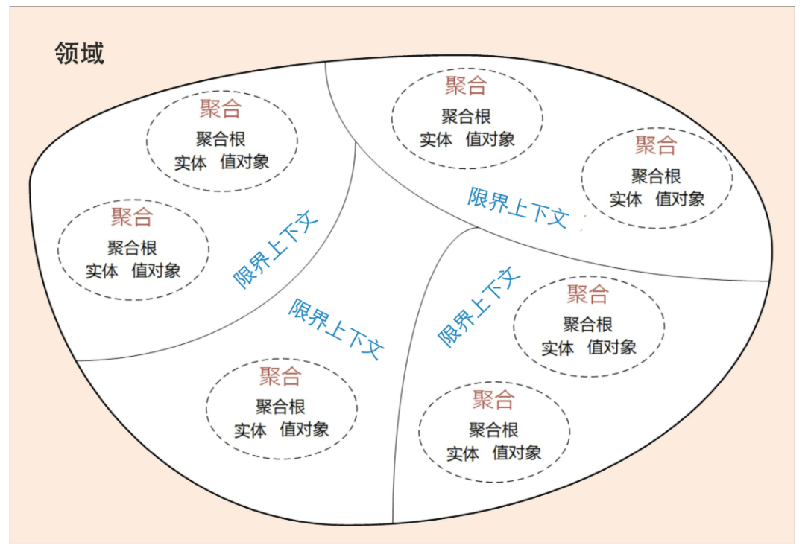

01 领域驱动设计：微服务设计为什么要选择DDD
========================

你好，我是欧创新。

我们知道，微服务设计过程中往往会面临边界如何划定的问题，我经常看到项目团队为微服务到底应该拆多小而争得面红耳赤。不同的人会根据自己对微服务的理解而拆分出不同的微服务，于是大家各执一词，谁也说服不了谁，都觉得自己很有道理。

那在实际落地过程中，我也确实见过不少项目在面临这种微服务设计困惑时，是靠拍脑袋硬完成的，上线后运维的压力就可想而知了。那是否有合适的理论或设计方法来指导微服务设计呢？当你看到这一讲的题目时，我想你已经知道答案了。

没错，就是 DDD。那么今天我就给你详细讲解下：“微服务设计为什么要选择领域驱动设计？”

软件架构模式的演进
---------

在进入今天的主题之前，我们先来了解下背景。

我们知道，这些年来随着设备和新技术的发展，软件的架构模式发生了很大的变化。软件架构模式大体来说经历了从单机、集中式到分布式微服务架构三个阶段的演进。随着分布式技术的快速兴起，我们已经进入到了微服务架构时代。

**我们可以用三步来划定领域模型和微服务的边界。**第一步：在事件风暴中梳理业务过程中的用户操作、事件以及外部依赖关系等，根据这些要素梳理出领域实体等领域对象。

第二步：根据领域实体之间的业务关联性，将业务紧密相关的实体进行组合形成聚合，同时确定聚合中的聚合根、值对象和实体。在这个图里，聚合之间的边界是第一层边界，它们在同一个微服务实例中运行，这个边界是逻辑边界，所以用虚线表示。

第三步：根据业务及语义边界等因素，将一个或者多个聚合划定在一个限界上下文内，形成领域模型。在这个图里，限界上下文之间的边界是第二层边界，这一层边界可能就是未来微服务的边界，不同限界上下文内的领域逻辑被隔离在不同的微服务实例中运行，物理上相互隔离，所以是物理边界，边界之间用实线来表示。

有了这两层边界，微服务的设计就不是什么难事了。

在战略设计中我们建立了领域模型，划定了业务领域的边界，建立了通用语言和限界上下文，确定了领域模型中各个领域对象的关系。到这儿，业务端领域模型的设计工作基本就完成了，这个过程同时也基本确定了应用端的微服务边界。

在从业务模型向微服务落地的过程中，也就是从战略设计向战术设计的实施过程中，我们会将领域模型中的领域对象与代码模型中的代码对象建立映射关系，将业务架构和系统架构进行绑定。当我们去响应业务变化调整业务架构和领域模型时，系统架构也会同时发生调整，并同步建立新的映射关系。

DDD 与微服务的关系
-----------

有了上面的讲解，现在我们不妨再次总结下 DDD 与微服务的关系。

DDD 是一种架构设计方法，微服务是一种架构风格，两者从本质上都是为了追求高响应力，而从业务视角去分离应用系统建设复杂度的手段。两者都强调从业务出发，其核心要义是强调根据业务发展，合理划分领域边界，持续调整现有架构，优化现有代码，以保持架构和代码的生命力，也就是我们常说的演进式架构。

DDD 主要关注：从业务领域视角划分领域边界，构建通用语言进行高效沟通，通过业务抽象，建立领域模型，维持业务和代码的逻辑一致性。

微服务主要关注：运行时的进程间通信、容错和故障隔离，实现去中心化数据管理和去中心化服务治理，关注微服务的独立开发、测试、构建和部署。

总结
--

今天我们主要讨论了微服务设计和拆分的难题。通过 DDD 战略设计可以建立领域模型，划定领域边界，解决微服务设计过程中，边界难以划定的难题。如果你的业务焦点在领域和领域逻辑，那么你就可以选择 DDD 作为微服务的设计方法！

更关键的一点是，DDD 不仅可以用于微服务设计，还可以很好地应用于企业中台的设计。如果你的企业正在做中台转型，DDD 将会是一把利器，它可以帮你建立一个非常好的企业级中台业务模型。有关这点你还会在后面的文章中见到详解。

除此之外，DDD 战术设计对设计和开发人员的要求相对较高，实现起来相对复杂。不同企业的研发管理能力和个人开发水平可能会存在差异。尤其对于传统企业而言，在战术设计落地的过程中，可能会存在一定挑战和困难，我建议你和你的公司如果有这方面的想法，就一定要谨慎评估自己的能力，选择最合适的方法落地 DDD。

也不妨根据收获权衡一下，**总体来说，DDD 可以给你带来以下收获：**

1. DDD 是一套完整而系统的设计方法，它能带给你从战略设计到战术设计的标准设计过程，使得你的设计思路能够更加清晰，设计过程更加规范。
2. DDD 善于处理与领域相关的拥有高复杂度业务的产品开发，通过它可以建立一个核心而稳定的领域模型，有利于领域知识的传递与传承。
3. DDD 强调团队与领域专家的合作，能够帮助你的团队建立一个沟通良好的氛围，构建一致的架构体系。
4. DDD 的设计思想、原则与模式有助于提高你的架构设计能力。
5. 无论是在新项目中设计微服务，还是将系统从单体架构演进到微服务，都可以遵循 DDD 的架构原则。
6. DDD 不仅适用于微服务，也适用于传统的单体应用。
