# 05 互联网消费金融高并发场景下监控体系建设

# 互联网消费金融高并发场景下监控面临挑战

在介绍监控系统建设设计之前，让我们首先看看，在互联网消费金融的高并发业务场景下，我们的对监控体系建设面临的困难和挑战有哪些：

1） 对于传统银行、金融集团来说，老旧系统大量存在，系统繁多，依赖关系复杂，对旧系统的监控困难； 2）.业务不断发展，对持续交付及业务连续性的要求高，需要实时告警、快速定位故障原因、并进行修复提出修复建议； 3）无法实时分析数据，操作步骤繁杂，耗时长且无法回避误操作与无效分析； 4）大量手工操作，系统难部署，环境复杂，安全难保障； 5）海量日志处理压力大，要求海量数据接收，秒级别反馈查询结果。历史数据查看困难，不便对比优化结果等。

# 构建互联网消费金融应用和系统层面监控体系

## 构建互联网消费金融调用链监控

在互联网消费金融分布式服务化架构下，不同的分布式服务间相互依赖，彼此协同来完成各类业务场景。如典型的用户发起一笔消费贷款业务场景，客户从前端发起一个请求，到最后的业务完成，需要经过很多环节，这些环节可能都是分布式服务的方式提供，部署在不同的服务器上进行。而在这种复杂的分布式服务场景下，为了定位问题、性能瓶颈查询、异常日志跟踪等，如果没有服务追踪和分析工具的帮助，都是非常困难的。


**调用链监控核心概念** 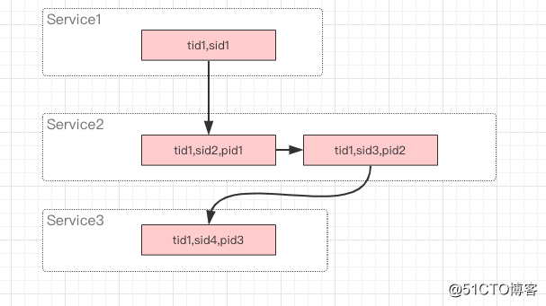

1）Trace：一次分布式调用的链路踪迹。 Trace是指一次请求调用的链路过程，trace id 是指这次请求调用的ID。在一次请求中，会在网络的最开始生成一个全局唯一的用于标识此次请求的trace id，这个trace id在这次请求调用过程中无论经过多少个节点都会保持不变，并且在随着每一层的调用不停的传递。最终，可以通过trace id将这一次用户请求在系统中的路径全部串起来。 2）Span：一个方法(局部或远程)调用踪迹。 Span是指一个模块的调用过程，一般用span id来标识。在一次请求的过程中会调用不同的节点/模块/服务，每一次调用都会生成一个新的span id来记录。这样，就可以通过span id来定位当前请求在整个系统调用链中所处的位置，以及它的上下游节点分别是什么。 3）Annotation：附着在Span上的日志信息。 可以是业务自定义的埋点信息，可以是sql、用户ID等关键信息。 4）Sampling：采样率 **调用链监控的常用工具**  **Zipkin** Twitter开源的zipkin，提供了完整的跟踪记录收集、存储功能，以及查询API与界面。其存储支持多种数据库：MySql、ElasticSearch、Cassandra、Redis等等，收集API支持HTTP和Thrift。

> Spring Cloud Sleuth是Spring Cloud封装的Zipkin兼容客户端Tracer，添加traceId和spanId到Slf4J MDC。支持埋点的库 ： • Hystrix • RestTemplate • Feign • MessagingwithSpringIntegration • Zuul

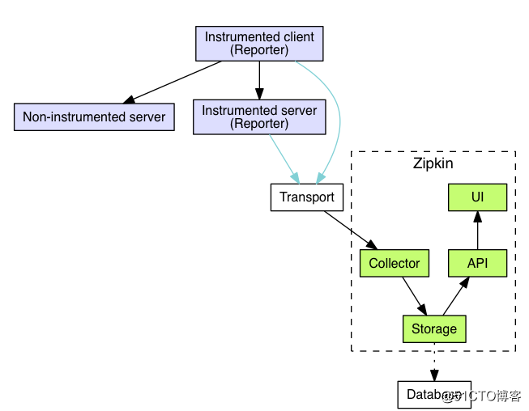  **CAT** 大众点评开源的基础监控框架，在中间件(MVC框架、RPC框架、数据库框架、缓存框架 等)得到广泛应用，为点评各个业务线提供系统的性能指标、健康状况和基础告警。 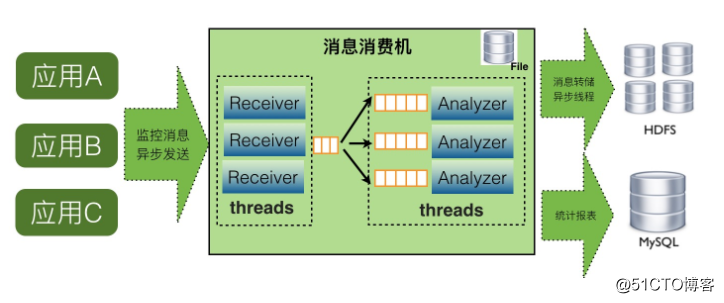

> - Cat 优势： 实时处理：信息的价值会随时间锐减，尤其是事故处理过程中 全量数据：全量采集指标数据，便于深度分析故障案例 高可用：故障的还原与问题定位，需要高可用监控来支撑 故障容忍：故障不影响业务正常运转、对业务透明 高吞吐：海量监控数据的收集，需要高吞吐能力做保证 可扩展：支持分布式、跨 IDC 部署，横向扩展的监控系统

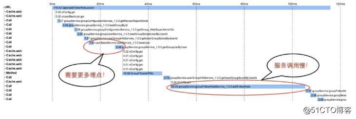

## 互联网消费金融高效的应用日志采集建设

在互联网消费金融的业务场景下，每天都有都能产生海量的日志数据。 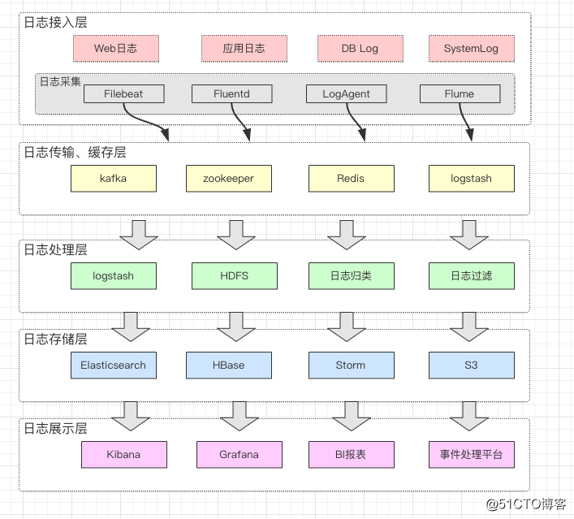

**ELKStack与EFKStack** 1）. ELK Stack 是 Elasticsearch、Logstash、Kibana 三个开源软件的组合。在实时数据检索和分析场合，三者通常是配合共用，而且又都先后归于 Elastic.co 公司名下，故有此简称。

> ELKStack具有如下几个优点： • 处理方式灵活。Elasticsearch 是实时全文索引，不需要像 storm 那样预先编程才能使用； • 配置简易上手。Elasticsearch 全部采用 JSON 接口，Logstash 是 Ruby DSL 设计，都是目前业界最通用的配置语法设计； • 检索性能高效。虽然每次查询都是实时计算，但是优秀的设计和实现基本可以达到全天数据查询的秒级响应； • 集群线性扩展。不管是 Elasticsearch 集群还是 Logstash 集群都是可以线性扩展的； • 前端操作炫丽。Kibana 界面上，只需要点击鼠标，就可以完成搜索、聚合功能，生成炫丽的仪表板。

2）. EFK由ElasticSearch、Fluentd和Kibana三个开源工具组成。Logstash是一个具有实时渠道能力的数据收集引擎,但和fluentd相比，它在效能上表现略逊一筹，故而逐渐被fluentd取代，ELK也随之变成EFK。

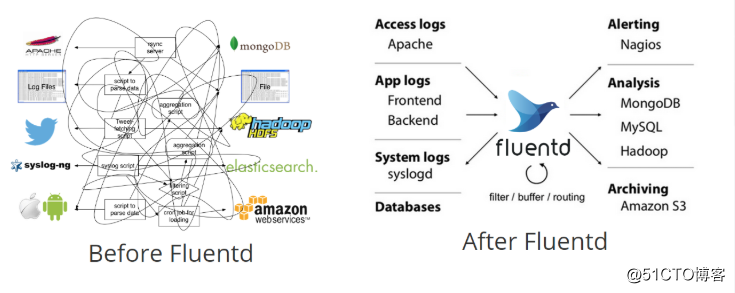 **日志采集核心技术栈介绍**

- Logstash：数据收集处理引擎，可用于传输docker各个容器中的日志给EK。支持动态的从各种数据源搜集数据，并对数据进行过滤、分析、丰富、统一格式等操作，然后存储以供后续使用。问题是它的性能以及资源消耗。
- Filebeat：和Logstash一样属于日志收集处理工具，基于原先 Logstash-fowarder 的源码改造出来的。与Logstash相比，filebeat更加轻量，占用资源更少
- ElasticSearch:日志搜索引擎，主要负责海量数据的存储； 
- Kibana:用于日志展示的可视化工具 
- Grafana:类似Kibana，可对后端的数据进行实时展示；
- Flume 作为 cloudera 开发的实时日志收集系统，受到了业界的认可与广泛应用。Flume是一个分布式、可靠地、可用的服务，用来收集、聚合、传输日志数据。 它是一个基于流式数据的架构，简单而灵活。具有健壮性、容错机制、故障转移、恢复机制。它提供一个简单的可扩展的数据模型，容许在线分析程序。 使用 Flume EXEC执行一个linux命令来生成数据源。例如，可以用tail命令监控一个文件，那么，只要文件增加内容，EXEC就可以将增加的内容作为数据源发送出去。使用 org.apache.flume.plugins.KafkaSink，将Flume EXEC产生的数据源发送到Kafka中；
- Fluentd是一个开源的数据收集器，专为处理数据流设计，使用JSON作为数据格式。它采用了插件式的架构，具有高可扩展性高可用性，同时还实现了高可靠的信息转发。

## 互联网消费金融系统监控设计

**Metric 监控**

- JVM相关指标： GC,堆栈mem，thread等
- 应用内存的状态 内存队列长度，线程执行状态
- 数据库连接池指标

**系统层监控**

- CPU监控
- 内存监控
- network监控
- disk监控

**基础设施监控**

- 网络流量
- 丢包率
- 连接数
- 交换机监控

## 互联网消费金融移动端、前端监控设计

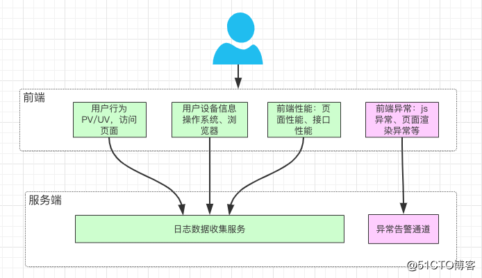 移动端、前端的监控内容包括：

- 用户的行为：PV、PV，页面停留时间等
- 城市、地区
- 运营商
- 移动端、前端的版本
- 操作系统类型、版本
- 浏览器类型、版本等
- 异常数据：Javascript的异常监控、样式丢失的异常监控等
- 前端性能：页面加载性能、接口访问性能等

# 建设互联网消费金融业务层面监控体系

## 建设互联网消费金融业务监控大屏

建设业务监控大屏，运维调度和监控中心可以通过中心仪表板提供实时动态的业务运行状况监控视图，监测和告警大量相关内容，实时发现问题和定位问题。 监控的主要内容包括包括：业务相关统计数据，如业务质量、业务数量、用户访问数、定义的URL数量、互联网访问数和错误个数；业务实时动态；业务访问统计；业务健康度；业务质量分析及资源使用量等。 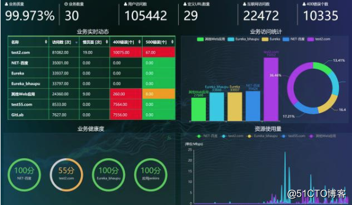 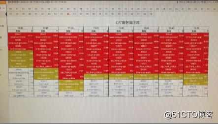

## 互联网消费金融主要业务场景监控

**业务汇总类监控** 1） 对当天的进件量进行监控。

- 例子：当天进件量超过50000件。

2） 进件审批场景的监控：如审批的数量、失败数进行监控；

- 例子：当天审批失败的笔数及客户数超过30笔；当天累计审批通过1000笔。

3） 实时客户访问数量进行监控；

- 例子：当前客户访问量超过10000；当前客户访问量比上周同比增加80%；

4） 对累计放款金额的监控：

- 例子：当天累计放款金额超过一千万；

**贷款流程监控** 1） 放款、还款流程监控

- 例子：信用小贷产品未放款或放款失败，订单号：xxx1000；

2） 审批环节监控

- 例子：信用小贷产品自动审批出错，错误码：10010；

3） 风控环节监控

- 例子：风控规则组出错，错误码：10010；

4） 关键业务规则监控

- 例子：出现贷款额度大于1千万的合同；出现贷款利率超过30%的借据；

**定时跑批监控** 1） 跑批节点进行监控

- 例子：日终批量补充批节点出错，错误码：10010；

2） 跑批时效进行监控

- 例子：日终批量补充批节处理时间超过1小时；

**外部接口监控** 1） 调用外部接口超时监控

- 例子：人行征信接口连续20秒内相应时间大于10秒；

2） 调用外部接口出错监控

- 例子：公积金查询接口连续出错10次；

## 互联网消费金融业务埋点建设

**设计埋点的模型** 1）. 事务Transaction 需要跨越一段时间的程序事务，如：访问一个页面，调用一个服务，一次数据库访问查询订单等； 2）. 事件Event 一次程序引发的事件，如：一次异常的抛出，用户的一次下单操作，用户的一次登录行为等； 3）. 心跳Heartbeat 有规律的，周而复始发生的事件，如一分钟内java程序的GC次数，每分钟的CPU的使用率，定时任务的定时批量处理等 4）. 业务指标Metric 指业务的多维度指标统计，如订单支付金额指标，风控规则组的通过率，客户的提款额度，银行的存款余额等 **设计业务的监控埋点** 1）. 目标设计

- 需要监控的埋点指标，如：每分钟系统处理审批的效率、支付接口的成功率等等；
- 需要解决的问题，如：提升审批节点的速度，降低支付接口的失败率等等。 2）. 方案设计
- 设计一个符合实际场景的埋点方案；
- 设计采集的数据的指标； 3）. 编写埋点代码
- 根据实际需要，实现 **式和非** 式代码编写； 4）. 验证业务埋点
- 发布上线后，根据埋点的报表结果，进行验证，是否符合预期指标；
- 不断优化埋点方案。

**业务埋点方案实践** 这里以CAT监控平台为例，实现监控订单保存业务埋点。 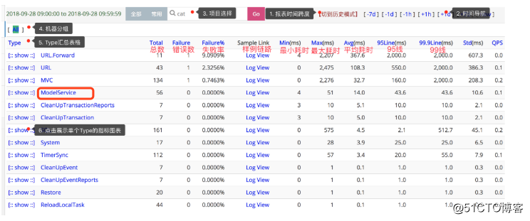

```
 public void ModelService(Order order) {        
    Transaction transaction = Cat.newTransaction("ModelService", order.getId());
    try {
        saveOrder(order); // 监控保存订单的速度
        transaction.setStatus(Transaction.SUCCESS);
    } catch (Exception e) {
        transaction.setStatus(e); // catch 到异常，设置状态，代表此请求失败
        Cat.logError(e); // 将异常上报到cat上
        // 也可以选择向上抛出： throw e;
    } finally {
        transaction.complete();
    }
} 
```

# 互联网消费金融监控告警架构设计

> 搭建互联网消费金融监控，能为我们的系统带来很多好处： 1、根据历史监控数据，做出告警预测； 2、发生异常时，即使报警，或做出相应措施； 3、根据监控报警及时定位问题根源； 4、通过可视化图表展示，便于直观获取信息。

## 告警数据采集

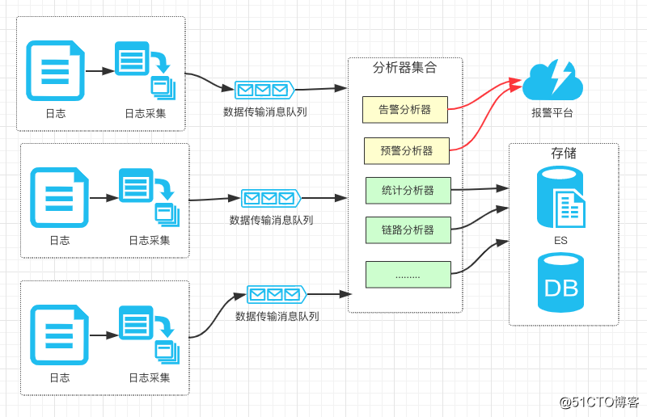

1）. 及时告警

- 日志消息全异步、分片处理提高并发处理效率；
- 多分析器实例并行处理；
- 实时日志数据走特殊通道，实时处理。

2）. 准确告警

- 连续多个时间片的采集值进行联合分析、判断，降低干扰及误报；
- 报警的阈值需要不断优化调整；
- 线性拟合算法的插值量尽可能的多。

## 告警异常程度分类

通常我们需要给异常分级处理。

1）. 忽略：一些可以忽略的数据波动，影响比较小的、不紧急的情况。 2）. 通知：提醒负责人该关注一下这里的问题，视情况而处理，比如钱不够了加钱，交易上升了等等。 3）. 告警：出现比较大的问题了，需要安排人力紧急排查了。

## 告警的通知方式

根据告警的紧急程度采取不同的通知方式，优先级依次是：短信/电话 > IM(微信钉钉等) > 数据图表 1）. 短信/电话：对应异常告警等级。 2）. IM：对应异常通知等级。 3）. 数据图表：对应异常忽略/通知等级。

## 搭建互联网消费金融监控告警平台Prometheus

**Prometheus的特点** Prometheus是由SoundCloud开发的开源监控报警系统和时序列数据库(TSDB)。Prometheus使用Go语言开发，是Google BorgMon监控系统的开源版本。 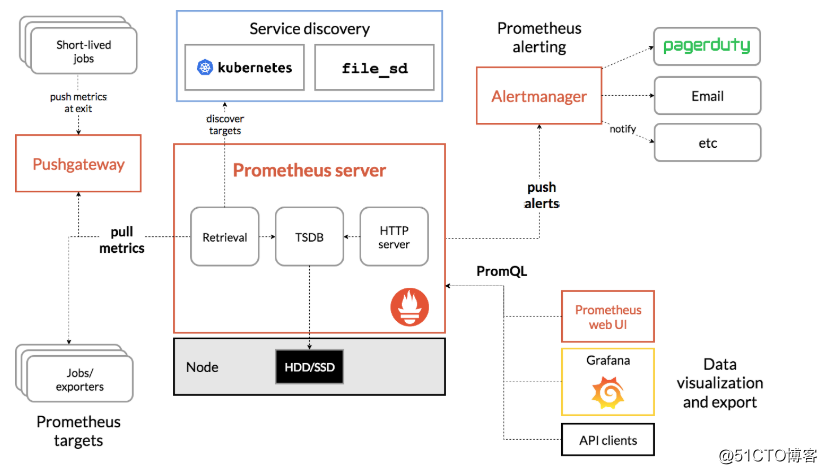

- 多维度数据模型。
- 灵活的查询语言。
- 不依赖分布式存储，单个服务器节点是自主的。
- 通过基于HTTP的pull方式采集时序数据。
- 可以通过中间网关进行时序列数据推送。
- 通过服务发现或者静态配置来发现目标服务对象。
- 支持多种多样的图表和界面展示，比如Grafana等。

**Prometheus的基本原理** Prometheus的基本原理是通过HTTP协议周期性抓取被监控组件的状态，任意组件只要提供对应的HTTP接口就可以接入监控。不需要任何SDK或者其他的集成过程。这样做非常适合做虚拟化环境监控系统，比如VM、Docker、Kubernetes等。输出被监控组件信息的HTTP接口被叫做exporter 。目前互联网公司常用的组件大部分都有exporter可以直接使用，比如Varnish、Haproxy、Nginx、MySQL、Linux系统信息(包括磁盘、内存、CPU、网络等等)。 **Prometheus的功能** 1）.业务应用层监控 我们可以通过在业务层添加埋点来监控系统，如贷款进度、支付放款埋点等。Prometheus支持多种语言（Go，java，python，ruby官方提供客户端，其他语言有第三方开源客户端）。 2）. 中间件应用监控 一些主流应用可以通过官方或第三方的导出器，来对这些应用做核心指标的收集。如redis,mysql。 3）. 在系统层用作系统监控 除了常用软件， prometheus也有相关系统层和网络层exporter,用于监控服务器或网络。 4）. 集成其他的监控 prometheus还可以通过各种export，集成其他的监控系统，收集监控数据，如AWS CloudWatch，JMX，Pingdom等等
