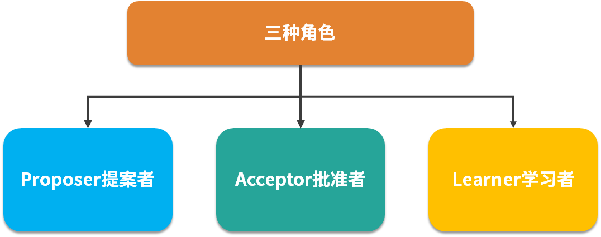
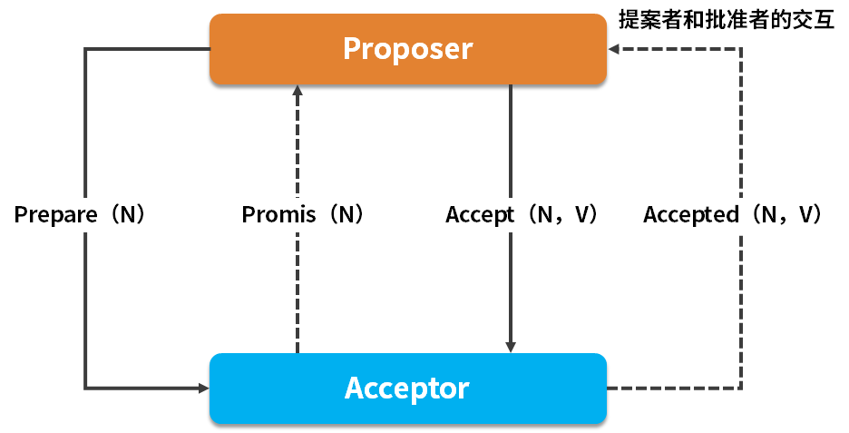
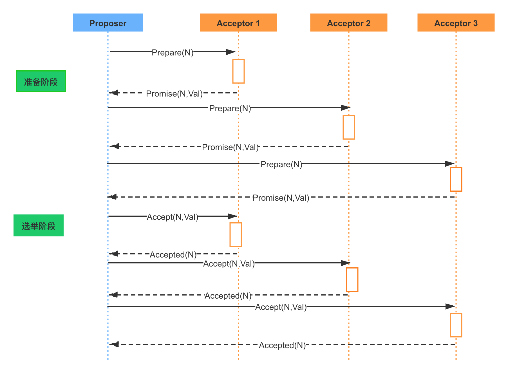

# 03 如何透彻理解 Paxos 算法？

本课时我们主要讲解“如何透彻理解 Paxos 算法”？ Paxos 算法在分布式领域具有非常重要的地位，开源分布式锁组件 Google Chubby 的作者 Mike Burrows 说过，这个世界上只有一种一致性算法，那就是 Paxos 算法，其他的算法都是残次品。 Paxos 算法虽然重要，但是也因算法复杂而著名，不过 Paxos 算法是学习分布式系统必需的一个知识点，这一课时我们就知难而上，一起来学习下 Paxos 算法。

# Quorum 机制

在学习 Paxos 算法之前，我们先来看分布式系统中的 Quorum 选举算法。在各种一致性算法中都可以看到Quorum 机制的身影，主要数学思想来源于抽屉原理，用一句话解释那就是，在 N 个副本中，一次更新成功的如果有 W 个，那么我在读取数据时是要从大于 N－W 个副本中读取，这样就能至少读到一个更新的数据了。 和 Quorum 机制对应的是 WARO，也就是Write All Read one，是一种简单的副本控制协议，当 Client 请求向某副本写数据时（更新数据），只有当所有的副本都更新成功之后，这次写操作才算成功，否则视为失败。 WARO 优先保证读服务，因为所有的副本更新成功，才能视为更新成功，从而保证了

所有的副本一致，这样的话，只需要读任何一个副本上的数据即可。写服务的可用性较低，因为只要有一个副本更新失败，此次写操作就视为失败了。假设有 N 个副本，N－1 个都宕机了，剩下的那个副本仍能提供读服务；但是只要有一个副本宕机了，写服务就不会成功。 WARO 牺牲了更新服务的可用性，最大程度地增强了读服务的可用性，而 Quorum 就是在更新服务和读服务之间进行的一个折衷。

## Quorum 定义

Quorum 的定义如下：假设有 N 个副本，更新操作 wi 在 W 个副本中更新成功之后，才认为此次更新操作 wi 成功，把这次成功提交的更新操作对应的数据叫做：“成功提交的数据”。对于读操作而言，至少需要读 R 个副本才能读到此次更新的数据，其中，W+R>N ，即 W 和 R 有重叠，一般，W+R=N+1。

> _N = 存储数据副本的数量_

> _W = 更新成功所需的副本_

> _R = 一次数据对象读取要访问的副本的数量_

Quorum就是限定了一次需要读取至少N+1-w的副本数据,听起来有些抽象，举个例子，我们维护了10个副本，一次成功更新了三个，那么至少需要读取八个副本的数据，可以保证我们读到了最新的数据。

## Quorum 的应用

Quorum 机制无法保证强一致性，也就是无法实现任何时刻任何用户或节点都可以读到最近一次成功提交的副本数据。 Quorum 机制的使用需要配合一个获取最新成功提交的版本号的 metadata 服务，这样可以确定最新已经成功提交的版本号，然后从已经读到的数据中就可以确认最新写入的数据。 Quorum 是分布式系统中常用的一种机制，用来保证数据冗余和最终一致性的投票算法，在 Paxos、Raft 和 ZooKeeper 的 Zab 等算法中，都可以看到 Quorum 机制的应用。

# Paxos 节点的角色和交互

了解了 Quorum 机制，我们接下来学习 Paxos 算法，首先看一下 Paxos 算法中的节点角色和交互。

## Paxos 的节点角色

在 Paxos 协议中，有三类节点角色，分别是 Proposer、Acceptor 和 Learner，另外还有一个 Client，作为产生议题者。  上述三类角色只是逻辑上的划分，在工作实践中，一个节点可以同时充当这三类角色。

### Proposer 提案者

Proposer 可以有多个，在流程开始时，Proposer 提出议案，也就是value，所谓 value，在工程中可以是任何操作，比如“修改某个变量的值为某个新值”，Paxos 协议中统一将这些操作抽象为 value。 不同的 Proposer 可以提出不同的甚至矛盾的 value，比如某个 Proposer 提议“将变量 X 设置为 1”，另一个 Proposer 提议“将变量 X 设置为 2”，但对同一轮 Paxos 过程，最多只有一个 value 被批准。

### Acceptor 批准者

在集群中，Acceptor 有 N 个，Acceptor 之间完全对等独立，Proposer 提出的 value 必须获得超过半数（N/2+1）的 Acceptor 批准后才能通过。

### Learner 学习者

Learner 不参与选举，而是学习被批准的 value，在Paxos中，Learner主要参与相关的状态机同步流程。

这里Leaner的流程就参考了Quorum 议会机制，某个 value 需要获得 W=N/2 + 1 的 Acceptor 批准，Learner 需要至少读取 N/2+1 个 Accpetor，最多读取 N 个 Acceptor 的结果后，才能学习到一个通过的 value。

### Client 产生议题者

Client 角色，作为产生议题者，实际不参与选举过程，比如发起修改请求的来源等。

## Proposer 与 Acceptor 之间的交互

Paxos 中， Proposer 和 Acceptor 是算法核心角色，Paxos 描述的就是在一个由多个 Proposer 和多个 Acceptor 构成的系统中，如何让多个 Acceptor 针对 Proposer 提出的多种提案达成一致的过程，而 Learner 只是“学习”最终被批准的提案。 Proposer 与 Acceptor 之间的交互主要有 4 类消息通信，如下图：  这 4 类消息对应于 Paxos 算法的两个阶段 4 个过程，下面在分析选举过程时会讲到。

# Paxos 选举过程

选举过程可以分为两个部分，准备阶段和选举阶段，可以查看下面的时序图： 

## Phase 1 准备阶段

Proposer 生成全局唯一且递增的 ProposalID，向 Paxos 集群的所有机器发送 Prepare 请求，这里不携带 value，只携带 N 即 ProposalID。 Acceptor 收到 Prepare 请求后，判断收到的 ProposalID 是否比之前已响应的所有提案的 N 大，如果是，则：

- 在本地持久化 N，可记为 Max_N；
- 回复请求，并带上已经 Accept 的提案中 N 最大的 value，如果此时还没有已经 Accept 的提案，则返回 value 为空；
- 做出承诺，不会 Accept 任何小于 Max_N 的提案。 如果否，则不回复或者回复 Error。

## Phase 2 选举阶段

为了方便描述，我们把 Phase 2 选举阶段继续拆分为 P2a、P2b 和 P2c。

### P2a：Proposer 发送 Accept

经过一段时间后，Proposer 收集到一些 Prepare 回复，有下列几种情况：

- 若回复数量 > 一半的 Acceptor 数量，且所有回复的 value 都为空时，则 Porposer 发出 accept 请求，并带上自己指定的 value。
- 若回复数量 > 一半的 Acceptor 数量，且有的回复 value 不为空时，则 Porposer 发出 accept 请求，并带上回复中 ProposalID 最大的 value，作为自己的提案内容。
- 若回复数量 \<= 一半的 Acceptor 数量时，则尝试更新生成更大的 ProposalID，再转到准备阶段执行。

### P2b：Acceptor 应答 Accept

Accpetor 收到 Accpet 请求 后，判断：

- 若收到的 N >= Max_N（一般情况下是等于），则回复提交成功，并持久化 N 和 value；
- 若收到的 N \< Max_N，则不回复或者回复提交失败。

### P2c: Proposer 统计投票

经过一段时间后，Proposer 会收集到一些 Accept 回复提交成功的情况，比如：

- 当回复数量 > 一半的 Acceptor 数量时，则表示提交 value 成功，此时可以发一个广播给所有的 Proposer、Learner，通知它们已 commit 的 value；
- 当回复数量 \<= 一半的 Acceptor 数量时，则尝试更新生成更大的 ProposalID，转到准备阶段执行。
- 当收到一条提交失败的回复时，则尝试更新生成更大的 ProposalID，也会转到准备阶段执行。

# Paxos 常见的问题

关于Paxos协议，有几个常见的问题，简单介绍下。 **1.如果半数以内的 Acceptor 失效，如何正常运行？**在Paxos流程中，如果出现半数以内的 Acceptor 失效，可以分为两种情况：

第一种，如果半数以内的 Acceptor 失效时还没确定最终的 value，此时所有的 Proposer 会重新竞争提案，最终有一个提案会成功提交。

第二种，如果半数以内的 Acceptor 失效时已确定最终的 value，此时所有的 Proposer 提交前必须以最终的 value 提交，也就是Value实际已经生效，此值可以被获取，并不再修改。**2. Acceptor需要接受更大的N，也就是ProposalID有什么意义？ **这种机制可以防止其中一个Proposer崩溃宕机产生阻塞问题，允许其他Proposer用更大ProposalID来抢占临时的访问权。** 3. 如何产生唯一的编号，也就是 ProposalID？**

在《Paxos made simple》论文中提到，唯一编号是让所有的 Proposer 都从不相交的数据集合中进行选择，需要保证在不同Proposer之间不重复，比如系统有 5 个 Proposer，则可为每一个 Proposer 分配一个标识 j(0~4)，那么每一个 Proposer 每次提出决议的编号可以为 5\*i + j，i 可以用来表示提出议案的次数。

## 总结

这一课时分享了 Paxos 协议相关的知识点，Paxos 是经典的分布式协议，理解了它们以后，学习其他分布式协议会简单很多。

Paxos算法更重要的是理解过程，并不是要把各个流程都背下来，除了文中介绍的，相关的分支判断和选择场景还有很多，如果希望了解Paxos算法相关的推导和证明，我在最后附上了 Paxos 相关的几篇论文地址，感兴趣的同学可以去学习下：

- [The PartTime Parliament](https://lamport.azurewebsites.net/pubs/lamport-paxos.pdf)
- [Paxos Made Simple](https://lamport.azurewebsites.net/pubs/paxos-simple.pdf)
- [fast-paxos](https://www.microsoft.com/en-us/research/publication/fast-paxos/)
