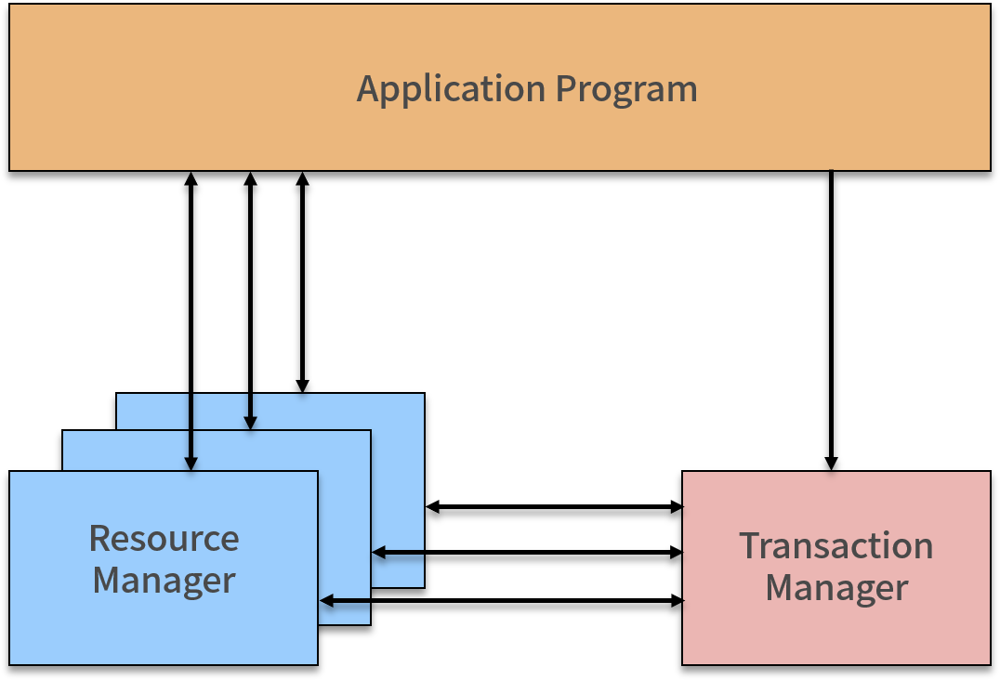
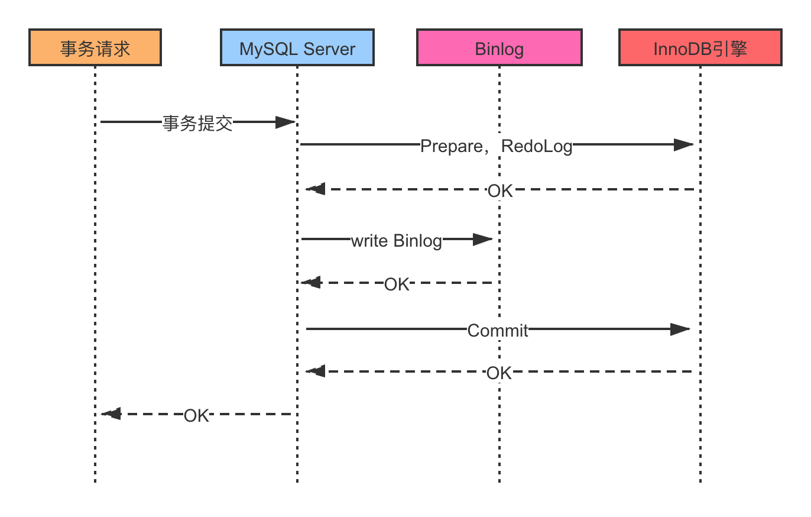

# 09 MySQL 数据库如何实现 XA 规范？

本课时我们来讨论 MySQL 的 XA 规范有哪些应用相关的内容。

MySQL 为我们提供了分布式事务解决方案，在前面的内容中提到过 binlog 的同步，其实是 MySQL XA 规范的一个应用，那么 XA 规范是如何定义的，具体又是如何应用的呢？

今天我们一起来看一下 XA 规范相关的内容。

### MySQL 有哪些一致性日志

问你一个问题，如果 MySQL 数据库断电了，未提交的事务怎么办？

答案是 **依靠日志** ，因为在执行一个操作之前，数据库会首先把这个操作的内容写入到文件系统日志里记录起来，然后再进行操作。当宕机或者断电的时候，即使操作并没有执行完，但是日志在操作前就已经写好了，我们仍然可以根据日志的内容来进行恢复。

MySQL InnoDB 引擎中和一致性相关的有 **重做日志** （redo log）、 **回滚日志** （undo log）和 **二进制日志** （binlog）。

**redo 日志**，每当有操作执行前，在数据真正更改前，会先把相关操作写入 redo 日志。这样当断电，或者发生一些意外，导致后续任务无法完成时，待系统恢复后，可以继续完成这些更改。

和 redo 日志对应的 undo 日志，也叫**撤消日志 **，记录事务开始前数据的状态，当一些更改在执行一半时，发生意外而无法完成，就可以根据撤消日志恢复到更改之前的状态。举个例子，事务 T1 更新数据 X，对 X 执行 Update 操作，从 10 更新到 20，对应的 Redo 日志为 \<T1, X, 20>，Undo 日志为 \<T1, X, 10>。** binlog 日志**是 MySQL sever 层维护的一种二进制日志，是 MySQL 最重要的日志之一，它记录了所有的 DDL 和 DML 语句，除了数据查询语句 select、show 等，还包含语句所执行的消耗时间。

binlog 与 InnoDB 引擎中的 redo/undo log 不同，binlog 的主要目的是**复制和恢复**，用来记录对 MySQL 数据更新或潜在发生更新的 SQL 语句，并以事务日志的形式保存在磁盘中。binlog 主要应用在 MySQL 的主从复制过程中，MySQL 集群在 Master 端开启 binlog，Master 把它的二进制日志传递给 slaves 节点，再从节点回放来达到 master-slave 数据一致的目的。

你可以连接到 MySQL 服务器，使用下面的命令查看真实的 binlog 数据：

```java
//查看binlog文件的内容


show binlog events;


//查看指定binlog文件的内容


show binlog events in 'MySQL-bin.000001';


//查看正在写入的binlog文件


show master status\G


//获取binlog文件列表


show binary logs;

```

### XA 规范是如何定义的

XA 是由 X/Open 组织提出的分布式事务规范，XA 规范主要定义了事务协调者（Transaction Manager）和资源管理器（Resource Manager）之间的接口。

**事务协调者（Transaction Manager**），因为 XA 事务是基于两阶段提交协议的，所以需要有一个协调者，来保证所有的事务参与者都完成了准备工作，也就是 2PC 的第一阶段。如果事务协调者收到所有参与者都准备好的消息，就会通知所有的事务都可以提交，也就是 2PC 的第二阶段。

在前面的内容中我们提到过，之所以需要引入事务协调者，是因为在分布式系统中，两台机器理论上无法达到一致的状态，需要引入一个单点进行协调。协调者，也就是事务管理器控制着全局事务，管理事务生命周期，并协调资源。**资源管理器（Resource Manager**），负责控制和管理实际资源，比如数据库或 JMS 队列。

目前，主流数据库都提供了对 XA 的支持，在 JMS 规范中，即 Java 消息服务（Java Message Service）中，也基于 XA 定义了对事务的支持。

### XA 事务的执行流程

XA 事务是两阶段提交的一种实现方式，根据 2PC 的规范，XA 将一次事务分割成了两个阶段，即 Prepare 和 Commit 阶段。**Prepare 阶段 **，TM 向所有 RM 发送 prepare 指令，RM 接受到指令后，执行数据修改和日志记录等操作，然后返回可以提交或者不提交的消息给 TM。如果事务协调者 TM 收到所有参与者都准备好的消息，会通知所有的事务提交，然后进入第二阶段。** Commit 阶段**，TM 接受到所有 RM 的 prepare 结果，如果有 RM 返回是不可提交或者超时，那么向所有 RM 发送 Rollback 命令；如果所有 RM 都返回可以提交，那么向所有 RM 发送 Commit 命令，完成一次事务操作。

### MySQL 如何实现 XA 规范

MySQL 中 XA 事务有两种情况，内部 XA 和外部 XA，其区别是事务发生在 MySQL 服务器单机上，还是发生在多个外部节点间上。

#### 内部 XA

在 MySQL 的 InnoDB 存储引擎中，开启 binlog 的情况下，MySQL 会同时维护 binlog 日志与 InnoDB 的 redo log，为了保证这两个日志的一致性，MySQL 使用了 XA 事务，由于是在 MySQL 单机上工作，所以被称为**内部 XA**。

内部 XA 事务由 binlog 作为协调者，在事务提交时，则需要将提交信息写入二进制日志，也就是说，binlog 的参与者是 MySQL 本身。

#### 外部 XA

外部 XA 就是典型的分布式事务，MySQL 支持 XA START/END/PREPARE/Commit 这些 SQL 语句，通过使用这些命令，可以完成分布式事务。

> 你也可以查看 [MySQL 官方文档](https://dev.mysql.com/doc/refman/8.0/en/xa-statements.html)，了解更多的 XA 命令。

MySQL 外部 XA 主要应用在数据库代理层，实现对 MySQL 数据库的分布式事务支持，例如开源的数据库中间层，比如淘宝的 TDDL、阿里巴巴 B2B 的 Cobar 等。外部 XA 一般是针对跨多 MySQL 实例的分布式事务，需要应用层作为协调者，比如我们在写业务代码，在代码中决定提交还是回滚，并且在崩溃时进行恢复。

#### Binlog 中的 Xid

当事务提交时，在 binlog 依赖的内部 XA 中，额外添加了 Xid 结构，binlog 有多种数据类型，包括以下三种：

- **statement 格式**，记录为基本语句，包含 Commit
- **row 格式**，记录为基于行
- **mixed 格式**，日志记录使用混合格式

不论是 statement 还是 row 格式，binlog 都会添加一个 XID_EVENT 作为事务的结束，该事件记录了事务的 ID 也就是 Xid，在 MySQL 进行崩溃恢复时根据 binlog 中提交的情况来决定如何恢复。

#### Binlog 同步过程

下面来看看 Binlog 下的事务提交过程，整体过程是先写 redo log，再写 binlog，并以 binlog 写成功为事务提交成功的标志。



当有事务提交时：

- 第一步，InnoDB 进入 Prepare 阶段，并且 write/sync redo log，写 redo log，将事务的 XID 写入到 redo 日志中，binlog 不作任何操作；
- 第二步，进行 write/sync Binlog，写 binlog 日志，也会把 XID 写入到 Binlog；
- 第三步，调用 InnoDB 引擎的 Commit 完成事务的提交，将 Commit 信息写入到 redo 日志中。

如果是在第一步和第二步失败，则整个事务回滚；如果是在第三步失败，则 MySQL 在重启后会检查 XID 是否已经提交，若没有提交，也就是事务需要重新执行，就会在存储引擎中再执行一次提交操作，保障 redo log 和 binlog 数据的一致性，防止数据丢失。

在实际执行中，还牵扯到操作系统缓存 Buffer 何时同步到文件系统中，所以 MySQL 支持用户自定义在 Commit 时如何将 log buffer 中的日志刷到 log file 中，通过变量 innodb_flush_log_at_trx_Commit 的值来决定。在 log buffer 中的内容称为 **脏日志** ，感兴趣的话可以查询资料了解下。

### 总结

这一课时介绍了 MySQL 一致性相关的几种日志，并分享了 MySQL 的 XA 规范相关内容，以及内外部 XA 事务如何实现。
