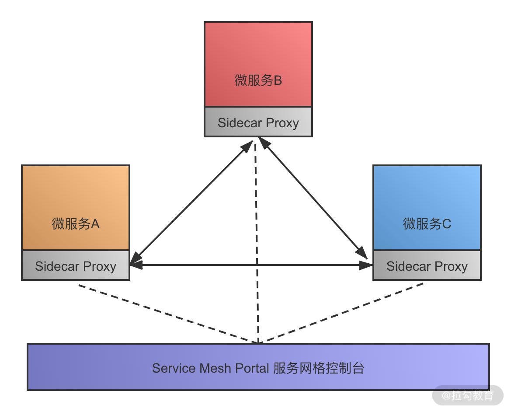

20 ServiceMesh：服务网格有哪些应用？
=========================

微服务的部署架构中有一个有趣的边车模式，并且基于边车模式，扩展出了 Service Mesh 服务网格的概念。这一课时我们一起来学习下 Service Mesh 相关的知识。

### Sidecar 设计模式

在了解服务网格之前，先来看一个微服务的设计模式——Sidecar，也就是边车模式。边车模式是一种分布式服务架构的设计模式，特别是在各大云服务厂商中应用较多。

边车模式因为类似于生活中的边三轮摩托车而得名，也就是侉子摩托车。边三轮摩托车是给摩托车加装一个挎斗，可以装载更多的货物，变得更加多用途，得益于这样的特性，边三轮摩托曾经得到了广泛应用。

在系统设计时，边车模式通过给应用程序添加边车的方式来拓展应用程序现有的功能，分离通用的业务逻辑，比如日志记录、流量控制、服务注册和发现、限流熔断等功能。通过添加边车实现，微服务只需要专注实现业务逻辑即可，实现了控制和逻辑的分离与解耦。

边车模式中的边车，实际上就是一个 Agent，微服务的通信可以通过 Agent 代理完成。在部署时，需要同时启动 Agent，Agent 会处理服务注册、服务发现、日志和服务监控等逻辑。这样在开发时，就可以忽略这些和对外业务逻辑本身没有关联的功能，实现更好的内聚和解耦。

应用边车模式解耦了服务治理和对外的业务逻辑，这一点和 API 网关比较像，但是边车模式控制的粒度更细，可以直接接管服务实例，合理扩展边车的功能，能够实现服务的横向管理，提升开发效率。

### Service Mesh 服务网格

在边车模式中，可以实现服务注册和发现、限流熔断等功能。如果边车的功能可以进一步标准化，那么会变得更加通用，就可以抽象出一个通用的服务治理组件，通过边车与其他系统交互，在各个微服务中进行推广。

随着分布式服务的发展，类似的需求越来越多，就出现了服务网格的概念。

#### 什么是 Service Mesh

微服务领域有 CNCF 组织（Cloud Native Computing Foundation），也就是云原生基金会，CNCF 致力于微服务开源技术的推广。Service Mesh 是 CNCF 推广的新一代微服务架构，致力于解决服务间通讯。

Service Mesh 基于边车模式演进，通过在系统中添加边车代理，也就是 Sidecar Proxy 实现。

Service Mesh 可以认为是边车模式的进一步扩展，提供了以下功能：

* 管理服务注册和发现
* 提供限流和降级功能
* 前置的负载均衡
* 服务熔断功能
* 日志和服务运行状态监控
* 管理微服务和上层容器的通信

#### Service Mesh 有哪些特点

使用 Sidecar 或者 Service Mesh，都可以认为是在原有的系统之上抽象了一层新的设计来实现。计算机领域有这么一句话：没有什么系统问题不是抽象一层解决不了的，如果有，那就再抽象一层。

Service Mesh 服务网格就是使用了这样的思想，抽象出专门的一层，提供服务治理领域所需的服务注册发现、负载均衡、熔断降级、监控等功能。现在的微服务有很多部署在各大云服务厂商的主机上，不同厂商的实现标准不同，如何更好地基于各类云服务部署业务系统，这也是云原生要解决的问题。

Service Mesh 可以统一管理微服务与上层通信的部分，接管各种网络通信、访问控制等，我们的业务代码只需要关心业务逻辑就可以，简化开发工作。

#### Service Mesh 和 API 网关的区别

服务网格实现的功能和 API 网关类似，都可以以一个切面的形式，进行一些横向功能的实现，比如流量控制、访问控制、日志和监控等功能。

服务网格和 API 网关主要的区别是部署方式不同，在整体系统架构中的位置不一样。

API 网关通常是独立部署，通过单独的系统提供服务，为了实现高可用，还会通过网关集群等来管理；而服务网格通常是集成在应用容器内的，服务网格离应用本身更近，相比 API 网关，和应用交互的链路更短，所以可以实现更细粒度的应用管理，也体现了 Sidecar 边车的设计思想。

### Service Mesh 解决方案

目前两款流行的 Service Mesh 开源软件分别是 Istio 和 Linkerd，下面简单介绍。

#### Istio

Istio 是 Google、IBM 等几大公司联合开源的一个服务网格组件，Istio 提供了负载均衡、服务间的身份验证、监控等方法。

Istio 的实现是通过 Sidecar ，通过添加一个 Sidecar 代理，在环境中为服务添加 Istio 的支持。Istio 代理会拦截不同服务之间的通信，然后进行统一的配置和管理。

官方文档中，对 Istio 支持的特性描述如下：

* 为 HTTP、gRPC、WebSocket 和 TCP 流量自动负载均衡；
* 对流量行为进行细粒度控制，包括丰富的路由规则、重试、故障转移和故障注入；
* 可插拔的策略层和配置 API，支持访问控制、速率限制和配额；
* 管理集群内所有流量的自动化度量、日志记录和追踪；
* 实现安全的服务间通信，支持基于身份验证和授权的集群。

Istio 官网开放了中文用户指南，可以点击链接查看 [https://istio.io/zh/docs/](https://istio.io/zh/docs/)，翻译质量一般，感兴趣的同学建议直接查看英文手册。

#### Linkerd

Linkerd 最早由 Twitter 贡献，支持的功能和 Istio 类似，Linkerd 是一款开源网络代理，可以作为服务网格进行部署，在应用程序内管理和控制服务与服务之间的通信。

Linkerd 出现来自 Linkerd 团队为 Twitter、Yahoo、Google 和 Microsoft 等公司运营大型生产系统时发现：最复杂和令人惊讶的问题来源通常不是服务本身，而是服务之间的通讯。Linkerd 目标是解决服务之间的通信问题，通过添加 Linkerd 代理，实现一个专用的基础设施层，为应用提供服务发现、路由、错误处理及服务可见性等功能，而无须侵入应用内部实现。

Istio 和 Linkerd 都处于快速发展阶段，可以到 Istio 和 Linkerd 的官网了解更多的信息。国内也有一些技术小组在进行相关的文档翻译工作，有意向的同学可以加入。

### 总结

这一课时和你分享了 Service Mesh 服务网格相关的内容，包括微服务中的边车模式，服务网格发展，最后简单介绍了目前流行的两种服务网格解决方案。

Service Mesh 作为一个比较新的领域，可以帮助我们了解微服务架构发展的方向，特别是解决服务上云，以及云原生等问题，对云原生等话题感兴趣的同学，可以关注下平台内的其他专栏。
