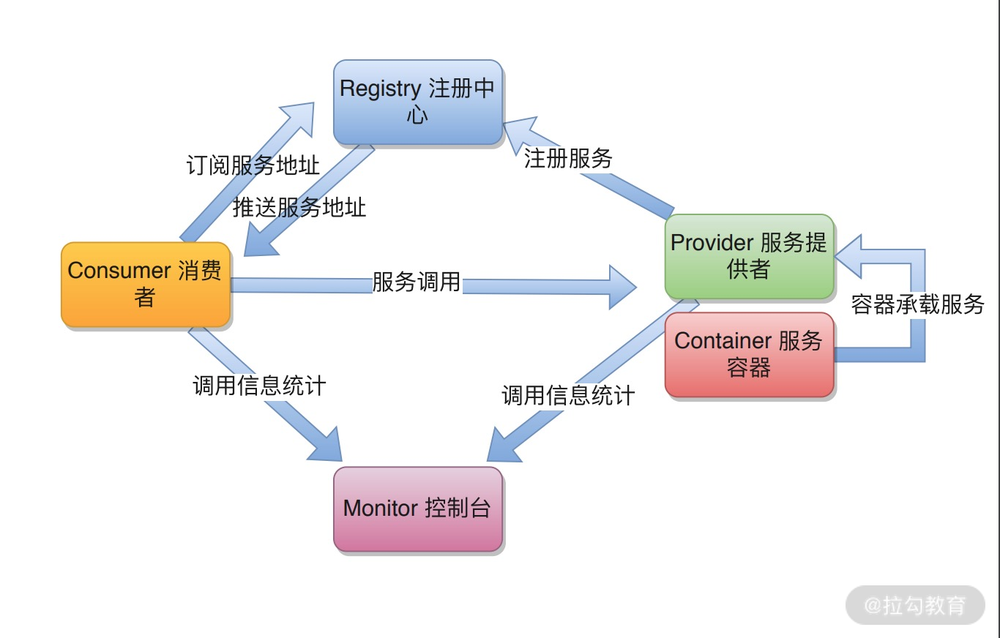
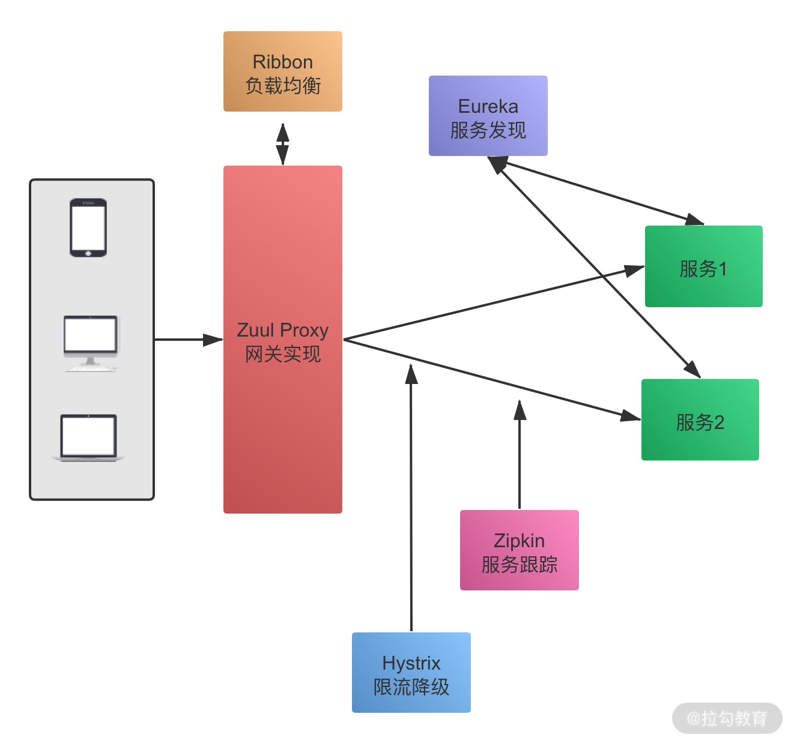

21 Dubbo vs Spring Cloud：两大技术栈如何选型？
===================================

提到微服务开源框架，不可不说的是 Dubbo 和 Spring Cloud，这两大框架应该是大家最熟悉的微服务解决方案，也是面试中的热点。这一课时就梳理下 Dubbo 和 Spring Cloud 的应用特性，以及两个组件的功能对比。

### Dubbo 应用

Dubbo 是阿里开源的一个分布式服务框架，目的是支持高性能的远程服务调用，并且进行相关的服务治理。在 RPC 远程服务这一课时我们也介绍过 Dubbo，从功能上，Dubbo 可以对标 gRPC、Thrift 等典型的 RPC 框架。

#### 总体架构

下面这张图包含了 Dubbo 核心组件和调用流程：

包括了下面几个角色：

* **Provider**，也就是服务提供者，通过 Container 容器来承载；
* **Consumer**，调用远程服务的服务消费方；
* **Registry**，服务注册中心和发现中心；
* **Monitor**，Dubbo 服务调用的控制台，用来统计和管理服务的调用信息；
* **Container**，服务运行的容器，比如 Tomcat 等。

#### 应用特性

Dubbo 是一个可扩展性很强的组件，主要的特性如下。

（1）基于 SPI 的扩展

SPI（Service Provider Interface）是 JDK 内置的一种服务提供发现机制，JDK 原生的 SPI 加载方式不灵活，要获取一个类的扩展必须加载所有实现类，得到指定的实现类需要遍历。

Dubbo 中增强了原生的 SPI 实现，可以通过指定的扩展类名称来找到具体的实现，这样可以更好地进行功能点扩展。

（2）灵活的服务调用

Dubbo 作为一个优秀的 RPC 解决方案，支持多种服务调用方式，针对服务端和消费端的线程池、集群调用模式、异步和同步调用等都可以进行灵活的配置。

（3）责任链和插件模式

Dubbo 的设计和实现采用了责任链模式，使用者可以在服务调用的责任链上，对各个环节进行自定义实现，也可通过这种方式，解决 Dubbo 自带策略有限的问题。基于 SPI 和责任链模式，Dubbo 实现了一个类似微内核加插件的设计，整体的可扩展性和灵活性都比较高。

（4）高级特性支持

Dubbo 对远程服务调用提供了非常细粒度的功能支持，比如服务发布支持 XML、注解等多种方式，调用可以选择泛化调用、Mock 调用等。

### Spring Cloud 应用

Spring Cloud 基于 Spring Boot，是一系列组件的集成，为微服务开发提供一个比较全面的解决方案，包括了服务发现功能、配置管理功能、API 网关、限流熔断组件、调用跟踪等一系列的对应实现。

#### 总体架构

Spring Cloud 的微服务组件都有多种选择，典型的架构图如下图所示：

整体服务调用流程如下：

* 外部请求通过 API 网关，在网关层进行相关处理；
* Eureka 进行服务发现，包含健康检查等；
* Ribbon 进行均衡负载，分发到后端的具体实例；
* Hystrix 负责处理服务超时熔断；
* Zipkin 进行链路跟踪。

#### 应用特性

Spring Cloud 目前主要的解决方案包括 Spring Cloud Netflix 系列，以及 Spring Cloud Config、Spring Cloud Consul 等。

Spring Cloud 典型的应用如下：

* **配置中心**，一般使用 Spring Cloud Config 实现，服务发现也可以管理部分配置；
* **服务发现**，使用 Eureka 实现，也可以扩展 Consul 等；
* **API 网关**，使用 Zuul 实现，另外还有 Kong 等应用；
* **负载均衡**，使用 Ribbon 实现，也可以选择 Feign；
* **限流降级**，使用 Hystrix 实现熔断机制，也可以选择 Sentinel。

### Dubbo 和 Spring Cloud 对比

可以看到，在介绍 Dubbo 时，主要是从 RPC 服务调用的特性入手，而在介绍 Spring Cloud 时，更多的是强调其在微服务方面提供的整体解决方案。

Dubbo 更多关注远程服务调用功能特性，Spring Cloud 则包含了整体的解决方案，可以认为 Dubbo 支持的功能是 Spring Cloud 的子集。

#### 功能对比

生产环境使用 Dubbo 组件实现服务调用，需要强依赖 ZooKeeper 注册中心；如果要实现服务治理的周边功能，比如配置中心、服务跟踪等，则需要集成其他组件的支持。

* **注册中心**：需要依赖 ZooKeeper，其他注册中心应用较少。
* **分布式配置**：可以使用 diamond，淘宝的开源组件来实现。
* **分布式调用跟踪**：应用扩展 Filter 用 Zippin 来做服务跟踪。
* **限流降级**：可以使用开源的 Sentinel 组件，或者自定义 Filter 实现。

对于 Spring Cloud，提供的功能更加多样，服务治理只是其中的一个方面，面向的是微服务整体的解决方案。

#### 调用方式

Dubbo 使用 RPC 协议进行通讯，支持多种序列化方式，包括 Dubbo 协议、Hessian、Kryo 等，如果针对特定的业务场景，用户还可以扩展自定义协议实现。

Spring Cloud 一般使用 HTTP 协议的 RESTful API 调用，RESTful 接口相比 RPC 更为灵活，服务提供方和调用方可以更好地解耦，不需要依赖额外的 jar 包等，更适合微服务的场景。从性能角度考虑，一般来说，会认为 PRC 方式的性能更高，但是如果对请求时延不是特别敏感的业务，是可以忽略这一点的。

#### 服务发现

Dubbo 的服务发现通过注册中心实现，支持多种注册中心，另外本地测试支持 Multicast、Simple 等简单的服务发现方式。Spring Cloud 有各种服务发现组件，包括 Eureka、Consul、Nacos 等。前面提到过，ZooKeeper 实现的是 CAP 中的 CP 一致性，Spring Cloud 中的 Eureka 实现的是 AP 一致性，AP 更适合服务发现的场景。

### 开发成本

应用 Dubbo 需要一定的开发成本，自定义功能需要实现各种 Filter 来做定制，使用 Spring Cloud 就很少有这个问题，因为各种功能都有了对应的开源实现，应用起来更加简单。特别是，如果项目中已经应用了 Spring 框架、Spring Boot 等技术，可以更方便地集成 Spring Cloud，减少已有项目的迁移成本。

经过上面的对比可以看出，Dubbo 和 Spring Cloud 的目标不同，关注的是微服务实现的不同维度，Dubbo 看重远程服务调用，Spring Cloud 则是作为一个微服务生态，覆盖了从服务调用，到服务治理的各个场景。

### 总结

这一课时的内容对比了微服务的两大技术栈，分别介绍了 Dubbo 和 Spring Cloud 的架构，以及应用特性。

Spring Cloud 从发展到现在，社区一直保持高度活跃，各类解决方案越来越丰富，另外，Dubbo 在近几年又重启维护，发布了新的版本，并且也官宣了新的升级计划，相信在两大开源框架的加持下，会更好地提高大家的开发效率。
