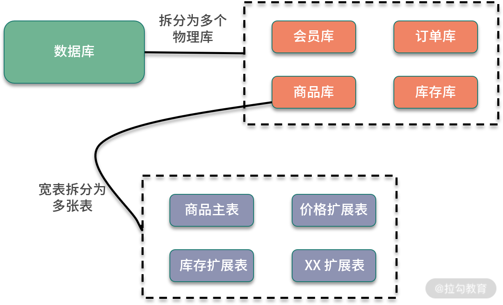

# 24 为什么需要分库分表，如何实现？

你好，欢迎来到第 21 课时，本课时我们主要讲解“为什么需要分库分表，如何实现”。

在上一课时中讲到了读写分离，读写分离优化了互联网 **读多写少** 场景下的性能问题，考虑一个业务场景，如果读库的数据规模非常大，除了增加多个从库之外，还有其他的手段吗？

方法总比问题多，实现 **数据库高可用** ，还有另外一个撒手锏，就是 **分库分表** ，分库分表也是面试的常客，今天一起来看一下相关的知识。

### 分库分表的背景

互联网业务的一个特点就是用户量巨大，BAT等头部公司都是亿级用户，产生的数据规模也飞速增长，传统的单库单表架构不足以支撑业务发展，存在下面的性能瓶颈：

#### 读写的数据量限制

数据库的数据量增大会直接影响读写的性能，比如一次查询操作，扫描 5 万条数据和 500 万条数据，查询速度肯定是不同的。

关于 MySQL 单库和单表的数据量限制，和不同的服务器配置，以及不同结构的数据存储有关，并没有一个确切的数字。这里参考阿里巴巴的《Java 开发手册》中数据库部分的建表规约：

> 单表行数超过 500 万行或者单表容量超过 2GB，才推荐进行分库分表。

**基于阿里巴巴的海量业务数据和多年实践**，这一条数据库规约，可以认为是数据库应用中的一个最佳实践。也就是在新业务建表规划时，或者当前数据库单表已经超过对应的限制，可以进行分库分表，同时也要避免过度设计。因为分库分表虽然可以提高性能，但是盲目地进行分库分表只会增加系统的复杂度。

#### 数据库连接限制

数据库的连接是有限制的，不能无限制创建，比如 MySQL 中可以使用 max_connections 查看默认的最大连接数，当访问连接数过多时，就会导致连接失败。以电商为例，假设存储没有进行分库，用户、商品、订单和交易，所有的业务请求都访问同一个数据库，产生的连接数是非常可观的，可能导致数据库无法支持业务请求。

使用数据库连接池，可以优化连接数问题，但是更好的方式是通过分库等手段，避免数据库连接成为业务瓶颈。

除了这些，如果不进行数据库拆分，大量数据访问都集中在单台机器上，对磁盘 IO、CPU 负载等都会产生很大的压力，并且直接影响业务操作的性能。

### 分库分表原理

分库分表，顾名思义，就是将原本存储于单个数据库上的数据拆分到多个数据库，把原来存储在单张数据表的数据拆分到多张数据表中，实现数据切分，从而提升数据库操作性能。分库分表的实现可以分为两种方式：垂直切分和水平切分。

#### 垂直切分

垂直拆分一般是按照业务和功能的维度进行拆分，把数据分别放到不同的数据库中。

垂直分库针对的是一个系统中对不同的业务进行拆分，根据业务维度进行数据的分离，剥离为多个数据库。比如电商网站早期，商品数据、会员数据、订单数据都是集中在一个数据库中，随着业务的发展，单库处理能力已成为瓶颈，这个时候就需要进行相关的优化，进行业务维度的拆分，分离出会员数据库、商品数据库和订单数据库等。

垂直分表是针对业务上的字段比较多的大表进行的，一般是把业务宽表中比较独立的字段，或者不常用的字段拆分到单独的数据表中。比如早期的商品表中，可能包含了商品信息、价格、库存等，可以拆分出来价格扩展表、库存扩展表等。

#### 水平切分

水平拆分是把相同的表结构分散到不同的数据库和不同的数据表中，避免访问集中的单个数据库或者单张数据表，具体的分库和分表规则，一般是通过业务主键，进行哈希取模操作。

例如，电商业务中的订单信息访问频繁，可以将订单表分散到多个数据库中，实现分库；在每个数据库中，继续进行拆分到多个数据表中，实现分表。路由策略可以使用订单 ID 或者用户 ID，进行取模运算，路由到不同的数据库和数据表中。

### 分库分表后引入的问题

下面看一下，引入分库分表后额外增加了哪些系统设计的问题。

- 分布式事务问题

对业务进行分库之后，同一个操作会分散到多个数据库中，涉及跨库执行 SQL 语句，也就出现了分布式事务问题。

比如数据库拆分后，订单和库存在两个库中，一个下单减库存的操作，就涉及跨库事务。关于分布式事务的处理，我们在专栏“分布式事务”的模块中也介绍过，可以使用分布式事务中间件，实现 TCC 等事务模型；也可以使用基于本地消息表的分布式事务实现。如果对这部分印象不深，你可以回顾下前面讲过的内容。

- 跨库关联查询问题

分库分表后，跨库和跨表的查询操作实现起来会比较复杂，性能也无法保证。在实际开发中，针对这种需要跨库访问的业务场景，一般会使用额外的存储，比如维护一份文件索引。另一个方案是通过合理的数据库字段冗余，避免出现跨库查询。

- 跨库跨表的合并和排序问题

分库分表以后，数据分散存储到不同的数据库和表中，如果查询指定数据列表，或者需要对数据列表进行排序时，就变得异常复杂，则需要在内存中进行处理，整体性能会比较差，一般来说，会限制这类型的操作。具体的实现，可以依赖开源的分库分表中间件来处理，下面就来介绍一下。

### 分库分表中间件实现

业务中实现分库分表，需要自己去实现路由规则，实现跨库合并排序等操作，具有一定的开发成本，可以考虑使用开源的分库分表中间件。这里比较推荐 Apache ShardingSphere，另外也可以参考淘宝的 TDDL 等。

其中，ShardingSphere 的前身是当当开源的 Sharding-JDBC，目前更名为 ShardingSphere，并且已经加入 Apache 基金会。ShardingSphere 在 Sharding-JDBC 的基础上，额外提供了 Sharding-Proxy，以及正在规划中的 Sharding-Sidecar。其中 Sharding-JDBC 用来实现分库分表，另外也添加了对分布式事务等的支持。关于 ShardingSphere 的具体应用，感兴趣的同学可以去浏览 [《ShardingSphere 用户手册》](https://shardingsphere.apache.org/document/current/cn/overview/)。

另一款 TDDL（Taobao Distributed Data Layer）是淘宝团队开发的数据库中间件，用于解决分库分表场景下的访问路由，TDDL 在淘宝大规模应用，遗憾的是开源部分还不太完善，社区已经很长时间都没有更新，可以在 [TDDL 项目](https://github.com/alibaba/tb_tddl)仓库了解更多的信息。

### 总结

这一课时分享了分库分表相关的知识点，包括分库分表的业务背景，水平切分和垂直切分的不同方式，分库分表以后增加的系统复杂性问题，以及可以使用哪些开源的分库分表中间件解决对应问题。

你可以考察下目前项目里是否有应用分库分表，以及是如何实现分库分表，比如自研或者使用开源组件，并且留言分享。
